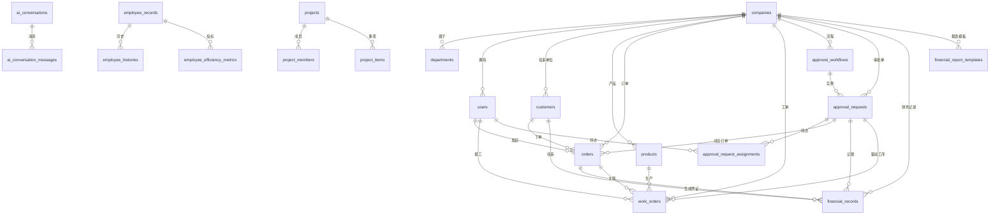

# FactoryOS 数据库重构规范

## 设计目标
- 数据驱动：以真实付款单、运费申请、工序产量单反向建模核心业务表。
- 精简聚合：审批与财务域分别收敛到 3 张及 2 张主表，取消冗余细表。
- 业务贯通：新增 `customers`、`products`、`orders`、`work_orders` 串联采购、物流与制造。
- 审批耦合：所有订单与工单均可追溯到审批单，满足 PRD 与 API 的合规要求。

## 实体关系图

## 表结构说明

### 核心多租户与权限

#### companies (公司)
多租户单位的主数据及默认配置。

| field_name | data_type | constraints | comment |
| --- | --- | --- | --- |
| id | uuid | PRIMARY KEY DEFAULT gen_random_uuid() | 公司唯一标识 |
| code | varchar(32) | NOT NULL UNIQUE | 公司编码 |
| name | varchar(255) | NOT NULL | 公司名称 |
| status | varchar(20) | NOT NULL DEFAULT 'active' CHECK (status IN ('active','suspended','closed')) | 公司状态 |
| timezone | varchar(50) | NULL | 默认时区 |
| locale | varchar(10) | NOT NULL DEFAULT 'zh-CN' | 默认语言 |
| metadata | jsonb | NOT NULL DEFAULT '{}'::jsonb | 企业扩展配置 |
| created_at | timestamptz | NOT NULL DEFAULT CURRENT_TIMESTAMP | 创建时间 |
| updated_at | timestamptz | NOT NULL DEFAULT CURRENT_TIMESTAMP | 更新时间 |

**设计权衡**：把多租户参数集中在 metadata，避免频繁 DDL，但需要服务层做结构校验。

#### departments (部门)
公司内部组织结构，支持树型层级。

| field_name | data_type | constraints | comment |
| --- | --- | --- | --- |
| id | uuid | PRIMARY KEY DEFAULT gen_random_uuid() | 部门唯一标识 |
| company_id | uuid | NOT NULL REFERENCES companies(id) ON DELETE CASCADE | 所属公司 |
| parent_id | uuid | NULL REFERENCES departments(id) | 上级部门 |
| path | ltree | NOT NULL | 层级路径 |
| name | varchar(150) | NOT NULL | 部门名称 |
| leader_id | uuid | NULL REFERENCES users(id) | 负责人 |
| metadata | jsonb | NOT NULL DEFAULT '{}'::jsonb | 自定义标签 |
| created_at | timestamptz | NOT NULL DEFAULT CURRENT_TIMESTAMP | 创建时间 |
| updated_at | timestamptz | NOT NULL DEFAULT CURRENT_TIMESTAMP | 更新时间 |

**设计权衡**：使用 ltree 存储层级路径，查询灵活但依赖 PostgreSQL 扩展。

#### permissions (权限)
平台支持的操作权限清单。

| field_name | data_type | constraints | comment |
| --- | --- | --- | --- |
| id | uuid | PRIMARY KEY DEFAULT gen_random_uuid() | 权限唯一标识 |
| code | varchar(100) | NOT NULL UNIQUE | 权限编码 |
| description | text | NOT NULL | 权限说明 |
| category | varchar(50) | NOT NULL | 权限分类 |
| is_system | boolean | NOT NULL DEFAULT true | 是否系统内置 |
| created_at | timestamptz | NOT NULL DEFAULT CURRENT_TIMESTAMP | 创建时间 |
| updated_at | timestamptz | NOT NULL DEFAULT CURRENT_TIMESTAMP | 更新时间 |

**设计权衡**：权限保持全局表，避免多租户重复定义，但自定义权限需另行扩展。

#### role_permissions (角色权限关联)
角色与权限的绑定关系。

| field_name | data_type | constraints | comment |
| --- | --- | --- | --- |
| role_id | uuid | NOT NULL REFERENCES roles(id) ON DELETE CASCADE | 角色 |
| permission_id | uuid | NOT NULL REFERENCES permissions(id) ON DELETE CASCADE | 权限 |
| company_id | uuid | NOT NULL REFERENCES companies(id) ON DELETE CASCADE | 所属公司 |
| granted_at | timestamptz | NOT NULL DEFAULT CURRENT_TIMESTAMP | 授权时间 |
| granted_by | uuid | NULL REFERENCES users(id) | 授权人 |

**设计权衡**：维持传统多对多表结构，查询直接但删除角色或权限需谨慎使用级联。

#### roles (角色)
公司内可分配的角色定义。

| field_name | data_type | constraints | comment |
| --- | --- | --- | --- |
| id | uuid | PRIMARY KEY DEFAULT gen_random_uuid() | 角色唯一标识 |
| company_id | uuid | NOT NULL REFERENCES companies(id) ON DELETE CASCADE | 所属公司 |
| code | varchar(50) | NOT NULL | 角色编码 |
| name | varchar(100) | NOT NULL | 角色名称 |
| description | text | NULL | 角色说明 |
| scope | varchar(30) | NOT NULL DEFAULT 'global' | 作用域 |
| created_at | timestamptz | NOT NULL DEFAULT CURRENT_TIMESTAMP | 创建时间 |
| updated_at | timestamptz | NOT NULL DEFAULT CURRENT_TIMESTAMP | 更新时间 |

**设计权衡**：保留 scope 字段满足项目级授权，但需业务约束防止过度碎片化。

#### user_roles (用户角色关联)
用户在公司范围及资源范围内获得的角色。

| field_name | data_type | constraints | comment |
| --- | --- | --- | --- |
| user_id | uuid | NOT NULL REFERENCES users(id) ON DELETE CASCADE | 用户 |
| role_id | uuid | NOT NULL REFERENCES roles(id) ON DELETE CASCADE | 角色 |
| company_id | uuid | NOT NULL REFERENCES companies(id) ON DELETE CASCADE | 所属公司 |
| scope_resource_type | varchar(50) | NULL | 作用域资源类型 |
| scope_resource_id | uuid | NULL | 作用域资源ID |
| assigned_at | timestamptz | NOT NULL DEFAULT CURRENT_TIMESTAMP | 分配时间 |
| assigned_by | uuid | NULL REFERENCES users(id) | 分配人 |

**设计权衡**：复合主键消除重复授权，但 scope 字段的可空性增加 SQL 复杂度。

#### users (用户)
平台用户及其登录、偏好信息。

| field_name | data_type | constraints | comment |
| --- | --- | --- | --- |
| id | uuid | PRIMARY KEY DEFAULT gen_random_uuid() | 用户唯一标识 |
| company_id | uuid | NOT NULL REFERENCES companies(id) ON DELETE CASCADE | 所属公司 |
| department_id | uuid | NULL REFERENCES departments(id) | 所属部门 |
| email | varchar(255) | NOT NULL UNIQUE | 登录邮箱 |
| display_name | varchar(150) | NOT NULL | 显示名称 |
| phone | varchar(30) | NULL | 手机号 |
| password_hash | varchar(255) | NOT NULL | 密码哈希 |
| status | varchar(20) | NOT NULL DEFAULT 'active' CHECK (status IN ('active','inactive','locked')) | 用户状态 |
| auth_provider | varchar(50) | NOT NULL DEFAULT 'password' | 认证来源 |
| locale | varchar(10) | NOT NULL DEFAULT 'zh-CN' | 语言偏好 |
| timezone | varchar(50) | NULL | 时区 |
| last_login_at | timestamptz | NULL | 最近登录时间 |
| profile | jsonb | NOT NULL DEFAULT '{}'::jsonb | 扩展档案 |
| settings | jsonb | NOT NULL DEFAULT '{}'::jsonb | 个性化设置 |
| created_at | timestamptz | NOT NULL DEFAULT CURRENT_TIMESTAMP | 创建时间 |
| updated_at | timestamptz | NOT NULL DEFAULT CURRENT_TIMESTAMP | 更新时间 |

**设计权衡**：扩展属性集中到 profile/settings，减少列扩散，但 JSON 索引维护成本更高。

### 通用资产

#### attachments (附件)
二进制资源及其元数据的统一注册表。

| field_name | data_type | constraints | comment |
| --- | --- | --- | --- |
| id | uuid | PRIMARY KEY DEFAULT gen_random_uuid() | 附件唯一标识 |
| company_id | uuid | NOT NULL REFERENCES companies(id) ON DELETE CASCADE | 所属公司 |
| file_name | varchar(255) | NOT NULL | 文件名 |
| content_type | varchar(120) | NOT NULL | 内容类型 |
| size_bytes | bigint | NOT NULL | 文件大小 |
| storage_path | varchar(500) | NOT NULL | 存储路径或对象存储键 |
| checksum | varchar(128) | NOT NULL | 完整性校验 |
| category | varchar(50) | NOT NULL DEFAULT 'general' | 附件类别 |
| owner_id | uuid | NULL REFERENCES users(id) | 上传人 |
| metadata | jsonb | NOT NULL DEFAULT '{}'::jsonb | 扩展信息 |
| uploaded_at | timestamptz | NOT NULL DEFAULT CURRENT_TIMESTAMP | 上传时间 |

**设计权衡**：附件均以引用方式关联，降低交叉外键，但需应用层控制一致性。

### 业务基础域

#### customers (客户/供应商)
来源于付款单与运费申请的核心往来单位。

| field_name | data_type | constraints | comment |
| --- | --- | --- | --- |
| id | uuid | PRIMARY KEY DEFAULT gen_random_uuid() | 往来单位唯一标识 |
| company_id | uuid | NOT NULL REFERENCES companies(id) ON DELETE CASCADE | 所属公司 |
| customer_code | varchar(50) | NULL | 外部或第三方编码 |
| name | varchar(255) | NOT NULL | 名称 |
| customer_type | varchar(20) | NOT NULL CHECK (customer_type IN ('supplier','customer','logistics','employee','other')) | 类型 |
| tax_id | varchar(50) | NULL | 纳税识别号 |
| contact_name | varchar(100) | NULL | 联系人 |
| contact_phone | varchar(30) | NULL | 联系电话 |
| bank_account_name | varchar(255) | NULL | 收款账户名 |
| bank_name | varchar(255) | NULL | 开户行 |
| bank_account | varchar(100) | NULL | 银行账号 |
| address | varchar(255) | NULL | 地址 |
| payment_terms | varchar(100) | NULL | 付款条件 |
| metadata | jsonb | NOT NULL DEFAULT '{}'::jsonb | 与 ERP 同步的额外字段 |
| created_by | uuid | NULL REFERENCES users(id) | 创建人 |
| updated_by | uuid | NULL REFERENCES users(id) | 更新人 |
| created_at | timestamptz | NOT NULL DEFAULT CURRENT_TIMESTAMP | 创建时间 |
| updated_at | timestamptz | NOT NULL DEFAULT CURRENT_TIMESTAMP | 更新时间 |

**设计权衡**：把物流公司、供应商统一建模，减少表数量，但需通过 customer_type 区分业务流程。

#### orders (订单)
来自付款单和运费申请的最小可行订单模型，串联审批与财务。

| field_name | data_type | constraints | comment |
| --- | --- | --- | --- |
| id | uuid | PRIMARY KEY DEFAULT gen_random_uuid() | 订单唯一标识 |
| company_id | uuid | NOT NULL REFERENCES companies(id) ON DELETE CASCADE | 所属公司 |
| order_code | varchar(50) | NOT NULL | 业务单号/审批编号 |
| order_type | varchar(30) | NOT NULL CHECK (order_type IN ('freight_payment','ap_payment','ar_refund','other')) | 订单类型 |
| order_status | varchar(20) | NOT NULL DEFAULT 'draft' | 业务状态 |
| approval_status | varchar(20) | NOT NULL DEFAULT 'pending' | 审批结果 |
| approval_request_id | uuid | NULL REFERENCES approval_requests(id) ON DELETE SET NULL | 关联审批 |
| customer_id | uuid | NULL REFERENCES customers(id) ON DELETE SET NULL | 往来单位 |
| amount_total | numeric(18,2) | NOT NULL | 订单金额 |
| amount_total_uppercase | text | NULL | 金额大写 |
| tax_amount | numeric(18,2) | NULL | 税额 |
| currency | char(3) | NOT NULL DEFAULT 'CNY' | 币种 |
| payment_method | varchar(30) | NOT NULL DEFAULT 'transfer' | 付款方式 |
| payment_date | date | NULL | 计划或实际付款日 |
| payee_bank_name | varchar(255) | NULL | 收款开户行 |
| payee_bank_account | varchar(100) | NULL | 收款账号 |
| payee_account_name | varchar(255) | NULL | 收款账号户名 |
| invoice_status | varchar(30) | NOT NULL DEFAULT 'pending' | 开票状态 |
| has_invoice | boolean | NOT NULL DEFAULT false | 是否已有发票 |
| summary | text | NULL | 付款事由/摘要 |
| line_items | jsonb | NOT NULL DEFAULT '[]'::jsonb | 订单明细（来自审批表单） |
| source_payload | jsonb | NOT NULL DEFAULT '{}'::jsonb | 原始审批记录快照 |
| attachments | jsonb | NOT NULL DEFAULT '[]'::jsonb | 附件列表 |
| created_by | uuid | NULL REFERENCES users(id) | 创建人 |
| updated_by | uuid | NULL REFERENCES users(id) | 更新人 |
| created_at | timestamptz | NOT NULL DEFAULT CURRENT_TIMESTAMP | 创建时间 |
| updated_at | timestamptz | NOT NULL DEFAULT CURRENT_TIMESTAMP | 更新时间 |

**设计权衡**：将审批单直接建模为订单，显著缩短上线周期，但订单行结构需通过 JSON 承载，统计时需借助物化视图。

#### products (产品)
基于工序产量单抽象出的可生产或交付的产品定义。

| field_name | data_type | constraints | comment |
| --- | --- | --- | --- |
| id | uuid | PRIMARY KEY DEFAULT gen_random_uuid() | 产品唯一标识 |
| company_id | uuid | NOT NULL REFERENCES companies(id) ON DELETE CASCADE | 所属公司 |
| product_code | varchar(100) | NOT NULL | 产品编码或物料号 |
| name | varchar(255) | NOT NULL | 产品名称 |
| specification | varchar(255) | NULL | 规格/型号 |
| product_type | varchar(50) | NOT NULL DEFAULT 'component' | 分类 |
| unit | varchar(20) | NOT NULL DEFAULT '件' | 计量单位 |
| default_process_flow | jsonb | NOT NULL DEFAULT '{}'::jsonb | 默认工序流程 |
| metadata | jsonb | NOT NULL DEFAULT '{}'::jsonb | 扩展信息 |
| is_active | boolean | NOT NULL DEFAULT true | 是否启用 |
| created_by | uuid | NULL REFERENCES users(id) | 创建人 |
| updated_by | uuid | NULL REFERENCES users(id) | 更新人 |
| created_at | timestamptz | NOT NULL DEFAULT CURRENT_TIMESTAMP | 创建时间 |
| updated_at | timestamptz | NOT NULL DEFAULT CURRENT_TIMESTAMP | 更新时间 |

**设计权衡**：产品规格差异大，通过 JSON 保存流程，避免为每种工艺建立子表，但标准化校验需在应用层完成。

#### work_orders (工序工单)
对工序产量送检单的简化建模，聚焦产品、批号与工序产出。

| field_name | data_type | constraints | comment |
| --- | --- | --- | --- |
| id | uuid | PRIMARY KEY DEFAULT gen_random_uuid() | 工单唯一标识 |
| company_id | uuid | NOT NULL REFERENCES companies(id) ON DELETE CASCADE | 所属公司 |
| work_order_code | varchar(50) | NOT NULL | 审批编号/工单号 |
| approval_request_id | uuid | NULL REFERENCES approval_requests(id) ON DELETE SET NULL | 关联审批 |
| related_order_id | uuid | NULL REFERENCES orders(id) ON DELETE SET NULL | 关联订单 |
| product_id | uuid | NULL REFERENCES products(id) ON DELETE SET NULL | 关联产品 |
| product_name_snapshot | varchar(255) | NOT NULL | 当时的产品名称 |
| specification_snapshot | varchar(255) | NULL | 当时的规格 |
| batch_no | varchar(100) | NULL | 生产批号 |
| process_name | varchar(100) | NOT NULL | 加工工序 |
| next_process | varchar(100) | NULL | 下一道工序 |
| status | varchar(20) | NOT NULL DEFAULT 'in_progress' | 审批状态 |
| approval_status | varchar(20) | NOT NULL DEFAULT 'pending' | 审批结果 |
| metrics | jsonb | NOT NULL DEFAULT '{}'::jsonb | 产量及良品率指标 |
| duration_hours | numeric(10,2) | NULL | 本工序耗时（小时） |
| duration_details | jsonb | NOT NULL DEFAULT '[]'::jsonb | 耗时拆分 |
| operator_name | varchar(100) | NULL | 经办人 |
| work_date | date | NULL | 作业日期 |
| attachments | jsonb | NOT NULL DEFAULT '[]'::jsonb | 附件列表 |
| remarks | text | NULL | 备注 |
| metadata | jsonb | NOT NULL DEFAULT '{}'::jsonb | 扩展信息 |
| created_by | uuid | NULL REFERENCES users(id) | 创建人 |
| updated_by | uuid | NULL REFERENCES users(id) | 更新人 |
| created_at | timestamptz | NOT NULL DEFAULT CURRENT_TIMESTAMP | 创建时间 |
| updated_at | timestamptz | NOT NULL DEFAULT CURRENT_TIMESTAMP | 更新时间 |

**设计权衡**：将多列拆分值揉成 JSON，显著减少子表，但后续要配合指标解析或物化视图做报表。

### 项目执行域

#### project_items (项目事项)
统一承载任务、里程碑、交付物及周报节点。

| field_name | data_type | constraints | comment |
| --- | --- | --- | --- |
| id | uuid | PRIMARY KEY DEFAULT gen_random_uuid() | 事项唯一标识 |
| project_id | uuid | NOT NULL REFERENCES projects(id) ON DELETE CASCADE | 关联项目 |
| company_id | uuid | NOT NULL REFERENCES companies(id) ON DELETE CASCADE | 所属公司 |
| parent_item_id | uuid | NULL REFERENCES project_items(id) ON DELETE SET NULL | 父事项 |
| item_type | varchar(30) | NOT NULL CHECK (item_type IN ('task','milestone','deliverable','update')) | 事项类型 |
| title | varchar(255) | NOT NULL | 标题 |
| description | text | NULL | 说明 |
| status | varchar(30) | NOT NULL DEFAULT 'open' | 状态 |
| priority | varchar(20) | NOT NULL DEFAULT 'normal' | 优先级 |
| assignee_id | uuid | NULL REFERENCES users(id) | 负责人 |
| dependency_ids | uuid[] | NULL | 依赖事项 |
| planned_start | date | NULL | 计划开始 |
| planned_end | date | NULL | 计划结束 |
| actual_start | date | NULL | 实际开始 |
| actual_end | date | NULL | 实际结束 |
| progress_metrics | jsonb | NOT NULL DEFAULT '{}'::jsonb | 进度指标 |
| timeline | jsonb | NOT NULL DEFAULT '[]'::jsonb | 活动时间线 |
| linked_resources | jsonb | NOT NULL DEFAULT '{}'::jsonb | 关联资源 |
| tags | text[] | NULL | 标签 |
| created_by | uuid | NOT NULL REFERENCES users(id) | 创建人 |
| updated_by | uuid | NULL REFERENCES users(id) | 更新人 |
| created_at | timestamptz | NOT NULL DEFAULT CURRENT_TIMESTAMP | 创建时间 |
| updated_at | timestamptz | NOT NULL DEFAULT CURRENT_TIMESTAMP | 更新时间 |

**设计权衡**：单表承载多种事项，结构简洁，但类型特有字段需通过 JSON 处理。

#### project_members (项目成员)
关联项目与成员的角色、投入信息。

| field_name | data_type | constraints | comment |
| --- | --- | --- | --- |
| id | uuid | PRIMARY KEY DEFAULT gen_random_uuid() | 记录标识 |
| project_id | uuid | NOT NULL REFERENCES projects(id) ON DELETE CASCADE | 项目 |
| company_id | uuid | NOT NULL REFERENCES companies(id) ON DELETE CASCADE | 所属公司 |
| user_id | uuid | NOT NULL REFERENCES users(id) ON DELETE CASCADE | 成员 |
| role | varchar(50) | NOT NULL | 项目角色 |
| allocation_pct | numeric(5,2) | NULL | 投入占比 |
| joined_at | date | NULL | 加入日期 |
| left_at | date | NULL | 离开日期 |
| permissions | jsonb | NOT NULL DEFAULT '{}'::jsonb | 项目内特定权限 |
| created_at | timestamptz | NOT NULL DEFAULT CURRENT_TIMESTAMP | 创建时间 |
| updated_at | timestamptz | NOT NULL DEFAULT CURRENT_TIMESTAMP | 更新时间 |

**设计权衡**：成员权限用 JSON，避免额外中间表，但授权校验需在服务层实现。

#### projects (项目)
项目主记录，承载预算与健康度概览。

| field_name | data_type | constraints | comment |
| --- | --- | --- | --- |
| id | uuid | PRIMARY KEY DEFAULT gen_random_uuid() | 项目唯一标识 |
| company_id | uuid | NOT NULL REFERENCES companies(id) ON DELETE CASCADE | 所属公司 |
| code | varchar(50) | NOT NULL | 项目编码 |
| name | varchar(255) | NOT NULL | 项目名称 |
| status | varchar(30) | NOT NULL DEFAULT 'active' | 项目状态 |
| project_type | varchar(30) | NOT NULL DEFAULT 'delivery' | 项目类型 |
| owner_id | uuid | NOT NULL REFERENCES users(id) | 负责人 |
| department_id | uuid | NULL REFERENCES departments(id) | 所属部门 |
| health_color | varchar(10) | NOT NULL DEFAULT 'green' | 健康度 |
| start_date | date | NULL | 开工日期 |
| end_date | date | NULL | 完工日期 |
| budget_amount | numeric(18,2) | NULL | 预算金额 |
| budget_currency | char(3) | NULL | 预算币种 |
| reporting_summary | jsonb | NOT NULL DEFAULT '{}'::jsonb | 进度与风险概览 |
| custom_fields | jsonb | NOT NULL DEFAULT '{}'::jsonb | 自定义字段 |
| created_at | timestamptz | NOT NULL DEFAULT CURRENT_TIMESTAMP | 创建时间 |
| updated_at | timestamptz | NOT NULL DEFAULT CURRENT_TIMESTAMP | 更新时间 |

**设计权衡**：项目指标聚合到 JSON，减少派生表，但复杂报表需依赖物化视图缓存。

### 人力与效率域

#### employee_efficiency_metrics (员工效率指标)
整合原评分与报表，存储各期效率量化数据。

| field_name | data_type | constraints | comment |
| --- | --- | --- | --- |
| id | uuid | PRIMARY KEY DEFAULT gen_random_uuid() | 记录唯一标识 |
| company_id | uuid | NOT NULL REFERENCES companies(id) ON DELETE CASCADE | 所属公司 |
| employee_id | uuid | NOT NULL REFERENCES employee_records(id) ON DELETE CASCADE | 员工 |
| conversation_id | uuid | NULL REFERENCES ai_conversations(id) | AI 评估来源 |
| metric_period_start | date | NOT NULL | 统计期开始 |
| metric_period_end | date | NOT NULL | 统计期结束 |
| metric_type | varchar(30) | NOT NULL | 指标类型 |
| score | numeric(5,2) | NULL | 评分 |
| metrics | jsonb | NOT NULL DEFAULT '{}'::jsonb | 详细指标 |
| comments | jsonb | NOT NULL DEFAULT '[]'::jsonb | 评语 |
| created_by | uuid | NULL REFERENCES users(id) | 创建人 |
| created_at | timestamptz | NOT NULL DEFAULT CURRENT_TIMESTAMP | 创建时间 |

**设计权衡**：评分和报告统一存储，生成逻辑更简单，但历史版本区分需依靠统计期与类型组合。

#### employee_histories (员工变更记录)
员工关键事件的历史轨迹。

| field_name | data_type | constraints | comment |
| --- | --- | --- | --- |
| id | uuid | PRIMARY KEY DEFAULT gen_random_uuid() | 记录唯一标识 |
| company_id | uuid | NOT NULL REFERENCES companies(id) ON DELETE CASCADE | 所属公司 |
| employee_id | uuid | NOT NULL REFERENCES employee_records(id) ON DELETE CASCADE | 员工档案 |
| change_type | varchar(50) | NOT NULL | 变更类型 |
| effective_at | timestamptz | NOT NULL | 生效时间 |
| change_summary | text | NULL | 摘要 |
| payload | jsonb | NOT NULL DEFAULT '{}'::jsonb | 变更详情 |
| approval_request_id | uuid | NULL REFERENCES approval_requests(id) | 关联审批 |
| created_by | uuid | NOT NULL REFERENCES users(id) | 记录人 |
| created_at | timestamptz | NOT NULL DEFAULT CURRENT_TIMESTAMP | 创建时间 |

**设计权衡**：payload 承接多类型历史，减少专用表，但针对特定字段的统计需要 JSON 索引优化。

#### employee_records (员工档案)
员工主数据与雇佣信息。

| field_name | data_type | constraints | comment |
| --- | --- | --- | --- |
| id | uuid | PRIMARY KEY DEFAULT gen_random_uuid() | 档案唯一标识 |
| company_id | uuid | NOT NULL REFERENCES companies(id) ON DELETE CASCADE | 所属公司 |
| user_id | uuid | NOT NULL REFERENCES users(id) ON DELETE CASCADE | 关联用户 |
| employee_code | varchar(50) | NOT NULL | 员工编号 |
| employment_type | varchar(30) | NOT NULL | 用工类型 |
| position_title | varchar(150) | NOT NULL | 职位 |
| manager_id | uuid | NULL REFERENCES employee_records(id) | 直属上级 |
| hire_date | date | NULL | 入职日期 |
| termination_date | date | NULL | 离职日期 |
| salary_currency | char(3) | NULL | 薪资币种 |
| salary_amount | numeric(12,2) | NULL | 薪资金额 |
| org_path | ltree | NULL | 组织路径 |
| profile | jsonb | NOT NULL DEFAULT '{}'::jsonb | 扩展信息 |
| status | varchar(20) | NOT NULL DEFAULT 'active' | 在职状态 |
| created_at | timestamptz | NOT NULL DEFAULT CURRENT_TIMESTAMP | 创建时间 |
| updated_at | timestamptz | NOT NULL DEFAULT CURRENT_TIMESTAMP | 更新时间 |

**设计权衡**：去除技能相关表后把能力标签并入 profile，结构简单但缺乏关系约束。

### AI 协作域

#### ai_conversation_messages (AI 会话消息)
AI 会话中的具体消息与模型响应。

| field_name | data_type | constraints | comment |
| --- | --- | --- | --- |
| id | uuid | PRIMARY KEY DEFAULT gen_random_uuid() | 消息唯一标识 |
| conversation_id | uuid | NOT NULL REFERENCES ai_conversations(id) ON DELETE CASCADE | 所属会话 |
| company_id | uuid | NOT NULL REFERENCES companies(id) ON DELETE CASCADE | 所属公司 |
| sequence | bigint | NOT NULL | 顺序号 |
| sender_type | varchar(20) | NOT NULL | 发送方类型 |
| sender_id | uuid | NULL | 发送方标识 |
| role | varchar(20) | NOT NULL | 消息角色 |
| content | text | NOT NULL | 消息内容 |
| token_usage | jsonb | NOT NULL DEFAULT '{}'::jsonb | Token 消耗 |
| metadata | jsonb | NOT NULL DEFAULT '{}'::jsonb | 模型及参数 |
| created_at | timestamptz | NOT NULL DEFAULT CURRENT_TIMESTAMP | 创建时间 |

**设计权衡**：保留全文内容便于回放，但需结合存储策略定期归档历史会话。

#### ai_conversations (AI 会话)
AI 协作会话主记录，涵盖上下文与关联资源。

| field_name | data_type | constraints | comment |
| --- | --- | --- | --- |
| id | uuid | PRIMARY KEY DEFAULT gen_random_uuid() | 会话唯一标识 |
| company_id | uuid | NOT NULL REFERENCES companies(id) ON DELETE CASCADE | 所属公司 |
| owner_id | uuid | NOT NULL REFERENCES users(id) | 发起人 |
| topic | varchar(255) | NOT NULL | 主题 |
| conversation_type | varchar(30) | NOT NULL DEFAULT 'assistant' | 会话类型 |
| status | varchar(20) | NOT NULL DEFAULT 'active' | 会话状态 |
| context | jsonb | NOT NULL DEFAULT '{}'::jsonb | 上下文存档 |
| linked_resources | jsonb | NOT NULL DEFAULT '{}'::jsonb | 外部关联 |
| created_at | timestamptz | NOT NULL DEFAULT CURRENT_TIMESTAMP | 创建时间 |
| updated_at | timestamptz | NOT NULL DEFAULT CURRENT_TIMESTAMP | 更新时间 |
| last_message_at | timestamptz | NULL | 最近消息时间 |

**设计权衡**：统一管理上下文，利于追溯但需控制 JSON 字段大小以降低存储成本。

### 财务域

#### financial_records (财务记录)
统一的财务流水表，兼容采购、运费等多种场景。

| field_name | data_type | constraints | comment |
| --- | --- | --- | --- |
| id | uuid | PRIMARY KEY DEFAULT gen_random_uuid() | 记录唯一标识 |
| company_id | uuid | NOT NULL REFERENCES companies(id) ON DELETE CASCADE | 所属公司 |
| order_id | uuid | NULL REFERENCES orders(id) ON DELETE SET NULL | 关联订单 |
| counterparty_id | uuid | NULL REFERENCES customers(id) ON DELETE SET NULL | 往来单位 |
| record_code | varchar(50) | NOT NULL | 业务编码 |
| record_type | varchar(30) | NOT NULL | 记录类型 |
| status | varchar(20) | NOT NULL DEFAULT 'pending' | 当前状态 |
| flow_direction | varchar(10) | NOT NULL CHECK (flow_direction IN ('inflow','outflow')) | 现金方向 |
| amount | numeric(18,2) | NOT NULL | 金额 |
| currency | char(3) | NOT NULL | 币种 |
| fx_rate | numeric(12,6) | NULL | 折算汇率 |
| amount_base | numeric(18,2) | NULL | 基准币种金额 |
| occurred_at | timestamptz | NOT NULL | 发生时间 |
| recognized_at | timestamptz | NULL | 确认时间 |
| reporting_window | daterange | NULL | 所属报表区间 |
| project_id | uuid | NULL REFERENCES projects(id) | 关联项目 |
| department_id | uuid | NULL REFERENCES departments(id) | 关联部门 |
| approval_request_id | uuid | NULL REFERENCES approval_requests(id) | 关联审批 |
| source | varchar(20) | NOT NULL DEFAULT 'manual' | 来源 |
| source_reference | varchar(100) | NULL | 来源凭证 |
| source_payload | jsonb | NOT NULL DEFAULT '{}'::jsonb | 原始明细 |
| ingestion_snapshot | jsonb | NOT NULL DEFAULT '{}'::jsonb | 同步状态 |
| dimensions | jsonb | NOT NULL DEFAULT '{}'::jsonb | 自定义维度 |
| tags | text[] | NULL | 标签 |
| alert_flags | jsonb | NOT NULL DEFAULT '{}'::jsonb | 预警标记 |
| attachments | jsonb | NOT NULL DEFAULT '[]'::jsonb | 附件列表 |
| created_by | uuid | NULL REFERENCES users(id) | 创建人 |
| updated_by | uuid | NULL REFERENCES users(id) | 更新人 |
| created_at | timestamptz | NOT NULL DEFAULT CURRENT_TIMESTAMP | 创建时间 |
| updated_at | timestamptz | NOT NULL DEFAULT CURRENT_TIMESTAMP | 更新时间 |

**设计权衡**：历史运行、采购、预警信息全部进入 JSON，显著减少表数量，但报表需结合物化视图或外部仓库。

#### financial_report_templates (财务报表模板)
报表、预警与订阅配置的统一定义。

| field_name | data_type | constraints | comment |
| --- | --- | --- | --- |
| id | uuid | PRIMARY KEY DEFAULT gen_random_uuid() | 模板唯一标识 |
| company_id | uuid | NOT NULL REFERENCES companies(id) ON DELETE CASCADE | 所属公司 |
| template_code | varchar(50) | NOT NULL | 模板编码 |
| name | varchar(255) | NOT NULL | 模板名称 |
| description | text | NULL | 模板说明 |
| status | varchar(20) | NOT NULL DEFAULT 'active' | 状态 |
| report_scope | varchar(20) | NOT NULL | 报表范围 |
| layout | jsonb | NOT NULL DEFAULT '{}'::jsonb | 布局定义 |
| filters | jsonb | NOT NULL DEFAULT '{}'::jsonb | 筛选条件 |
| schedule | jsonb | NOT NULL DEFAULT '{}'::jsonb | 调度配置 |
| subscriptions | jsonb | NOT NULL DEFAULT '[]'::jsonb | 订阅人列表 |
| alert_rules | jsonb | NOT NULL DEFAULT '[]'::jsonb | 预警规则 |
| alert_history | jsonb | NOT NULL DEFAULT '[]'::jsonb | 预警历史 |
| run_history | jsonb | NOT NULL DEFAULT '[]'::jsonb | 运行历史 |
| data_sources | jsonb | NOT NULL DEFAULT '[]'::jsonb | 数据源配置 |
| sync_state | jsonb | NOT NULL DEFAULT '{}'::jsonb | 同步作业状态 |
| last_run_at | timestamptz | NULL | 最近运行时间 |
| last_run_status | varchar(20) | NULL | 最近运行状态 |
| owner_id | uuid | NOT NULL REFERENCES users(id) | 模板负责人 |
| timezone | varchar(50) | NULL | 调度时区 |
| created_at | timestamptz | NOT NULL DEFAULT CURRENT_TIMESTAMP | 创建时间 |
| updated_at | timestamptz | NOT NULL DEFAULT CURRENT_TIMESTAMP | 更新时间 |

**设计权衡**：运行历史与预警全部存入 JSON，极大降低表数量，但查询需依赖 JSON 索引与物化快照。

### 审批域

#### approval_request_assignments (审批待办索引)
审批待办的扁平索引，提升按人员查询效率。

| field_name | data_type | constraints | comment |
| --- | --- | --- | --- |
| id | uuid | PRIMARY KEY DEFAULT gen_random_uuid() | 记录唯一标识 |
| company_id | uuid | NOT NULL REFERENCES companies(id) ON DELETE CASCADE | 所属公司 |
| request_id | uuid | NOT NULL REFERENCES approval_requests(id) ON DELETE CASCADE | 审批单 |
| assignee_id | uuid | NOT NULL REFERENCES users(id) ON DELETE CASCADE | 处理人 |
| role_type | varchar(20) | NOT NULL | 角色类型 |
| assignment_state | varchar(20) | NOT NULL DEFAULT 'pending' | 任务状态 |
| due_at | timestamptz | NULL | 到期时间 |
| completed_at | timestamptz | NULL | 完成时间 |
| reminder_state | jsonb | NOT NULL DEFAULT '{}'::jsonb | 提醒信息 |
| metadata | jsonb | NOT NULL DEFAULT '{}'::jsonb | 扩展字段 |
| created_at | timestamptz | NOT NULL DEFAULT CURRENT_TIMESTAMP | 创建时间 |
| updated_at | timestamptz | NOT NULL DEFAULT CURRENT_TIMESTAMP | 更新时间 |

**设计权衡**：通过索引表换取按人检索效率，但需与审批单 JSON 保持强一致，可用触发器或事务保障。

#### approval_requests (审批单)
审批实例及其流程执行轨迹，是订单与财务的粘合剂。

| field_name | data_type | constraints | comment |
| --- | --- | --- | --- |
| id | uuid | PRIMARY KEY DEFAULT gen_random_uuid() | 审批唯一标识 |
| company_id | uuid | NOT NULL REFERENCES companies(id) ON DELETE CASCADE | 所属公司 |
| workflow_id | uuid | NOT NULL REFERENCES approval_workflows(id) | 流程定义 |
| workflow_revision | integer | NOT NULL | 使用版本 |
| request_code | varchar(50) | NOT NULL | 审批编号 |
| title | varchar(255) | NOT NULL | 审批标题 |
| requester_id | uuid | NOT NULL REFERENCES users(id) | 发起人 |
| priority | varchar(20) | NOT NULL DEFAULT 'normal' | 优先级 |
| status | varchar(20) | NOT NULL DEFAULT 'draft' | 审批状态 |
| approval_result | varchar(20) | NOT NULL DEFAULT 'pending' | 审批结果 |
| current_stage | varchar(100) | NULL | 当前节点 |
| current_stage_started_at | timestamptz | NULL | 当前节点开始时间 |
| due_at | timestamptz | NULL | 到期时间 |
| submitted_at | timestamptz | NULL | 提交时间 |
| decided_at | timestamptz | NULL | 完成时间 |
| primary_order_id | uuid | NULL REFERENCES orders(id) ON DELETE SET NULL | 关联订单 |
| form_payload | jsonb | NOT NULL DEFAULT '{}'::jsonb | 表单数据 |
| timeline | jsonb | NOT NULL DEFAULT '[]'::jsonb | 执行历史 |
| active_assignments | jsonb | NOT NULL DEFAULT '[]'::jsonb | 当前待办 |
| linked_resources | jsonb | NOT NULL DEFAULT '{}'::jsonb | 外部关联 |
| attachments | jsonb | NOT NULL DEFAULT '[]'::jsonb | 附件列表 |
| ai_assist_summary | jsonb | NOT NULL DEFAULT '{}'::jsonb | AI 辅助摘要 |
| conversation_id | uuid | NULL REFERENCES ai_conversations(id) | 关联会话 |
| result_payload | jsonb | NOT NULL DEFAULT '{}'::jsonb | 最终结论 |
| created_at | timestamptz | NOT NULL DEFAULT CURRENT_TIMESTAMP | 创建时间 |
| updated_at | timestamptz | NOT NULL DEFAULT CURRENT_TIMESTAMP | 更新时间 |
| archived_at | timestamptz | NULL | 归档时间 |

**设计权衡**：步骤、动作聚合在 timeline JSON，极大降低表数量，但细粒度统计需依赖 JSON 索引或分析管道。

#### approval_workflows (审批流程)
审批流程定义、版本与表单配置。

| field_name | data_type | constraints | comment |
| --- | --- | --- | --- |
| id | uuid | PRIMARY KEY DEFAULT gen_random_uuid() | 流程唯一标识 |
| company_id | uuid | NOT NULL REFERENCES companies(id) ON DELETE CASCADE | 所属公司 |
| code | varchar(50) | NOT NULL | 流程编码 |
| name | varchar(255) | NOT NULL | 流程名称 |
| category | varchar(50) | NOT NULL | 流程分类 |
| status | varchar(20) | NOT NULL DEFAULT 'active' | 流程状态 |
| latest_revision | integer | NOT NULL DEFAULT 1 | 最新版本号 |
| definition | jsonb | NOT NULL DEFAULT '{}'::jsonb | 流程图定义 |
| form_schema | jsonb | NOT NULL DEFAULT '{}'::jsonb | 表单结构 |
| metadata | jsonb | NOT NULL DEFAULT '{}'::jsonb | 扩展配置 |
| published_at | timestamptz | NULL | 最近发布时间 |
| retired_at | timestamptz | NULL | 下线时间 |
| created_by | uuid | NOT NULL REFERENCES users(id) | 创建人 |
| updated_by | uuid | NULL REFERENCES users(id) | 更新人 |
| created_at | timestamptz | NOT NULL DEFAULT CURRENT_TIMESTAMP | 创建时间 |
| updated_at | timestamptz | NOT NULL DEFAULT CURRENT_TIMESTAMP | 更新时间 |

**设计权衡**：版本信息嵌入 JSON，减少版本表，但需要在应用层管理 revision 快照。
