# FactoryOS 系统数据模型规约

## 引言
FactoryOS 系统数据模型规约作为平台数据库设计的权威参考，涵盖所有核心业务域的数据结构与关系定义。本文档严格遵循《docs/architecture.md》中提出的设计原则，包括多租户隔离、全局 `snake_case` 命名约定，以及基于 PostgreSQL 15+ 的实现约束。所有表结构均已落实 `company_id` 等租户维度字段，并配套审计元数据，保证在企业级场景下的数据安全与可追溯性。

## 实体关系图

```mermaid
erDiagram
    ai_conversations ||--o{ ai_conversation_messages : "conversation id"
    ai_conversations ||--o{ approval_requests : "conversation id"
    ai_conversations ||--o{ employee_efficiency_scores : "conversation id"
    ai_conversations ||--o{ project_weekly_deliveries : "generated by conversation id"
    approval_nodes ||--o{ approval_request_steps : "node id"
    approval_nodes ||--o{ approval_requests : "current node id"
    approval_nodes ||--o{ approval_rules : "node id"
    approval_request_steps ||--o{ approval_request_actions : "step id"
    approval_requests ||--o{ approval_audit_logs : "request id"
    approval_requests ||--o{ approval_request_actions : "request id"
    approval_requests ||--o{ approval_request_attachments : "request id"
    approval_requests ||--o{ approval_request_ccs : "request id"
    approval_requests ||--o{ approval_request_steps : "request id"
    approval_requests ||--o{ employee_efficiency_reports : "approval request id"
    approval_requests ||--o{ employee_histories : "approval request id"
    approval_requests ||--o{ financial_alert_events : "action request id"
    approval_requests ||--o{ financial_records : "approval request id"
    approval_requests ||--o{ procurement_records : "approval request id"
    approval_requests ||--o{ project_cost_records : "approval request id"
    approval_templates ||--o{ approval_requests : "template id"
    approval_workflow_versions ||--o{ approval_nodes : "workflow version id"
    approval_workflow_versions ||--o{ approval_requests : "workflow version id"
    approval_workflow_versions ||--o{ approval_rules : "workflow version id"
    approval_workflows ||--o{ approval_templates : "workflow id"
    approval_workflows ||--o{ approval_workflow_versions : "workflow id"
    attachments ||--o{ approval_request_attachments : "attachment id"
    companies ||--o{ ai_conversation_messages : "company id"
    companies ||--o{ ai_conversations : "company id"
    companies ||--o{ approval_audit_logs : "company id"
    companies ||--o{ approval_nodes : "company id"
    companies ||--o{ approval_request_actions : "company id"
    companies ||--o{ approval_request_attachments : "company id"
    companies ||--o{ approval_request_ccs : "company id"
    companies ||--o{ approval_request_steps : "company id"
    companies ||--o{ approval_requests : "company id"
    companies ||--o{ approval_rules : "company id"
    companies ||--o{ approval_templates : "company id"
    companies ||--o{ approval_workflow_versions : "company id"
    companies ||--o{ approval_workflows : "company id"
    companies ||--o{ attachments : "company id"
    companies ||--o{ departments : "company id"
    companies ||--o{ employee_efficiency_reports : "company id"
    companies ||--o{ employee_efficiency_scores : "company id"
    companies ||--o{ employee_histories : "company id"
    companies ||--o{ employee_records : "company id"
    companies ||--o{ employee_skills : "company id"
    companies ||--o{ financial_alert_events : "company id"
    companies ||--o{ financial_alert_rules : "company id"
    companies ||--o{ financial_categories : "company id"
    companies ||--o{ financial_data_sources : "company id"
    companies ||--o{ financial_records : "company id"
    companies ||--o{ financial_report_runs : "company id"
    companies ||--o{ financial_report_subscriptions : "company id"
    companies ||--o{ financial_report_templates : "company id"
    companies ||--o{ financial_sync_job_runs : "company id"
    companies ||--o{ financial_sync_jobs : "company id"
    companies ||--o{ permissions : "company id"
    companies ||--o{ procurement_records : "company id"
    companies ||--o{ project_budget_snapshots : "company id"
    companies ||--o{ project_cost_records : "company id"
    companies ||--o{ project_deliverables : "company id"
    companies ||--o{ project_members : "company id"
    companies ||--o{ project_milestones : "company id"
    companies ||--o{ project_task_dependencies : "company id"
    companies ||--o{ project_tasks : "company id"
    companies ||--o{ project_templates : "company id"
    companies ||--o{ project_weekly_deliveries : "company id"
    companies ||--o{ projects : "company id"
    companies ||--o{ role_permissions : "company id"
    companies ||--o{ roles : "company id"
    companies ||--o{ skill_categories : "company id"
    companies ||--o{ skills : "company id"
    companies ||--o{ user_profiles : "company id"
    companies ||--o{ user_roles : "company id"
    companies ||--o{ users : "company id"
    departments ||--o{ approval_requests : "department id"
    departments ||--o{ departments : "parent id"
    departments ||--o{ employee_efficiency_reports : "department id"
    departments ||--o{ projects : "department id"
    departments ||--o{ users : "department id"
    financial_alert_rules ||--o{ financial_alert_events : "alert rule id"
    financial_categories ||--o{ financial_categories : "parent id"
    financial_categories ||--o{ financial_records : "category id"
    financial_data_sources ||--o{ financial_sync_jobs : "data source id"
    financial_report_templates ||--o{ financial_report_runs : "template id"
    financial_report_templates ||--o{ financial_report_subscriptions : "template id"
    financial_sync_jobs ||--o{ financial_sync_job_runs : "sync job id"
    permissions ||--o{ role_permissions : "permission id"
    project_milestones ||--o{ project_tasks : "milestone id"
    project_tasks ||--o{ project_cost_records : "task id"
    project_tasks ||--o{ project_task_dependencies : "predecessor task id"
    project_tasks ||--o{ project_task_dependencies : "successor task id"
    project_tasks ||--o{ project_tasks : "parent id"
    projects ||--o{ procurement_records : "project id"
    projects ||--o{ project_budget_snapshots : "project id"
    projects ||--o{ project_cost_records : "project id"
    projects ||--o{ project_deliverables : "project id"
    projects ||--o{ project_members : "project id"
    projects ||--o{ project_milestones : "project id"
    projects ||--o{ project_task_dependencies : "project id"
    projects ||--o{ project_tasks : "project id"
    projects ||--o{ project_weekly_deliveries : "project id"
    roles ||--o{ role_permissions : "role id"
    roles ||--o{ user_roles : "role id"
    skill_categories ||--o{ skill_categories : "parent id"
    skill_categories ||--o{ skills : "category id"
    skills ||--o{ employee_skills : "skill id"
    users ||--o{ ai_conversations : "user id"
    users ||--o{ approval_audit_logs : "actor id"
    users ||--o{ approval_request_actions : "actor id"
    users ||--o{ approval_request_ccs : "user id"
    users ||--o{ approval_request_steps : "assignee id"
    users ||--o{ approval_requests : "requester id"
    users ||--o{ attachments : "owner id"
    users ||--o{ departments : "head id"
    users ||--o{ employee_efficiency_reports : "owner user id"
    users ||--o{ employee_efficiency_scores : "user id"
    users ||--o{ employee_histories : "user id"
    users ||--o{ employee_records : "user id"
    users ||--o{ employee_skills : "user id"
    users ||--o{ financial_records : "approved by"
    users ||--o{ financial_report_subscriptions : "subscriber id"
    users ||--o{ project_deliverables : "owner id"
    users ||--o{ project_members : "user id"
    users ||--o{ project_milestones : "owner id"
    users ||--o{ project_tasks : "assignee id"
    users ||--o{ project_tasks : "reviewer id"
    users ||--o{ projects : "manager id"
    users ||--o{ user_profiles : "manager id"
    users ||--o{ user_profiles : "user id"
    users ||--o{ user_roles : "user id"
```

## 详细表结构
下列章节按字母顺序列出 `database/` 目录中定义的全部数据表，内容与字段约束保持与源文件一致。

## ai_conversation_messages (AI 会话消息表)

| field_name | data_type | constraints | comment |
| --- | --- | --- | --- |
| id | uuid | PRIMARY KEY DEFAULT gen_random_uuid() | 消息唯一标识 |
| company_id | uuid | NOT NULL REFERENCES companies(id) ON DELETE CASCADE | 租户ID |
| conversation_id | uuid | NOT NULL REFERENCES ai_conversations(id) ON DELETE CASCADE | 所属对话 |
| role | varchar(20) | NOT NULL CHECK (role IN ('user','assistant','tool')) | 消息角色 |
| content | text | NOT NULL | 消息内容 |
| attachments | jsonb | NOT NULL DEFAULT '[]'::jsonb | 附件列表（引用 storage ids） |
| metadata | jsonb | NOT NULL DEFAULT '{}'::jsonb | 消息元数据（token、耗时等） |
| created_at | timestamptz | NOT NULL DEFAULT CURRENT_TIMESTAMP | 消息时间 |
| created_by | uuid | NULL REFERENCES users(id) | 触发用户（assistant/tool 时可为空） |

**Relationships**
- 关联 `ai_conversations`

## ai_conversations (AI 会话表)

| field_name | data_type | constraints | comment |
| --- | --- | --- | --- |
| id | uuid | PRIMARY KEY DEFAULT gen_random_uuid() | 会话唯一标识 |
| company_id | uuid | NOT NULL REFERENCES companies(id) ON DELETE CASCADE | 租户ID |
| user_id | uuid | NOT NULL REFERENCES users(id) ON DELETE CASCADE | 发起用户 |
| agent_type | varchar(50) | NOT NULL CHECK (agent_type IN ('document','video','finance','technical','legal','project','approval','hr')) | 代理类型 |
| session_id | varchar(200) | NOT NULL | Dify 会话标识 |
| status | varchar(20) | NOT NULL DEFAULT 'active' CHECK (status IN ('active','completed','archived')) | 会话状态 |
| metadata | jsonb | NOT NULL DEFAULT '{}'::jsonb | 元数据（模型、来源、会话标签） |
| context | jsonb | NOT NULL DEFAULT '{}'::jsonb | 对话上下文变量 |
| created_at | timestamptz | NOT NULL DEFAULT CURRENT_TIMESTAMP | 创建时间 |
| updated_at | timestamptz | NOT NULL DEFAULT CURRENT_TIMESTAMP | 更新时间 |
| created_by | uuid | NULL REFERENCES users(id) | 创建人（默认同 user_id） |
| updated_by | uuid | NULL REFERENCES users(id) | 最近更新人 |

**Relationships**
- 多个 `ai_conversation_messages`
- 关联 `users`、`companies`

## approval_audit_logs (审批审计日志表)

| field_name | data_type | constraints | comment |
| --- | --- | --- | --- |
| id | uuid | PRIMARY KEY DEFAULT gen_random_uuid() | 审计记录ID |
| company_id | uuid | NOT NULL REFERENCES companies(id) ON DELETE CASCADE | 租户ID |
| request_id | uuid | NULL REFERENCES approval_requests(id) ON DELETE CASCADE | 关联审批单 |
| event_type | varchar(50) | NOT NULL | 事件类型（view、update、permission_check、rule_hit等） |
| actor_id | uuid | NULL REFERENCES users(id) | 操作人 |
| channel | varchar(30) | NOT NULL DEFAULT 'web' | 访问渠道 |
| event_at | timestamptz | NOT NULL DEFAULT CURRENT_TIMESTAMP | 发生时间 |
| details | jsonb | NOT NULL DEFAULT '{}'::jsonb | 事件详情（字段级访问、规则结果） |
| trace_id | uuid | NULL | 全链路追踪ID |
| created_at | timestamptz | NOT NULL DEFAULT CURRENT_TIMESTAMP | 记录时间 |

**Relationships**
- 为审计报表提供数据

## approval_nodes (审批节点定义表)

| field_name | data_type | constraints | comment |
| --- | --- | --- | --- |
| id | uuid | PRIMARY KEY DEFAULT gen_random_uuid() | 节点ID |
| company_id | uuid | NOT NULL REFERENCES companies(id) ON DELETE CASCADE | 租户ID |
| workflow_version_id | uuid | NOT NULL REFERENCES approval_workflow_versions(id) ON DELETE CASCADE | 所属流程版本 |
| code | varchar(100) | NOT NULL | 节点标识 |
| name | varchar(150) | NOT NULL | 节点名称 |
| node_type | varchar(30) | NOT NULL CHECK (node_type IN ('start','approval','review','cc','automated','end')) | 节点类型 |
| assignee_strategy | jsonb | NOT NULL DEFAULT '{}'::jsonb | 指派策略（角色、部门、表达式） |
| sla_minutes | integer | NULL | SLA（分钟） |
| allow_delegate | boolean | NOT NULL DEFAULT false | 是否允许转办 |
| allow_consignment | boolean | NOT NULL DEFAULT false | 是否允许加签 |
| metadata | jsonb | NOT NULL DEFAULT '{}'::jsonb | 其他配置（表单片段、权限） |
| sort_order | integer | NOT NULL | 节点顺序 |
| created_at | timestamptz | NOT NULL DEFAULT CURRENT_TIMESTAMP | 创建时间 |
| updated_at | timestamptz | NOT NULL DEFAULT CURRENT_TIMESTAMP | 更新时间 |
| created_by | uuid | NULL REFERENCES users(id) | 创建人 |
| updated_by | uuid | NULL REFERENCES users(id) | 最近更新人 |

**Constraints**
- UNIQUE (workflow_version_id, code)

**Relationships**
- 关联 `approval_rules`
- 生成 `approval_request_steps`

## approval_request_actions (审批操作记录表)

| field_name | data_type | constraints | comment |
| --- | --- | --- | --- |
| id | uuid | PRIMARY KEY DEFAULT gen_random_uuid() | 操作记录ID |
| company_id | uuid | NOT NULL REFERENCES companies(id) ON DELETE CASCADE | 租户ID |
| request_id | uuid | NOT NULL REFERENCES approval_requests(id) ON DELETE CASCADE | 审批单 |
| step_id | uuid | NULL REFERENCES approval_request_steps(id) ON DELETE SET NULL | 对应节点实例 |
| actor_id | uuid | NULL REFERENCES users(id) | 操作者（系统动作可为空） |
| action_type | varchar(30) | NOT NULL CHECK (action_type IN ('submit','approve','reject','withdraw','delegate','consign','urge','auto_transition','comment')) | 操作类型 |
| action_payload | jsonb | NOT NULL DEFAULT '{}'::jsonb | 操作详情（意见、转办对象） |
| previous_status | varchar(30) | NULL | 操作前状态 |
| new_status | varchar(30) | NULL | 操作后状态 |
| performed_at | timestamptz | NOT NULL DEFAULT CURRENT_TIMESTAMP | 操作时间 |
| performed_via | varchar(30) | NOT NULL DEFAULT 'web' CHECK (performed_via IN ('web','mobile','conversation','api')) | 操作渠道 |
| audit_trace_id | uuid | NULL | 审计追踪ID |
| created_at | timestamptz | NOT NULL DEFAULT CURRENT_TIMESTAMP | 创建时间 |
| updated_at | timestamptz | NOT NULL DEFAULT CURRENT_TIMESTAMP | 更新时间 |
| created_by | uuid | NULL REFERENCES users(id) | 记录创建人 |
| updated_by | uuid | NULL REFERENCES users(id) | 最近更新人 |

**Relationships**
- 关联 `approval_requests`、`approval_request_steps`
- 支撑审计导出

## approval_request_attachments (审批附件关联表)

| field_name | data_type | constraints | comment |
| --- | --- | --- | --- |
| request_id | uuid | NOT NULL REFERENCES approval_requests(id) ON DELETE CASCADE | 审批单ID |
| attachment_id | uuid | NOT NULL REFERENCES attachments(id) ON DELETE CASCADE | 附件ID |
| company_id | uuid | NOT NULL REFERENCES companies(id) ON DELETE CASCADE | 租户ID |
| is_required | boolean | NOT NULL DEFAULT false | 是否必传附件 |
| created_at | timestamptz | NOT NULL DEFAULT CURRENT_TIMESTAMP | 关联时间 |
| updated_at | timestamptz | NOT NULL DEFAULT CURRENT_TIMESTAMP | 更新时间 |
| created_by | uuid | NULL REFERENCES users(id) | 关联操作人 |
| updated_by | uuid | NULL REFERENCES users(id) | 最近更新人 |

**Constraints**
- PRIMARY KEY (request_id, attachment_id)

**Relationships**
- 连接 `approval_requests` 与 `attachments`

## approval_request_ccs (审批抄送表)

| field_name | data_type | constraints | comment |
| --- | --- | --- | --- |
| request_id | uuid | NOT NULL REFERENCES approval_requests(id) ON DELETE CASCADE | 审批单ID |
| user_id | uuid | NOT NULL REFERENCES users(id) ON DELETE CASCADE | 抄送/关注用户 |
| company_id | uuid | NOT NULL REFERENCES companies(id) ON DELETE CASCADE | 租户ID |
| notify_channel | varchar(20) | NOT NULL DEFAULT 'web' CHECK (notify_channel IN ('web','email','dingtalk')) | 通知渠道 |
| created_at | timestamptz | NOT NULL DEFAULT CURRENT_TIMESTAMP | 添加时间 |
| updated_at | timestamptz | NOT NULL DEFAULT CURRENT_TIMESTAMP | 更新时间 |
| created_by | uuid | NULL REFERENCES users(id) | 添加人 |
| updated_by | uuid | NULL REFERENCES users(id) | 最近更新人 |

**Constraints**
- PRIMARY KEY (request_id, user_id)

**Relationships**
- 为审批单提供抄送能力

## approval_request_steps (审批流程实例节点表)

| field_name | data_type | constraints | comment |
| --- | --- | --- | --- |
| id | uuid | PRIMARY KEY DEFAULT gen_random_uuid() | 流程节点实例ID |
| company_id | uuid | NOT NULL REFERENCES companies(id) ON DELETE CASCADE | 租户ID |
| request_id | uuid | NOT NULL REFERENCES approval_requests(id) ON DELETE CASCADE | 审批单 |
| node_id | uuid | NOT NULL REFERENCES approval_nodes(id) | 定义节点 |
| step_order | integer | NOT NULL | 执行顺序 |
| assignee_id | uuid | NULL REFERENCES users(id) | 指定审批人 |
| assignee_role | varchar(100) | NULL | 指定角色（动态指派） |
| status | varchar(20) | NOT NULL DEFAULT 'pending' CHECK (status IN ('pending','approved','rejected','returned','delegated','skipped')) | 状态 |
| assigned_at | timestamptz | NOT NULL DEFAULT CURRENT_TIMESTAMP | 指派时间 |
| acted_at | timestamptz | NULL | 处理时间 |
| deadline_at | timestamptz | NULL | 截止时间（根据 SLA） |
| consignees | jsonb | NOT NULL DEFAULT '[]'::jsonb | 加签/转办人员列表 |
| metadata | jsonb | NOT NULL DEFAULT '{}'::jsonb | 附加信息（意见、自定义字段） |
| created_at | timestamptz | NOT NULL DEFAULT CURRENT_TIMESTAMP | 创建时间 |
| updated_at | timestamptz | NOT NULL DEFAULT CURRENT_TIMESTAMP | 更新时间 |
| created_by | uuid | NULL REFERENCES users(id) | 创建人 |
| updated_by | uuid | NULL REFERENCES users(id) | 最近更新人 |

**Relationships**
- 关联 `approval_request_actions`

## approval_requests (审批单表)

| field_name | data_type | constraints | comment |
| --- | --- | --- | --- |
| id | uuid | PRIMARY KEY DEFAULT gen_random_uuid() | 审批单ID |
| company_id | uuid | NOT NULL REFERENCES companies(id) ON DELETE CASCADE | 租户ID |
| requester_id | uuid | NOT NULL REFERENCES users(id) | 申请人 |
| department_id | uuid | NULL REFERENCES departments(id) | 申请人部门 |
| workflow_version_id | uuid | NOT NULL REFERENCES approval_workflow_versions(id) | 使用的流程版本 |
| template_id | uuid | NULL REFERENCES approval_templates(id) | 来源模板 |
| code | varchar(100) | NOT NULL | 审批单号（公司内唯一） |
| title | varchar(300) | NOT NULL | 标题 |
| request_type | varchar(50) | NOT NULL | 类型（leave/travel/expense/seal/custom 等） |
| status | varchar(30) | NOT NULL DEFAULT 'draft' CHECK (status IN ('draft','submitted','running','approved','rejected','withdrawn','cancelled')) | 状态 |
| priority | varchar(20) | NOT NULL DEFAULT 'medium' CHECK (priority IN ('low','medium','high','urgent')) | 优先级 |
| amount | numeric(18,2) | NULL | 金额（用于金额类申请） |
| currency | varchar(10) | NULL DEFAULT 'CNY' | 币种 |
| sla_due_at | timestamptz | NULL | SLA 到期时间 |
| current_node_id | uuid | NULL REFERENCES approval_nodes(id) | 当前节点 |
| form_data | jsonb | NOT NULL DEFAULT '{}'::jsonb | 表单数据（脱敏控制） |
| attachments | jsonb | NOT NULL DEFAULT '[]'::jsonb | 附件元数据列表 |
| conversation_id | uuid | NULL REFERENCES ai_conversations(id) | 对话发起来源 |
| submitted_at | timestamptz | NULL | 提交时间 |
| completed_at | timestamptz | NULL | 完成时间 |
| cancelled_at | timestamptz | NULL | 撤回/取消时间 |
| metadata | jsonb | NOT NULL DEFAULT '{}'::jsonb | 其他信息（订阅、标签） |
| created_at | timestamptz | NOT NULL DEFAULT CURRENT_TIMESTAMP | 创建时间 |
| updated_at | timestamptz | NOT NULL DEFAULT CURRENT_TIMESTAMP | 更新时间 |
| created_by | uuid | NULL REFERENCES users(id) | 创建人（通常= requester） |
| updated_by | uuid | NULL REFERENCES users(id) | 最近更新人 |

**Constraints**
- UNIQUE (company_id, code)

**Relationships**
- 关联 `approval_request_steps`、`approval_actions`
- 可关联 `financial_records`、`project_cost_records`

## approval_rules (审批规则表)

| field_name | data_type | constraints | comment |
| --- | --- | --- | --- |
| id | uuid | PRIMARY KEY DEFAULT gen_random_uuid() | 规则ID |
| company_id | uuid | NOT NULL REFERENCES companies(id) ON DELETE CASCADE | 租户ID |
| workflow_version_id | uuid | NOT NULL REFERENCES approval_workflow_versions(id) ON DELETE CASCADE | 所属流程版本 |
| node_id | uuid | NULL REFERENCES approval_nodes(id) ON DELETE CASCADE | 目标节点 |
| rule_type | varchar(30) | NOT NULL CHECK (rule_type IN ('condition','assignment','notification','exit')) | 规则类型 |
| expression | jsonb | NOT NULL | 条件表达式（DSL/JSONLogic） |
| priority | integer | NOT NULL DEFAULT 1 | 规则优先级 |
| description | text | NULL | 规则说明 |
| created_at | timestamptz | NOT NULL DEFAULT CURRENT_TIMESTAMP | 创建时间 |
| updated_at | timestamptz | NOT NULL DEFAULT CURRENT_TIMESTAMP | 更新时间 |
| created_by | uuid | NULL REFERENCES users(id) | 创建人 |
| updated_by | uuid | NULL REFERENCES users(id) | 最近更新人 |

**Relationships**
- 被 `approval_requests` 执行日志引用

## approval_templates (审批模板表)

| field_name | data_type | constraints | comment |
| --- | --- | --- | --- |
| id | uuid | PRIMARY KEY DEFAULT gen_random_uuid() | 模板ID |
| company_id | uuid | NOT NULL REFERENCES companies(id) ON DELETE CASCADE | 租户ID |
| workflow_id | uuid | NOT NULL REFERENCES approval_workflows(id) ON DELETE CASCADE | 关联流程定义 |
| code | varchar(100) | NOT NULL | 模板编码（公司内唯一） |
| name | varchar(200) | NOT NULL | 模板名称 |
| form_schema | jsonb | NOT NULL | 表单Schema（字段/校验/脱敏） |
| default_values | jsonb | NOT NULL DEFAULT '{}'::jsonb | 默认值配置 |
| attachments_required | boolean | NOT NULL DEFAULT false | 是否必须附件 |
| status | varchar(20) | NOT NULL DEFAULT 'active' CHECK (status IN ('active','inactive','archived')) | 模板状态 |
| metadata | jsonb | NOT NULL DEFAULT '{}'::jsonb | 额外信息（限制、说明） |
| created_at | timestamptz | NOT NULL DEFAULT CURRENT_TIMESTAMP | 创建时间 |
| updated_at | timestamptz | NOT NULL DEFAULT CURRENT_TIMESTAMP | 更新时间 |
| created_by | uuid | NULL REFERENCES users(id) | 创建人 |
| updated_by | uuid | NULL REFERENCES users(id) | 最近更新人 |

**Relationships**
- 用于创建 `approval_requests`

## approval_workflow_versions (审批流程版本表)

| field_name | data_type | constraints | comment |
| --- | --- | --- | --- |
| id | uuid | PRIMARY KEY DEFAULT gen_random_uuid() | 流程版本ID |
| company_id | uuid | NOT NULL REFERENCES companies(id) ON DELETE CASCADE | 租户ID |
| workflow_id | uuid | NOT NULL REFERENCES approval_workflows(id) ON DELETE CASCADE | 流程定义 |
| version | integer | NOT NULL | 版本号 |
| status | varchar(20) | NOT NULL DEFAULT 'draft' CHECK (status IN ('draft','active','archived')) | 版本状态 |
| effective_at | timestamptz | NULL | 生效时间 |
| deprecated_at | timestamptz | NULL | 停用时间 |
| change_summary | text | NULL | 版本更新说明 |
| simulation_result | jsonb | NOT NULL DEFAULT '{}'::jsonb | 发布前模拟校验结果 |
| created_at | timestamptz | NOT NULL DEFAULT CURRENT_TIMESTAMP | 创建时间 |
| updated_at | timestamptz | NOT NULL DEFAULT CURRENT_TIMESTAMP | 更新时间 |
| created_by | uuid | NULL REFERENCES users(id) | 创建人 |
| updated_by | uuid | NULL REFERENCES users(id) | 最近更新人 |

**Constraints**
- UNIQUE (workflow_id, version)
- 每个公司仅允许一个 `status='active'` 版本（需逻辑约束）

**Relationships**
- 包含多个 `approval_nodes`、`approval_rules`
- 被 `approval_requests` 引用

## approval_workflows (审批流程定义表)

| field_name | data_type | constraints | comment |
| --- | --- | --- | --- |
| id | uuid | PRIMARY KEY DEFAULT gen_random_uuid() | 审批流程定义ID |
| company_id | uuid | NOT NULL REFERENCES companies(id) ON DELETE CASCADE | 租户ID |
| code | varchar(100) | NOT NULL | 流程编码（公司内唯一） |
| name | varchar(200) | NOT NULL | 流程名称 |
| business_domain | varchar(50) | NOT NULL CHECK (business_domain IN ('leave','travel','expense','seal','custom','project','finance')) | 业务域 |
| description | text | NULL | 流程描述 |
| is_system | boolean | NOT NULL DEFAULT false | 是否系统预置 |
| created_at | timestamptz | NOT NULL DEFAULT CURRENT_TIMESTAMP | 创建时间 |
| updated_at | timestamptz | NOT NULL DEFAULT CURRENT_TIMESTAMP | 更新时间 |
| created_by | uuid | NULL REFERENCES users(id) | 创建人 |
| updated_by | uuid | NULL REFERENCES users(id) | 最近更新人 |

**Constraints**
- UNIQUE (company_id, code)

**Relationships**
- 关联多个 `approval_workflow_versions`

## attachments (附件表)

| field_name | data_type | constraints | comment |
| --- | --- | --- | --- |
| id | uuid | PRIMARY KEY DEFAULT gen_random_uuid() | 附件ID |
| company_id | uuid | NOT NULL REFERENCES companies(id) ON DELETE CASCADE | 租户ID |
| owner_id | uuid | NOT NULL REFERENCES users(id) | 上传人 |
| file_name | varchar(255) | NOT NULL | 文件名 |
| mime_type | varchar(100) | NOT NULL | MIME 类型 |
| file_size | bigint | NOT NULL | 文件大小（字节） |
| storage_key | varchar(255) | NOT NULL | 存储对象键 |
| checksum | varchar(128) | NULL | 文件校验值 |
| tags | jsonb | NOT NULL DEFAULT '[]'::jsonb | 标签（如审批、项目） |
| source | varchar(50) | NOT NULL DEFAULT 'upload' | 来源（upload/conversation/import） |
| created_at | timestamptz | NOT NULL DEFAULT CURRENT_TIMESTAMP | 上传时间 |
| updated_at | timestamptz | NOT NULL DEFAULT CURRENT_TIMESTAMP | 更新时间 |
| created_by | uuid | NULL REFERENCES users(id) | 创建人 |
| updated_by | uuid | NULL REFERENCES users(id) | 最近更新人 |

**Relationships**
- 与 `approval_requests`、`project_deliverables`、`financial_records` 通过关联表或 JSON 映射

## companies (公司表)

| field_name | data_type | constraints | comment |
| --- | --- | --- | --- |
| id | uuid | PRIMARY KEY DEFAULT gen_random_uuid() | 公司唯一标识 |
| name | varchar(200) | NOT NULL | 公司名称 |
| code | varchar(50) | NOT NULL UNIQUE | 公司代码，用于租户切换与数据路由 |
| type | varchar(50) | NOT NULL CHECK (type IN ('weibo','lidong_fujian','lidong_chengdu')) | 公司类型 |
| settings | jsonb | NOT NULL DEFAULT '{}'::jsonb | 公司级配置（时区、工作日、AI设置等） |
| status | varchar(20) | NOT NULL DEFAULT 'active' CHECK (status IN ('active','suspended','trial')) | 公司状态 |
| subscription_expires_at | timestamptz | NULL | 订阅到期时间 |
| created_at | timestamptz | NOT NULL DEFAULT CURRENT_TIMESTAMP | 创建时间 |
| updated_at | timestamptz | NOT NULL DEFAULT CURRENT_TIMESTAMP | 更新时间 |
| created_by | uuid | NULL REFERENCES users(id) | 创建人 |
| updated_by | uuid | NULL REFERENCES users(id) | 最近更新人 |

**Relationships**
- 拥有多个 `departments`
- 拥有多个 `users`
- 拥有多个 `projects`
- 拥有多个 `financial_records`
- 拥有多个 `approval_requests`

## departments (部门表)

| field_name | data_type | constraints | comment |
| --- | --- | --- | --- |
| id | uuid | PRIMARY KEY DEFAULT gen_random_uuid() | 部门唯一标识 |
| company_id | uuid | NOT NULL REFERENCES companies(id) ON DELETE CASCADE | 所属公司 |
| parent_id | uuid | NULL REFERENCES departments(id) ON DELETE SET NULL | 上级部门 |
| name | varchar(200) | NOT NULL | 部门名称 |
| code | varchar(100) | NOT NULL | 部门编码，用于对接 HR/钉钉 |
| level | integer | NOT NULL DEFAULT 1 | 部门层级 |
| head_id | uuid | NULL REFERENCES users(id) | 部门负责人 |
| metadata | jsonb | NOT NULL DEFAULT '{}'::jsonb | 自定义字段（编制、地点等） |
| created_at | timestamptz | NOT NULL DEFAULT CURRENT_TIMESTAMP | 创建时间 |
| updated_at | timestamptz | NOT NULL DEFAULT CURRENT_TIMESTAMP | 更新时间 |
| created_by | uuid | NULL REFERENCES users(id) | 创建人 |
| updated_by | uuid | NULL REFERENCES users(id) | 最近更新人 |

**Relationships**
- 关联 `companies`
- 关联多个 `users`
- 关联多个 `approval_requests`

## employee_efficiency_reports (效率报告表)

| field_name | data_type | constraints | comment |
| --- | --- | --- | --- |
| id | uuid | PRIMARY KEY DEFAULT gen_random_uuid() | 报告ID |
| company_id | uuid | NOT NULL REFERENCES companies(id) ON DELETE CASCADE | 租户ID |
| report_type | varchar(20) | NOT NULL CHECK (report_type IN ('weekly','monthly','team')) | 报告类型 |
| owner_user_id | uuid | NULL REFERENCES users(id) | 报告所属员工（团队报告可空） |
| department_id | uuid | NULL REFERENCES departments(id) | 所属部门 |
| period_start | date | NOT NULL | 开始日期 |
| period_end | date | NOT NULL | 结束日期 |
| content | jsonb | NOT NULL DEFAULT '{}'::jsonb | 报告结构化内容（摘要、亮点、风险） |
| generated_via | varchar(20) | NOT NULL DEFAULT 'conversation' CHECK (generated_via IN ('conversation','template','manual')) | 生成方式 |
| approval_request_id | uuid | NULL REFERENCES approval_requests(id) | 关联审批 |
| published_at | timestamptz | NULL | 发布/分享时间 |
| created_at | timestamptz | NOT NULL DEFAULT CURRENT_TIMESTAMP | 创建时间 |
| updated_at | timestamptz | NOT NULL DEFAULT CURRENT_TIMESTAMP | 更新时间 |
| created_by | uuid | NULL REFERENCES users(id) | 创建人 |
| updated_by | uuid | NULL REFERENCES users(id) | 最近更新人 |

**Relationships**
- 结合 `employee_efficiency_scores`

## employee_efficiency_scores (效率评分表)

| field_name | data_type | constraints | comment |
| --- | --- | --- | --- |
| id | uuid | PRIMARY KEY DEFAULT gen_random_uuid() | 效率评分记录ID |
| company_id | uuid | NOT NULL REFERENCES companies(id) ON DELETE CASCADE | 租户ID |
| user_id | uuid | NOT NULL REFERENCES users(id) ON DELETE CASCADE | 员工 |
| period_start | date | NOT NULL | 统计周期开始 |
| period_end | date | NOT NULL | 统计周期结束 |
| score | numeric(5,2) | NOT NULL | 效率评分 |
| score_breakdown | jsonb | NOT NULL DEFAULT '{}'::jsonb | 评分构成（交付、质量等） |
| trend | jsonb | NOT NULL DEFAULT '{}'::jsonb | 趋势数据（同比/环比） |
| generated_by | uuid | NULL REFERENCES users(id) | 生成者（人工确认） |
| conversation_id | uuid | NULL REFERENCES ai_conversations(id) | 对话生成记录 |
| created_at | timestamptz | NOT NULL DEFAULT CURRENT_TIMESTAMP | 创建时间 |
| updated_at | timestamptz | NOT NULL DEFAULT CURRENT_TIMESTAMP | 更新时间 |
| created_by | uuid | NULL REFERENCES users(id) | 创建人 |
| updated_by | uuid | NULL REFERENCES users(id) | 最近更新人 |

**Constraints**
- UNIQUE (user_id, period_start, period_end)

**Relationships**
- 关联 `employee_efficiency_reports`

## employee_histories (员工变更历史表)

| field_name | data_type | constraints | comment |
| --- | --- | --- | --- |
| id | uuid | PRIMARY KEY DEFAULT gen_random_uuid() | 历史记录ID |
| company_id | uuid | NOT NULL REFERENCES companies(id) ON DELETE CASCADE | 租户ID |
| user_id | uuid | NOT NULL REFERENCES users(id) ON DELETE CASCADE | 员工 |
| change_type | varchar(50) | NOT NULL CHECK (change_type IN ('position','department','salary','status','location','manager')) | 变更类型 |
| old_value | jsonb | NULL | 变更前值 |
| new_value | jsonb | NULL | 变更后值 |
| effective_date | date | NOT NULL | 生效日期 |
| approval_request_id | uuid | NULL REFERENCES approval_requests(id) | 对应审批单 |
| created_at | timestamptz | NOT NULL DEFAULT CURRENT_TIMESTAMP | 记录时间 |
| created_by | uuid | NULL REFERENCES users(id) | 记录人 |

**Relationships**
- 支持审计与回溯

## employee_records (员工档案表)

| field_name | data_type | constraints | comment |
| --- | --- | --- | --- |
| user_id | uuid | PRIMARY KEY REFERENCES users(id) ON DELETE CASCADE | 员工对应用户ID |
| company_id | uuid | NOT NULL REFERENCES companies(id) ON DELETE CASCADE | 租户ID |
| employee_number | varchar(100) | NOT NULL | 员工编号（公司内唯一） |
| employment_status | varchar(30) | NOT NULL DEFAULT 'active' CHECK (employment_status IN ('active','probation','on_leave','terminated')) | 任职状态 |
| hire_date | date | NULL | 入职日期 |
| probation_end_date | date | NULL | 试用期结束 |
| termination_date | date | NULL | 离职日期 |
| termination_reason | text | NULL | 离职原因 |
| job_title | varchar(150) | NULL | 职位名称 |
| job_level | varchar(50) | NULL | 职级 |
| cost_center | varchar(100) | NULL | 成本中心 |
| salary_info | jsonb | NOT NULL DEFAULT '{}'::jsonb | 薪酬信息（加密/脱敏） |
| contract_type | varchar(50) | NULL | 合同类型 |
| work_location | varchar(150) | NULL | 工作地点 |
| emergency_contacts | jsonb | NOT NULL DEFAULT '[]'::jsonb | 紧急联系人 |
| metadata | jsonb | NOT NULL DEFAULT '{}'::jsonb | 其他字段 |
| created_at | timestamptz | NOT NULL DEFAULT CURRENT_TIMESTAMP | 创建时间 |
| updated_at | timestamptz | NOT NULL DEFAULT CURRENT_TIMESTAMP | 更新时间 |
| created_by | uuid | NULL REFERENCES users(id) | 创建人 |
| updated_by | uuid | NULL REFERENCES users(id) | 最近更新人 |

**Constraints**
- UNIQUE (company_id, employee_number)

**Relationships**
- 一对一 `users`
- 关联 `employee_histories`、`employee_efficiency_scores`

## employee_skills (员工技能表)

| field_name | data_type | constraints | comment |
| --- | --- | --- | --- |
| user_id | uuid | NOT NULL REFERENCES users(id) ON DELETE CASCADE | 员工 |
| company_id | uuid | NOT NULL REFERENCES companies(id) ON DELETE CASCADE | 租户ID |
| skill_id | uuid | NOT NULL REFERENCES skills(id) ON DELETE CASCADE | 技能 |
| proficiency | varchar(20) | NOT NULL | 熟练度等级（与技能定义对齐） |
| last_validated_at | timestamptz | NULL | 最近验证时间 |
| validated_by | uuid | NULL REFERENCES users(id) | 验证人 |
| metadata | jsonb | NOT NULL DEFAULT '{}'::jsonb | 附加信息（项目经验） |
| created_at | timestamptz | NOT NULL DEFAULT CURRENT_TIMESTAMP | 创建时间 |
| updated_at | timestamptz | NOT NULL DEFAULT CURRENT_TIMESTAMP | 更新时间 |
| created_by | uuid | NULL REFERENCES users(id) | 创建人 |
| updated_by | uuid | NULL REFERENCES users(id) | 最近更新人 |

**Constraints**
- PRIMARY KEY (user_id, skill_id)
- `company_id` 对齐两端实体

**Relationships**
- 支撑排班建议与能力缺口分析

## financial_alert_events (财务预警事件表)

| field_name | data_type | constraints | comment |
| --- | --- | --- | --- |
| id | uuid | PRIMARY KEY DEFAULT gen_random_uuid() | 预警事件ID |
| company_id | uuid | NOT NULL REFERENCES companies(id) ON DELETE CASCADE | 租户ID |
| alert_rule_id | uuid | NOT NULL REFERENCES financial_alert_rules(id) ON DELETE CASCADE | 触发规则 |
| triggered_at | timestamptz | NOT NULL DEFAULT CURRENT_TIMESTAMP | 触发时间 |
| metric_value | numeric(18,2) | NULL | 实际值 |
| comparison_value | numeric(18,2) | NULL | 对比值（阈值/历史） |
| context | jsonb | NOT NULL DEFAULT '{}'::jsonb | 触发上下文（维度、报表ID） |
| status | varchar(20) | NOT NULL DEFAULT 'open' CHECK (status IN ('open','acknowledged','resolved','dismissed')) | 处理状态 |
| resolved_at | timestamptz | NULL | 解决时间 |
| resolved_by | uuid | NULL REFERENCES users(id) | 处理人 |
| action_request_id | uuid | NULL REFERENCES approval_requests(id) | 关联纠偏任务或审批 |
| created_at | timestamptz | NOT NULL DEFAULT CURRENT_TIMESTAMP | 创建时间 |
| updated_at | timestamptz | NOT NULL DEFAULT CURRENT_TIMESTAMP | 更新时间 |

**Relationships**
- 关联 `financial_alert_rules`
- 可关联 `approval_requests`

## financial_alert_rules (财务预警规则表)

| field_name | data_type | constraints | comment |
| --- | --- | --- | --- |
| id | uuid | PRIMARY KEY DEFAULT gen_random_uuid() | 预警规则ID |
| company_id | uuid | NOT NULL REFERENCES companies(id) ON DELETE CASCADE | 租户ID |
| name | varchar(200) | NOT NULL | 规则名称 |
| metric | varchar(150) | NOT NULL | 指标编码 |
| threshold_type | varchar(20) | NOT NULL CHECK (threshold_type IN ('greater_than','less_than','between','change_rate')) | 阈值类型 |
| threshold_config | jsonb | NOT NULL | 阈值配置（上下限、同比环比） |
| severity | varchar(20) | NOT NULL DEFAULT 'medium' CHECK (severity IN ('low','medium','high','critical')) | 严重级别 |
| notification_channels | jsonb | NOT NULL DEFAULT '[]'::jsonb | 通知渠道 |
| subscribers | jsonb | NOT NULL DEFAULT '[]'::jsonb | 订阅人/角色 |
| schedule | varchar(50) | NULL | 可选执行频率 |
| status | varchar(20) | NOT NULL DEFAULT 'active' CHECK (status IN ('active','paused','archived')) | 状态 |
| created_at | timestamptz | NOT NULL DEFAULT CURRENT_TIMESTAMP | 创建时间 |
| updated_at | timestamptz | NOT NULL DEFAULT CURRENT_TIMESTAMP | 更新时间 |
| created_by | uuid | NULL REFERENCES users(id) | 创建人 |
| updated_by | uuid | NULL REFERENCES users(id) | 最近更新人 |

**Relationships**
- 触发 `financial_alert_events`

## financial_categories (财务分类表)

| field_name | data_type | constraints | comment |
| --- | --- | --- | --- |
| id | uuid | PRIMARY KEY DEFAULT gen_random_uuid() | 分类ID |
| company_id | uuid | NOT NULL REFERENCES companies(id) ON DELETE CASCADE | 租户ID |
| parent_id | uuid | NULL REFERENCES financial_categories(id) ON DELETE SET NULL | 父分类 |
| name | varchar(150) | NOT NULL | 分类名称 |
| code | varchar(100) | NOT NULL | 分类编码（公司内唯一） |
| type | varchar(20) | NOT NULL CHECK (type IN ('income','expense')) | 分类类型 |
| level | integer | NOT NULL DEFAULT 1 | 层级 |
| metadata | jsonb | NOT NULL DEFAULT '{}'::jsonb | 附加属性（成本中心、税率） |
| created_at | timestamptz | NOT NULL DEFAULT CURRENT_TIMESTAMP | 创建时间 |
| updated_at | timestamptz | NOT NULL DEFAULT CURRENT_TIMESTAMP | 更新时间 |
| created_by | uuid | NULL REFERENCES users(id) | 创建人 |
| updated_by | uuid | NULL REFERENCES users(id) | 最近更新人 |

**Constraints**
- UNIQUE (company_id, code)

**Relationships**
- 与 `financial_records` 多对一

## financial_data_sources (财务数据源表)

| field_name | data_type | constraints | comment |
| --- | --- | --- | --- |
| id | uuid | PRIMARY KEY DEFAULT gen_random_uuid() | 数据源ID |
| company_id | uuid | NOT NULL REFERENCES companies(id) ON DELETE CASCADE | 租户ID |
| name | varchar(150) | NOT NULL | 数据源名称 |
| source_type | varchar(50) | NOT NULL CHECK (source_type IN ('mysql','postgresql','sqlserver','api','file')) | 来源类型 |
| connection_config | jsonb | NOT NULL | 连接配置（脱敏存储） |
| status | varchar(20) | NOT NULL DEFAULT 'active' CHECK (status IN ('active','inactive')) | 状态 |
| last_synced_at | timestamptz | NULL | 最近同步时间 |
| metadata | jsonb | NOT NULL DEFAULT '{}'::jsonb | 附加信息（schema映射） |
| created_at | timestamptz | NOT NULL DEFAULT CURRENT_TIMESTAMP | 创建时间 |
| updated_at | timestamptz | NOT NULL DEFAULT CURRENT_TIMESTAMP | 更新时间 |
| created_by | uuid | NULL REFERENCES users(id) | 创建人 |
| updated_by | uuid | NULL REFERENCES users(id) | 最近更新人 |

**Relationships**
- 关联多个 `financial_records` 同步任务（通过 `financial_sync_jobs`）

## financial_records (财务记录表)

| field_name | data_type | constraints | comment |
| --- | --- | --- | --- |
| id | uuid | PRIMARY KEY DEFAULT gen_random_uuid() | 财务记录ID |
| company_id | uuid | NOT NULL REFERENCES companies(id) ON DELETE CASCADE | 租户ID |
| record_date | date | NOT NULL | 记账日期 |
| type | varchar(20) | NOT NULL CHECK (type IN ('income','expense','transfer')) | 财务类型 |
| category_id | uuid | NULL REFERENCES financial_categories(id) | 财务分类 |
| amount | numeric(18,2) | NOT NULL | 金额 |
| currency | varchar(10) | NOT NULL DEFAULT 'CNY' | 币种 |
| description | text | NULL | 描述 |
| source_system | varchar(50) | NOT NULL | 数据来源系统标识 |
| source_reference | jsonb | NOT NULL DEFAULT '{}'::jsonb | 外部凭证（库、表、主键） |
| approval_request_id | uuid | NULL REFERENCES approval_requests(id) | 关联审批单 |
| approved_by | uuid | NULL REFERENCES users(id) | 审批人 |
| approved_at | timestamptz | NULL | 审批时间 |
| status | varchar(20) | NOT NULL DEFAULT 'pending' CHECK (status IN ('pending','approved','rejected','archived')) | 当前状态 |
| metadata | jsonb | NOT NULL DEFAULT '{}'::jsonb | 附加指标（税率、成本中心） |
| created_at | timestamptz | NOT NULL DEFAULT CURRENT_TIMESTAMP | 创建时间 |
| updated_at | timestamptz | NOT NULL DEFAULT CURRENT_TIMESTAMP | 更新时间 |
| created_by | uuid | NULL REFERENCES users(id) | 创建人 |
| updated_by | uuid | NULL REFERENCES users(id) | 最近更新人 |

**Relationships**
- 关联 `financial_categories`
- 可链接 `projects`、`approval_requests`

## financial_report_runs (财务报表执行表)

| field_name | data_type | constraints | comment |
| --- | --- | --- | --- |
| id | uuid | PRIMARY KEY DEFAULT gen_random_uuid() | 报表任务ID |
| company_id | uuid | NOT NULL REFERENCES companies(id) ON DELETE CASCADE | 租户ID |
| template_id | uuid | NOT NULL REFERENCES financial_report_templates(id) ON DELETE CASCADE | 报表模板 |
| scheduled_at | timestamptz | NULL | 计划执行时间 |
| executed_at | timestamptz | NOT NULL DEFAULT CURRENT_TIMESTAMP | 实际执行时间 |
| status | varchar(20) | NOT NULL CHECK (status IN ('pending','running','success','failed')) | 执行状态 |
| parameters | jsonb | NOT NULL DEFAULT '{}'::jsonb | 运行参数（时间范围、过滤条件） |
| output_location | jsonb | NULL | 输出位置（文件、仪表盘ID） |
| insights | jsonb | NOT NULL DEFAULT '[]'::jsonb | 波动解释与建议 |
| triggered_by | uuid | NULL REFERENCES users(id) | 触发人（调度时为空） |
| created_at | timestamptz | NOT NULL DEFAULT CURRENT_TIMESTAMP | 创建时间 |
| updated_at | timestamptz | NOT NULL DEFAULT CURRENT_TIMESTAMP | 更新时间 |

**Relationships**
- 关联 `financial_report_templates`
- 生成对应的 `financial_alert_events`

## financial_report_subscriptions (财务报表订阅表)

| field_name | data_type | constraints | comment |
| --- | --- | --- | --- |
| id | uuid | PRIMARY KEY DEFAULT gen_random_uuid() | 订阅ID |
| company_id | uuid | NOT NULL REFERENCES companies(id) ON DELETE CASCADE | 租户ID |
| template_id | uuid | NOT NULL REFERENCES financial_report_templates(id) ON DELETE CASCADE | 报表模板 |
| subscriber_id | uuid | NULL REFERENCES users(id) | 订阅用户 |
| subscriber_role | varchar(100) | NULL | 订阅角色（群发场景） |
| channel | varchar(20) | NOT NULL CHECK (channel IN ('email','web','dingtalk','slack')) | 推送渠道 |
| schedule | varchar(50) | NOT NULL | 调度表达式 |
| status | varchar(20) | NOT NULL DEFAULT 'active' CHECK (status IN ('active','paused','cancelled')) | 状态 |
| last_delivered_at | timestamptz | NULL | 最近送达时间 |
| metadata | jsonb | NOT NULL DEFAULT '{}'::jsonb | 附加信息（报表语言等） |
| created_at | timestamptz | NOT NULL DEFAULT CURRENT_TIMESTAMP | 创建时间 |
| updated_at | timestamptz | NOT NULL DEFAULT CURRENT_TIMESTAMP | 更新时间 |
| created_by | uuid | NULL REFERENCES users(id) | 创建人 |
| updated_by | uuid | NULL REFERENCES users(id) | 最近更新人 |

**Relationships**
- 关联 `financial_report_templates`

## financial_report_templates (财务报表模板表)

| field_name | data_type | constraints | comment |
| --- | --- | --- | --- |
| id | uuid | PRIMARY KEY DEFAULT gen_random_uuid() | 报表模板ID |
| company_id | uuid | NOT NULL REFERENCES companies(id) ON DELETE CASCADE | 租户ID |
| name | varchar(200) | NOT NULL | 模板名称 |
| code | varchar(100) | NOT NULL | 模板编码（公司内唯一） |
| frequency | varchar(20) | NOT NULL CHECK (frequency IN ('daily','weekly','monthly','quarterly','custom')) | 默认频率 |
| data_definition | jsonb | NOT NULL | 数据源与指标定义 |
| layout_config | jsonb | NOT NULL DEFAULT '{}'::jsonb | 布局与可视化配置 |
| permissions | jsonb | NOT NULL DEFAULT '{}'::jsonb | 权限控制（角色/字段级） |
| version | integer | NOT NULL DEFAULT 1 | 当前版本号 |
| status | varchar(20) | NOT NULL DEFAULT 'active' CHECK (status IN ('active','archived','draft')) | 模板状态 |
| created_at | timestamptz | NOT NULL DEFAULT CURRENT_TIMESTAMP | 创建时间 |
| updated_at | timestamptz | NOT NULL DEFAULT CURRENT_TIMESTAMP | 更新时间 |
| created_by | uuid | NULL REFERENCES users(id) | 创建人 |
| updated_by | uuid | NULL REFERENCES users(id) | 最近更新人 |

**Constraints**
- UNIQUE (company_id, code, version)

**Relationships**
- 关联多条 `financial_report_runs`、`financial_report_subscriptions`

## financial_sync_job_runs (财务同步任务运行表)

| field_name | data_type | constraints | comment |
| --- | --- | --- | --- |
| id | uuid | PRIMARY KEY DEFAULT gen_random_uuid() | 任务运行ID |
| company_id | uuid | NOT NULL REFERENCES companies(id) ON DELETE CASCADE | 租户ID |
| sync_job_id | uuid | NOT NULL REFERENCES financial_sync_jobs(id) ON DELETE CASCADE | 同步任务 |
| started_at | timestamptz | NOT NULL DEFAULT CURRENT_TIMESTAMP | 开始时间 |
| finished_at | timestamptz | NULL | 结束时间 |
| status | varchar(20) | NOT NULL CHECK (status IN ('success','failure','partial')) | 运行状态 |
| records_processed | integer | NOT NULL DEFAULT 0 | 处理记录数 |
| error_message | text | NULL | 错误信息 |
| metadata | jsonb | NOT NULL DEFAULT '{}'::jsonb | 附加指标（延迟、耗时） |

**Relationships**
- 关联 `financial_sync_jobs`

## financial_sync_jobs (财务同步任务表)

| field_name | data_type | constraints | comment |
| --- | --- | --- | --- |
| id | uuid | PRIMARY KEY DEFAULT gen_random_uuid() | 同步任务ID |
| company_id | uuid | NOT NULL REFERENCES companies(id) ON DELETE CASCADE | 租户ID |
| data_source_id | uuid | NOT NULL REFERENCES financial_data_sources(id) ON DELETE CASCADE | 数据源 |
| schedule | varchar(50) | NOT NULL | 调度表达式（cron） |
| status | varchar(20) | NOT NULL DEFAULT 'active' CHECK (status IN ('active','paused','disabled')) | 任务状态 |
| last_run_at | timestamptz | NULL | 上次执行时间 |
| last_run_status | varchar(20) | NULL | 上次执行结果（success/failure） |
| retry_policy | jsonb | NOT NULL DEFAULT '{}'::jsonb | 重试策略 |
| created_at | timestamptz | NOT NULL DEFAULT CURRENT_TIMESTAMP | 创建时间 |
| updated_at | timestamptz | NOT NULL DEFAULT CURRENT_TIMESTAMP | 更新时间 |
| created_by | uuid | NULL REFERENCES users(id) | 创建人 |
| updated_by | uuid | NULL REFERENCES users(id) | 最近更新人 |

**Relationships**
- 产生多条 `financial_sync_job_runs`

## permissions (权限表)

| field_name | data_type | constraints | comment |
| --- | --- | --- | --- |
| id | uuid | PRIMARY KEY DEFAULT gen_random_uuid() | 权限唯一标识 |
| company_id | uuid | NOT NULL REFERENCES companies(id) ON DELETE CASCADE | 所属公司 |
| code | varchar(150) | NOT NULL | 权限编码（module:action 格式） |
| name | varchar(150) | NOT NULL | 权限名称 |
| description | text | NULL | 权限描述 |
| scope | varchar(50) | NOT NULL DEFAULT 'entity' CHECK (scope IN ('entity','field','action')) | 权限作用范围 |
| metadata | jsonb | NOT NULL DEFAULT '{}'::jsonb | 附加条件（ABAC 规则、字段约束） |
| created_at | timestamptz | NOT NULL DEFAULT CURRENT_TIMESTAMP | 创建时间 |
| updated_at | timestamptz | NOT NULL DEFAULT CURRENT_TIMESTAMP | 更新时间 |
| created_by | uuid | NULL REFERENCES users(id) | 创建人 |
| updated_by | uuid | NULL REFERENCES users(id) | 最近更新人 |

**Relationships**
- 多对多关联 `roles`（`role_permissions`）
- 可直接分配给 `users`（`user_permissions` 可选）

## procurement_records (采购记录表)

| field_name | data_type | constraints | comment |
| --- | --- | --- | --- |
| id | uuid | PRIMARY KEY DEFAULT gen_random_uuid() | 采购记录ID |
| company_id | uuid | NOT NULL REFERENCES companies(id) ON DELETE CASCADE | 租户ID |
| supplier_name | varchar(200) | NOT NULL | 供应商名称 |
| supplier_code | varchar(100) | NULL | 供应商编码 |
| material_code | varchar(100) | NULL | 物料编码 |
| material_name | varchar(200) | NULL | 物料名称 |
| category | varchar(100) | NULL | 采购类别 |
| order_date | date | NOT NULL | 下单日期 |
| delivery_date | date | NULL | 交付日期 |
| quantity | numeric(18,4) | NULL | 数量 |
| unit_price | numeric(18,4) | NULL | 单价 |
| amount | numeric(18,2) | NOT NULL | 金额 |
| currency | varchar(10) | NOT NULL DEFAULT 'CNY' | 币种 |
| source_record | jsonb | NOT NULL DEFAULT '{}'::jsonb | 来源凭证信息 |
| approval_request_id | uuid | NULL REFERENCES approval_requests(id) | 关联审批单 |
| project_id | uuid | NULL REFERENCES projects(id) | 关联项目 |
| metadata | jsonb | NOT NULL DEFAULT '{}'::jsonb | 附加信息（合同比例、评分） |
| created_at | timestamptz | NOT NULL DEFAULT CURRENT_TIMESTAMP | 创建时间 |
| updated_at | timestamptz | NOT NULL DEFAULT CURRENT_TIMESTAMP | 更新时间 |
| created_by | uuid | NULL REFERENCES users(id) | 创建人 |
| updated_by | uuid | NULL REFERENCES users(id) | 最近更新人 |

**Relationships**
- 支撑历史采购对比与预警

## project_budget_snapshots (项目预算快照表)

| field_name | data_type | constraints | comment |
| --- | --- | --- | --- |
| id | uuid | PRIMARY KEY DEFAULT gen_random_uuid() | 预算快照ID |
| company_id | uuid | NOT NULL REFERENCES companies(id) ON DELETE CASCADE | 租户ID |
| project_id | uuid | NOT NULL REFERENCES projects(id) ON DELETE CASCADE | 项目ID |
| version | integer | NOT NULL | 快照版本号 |
| snapshot_date | date | NOT NULL | 快照日期 |
| total_budget | numeric(18,2) | NOT NULL | 总预算 |
| labor_budget | numeric(18,2) | NULL | 人工预算 |
| material_budget | numeric(18,2) | NULL | 材料预算 |
| equipment_budget | numeric(18,2) | NULL | 设备预算 |
| other_budget | numeric(18,2) | NULL | 其他预算 |
| currency | varchar(10) | NOT NULL DEFAULT 'CNY' | 币种 |
| forecast_completion_cost | numeric(18,2) | NULL | 预测完工成本 |
| variance_notes | text | NULL | 偏差说明 |
| created_at | timestamptz | NOT NULL DEFAULT CURRENT_TIMESTAMP | 创建时间 |
| created_by | uuid | NULL REFERENCES users(id) | 创建人 |

**Constraints**
- UNIQUE (project_id, version)

**Relationships**
- 关联 `projects`

## project_cost_records (项目成本记录表)

| field_name | data_type | constraints | comment |
| --- | --- | --- | --- |
| id | uuid | PRIMARY KEY DEFAULT gen_random_uuid() | 成本记录ID |
| company_id | uuid | NOT NULL REFERENCES companies(id) ON DELETE CASCADE | 租户ID |
| project_id | uuid | NOT NULL REFERENCES projects(id) ON DELETE CASCADE | 项目ID |
| task_id | uuid | NULL REFERENCES project_tasks(id) ON DELETE SET NULL | 关联任务 |
| cost_category | varchar(30) | NOT NULL CHECK (cost_category IN ('labor','material','equipment','other')) | 成本分类 |
| cost_type | varchar(20) | NOT NULL CHECK (cost_type IN ('budget','actual','forecast')) | 成本类型 |
| amount | numeric(18,2) | NOT NULL | 金额 |
| currency | varchar(10) | NOT NULL DEFAULT 'CNY' | 币种 |
| incurred_on | date | NOT NULL | 发生日期 |
| vendor | varchar(200) | NULL | 供应商/承包商 |
| approval_request_id | uuid | NULL REFERENCES approval_requests(id) | 关联审批单 |
| source_reference | jsonb | NOT NULL DEFAULT '{}'::jsonb | 来源数据（凭证ID、外部系统） |
| notes | text | NULL | 备注 |
| created_at | timestamptz | NOT NULL DEFAULT CURRENT_TIMESTAMP | 创建时间 |
| updated_at | timestamptz | NOT NULL DEFAULT CURRENT_TIMESTAMP | 更新时间 |
| created_by | uuid | NULL REFERENCES users(id) | 创建人 |
| updated_by | uuid | NULL REFERENCES users(id) | 最近更新人 |

**Relationships**
- 关联 `projects`、`project_tasks`
- 可联动 `financial_records`

## project_deliverables (项目交付物表)

| field_name | data_type | constraints | comment |
| --- | --- | --- | --- |
| id | uuid | PRIMARY KEY DEFAULT gen_random_uuid() | 交付物ID |
| company_id | uuid | NOT NULL REFERENCES companies(id) ON DELETE CASCADE | 租户ID |
| project_id | uuid | NOT NULL REFERENCES projects(id) ON DELETE CASCADE | 项目ID |
| name | varchar(200) | NOT NULL | 交付物名称 |
| type | varchar(50) | NOT NULL CHECK (type IN ('document','prototype','release','report','other')) | 交付物类型 |
| description | text | NULL | 描述 |
| owner_id | uuid | NULL REFERENCES users(id) | 责任人 |
| due_date | date | NULL | 截止日期 |
| status | varchar(20) | NOT NULL DEFAULT 'planned' CHECK (status IN ('planned','in_progress','delivered','accepted','rejected')) | 状态 |
| acceptance_at | timestamptz | NULL | 验收时间 |
| attachment_ids | jsonb | NOT NULL DEFAULT '[]'::jsonb | 关联附件ID 列表 |
| metadata | jsonb | NOT NULL DEFAULT '{}'::jsonb | 额外信息（审批单引用等） |
| created_at | timestamptz | NOT NULL DEFAULT CURRENT_TIMESTAMP | 创建时间 |
| updated_at | timestamptz | NOT NULL DEFAULT CURRENT_TIMESTAMP | 更新时间 |
| created_by | uuid | NULL REFERENCES users(id) | 创建人 |
| updated_by | uuid | NULL REFERENCES users(id) | 最近更新人 |

**Relationships**
- 可绑定 `approval_requests`（验收审批）
- 与 `project_tasks`联动

## project_members (项目成员表)

| field_name | data_type | constraints | comment |
| --- | --- | --- | --- |
| project_id | uuid | NOT NULL REFERENCES projects(id) ON DELETE CASCADE | 项目ID |
| user_id | uuid | NOT NULL REFERENCES users(id) ON DELETE CASCADE | 成员用户 |
| company_id | uuid | NOT NULL REFERENCES companies(id) ON DELETE CASCADE | 租户ID |
| role | varchar(100) | NOT NULL | 项目角色（如PM、Dev、QA） |
| allocation_percent | numeric(5,2) | NOT NULL DEFAULT 100 | 资源投入百分比 |
| start_date | date | NULL | 参与开始日期 |
| end_date | date | NULL | 结束日期 |
| is_primary | boolean | NOT NULL DEFAULT false | 是否主责人 |
| created_at | timestamptz | NOT NULL DEFAULT CURRENT_TIMESTAMP | 创建时间 |
| updated_at | timestamptz | NOT NULL DEFAULT CURRENT_TIMESTAMP | 更新时间 |
| created_by | uuid | NULL REFERENCES users(id) | 创建人 |
| updated_by | uuid | NULL REFERENCES users(id) | 最近更新人 |

**Constraints**
- PRIMARY KEY (project_id, user_id)
- `company_id` 必须与 `projects`、`users` 一致

**Relationships**
- 连接 `projects` 与 `users`

## project_milestones (项目里程碑表)

| field_name | data_type | constraints | comment |
| --- | --- | --- | --- |
| id | uuid | PRIMARY KEY DEFAULT gen_random_uuid() | 里程碑ID |
| company_id | uuid | NOT NULL REFERENCES companies(id) ON DELETE CASCADE | 租户ID |
| project_id | uuid | NOT NULL REFERENCES projects(id) ON DELETE CASCADE | 项目ID |
| name | varchar(200) | NOT NULL | 里程碑名称 |
| description | text | NULL | 里程碑描述 |
| owner_id | uuid | NULL REFERENCES users(id) | 负责人 |
| status | varchar(20) | NOT NULL DEFAULT 'planned' CHECK (status IN ('planned','in_progress','completed','delayed','cancelled')) | 状态 |
| start_date | date | NULL | 计划开始日期 |
| due_date | date | NULL | 计划完成日期 |
| completed_at | date | NULL | 实际完成日期 |
| progress_percent | numeric(5,2) | NOT NULL DEFAULT 0 | 完成百分比 |
| risk_flag | boolean | NOT NULL DEFAULT false | 是否存在风险 |
| notes | text | NULL | 备注 |
| created_at | timestamptz | NOT NULL DEFAULT CURRENT_TIMESTAMP | 创建时间 |
| updated_at | timestamptz | NOT NULL DEFAULT CURRENT_TIMESTAMP | 更新时间 |
| created_by | uuid | NULL REFERENCES users(id) | 创建人 |
| updated_by | uuid | NULL REFERENCES users(id) | 最近更新人 |

**Relationships**
- 关联 `projects`
- 可关联多个 `project_tasks`

## project_task_dependencies (项目任务依赖表)

| field_name | data_type | constraints | comment |
| --- | --- | --- | --- |
| id | uuid | PRIMARY KEY DEFAULT gen_random_uuid() | 依赖ID |
| company_id | uuid | NOT NULL REFERENCES companies(id) ON DELETE CASCADE | 租户ID |
| project_id | uuid | NOT NULL REFERENCES projects(id) ON DELETE CASCADE | 项目ID |
| predecessor_task_id | uuid | NOT NULL REFERENCES project_tasks(id) ON DELETE CASCADE | 前置任务 |
| successor_task_id | uuid | NOT NULL REFERENCES project_tasks(id) ON DELETE CASCADE | 后继任务 |
| dependency_type | varchar(20) | NOT NULL DEFAULT 'finish_start' CHECK (dependency_type IN ('finish_start','start_start','finish_finish','start_finish')) | 依赖类型 |
| lag_days | integer | NOT NULL DEFAULT 0 | 间隔天数 |
| created_at | timestamptz | NOT NULL DEFAULT CURRENT_TIMESTAMP | 创建时间 |
| created_by | uuid | NULL REFERENCES users(id) | 创建人 |

**Constraints**
- UNIQUE (project_id, predecessor_task_id, successor_task_id)
- 保证 `predecessor_task_id != successor_task_id`

**Relationships**
- 连接 `project_tasks`

## project_tasks (项目任务表)

| field_name | data_type | constraints | comment |
| --- | --- | --- | --- |
| id | uuid | PRIMARY KEY DEFAULT gen_random_uuid() | 任务ID |
| company_id | uuid | NOT NULL REFERENCES companies(id) ON DELETE CASCADE | 租户ID |
| project_id | uuid | NOT NULL REFERENCES projects(id) ON DELETE CASCADE | 所属项目 |
| milestone_id | uuid | NULL REFERENCES project_milestones(id) ON DELETE SET NULL | 关联里程碑 |
| parent_id | uuid | NULL REFERENCES project_tasks(id) ON DELETE SET NULL | 父任务（支持分解） |
| name | varchar(300) | NOT NULL | 任务名称 |
| description | text | NULL | 任务描述 |
| task_type | varchar(50) | NOT NULL DEFAULT 'task' CHECK (task_type IN ('task','bug','milestone','review','risk')) | 任务类型 |
| status | varchar(30) | NOT NULL DEFAULT 'todo' CHECK (status IN ('todo','in_progress','in_review','blocked','done')) | 状态 |
| priority | varchar(20) | NOT NULL DEFAULT 'medium' CHECK (priority IN ('low','medium','high','critical')) | 优先级 |
| assignee_id | uuid | NULL REFERENCES users(id) | 当前负责人 |
| reviewer_id | uuid | NULL REFERENCES users(id) | 审核人/确认人 |
| start_date | date | NULL | 计划开始日期 |
| due_date | date | NULL | 计划结束日期 |
| actual_start_at | timestamptz | NULL | 实际开始时间 |
| actual_end_at | timestamptz | NULL | 实际完成时间 |
| estimated_hours | numeric(10,2) | NULL | 预估工时 |
| actual_hours | numeric(10,2) | NULL | 实际工时 |
| progress_percent | numeric(5,2) | NOT NULL DEFAULT 0 | 完成百分比 |
| board_column | varchar(50) | NULL | 看板列标识 |
| wip_limit_breach | boolean | NOT NULL DEFAULT false | 是否触发在制限制 |
| risk_level | varchar(20) | NULL CHECK (risk_level IS NULL OR risk_level IN ('low','medium','high')) | 风险等级 |
| metadata | jsonb | NOT NULL DEFAULT '{}'::jsonb | 额外字段（标签、AI卡片引用等） |
| created_at | timestamptz | NOT NULL DEFAULT CURRENT_TIMESTAMP | 创建时间 |
| updated_at | timestamptz | NOT NULL DEFAULT CURRENT_TIMESTAMP | 更新时间 |
| created_by | uuid | NULL REFERENCES users(id) | 创建人 |
| updated_by | uuid | NULL REFERENCES users(id) | 最近更新人 |

**Relationships**
- 关联 `project_task_dependencies`
- 关联 `project_cost_records`
- 关联 `approval_requests`（纠偏任务可触发审批）

## project_templates (项目模板表)

| field_name | data_type | constraints | comment |
| --- | --- | --- | --- |
| id | uuid | PRIMARY KEY DEFAULT gen_random_uuid() | 模板ID |
| company_id | uuid | NOT NULL REFERENCES companies(id) ON DELETE CASCADE | 租户ID |
| code | varchar(100) | NOT NULL | 模板编码（公司内唯一） |
| name | varchar(200) | NOT NULL | 模板名称 |
| description | text | NULL | 模板说明 |
| scope | varchar(50) | NOT NULL CHECK (scope IN ('project','task','milestone')) | 模板适用范围 |
| payload | jsonb | NOT NULL | 模板内容（任务结构、里程碑等） |
| status | varchar(20) | NOT NULL DEFAULT 'active' CHECK (status IN ('active','archived')) | 状态 |
| created_at | timestamptz | NOT NULL DEFAULT CURRENT_TIMESTAMP | 创建时间 |
| updated_at | timestamptz | NOT NULL DEFAULT CURRENT_TIMESTAMP | 更新时间 |
| created_by | uuid | NULL REFERENCES users(id) | 创建人 |
| updated_by | uuid | NULL REFERENCES users(id) | 最近更新人 |

**Relationships**
- 被 `projects` 与 `project_tasks` 套用

## project_weekly_deliveries (项目周交付表)

| field_name | data_type | constraints | comment |
| --- | --- | --- | --- |
| id | uuid | PRIMARY KEY DEFAULT gen_random_uuid() | 周交付报告ID |
| company_id | uuid | NOT NULL REFERENCES companies(id) ON DELETE CASCADE | 租户ID |
| project_id | uuid | NOT NULL REFERENCES projects(id) ON DELETE CASCADE | 项目ID |
| week_start_date | date | NOT NULL | 周起始日期（周一） |
| week_end_date | date | NOT NULL | 周结束日期（周日） |
| status | varchar(20) | NOT NULL DEFAULT 'draft' CHECK (status IN ('draft','published','archived')) | 报告状态 |
| summary | text | NULL | 总结 |
| completed_items | jsonb | NOT NULL DEFAULT '[]'::jsonb | 已完成事项列表 |
| planned_items | jsonb | NOT NULL DEFAULT '[]'::jsonb | 下周计划列表 |
| risk_items | jsonb | NOT NULL DEFAULT '[]'::jsonb | 风险与异常（含SLA） |
| cost_variance | jsonb | NOT NULL DEFAULT '{}'::jsonb | 成本偏差信息 |
| generated_by_conversation_id | uuid | NULL REFERENCES ai_conversations(id) | 生成来源对话 |
| published_at | timestamptz | NULL | 发布时间 |
| created_at | timestamptz | NOT NULL DEFAULT CURRENT_TIMESTAMP | 创建时间 |
| updated_at | timestamptz | NOT NULL DEFAULT CURRENT_TIMESTAMP | 更新时间 |
| created_by | uuid | NULL REFERENCES users(id) | 创建人 |
| updated_by | uuid | NULL REFERENCES users(id) | 最近更新人 |

**Relationships**
- 关联 `projects`
- 可关联 `approval_requests`（派发审批）

## projects (项目表)

| field_name | data_type | constraints | comment |
| --- | --- | --- | --- |
| id | uuid | PRIMARY KEY DEFAULT gen_random_uuid() | 项目ID |
| company_id | uuid | NOT NULL REFERENCES companies(id) ON DELETE CASCADE | 租户ID |
| code | varchar(100) | NOT NULL | 项目编码（公司内唯一） |
| name | varchar(300) | NOT NULL | 项目名称 |
| description | text | NULL | 项目描述 |
| manager_id | uuid | NOT NULL REFERENCES users(id) | 项目经理 |
| department_id | uuid | NULL REFERENCES departments(id) | 归属部门 |
| status | varchar(20) | NOT NULL DEFAULT 'planning' CHECK (status IN ('planning','active','on_hold','completed','cancelled')) | 项目状态 |
| priority | varchar(20) | NOT NULL DEFAULT 'medium' CHECK (priority IN ('low','medium','high','critical')) | 优先级 |
| start_date | date | NULL | 启动日期 |
| end_date | date | NULL | 实际结束日期 |
| planned_end_date | date | NULL | 计划结束日期 |
| progress_percent | numeric(5,2) | NOT NULL DEFAULT 0 | 进度百分比 |
| health_status | varchar(20) | NOT NULL DEFAULT 'on_track' CHECK (health_status IN ('on_track','at_risk','delayed')) | 项目健康度 |
| risk_summary | text | NULL | 风险摘要 |
| budget_total | numeric(18,2) | NULL | 总预算 |
| budget_currency | varchar(10) | NULL DEFAULT 'CNY' | 预算币种 |
| last_report_at | timestamptz | NULL | 最近周报生成时间 |
| metadata | jsonb | NOT NULL DEFAULT '{}'::jsonb | 扩展字段（模板ID等） |
| created_at | timestamptz | NOT NULL DEFAULT CURRENT_TIMESTAMP | 创建时间 |
| updated_at | timestamptz | NOT NULL DEFAULT CURRENT_TIMESTAMP | 更新时间 |
| created_by | uuid | NULL REFERENCES users(id) | 创建人 |
| updated_by | uuid | NULL REFERENCES users(id) | 最近更新人 |

**Relationships**
- 多个 `project_members`、`project_milestones`、`project_tasks`
- 关联 `project_cost_records`、`project_weekly_deliveries`

## role_permissions (角色权限关联表)

| field_name | data_type | constraints | comment |
| --- | --- | --- | --- |
| role_id | uuid | NOT NULL REFERENCES roles(id) ON DELETE CASCADE | 角色ID |
| permission_id | uuid | NOT NULL REFERENCES permissions(id) ON DELETE CASCADE | 权限ID |
| company_id | uuid | NOT NULL REFERENCES companies(id) ON DELETE CASCADE | 所属公司 |
| created_at | timestamptz | NOT NULL DEFAULT CURRENT_TIMESTAMP | 分配时间 |
| updated_at | timestamptz | NOT NULL DEFAULT CURRENT_TIMESTAMP | 更新时间 |
| created_by | uuid | NULL REFERENCES users(id) | 分配操作人 |
| updated_by | uuid | NULL REFERENCES users(id) | 最近更新人 |

**Constraints**
- PRIMARY KEY (role_id, permission_id)
- 保证 `company_id` 与两端实体一致（触发器或检查）

**Relationships**
- 连接 `roles` 与 `permissions`

## roles (角色表)

| field_name | data_type | constraints | comment |
| --- | --- | --- | --- |
| id | uuid | PRIMARY KEY DEFAULT gen_random_uuid() | 角色唯一标识 |
| company_id | uuid | NOT NULL REFERENCES companies(id) ON DELETE CASCADE | 所属公司 |
| code | varchar(100) | NOT NULL | 角色编码（公司内唯一） |
| name | varchar(150) | NOT NULL | 角色名称 |
| description | text | NULL | 角色描述 |
| is_system | boolean | NOT NULL DEFAULT false | 是否系统预置 |
| metadata | jsonb | NOT NULL DEFAULT '{}'::jsonb | 附加配置（字段级权限等） |
| created_at | timestamptz | NOT NULL DEFAULT CURRENT_TIMESTAMP | 创建时间 |
| updated_at | timestamptz | NOT NULL DEFAULT CURRENT_TIMESTAMP | 更新时间 |
| created_by | uuid | NULL REFERENCES users(id) | 创建人 |
| updated_by | uuid | NULL REFERENCES users(id) | 最近更新人 |

**Relationships**
- 多对多关联 `users`（`user_roles`）
- 多对多关联 `permissions`（`role_permissions`）

## skill_categories (技能分类表)

| field_name | data_type | constraints | comment |
| --- | --- | --- | --- |
| id | uuid | PRIMARY KEY DEFAULT gen_random_uuid() | 技能分类ID |
| company_id | uuid | NOT NULL REFERENCES companies(id) ON DELETE CASCADE | 租户ID |
| name | varchar(150) | NOT NULL | 分类名称 |
| code | varchar(100) | NOT NULL | 分类编码（公司内唯一） |
| description | text | NULL | 分类说明 |
| parent_id | uuid | NULL REFERENCES skill_categories(id) ON DELETE SET NULL | 父分类 |
| sort_order | integer | NOT NULL DEFAULT 0 | 排序 |
| created_at | timestamptz | NOT NULL DEFAULT CURRENT_TIMESTAMP | 创建时间 |
| updated_at | timestamptz | NOT NULL DEFAULT CURRENT_TIMESTAMP | 更新时间 |
| created_by | uuid | NULL REFERENCES users(id) | 创建人 |
| updated_by | uuid | NULL REFERENCES users(id) | 最近更新人 |

**Constraints**
- UNIQUE (company_id, code)

**Relationships**
- 关联多个 `skills`

## skills (技能表)

| field_name | data_type | constraints | comment |
| --- | --- | --- | --- |
| id | uuid | PRIMARY KEY DEFAULT gen_random_uuid() | 技能ID |
| company_id | uuid | NOT NULL REFERENCES companies(id) ON DELETE CASCADE | 租户ID |
| category_id | uuid | NULL REFERENCES skill_categories(id) ON DELETE SET NULL | 分类 |
| name | varchar(150) | NOT NULL | 技能名称 |
| code | varchar(100) | NOT NULL | 技能编码（公司内唯一） |
| description | text | NULL | 技能描述 |
| proficiency_levels | jsonb | NOT NULL DEFAULT '[]'::jsonb | 熟练度定义 |
| is_active | boolean | NOT NULL DEFAULT true | 是否启用 |
| created_at | timestamptz | NOT NULL DEFAULT CURRENT_TIMESTAMP | 创建时间 |
| updated_at | timestamptz | NOT NULL DEFAULT CURRENT_TIMESTAMP | 更新时间 |
| created_by | uuid | NULL REFERENCES users(id) | 创建人 |
| updated_by | uuid | NULL REFERENCES users(id) | 最近更新人 |

**Constraints**
- UNIQUE (company_id, code)

**Relationships**
- 被 `employee_skills` 引用

## user_profiles (用户档案扩展表)

| field_name | data_type | constraints | comment |
| --- | --- | --- | --- |
| user_id | uuid | PRIMARY KEY REFERENCES users(id) ON DELETE CASCADE | 对应用户ID |
| company_id | uuid | NOT NULL REFERENCES companies(id) ON DELETE CASCADE | 所属公司，用于加强隔离 |
| first_name | varchar(100) | NOT NULL | 名 |
| last_name | varchar(100) | NOT NULL | 姓 |
| avatar_url | text | NULL | 头像链接 |
| phone | varchar(30) | NULL | 手机号 |
| position | varchar(150) | NULL | 职位 |
| employee_code | varchar(100) | NULL | 员工编号 |
| manager_id | uuid | NULL REFERENCES users(id) | 直接主管 |
| preferences | jsonb | NOT NULL DEFAULT '{}'::jsonb | 个性化偏好 |
| created_at | timestamptz | NOT NULL DEFAULT CURRENT_TIMESTAMP | 创建时间 |
| updated_at | timestamptz | NOT NULL DEFAULT CURRENT_TIMESTAMP | 更新时间 |
| created_by | uuid | NULL REFERENCES users(id) | 创建人 |
| updated_by | uuid | NULL REFERENCES users(id) | 最近更新人 |

**Relationships**
- 一对一 `users`
- 经理引用 `users`

## user_roles (用户角色关联表)

| field_name | data_type | constraints | comment |
| --- | --- | --- | --- |
| user_id | uuid | NOT NULL REFERENCES users(id) ON DELETE CASCADE | 用户ID |
| role_id | uuid | NOT NULL REFERENCES roles(id) ON DELETE CASCADE | 角色ID |
| company_id | uuid | NOT NULL REFERENCES companies(id) ON DELETE CASCADE | 所属公司 |
| assigned_at | timestamptz | NOT NULL DEFAULT CURRENT_TIMESTAMP | 分配时间 |
| updated_at | timestamptz | NOT NULL DEFAULT CURRENT_TIMESTAMP | 更新时间 |
| assigned_by | uuid | NULL REFERENCES users(id) | 分配人 |
| updated_by | uuid | NULL REFERENCES users(id) | 最近更新人 |

**Constraints**
- PRIMARY KEY (user_id, role_id)
- 保证 `company_id` 与用户/角色一致

**Relationships**
- 连接 `users` 与 `roles`

## users (用户表)

| field_name | data_type | constraints | comment |
| --- | --- | --- | --- |
| id | uuid | PRIMARY KEY DEFAULT gen_random_uuid() | 用户唯一标识 |
| company_id | uuid | NOT NULL REFERENCES companies(id) ON DELETE CASCADE | 所属公司 |
| department_id | uuid | NULL REFERENCES departments(id) | 所属部门 |
| email | varchar(255) | NOT NULL UNIQUE | 登录邮箱 |
| username | varchar(150) | NOT NULL UNIQUE | 用户名 |
| password_hash | varchar(255) | NOT NULL | 密码哈希（BCrypt/Argon2） |
| status | varchar(20) | NOT NULL DEFAULT 'active' CHECK (status IN ('active','inactive','locked')) | 用户状态 |
| auth_provider | varchar(50) | NOT NULL DEFAULT 'password' | 认证提供方（password/sso等） |
| last_login_at | timestamptz | NULL | 最近登录时间 |
| locale | varchar(10) | NOT NULL DEFAULT 'zh-CN' | 用户偏好语言 |
| timezone | varchar(50) | NULL | 用户时区 |
| is_mfa_enabled | boolean | NOT NULL DEFAULT false | 多因素认证启用标记 |
| created_at | timestamptz | NOT NULL DEFAULT CURRENT_TIMESTAMP | 创建时间 |
| updated_at | timestamptz | NOT NULL DEFAULT CURRENT_TIMESTAMP | 更新时间 |
| created_by | uuid | NULL REFERENCES users(id) | 创建人 |
| updated_by | uuid | NULL REFERENCES users(id) | 最近更新人 |

**Relationships**
- 关联 `companies`、`departments`
- 一对一关联 `user_profiles`
- 多对多关联 `roles` 与 `permissions`
- 参与多个 `projects`、`approval_requests`
- 生成 `ai_conversations`

## 核心关系说明
- **多租户隔离**：所有业务表都携带 `company_id` 外键指向 `companies`，确保数据按租户划分并支持跨域统一审计。
- **身份与权限**：`users` 通过 `user_roles` 与 `roles` 建立多对多关联，`roles` 再与 `permissions` 通过 `role_permissions` 绑定，实现 RBAC/ABAC 组合；`user_profiles`、`employee_records` 等扩展用户结构并引用 `users`。
- **审批域**：`approval_workflows` -> `approval_workflow_versions` -> `approval_nodes` 描述流程定义，`approval_requests` 选用具体版本并关联 `approval_request_steps`、`approval_request_actions`、`approval_request_attachments`、`approval_request_ccs`，并可与 `ai_conversations`、`attachments`、`approval_audit_logs`、`projects`/`financial_records` 等业务数据互通。
- **项目域**：`projects` 依赖 `companies`、`users`（项目经理）与 `departments`，通过 `project_members`、`project_milestones`、`project_tasks`、`project_task_dependencies`、`project_deliverables`、`project_cost_records`、`project_weekly_deliveries`、`project_budget_snapshots` 形成完整执行链；相关成本与采购记录可关联审批与财务模块。
- **财务域**：`financial_records` 与 `financial_categories`、`financial_alert_rules`、`financial_alert_events`、`financial_report_templates`/`runs`/`subscriptions`、`financial_data_sources`/`financial_sync_jobs`/`financial_sync_job_runs`组成数据采集、报表、预警与调度闭环，并通过 `approval_requests` 执行合规审批。
- **人力域**：`employee_records`、`employee_histories`、`employee_efficiency_scores`、`employee_efficiency_reports`、`skills`/`skill_categories`/`employee_skills` 共同描述员工档案、变更、效率与技能矩阵，关键动作需关联 `approval_requests` 及 `ai_conversations` 生成的报告。
- **AI 交互**：`ai_conversations` 与 `ai_conversation_messages` 记录 1:N 对话，并与审批、项目、效率等模块通过外键形成追溯链路。
