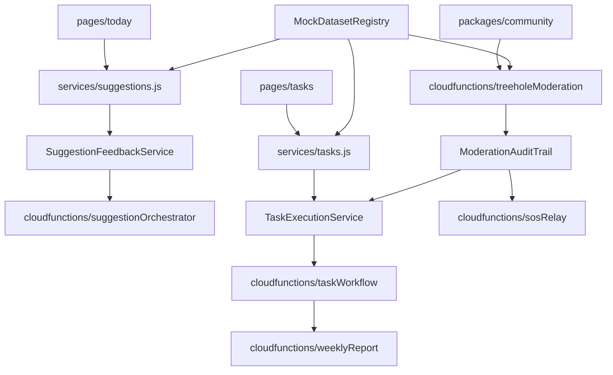

好的，这是根据我们之前的讨论生成的完整棕地增强架构文档。

---

# MindGuard Brownfield Enhancement Architecture

| 变更                               | 日期          | 版本 | 描述                                | 作者           |
| ---------------------------------- | ------------- | ---- | ----------------------------------- | -------------- |
| 初始版本创建                       | 2024-05-24    | 1.0  | 基于PRD v4.0和现有代码库创建增强架构 | Winston (Architect) |

## Introduction

This document outlines the architectural approach for enhancing MindGuard with the PRD-defined brownfield improvements that complete the “情绪打卡 → AI建议 → 任务执行 → 效果验证” loop while strengthening community safety and SOS coverage. Its primary goal is to guide AI-assisted implementation of the remaining feature work so new capabilities slot cleanly into the existing CloudBase + Dify architecture without breaking current experiences.

**Relationship to Existing Architecture:**
The plan builds on MindGuard’s layered structure (CLAUDE.md) and the v4 PRD scope (docs/prd.md). Where new workflows (treehole moderation hardening, AI micro-suggestion lifecycle, SOS escalation) touch established modules, this document specifies integration contracts so the current TDesign front-end, service layer normalizers, and CloudBase functions remain consistent. When trade-offs arise—e.g., expanding data models vs. keeping migrations lightweight—we favor compatibility with existing schemas and deployment tooling.

## Existing Project Analysis

- **Primary Purpose**: 面向高校学生的心理健康支持小程序，覆盖“情绪打卡→AI建议→任务执行→社区守护”全闭环（docs/prd.md:30-64）。
- **Current Tech Stack**: 微信小程序前端 + TDesign 组件，CloudBase 云函数后端，Dify AI 工作流，NoSQL 数据库（CLAUDE.md:42-61）。
- **Architecture Style**: 明确的分层架构：展示层（主包+分包）、服务层（17 个 API 模块）、云函数层（7 个核心函数）、数据层（云数据库+存储）（CLAUDE.md:73-124）。
- **Deployment Method**: 依托微信开发者工具构建与上传，云函数通过 CloudBase 管理，分包灰度发布策略（CLAUDE.md:205-329）。

### Available Documentation
- 根级 `CLAUDE.md` 提供架构总览、模块结构与开发规范（CLAUDE.md:1-360）。
- `docs/prd.md` 定义功能/非功能需求、实施计划与风险（docs/prd.md:1-497）。
- `docs/分包规划方案.md` 描述主包与分包体积、预加载及路径治理（docs/分包规划方案.md:215-320）。
- `docs/数据库设计.md` 给出核心集合、索引与数据策略（docs/数据库设计.md:1-200）。

### Identified Constraints
- 主包需保持 <2MB，分包 <1MB，严格遵循现有分包规划（docs/分包规划方案.md:215-238）。
- 所有 API 返回需维持 `{ ok, data, error }` 格式和 Mock 对齐（CLAUDE.md:298-307）。
- 需复用现有 CloudBase 环境 `cloud1-9gpfk3ie94d8630a`，避免破坏既有工作流（CLAUDE.md:205-214）。
- 性能与可用性指标：加权页面加载 <2s，AI 响应 <5s，SOS 功能 100% 可用（docs/prd.md:93-101）。
- 数据迁移必须向后兼容，敏感信息需加密存储并遵循最小权限原则（docs/prd.md:95-108）。

## Enhancement Scope and Integration Strategy

### Enhancement Overview
- **Enhancement Type**: Brownfield 功能闭环强化
- **Scope**: 完成 PRD 中定义的九大功能增强（情绪打卡、AI 微建议、任务闭环、树洞守护、REBT 日记、SOS、心语精灵、徽章激励、护心周报），并完善数据流、体验及安全策略（docs/prd.md:71-125）。
- **Integration Impact**: 高——需在保持现有 CloudBase+TDesign 架构的同时扩展服务层、云函数与数据模型，触及核心业务路径与多包页面。

### Integration Approach
- **Code Integration Strategy**: 优先复用 `miniprogram/services/*.js` 现有归一化服务与 Mock 体系，通过增量扩展函数与状态管理来支撑新场景。前端遵循既有页面/分包结构，将新增功能布置到合适的主包或分包以维持体积约束。云函数层在现有 7 个函数基础上扩展编排逻辑。
- **Database Integration**: 在 `checkins`, `behavior_tasks`, `forum_posts`, `ask_messages` 等集合中新增字段和索引，确保数据迁移向后兼容并遵循加密/最小权限原则。
- **API Integration**: 保持 `{ ok, data, error }` 格式及 Mock 对齐。服务层新增方法需覆盖 AI 建议、任务闭环、树洞守护、SOS 触发等，前端通过统一服务调用避免直连云函数。
- **UI Integration**: 延续 TDesign 组件体系和页面命名规范。新增界面遵循分包预加载策略，重点优化树洞互动、任务闭环、SOS 流程的导航与提示。

### Compatibility Requirements
- **Existing API Compatibility**: 所有增强需保持现有接口契约，维持服务层与云函数的兼容行为，并提供阶段性回归测试。
- **Database Schema Compatibility**: 数据迁移必须保留历史记录，支持灰度更新及回滚，敏感字段继续加密存储。
- **UI/UX Consistency**: 维持 TDesign 视觉语言与交互模式，控制页面体积及分包路径，确保老用户体验不突兀。
- **Performance Impact**: 遵守性能指标，新增功能在高并发下需通过缓存、异步处理与分批加载缓解压力，保持 SOS 功能 100% 可用。

## Tech Stack Alignment

| Category | Current Technology | Version | Usage in Enhancement | Notes |
|---|---|---|---|---|
| 前端框架 | 微信小程序原生框架 | 最新基础库 ≥ 2.32 | 扩展 5 个主包页面与 7 个分包 UI 交互 | 主包 < 2MB，分包 < 1MB（docs/分包规划方案.md） |
| UI 组件库 | TDesign Miniprogram | v1.0+ | 新增情绪打卡、任务、社区、SOS 等界面 | 需保持统一设计语言与响应式布局（CLAUDE.md） |
| 状态存储 | 微信小程序本地存储、全局状态 | - | 支持离线情绪打卡、任务缓存与同步 | 需与云端数据一致性策略配合 |
| 服务层 | miniprogram/services/\*.js 模块 | - | 承接 API 调用归一化与前端调用封装 | **注意**: Mock为硬编码/数据库样本，需规划集中化 |
| 后端运行 | 微信云开发 CloudBase 云函数 | Node.js | 扩展 checkinRecorder,suggestionOrchestrator,taskWorkflow 等逻辑 | 复用环境 `cloud1-9gpfk3ie94d8630a` |
| 数据库 | 微信云数据库 (NoSQL) | - | 增加情绪强度、任务闭环、社区风险字段等 | 必须保证迁移向后兼容，敏感数据加密 |
| AI 集成 | Dify 工作流与 API | 最新工作流配置 | 支持 AI 建议生成、风险评估、心语精灵多 Agent | 重点监控响应时延，确保降级策略 |
| 外部接口 | 微信开放平台 API | 最新 | 登录、订阅消息、内容安全接口调用 | 结合风控需求调整调用频率与错误处理 |
| 构建工具 | 微信开发者工具 + npm | 最新稳定版 | 构建小程序、部署云函数、依赖管理 | 需更新分包预加载与灰度发布策略 |
| 监控/日志 | 微信云开发日志 + 自定义遥测 | - | 追踪 AI 调用、社区风控、SOS 触发等关键指标 | 加强实时告警和异常分级机制 |

## Data Models and Schema Changes

### New Data Models

#### SuggestionFeedback
- **Purpose**: 记录用户对 AI 微建议的即时反馈，支撑模型调优与个性化排序。
- **Integration**: 与现有 `suggestions`、`tasks` 集合关联，形成“建议 → 反馈 → 任务执行”闭环。
- **Key Attributes**:
  - `suggestion_id`: string – 对应的微建议标识
  - `user_id`: string – 用户标识
  - `feedback_type`: string – 反馈类型 (helpful/neutral/not_helpful)
  - `feedback_score`: number – 1-5 满意度评分
  - `comment`: string – 可选文字说明
  - `action_taken`: string – 是否转化为任务、收藏或忽略
  - `createdAt`: date, `updatedAt`: date
- **Relationships**: With Existing: `suggestions`, `tasks`. With New: `TaskExecutionLog`.

#### TaskExecutionLog
- **Purpose**: 精细记录任务执行过程、打卡记录与复盘数据，满足 PRD 中对任务闭环的统计与周报需求。
- **Integration**: 与 `tasks`、`checkins`、`reports` 集成，为周报和徽章系统提供详尽数据。
- **Key Attributes**:
  - `task_id`: string – 任务唯一标识
  - `user_id`: string – 用户标识
  - `event_type`: string – 执行事件 (start/complete/review)
  - `event_payload`: object – 事件详情
  - `linked_checkin_id`: string – 对应情绪回执
  - `effectiveness_score`: number – 执行后自评效果 0-1
  - `createdAt`: date, `updatedAt`: date
- **Relationships**: With Existing: `tasks`, `checkins`, `reports`. With New: `ModerationAuditTrail`.

#### ModerationAuditTrail
- **Purpose**: 为树洞风控与 SOS 保障建立完整审核日志，满足 PRD 对“风险识别 → 审核 → 干预”链路的审计要求。
- **Integration**: 与 `posts`, `comments`, `sos_events`, `notifications` 交互。
- **Key Attributes**:
  - `target_type`: string – 被审核对象类型
  - `target_id`: string – 对象 ID
  - `risk_snapshot`: object – 风险指标
  - `action_taken`: string – 采取的措施
  - `reviewer_id`: string – 审核人
  - `follow_up_task_id`: string – 后续干预任务
  - `createdAt`: date, `updatedAt`: date
- **Relationships**: With Existing: `posts`, `comments`, `sos_events`, `notifications`. With New: `TaskExecutionLog`.

### Schema Integration Strategy
- **New Tables**: `suggestion_feedback`, `task_execution_logs`, `moderation_audit_trail`.
- **Modified Tables**: 
  - `suggestions`: add `feedback_count`, `last_feedback_at`.
  - `tasks`: add `latest_execution_score`.
  - `posts`: add `last_reviewed_at`, `audit_status`.
  - `checkins`: add `mood_intensity`, `energy_level`.
- **New Indexes**: For new collections and updated fields to support queries.
- **Migration Strategy**: Use cloud function batch processing to add default fields. Create `mock_datasets` collection to centralize future mock data.
- **Backward Compatibility**: Ensure old data defaults gracefully and APIs tolerate missing new fields.

## Component Architecture

### New Components
#### SuggestionFeedbackService
- **Responsibility**: 统一管理微建议反馈采集、存储和排序信号聚合。
- **Integration Points**: `services/suggestions.js`, `cloudfunctions/suggestionOrchestrator`.
- **Key Interfaces**: `submitFeedback(suggestionId, payload)`, `fetchAggregatedScores(userId)`.

#### TaskExecutionService
- **Responsibility**: 记录任务执行全生命周期事件，串联任务状态、情绪回执与周报生成。
- **Integration Points**: `services/tasks.js`, `cloudfunctions/taskWorkflow`, `cloudfunctions/weeklyReport`.
- **Key Interfaces**: `logTaskEvent(taskId, eventType, payload)`, `getExecutionSummary(userId, range)`.

#### ModerationAuditTrail
- **Responsibility**: 为树洞与 SOS 审核提供全链路日志、证据管理与跟进任务挂接。
- **Integration Points**: `cloudfunctions/treeholeModeration`, `cloudfunctions/sosRelay`, `services/forum.js`.
- **Key Interfaces**: `recordModeration(targetType, targetId, decision, evidence)`, `listAuditTrail(targetId)`.

#### MockDatasetRegistry
- **Responsibility**: 将目前散落在前端/数据库的 Mock 数据集中管理。
- **Integration Points**: All services using mock data.
- **Key Interfaces**: `loadMockData(serviceName, scenario)`, `syncMockDataset(dataset)`.

### Component Interaction Diagram


## API Design and Integration
- **API Integration Strategy**: 沿用现有“服务层 -> 云函数”调用模式，将新增能力绑定到既有CloudBase函数。
- **Authentication**: 保持微信会话鉴权。新增审核/SOS接口采用角色权限校验。
- **Versioning**: 在云函数内部保留v1逻辑，通过`apiVersion`参数实现向后兼容。

### New/Extended API Endpoints (as Cloud Function Actions)

#### SubmitSuggestionFeedback
- **Endpoint**: `cloudfunctions/suggestionOrchestrator`
- **Action**: `submitFeedback`
- **Purpose**: 收集微建议即时反馈。
- **Request**: `{ "action": "submitFeedback", "payload": { "suggestionId": "...", "feedbackType": "...", ... } }`
- **Response**: `{ "ok": true, "data": { "feedbackId": "...", "aggregatedScore": 4.6 } }`

#### LogTaskExecutionEvent
- **Endpoint**: `cloudfunctions/taskWorkflow`
- **Action**: `logExecutionEvent`
- **Purpose**: 记录任务执行事件与复盘数据。
- **Request**: `{ "action": "logExecutionEvent", "payload": { "taskId": "...", "eventType": "complete", ... } }`
- **Response**: `{ "ok": true, "data": { "logId": "...", "latestExecutionScore": 0.82 } }`

#### RecordModerationDecision
- **Endpoint**: `cloudfunctions/treeholeModeration`
- **Action**: `recordModerationDecision`
- **Purpose**: 保存审核结果并按需触发SOS。
- **Request**: `{ "action": "recordModerationDecision", "payload": { "targetId": "...", "decision": { "actionTaken": "escalate", ... }, ... } }`
- **Response**: `{ "ok": true, "data": { "auditId": "...", "sosTriggered": true } }`

## External APIs
本次棕地增强不引入新的第三方API。继续沿用现有微信开放接口与Dify模型调用。

## Source Tree Integration

### Existing Project Structure
```
miniprogram/
├── pages/
├── packages/
├── services/
└── ...
cloudfunctions/
├── checkinRecorder/
├── suggestionOrchestrator/
└── ...
docs/
```

### New File Organization
```
MindGuard/
├── tools/
│   └── mock-sync/          # MockDatasetRegistry 同步脚本
├── miniprogram/
│   ├── services/
│   │   ├── feedback.js       # SuggestionFeedbackService
│   │   ├── taskExecution.js  # TaskExecutionService
│   │   └── mock-registry.js  # MockDatasetRegistry 访问辅助
│   └── utils/
│       └── api-version.js    # 服务层统一附加 apiVersion
├── cloudfunctions/
│   ├── suggestionOrchestrator/
│   │   └── actions/          # 按动作拆分逻辑
│   └── ...
└── docs/
    └── architecture/
        └── brownfield-v2.md  # 本文档
```
- **Guidelines**: 新服务模块遵循现有`kebab-case`命名。云函数逻辑按动作拆分到`actions/`子目录。

## Infrastructure and Deployment Integration
- **Existing Infrastructure**: 继续完全依托微信云开发（CloudBase）和微信小程序管线。
- **Enhancement Deployment Strategy**: 采用“先分支环境验证 → 灰度发布 → 全量同步”的序列，利用小程序灰度发布和云函数版本化能力。
- **Infrastructure Changes**: 新建所需数据库集合，在CloudBase部署脚本中更新打包和迁移逻辑。
- **Rollback Strategy**: 小程序端可一键回滚版本；云函数可回退版本；数据库迁移有备份和恢复脚本。

## Coding Standards and Conventions
- **Compliance**: 新代码遵循`CLAUDE.md`中定义的代码风格、文件结构和JSDoc注释规范。
- **Critical Rules**: API返回值保持`{ok,data,error}`；云函数支持`apiVersion`；数据库迁移必须向后兼容；敏感数据加密；错误需记录并提供降级处理。

## Testing Strategy
- **Framework**: 引入Jest进行服务层和云函数单元测试。
- **Organization**: 新建`__tests__`目录存放测试文件。
- **Coverage**: 核心流程（情绪闭环、社区守护、SOS）要求测试覆盖率 ≥ 80%。
- **Integration Tests**: 重点测试情绪打卡->建议->任务->周报的端到端链路，以及社区审核->SOS触发的流程。
- **Regression Testing**: 建立自动化回归用例集，确保改动不破坏现有功能。

## Security Integration
- **Existing Measures**: 沿用现有微信`_openid`鉴权、角色授权、数据加密和内容安全接口。
- **Enhancement Requirements**: 新增ModerationAuditTrail记录审核全流程；SuggestionFeedback和TaskExecution日志按P2/P3级数据管理；`MockDatasetRegistry`的写入操作需要开发者权限。
- **Security Testing**: 增加对角色越权、风险升级、Mock数据篡改等场景的自动化测试。

## Checklist Results Report
Architect-checklist执行已启动，初步分析结果如下 (部分)：
- **Section 1 (Requirements Alignment)**: **通过 (14/16)**。警告项：高并发性能测试计划和第三方API速率降级方案需在后续阶段细化。
- **Section 2 (Architecture Fundamentals)**: **通过 (100%)**。
- **Section 3 (Tech Stack)**: **通过**。提醒：建议整理“关键依赖与版本”表。
- **后续章节**：已识别出部分待补充项，如组件交互稿、CI/CD实施细节、版本升级策略等。

**结论**: 架构方案与需求高度对齐，无阻断性问题。识别出的风险点和待补充项可在后续开发迭代中跟进。

## Next Steps

### Story Manager Handoff
"架构方案已完成。请根据`docs/architecture`和`docs/prd.md`，开始创建用户故事。关键点：
1.  **遵循PRD中的故事优先级**，从Story 1.1开始。
2.  **集成需求**: 每个故事都必须考虑与现有系统的集成，并包含验证现有功能完整性的AC。
3.  **遵守约束**: 严格遵循`Coding Standards`和`Security Integration`章节定义的规范。"

### Developer Handoff
"增强功能的架构设计已完成。开发时请严格遵循 `docs/architecture` 文档：
1.  **代码结构**: 按照`Source Tree Integration`章节的规划组织新文件。
2.  **集成模式**: 遵循`API Design`和`Component Architecture`中定义的接口和模式。
3.  **测试要求**: 按照`Testing Strategy`为新代码编写单元测试和集成测试。
4.  **安全第一**: 实施`Security Integration`中定义的所有安全要求。"