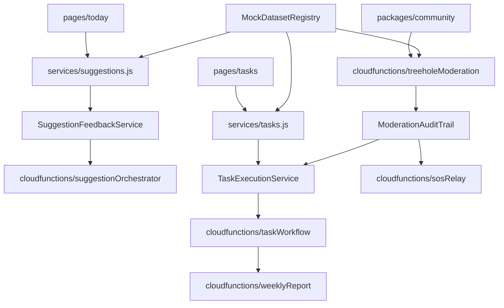

# Component Architecture

### New Components
#### SuggestionFeedbackService
- **Responsibility**: 统一管理微建议反馈采集、存储和排序信号聚合。
- **Integration Points**: `services/suggestions.js`, `cloudfunctions/suggestionOrchestrator`.
- **Key Interfaces**: `submitFeedback(suggestionId, payload)`, `fetchAggregatedScores(userId)`.

#### TaskExecutionService
- **Responsibility**: 记录任务执行全生命周期事件，串联任务状态、情绪回执与周报生成。
- **Integration Points**: `services/tasks.js`, `cloudfunctions/taskWorkflow`, `cloudfunctions/weeklyReport`.
- **Key Interfaces**: `logTaskEvent(taskId, eventType, payload)`, `getExecutionSummary(userId, range)`.

#### ModerationAuditTrail
- **Responsibility**: 为树洞与 SOS 审核提供全链路日志、证据管理与跟进任务挂接。
- **Integration Points**: `cloudfunctions/treeholeModeration`, `cloudfunctions/sosRelay`, `services/forum.js`.
- **Key Interfaces**: `recordModeration(targetType, targetId, decision, evidence)`, `listAuditTrail(targetId)`.

#### MockDatasetRegistry
- **Responsibility**: 将目前散落在前端/数据库的 Mock 数据集中管理。
- **Integration Points**: All services using mock data.
- **Key Interfaces**: `loadMockData(serviceName, scenario)`, `syncMockDataset(dataset)`.

### Component Interaction Diagram


