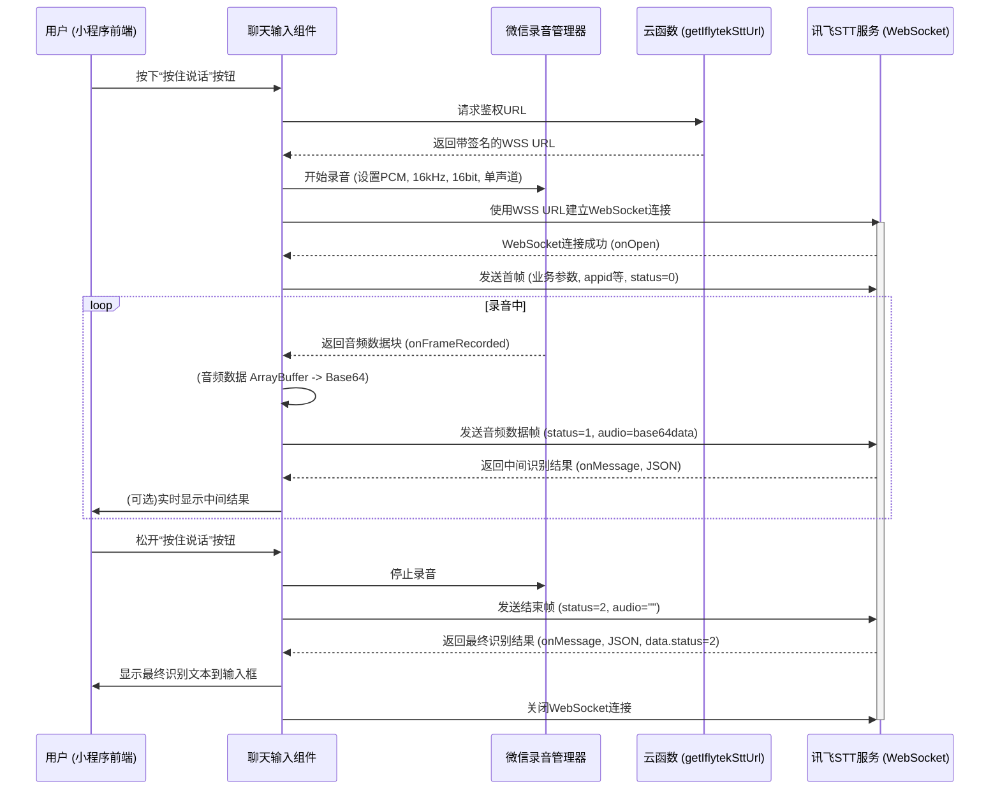

好的，我们来编写一份关于集成讯飞语音实现语音输入功能的开发文档。这份文档将作为我们开发过程中的指南和后续维护的参考。

**HeartChat 语音输入功能 (讯飞语音听写) 开发文档**

**1. 功能概述**

本功能旨在为 HeartChat 小程序提供语音输入能力，允许用户通过麦克风录制语音，并将语音实时转换为文字，显示在聊天输入框中。核心技术采用科大讯飞的语音听写（流式版）WebAPI，通过 WebSocket 进行实时通信。

**2. 技术选型**

*   **语音识别服务 (STT):** 科大讯飞语音听写（流式版）WebAPI
    *   官方文档: [https://www.xfyun.cn/doc/asr/voicedictation/API.html](https://www.xfyun.cn/doc/asr/voicedictation/API.html)
*   **客户端:** 微信小程序原生 JS API
    *   录音: `wx.getRecorderManager()`
    *   WebSocket: `wx.connectSocket()`
*   **服务端 (鉴权):** 微信小程序云函数 (Node.js 环境)
    *   主要职责：生成安全的、包含签名的 WebSocket 连接 URL。
*   **Node.js Demo 参考:** `@docs/参考文档/iat_ws_nodejs_demo` (用于理解 WebSocket 通信协议和数据帧格式)

**3. 系统架构**



**4. 前置准备**

1.  **讯飞开放平台配置:**
    *   注册账号并完成个人实名认证 ([https://www.xfyun.cn/](https://www.xfyun.cn/))。
    *   进入控制台，创建新应用。
    *   为应用开通“语音听写（流式版）”服务。
    *   记录下应用的 `APPID`, `APISecret`, `APIKey` (用于云函数鉴权)。
2.  **微信小程序后台配置:**
    *   登录微信公众平台，进入小程序的“开发管理”->“开发设置”->“服务器域名”。
    *   添加 `request` 合法域名: `https://*.xfyun.cn` (或讯飞 API 文档中指定的更精确域名，如 `https://iat-api.xfyun.cn`)。
    *   添加 `socket` 合法域名: `wss://iat-api.xfyun.cn` (以及文档中可能提及的其他备用 WSS 地址，如 `wss://ws-api.xfyun.cn`)。
3.  **讯飞开放平台配置:**
    *   APPID: 60f9a524
    *   APISecret: ZDk4Yjg4NzNmZDk3NjgzZjgwNjYwYTFm
    *   APIKey: 4feb62558a6751514bb884b0c9832030


**5. 后端云函数实现 (`getIflytekSttUrl`)**

*   **功能:** 生成科大讯飞语音听写服务所需的 WebSocket 鉴权 URL。
*   **触发方式:** 小程序端调用。
*   **输入参数:** 无 (APPID, APIKey, APISecret 从云函数环境变量获取)。
*   **返回数据:**
    ```json
    {
      "success": true,
      "wssUrl": "wss://iat-api.xfyun.cn/v2/iat?authorization=...&date=...&host=...",
      "appid": "YOUR_APPID" // 可选，方便前端使用
    }
    // 或错误时
    {
      "success": false,
      "error": "错误信息"
    }
    ```
*   **核心逻辑 (Node.js):**
    1.  从云函数环境变量中读取 `IFLYTEK_APPID`, `IFLYTEK_API_KEY`, `IFLYTEK_API_SECRET`。
    2.  获取当前 UTC 时间，并格式化为 `RFC1123` 格式 (e.g., `Mon, 02 Aug 2021 08:41:30 GMT`)。
    3.  定义请求的主机名 (e.g., `iat-api.xfyun.cn`) 和路径 (`/v2/iat`)。
    4.  构造待签名的字符串 `signature_origin`:
        ```
        host: ${host}
        date: ${date}
        GET ${requestLine} HTTP/1.1
        ```
    5.  使用 `APISecret` 对 `signature_origin` 进行 HMAC-SHA256 加密，然后进行 Base64 编码得到 `signature_sha`。
    6.  使用 `APIKey` 和其他参数构造最终的 `authorization` 字符串，并进行 Base64 编码。
        ```javascript
        // 伪代码
        const authorization_origin = `api_key="${apiKey}", algorithm="hmac-sha256", headers="host date request-line", signature="${signature_sha}"`;
        const authorization = Buffer.from(authorization_origin).toString('base64');
        ```
    7.  拼接完整的 WebSocket URL: `wss://${host}${requestLine}?authorization=${authorization}&date=${encodeURIComponent(date)}&host=${host}`。
    8.  返回拼接好的 URL。
*   **依赖库:** `crypto` (Node.js 内置)。
*   **注意事项:** 务必将密钥信息存储在环境变量中，避免硬编码。

**6. 前端小程序实现**

*   **涉及组件/页面:** `miniprogram/components/chat-input/chat-input.js` (或其他负责输入的组件/页面)。
*   **UI 元素:**
    *   一个可点击/长按的“语音输入”按钮。
    *   录音过程中的状态提示（如“正在聆听…”、“松开结束”等）。
*   **核心逻辑:**
    *   **6.1. 初始化录音与 WebSocket 相关变量:**
        ```javascript
        // chat-input.js
        data: {
          isRecording: false,
          recordStatusText: '按住说话',
          sttResult: '', // 最终识别结果
          // ... 其他已有 data
        },
        recorderManager: null,
        socketTask: null,
        IFLYTEK_APPID: '', // 从云函数获取或配置
        // ...
        ```
    *   **6.2. 用户交互 (按下按钮 - `onTouchStart` / `onLongPress`):**
        1.  设置 `isRecording` 为 `true`，更新 `recordStatusText`。
        2.  调用云函数 `getIflytekSttUrl` 获取鉴权后的 `wssUrl` 和 `appid`。
            ```javascript
            wx.cloud.callFunction({
              name: 'getIflytekSttUrl',
              success: res => {
                if (res.result && res.result.success) {
                  this.IFLYTEK_APPID = res.result.appid; // 保存 appid
                  this.startRecordAndConnect(res.result.wssUrl);
                } else {
                  // 处理获取 URL 失败
                  wx.showToast({ title: '语音服务初始化失败', icon: 'none' });
                  this.resetRecordState();
                }
              },
              fail: err => {
                // ...错误处理
                this.resetRecordState();
              }
            });
            ```
        3.  在 `startRecordAndConnect(wssUrl)` 方法中:
            *   初始化 `wx.getRecorderManager()`：
                ```javascript
                this.recorderManager = wx.getRecorderManager();
                const options = {
                  duration: 60000, // 最长录音时间，单位 ms
                  sampleRate: 16000, // 采样率
                  numberOfChannels: 1, // 录音通道数
                  encodeBitRate: 48000, // 编码码率 (16kHz * 16bit * 1channel / 1 = 256kbps -> 32KB/s, 48kbps可能偏低，需确认讯飞pcm要求)
                                      // 讯飞文档通常要求原始PCM，这里可能需要调整为接近16bit PCM的码率
                                      // 如果是原始PCM，码率计算应为 16000 * 16 * 1 = 256000 bps。
                                      // 小程序文档中 encodeBitRate 针对的是 aac/mp3，pcm可能不需要此参数或有特定值
                  format: 'pcm', // 音频格式，讯飞要求 pcm
                  frameSize: 5,    // (可选)指定帧大小，单位 KB。传入 frameSize 后，每录制指定帧大小的内容后，会回调录制的文件内容。
                                   // 讯飞要求每次发送音频字节数 1280 -> 1.25KB，可以考虑frameSize设置为1.25KB的倍数
                                   // 但实测中，frameSize 较小（如1-5KB）时，onFrameRecorded 回调频率较高，便于流式发送
                };
                this.recorderManager.start(options);
                ```
            *   绑定录音事件监听：`this.recorderManager.onStart`, `this.recorderManager.onFrameRecorded`, `this.recorderManager.onStop`, `this.recorderManager.onError`。
            *   初始化 WebSocket 连接:
                ```javascript
                this.socketTask = wx.connectSocket({ url: wssUrl });
                this.socketTask.onOpen(() => { /* ... send first frame ... */ });
                this.socketTask.onMessage(res => { /* ... handle stt result ... */ });
                this.socketTask.onError(err => { /* ... handle error ... */ });
                this.socketTask.onClose(() => { /* ... handle close ... */ });
                ```
    *   **6.3. WebSocket `onOpen` 事件处理:**
        *   发送业务参数帧 (首帧)，`status: 0`。
        ```javascript
        // 示例，具体参数参考讯飞文档和 iat-ws-node.js
        const firstFrame = {
          common: { app_id: this.IFLYTEK_APPID },
          business: {
            language: 'zh_cn', // en_us, ...
            domain: 'iat',     // iat (日常用语), medical (医疗领域), ...
            accent: 'mandarin',// mandarin (普通话), cantonese (粤语), ...
            vad_eos: 3000,     // (静默后端点)静默多长时间后后端点自动断开（取值范围：0-10000ms）
            dwa: 'wpgs',       // (动态修正)参数，设置为 wpgs 表示开启修正（具体参考业务参数）
            // pd: '', // (个性化)个性化参数上传
            // ptt: 0, // (标点)是否有标点（0：无，1：有）
            // rlang: 'zh-cn', // (语种)仅在多语种参数效果下生效
            // vinfo: 0, // (结果信息)返回结果中是否包含增量、时间信息（0：否，1：是）
            // nunum: 0, // (数字转换)是否开启接口数字智能转换（0-不开启，1-开启） [未开启动态修正时生效]
            // speex_size: 60, // speex音频帧大小[1-60]，speex音频（即treat_audio_as_raw=false）时使用此参数传输数据
            // nbest: 0, // 候选结果个数（0-不返回） [未开启动态修正时生效]
            // wbest: 0, // 候选结果（含词级时间戳）个数（0-不返回） [未开启动态修正时生效]
          },
          data: {
            status: 0,
            format: 'audio/L16;rate=16000', // 音频规格
            encoding: 'raw', // 音频编码，raw 表示原始数据即PCM
            audio: '' // 首帧 audio 为空字符串
          }
        };
        this.socketTask.send({ data: JSON.stringify(firstFrame) });
        ```
    *   **6.4. 录音管理器 `onFrameRecorded` 事件处理:**
        *   当 `res.isLastFrame` 为 `false` 时，此为中间音频帧。
        *   将 `res.frameBuffer` (ArrayBuffer) 转换为 Base64 字符串。
        *   发送音频数据帧，`status: 1`。
        ```javascript
        const audioBase64 = wx.arrayBufferToBase64(res.frameBuffer);
        const audioFrame = {
          data: {
            status: 1,
            format: 'audio/L16;rate=16000',
            encoding: 'raw',
            audio: audioBase64
          }
        };
        if (this.socketTask && this.socketTask.readyState === this.socketTask.OPEN) {
          this.socketTask.send({ data: JSON.stringify(audioFrame) });
        }
        ```
    *   **6.5. 用户交互 (松开按钮 - `onTouchEnd`):**
        1.  调用 `this.recorderManager.stop()`。
        2.  `isRecording` 设置为 `false`。
        3.  (在 `recorderManager.onStop` 回调中或此处直接) 发送结束帧给 WebSocket，`status: 2`。
            ```javascript
            const lastFrame = {
              data: {
                status: 2,
                format: 'audio/L16;rate=16000',
                encoding: 'raw',
                audio: '' // 结束帧 audio 为空
              }
            };
            if (this.socketTask && this.socketTask.readyState === this.socketTask.OPEN) {
              this.socketTask.send({ data: JSON.stringify(lastFrame) });
            }
            this.setData({ recordStatusText: '识别中...' });
            ```
    *   **6.6. WebSocket `onMessage` 事件处理:**
        *   接收到讯飞服务器返回的 JSON 字符串，解析它。
        *   根据讯飞的返回结果格式，提取识别出的文本。
            *   `data.result.ws` 是一个数组，每个元素代表一个词。
            *   `data.result.ws[i].cw[0].w` 是词文本。
            *   `data.result.pgs` (如果为 `rpl` 或 `apd`) 表示替换或追加之前的识别结果。
            *   `data.result.ls` (boolean) 为 `true` 表示这是最终结果。
            *   如果开启了动态修正，则需要解析 `data.cn.st.rt[0].ws`。
        *   拼接并更新 `sttResult`，并显示在输入框或临时区域。
        *   如果 `data.code !== 0`，则表示出错，进行错误处理。
        *   如果 `data.data.status === 2`，表示整个识别流程结束，服务端已处理完所有音频。此时可以根据最终结果更新输入框，并关闭 WebSocket 连接。
            ```javascript
            // 简化版结果处理，详细逻辑参考讯飞文档及 iat-ws-node.js
            const resData = JSON.parse(event.data);
            if (resData.code !== 0) {
              console.error('STT Error:', resData.message);
              this.resetRecordState();
              wx.showToast({ title: `识别失败: ${resData.message}`, icon: 'none' });
              if(this.socketTask) this.socketTask.close();
              return;
            }

            let currentText = '';
            // 假设未开启动态修正
            if (resData.data && resData.data.result && resData.data.result.ws) {
              for (let i = 0; i < resData.data.result.ws.length; i++) {
                currentText += resData.data.result.ws[i].cw[0].w;
              }
            }
            // 如果开启了动态修正，解析逻辑不同
            // if (resData.data && resData.data.cn && resData.data.cn.st && resData.data.cn.st.rt[0].ws) { ... }

            // 简单拼接，实际可能需要根据 pgs 字段做更细致处理
            let newSttResult = this.data.sttResult + currentText;
            this.setData({ sttResult: newSttResult }); // 更新到 data

            if (resData.data && resData.data.status === 2) { // 最终结果
              this.setData({ recordStatusText: '按住说话' });
              // 将 this.data.sttResult 设置到输入框
              this.triggerEvent('inputChange', { value: this.data.sttResult }); // 假设有这个事件
              this.triggerEvent('send', { value: this.data.sttResult }); // 或直接发送
              if(this.socketTask) this.socketTask.close();
              this.setData({ sttResult: '' }); // 清空累积结果
            }
            ```
    *   **6.7. WebSocket `onError` 和 `onClose` 事件处理:**
        *   `onError`: 提示用户网络错误或服务异常。
        *   `onClose`: 清理状态，确保 `isRecording` 为 `false`，`recorderManager` 和 `socketTask` 被正确处理。
    *   **6.8. 状态重置方法 `resetRecordState()`:**
        *   用于在录音结束、出错或取消时，将所有相关状态和变量恢复到初始值。

**7. 音频格式和参数**

*   **小程序端录音参数 (`recorderManager.start(options)`):**
    *   `sampleRate`: **16000** (讯飞要求)
    *   `numberOfChannels`: **1** (讯飞要求单声道)
    *   `format`: **'pcm'** (讯飞要求 PCM 或其他指定压缩格式)
    *   `frameSize`: 建议设置为较小值（如 1-5KB）以便 `onFrameRecorded` 频繁回调，方便流式发送。讯飞推荐每次 WebSocket 传输的音频数据量为 1280 字节 (1.25KB) 的整数倍，可以基于此调整。
*   **发送给讯飞的业务参数 (`business`):**
    *   `language`: `zh_cn` (中文普通话), `en_us` (英语) 等。
    *   `domain`: `iat` (日常用语), `medical` (医疗) 等，根据场景选择。
    *   `accent`: `mandarin` (普通话), `cantonese` (粤语) 等。
    *   `dwa`: (可选) 是否开启动态修正，如 `wpgs`。
    *   更多参数参考讯飞官方文档。
*   **发送给讯f飞的数据帧参数 (`data`):**
    *   `status`: `0` (首帧), `1` (中间音频帧), `2` (结束帧)。
    *   `format`: `audio/L16;rate=16000` (表示 16kHz采样率、16bit位深、线性PCM)。
    *   `encoding`: `raw` (表示原始 PCM 数据)。
    *   `audio`: Base64 编码的音频数据字符串 (首帧和尾帧为空)。

**8. 错误处理与健壮性**

*   云函数获取 WSS URL 失败。
*   WebSocket 连接建立失败 (`onError`)。
*   WebSocket 连接意外断开 (`onClose`)。
*   讯飞服务返回错误码 (解析 `onMessage` 中的 `resData.code`)。
*   小程序录音权限未授予。
*   录音 API 调用错误 (`recorderManager.onError`)。
*   网络请求超时。

**9. 注意事项与待办**

*   **真机调试:** WebSocket 和录音相关功能强依赖真机环境。
*   **音频格式对齐:** 确保小程序 `recorderManager` 输出的 PCM 数据格式严格符合讯飞要求。这是最容易出问题的环节。
*   **动态修正逻辑:** 如果启用了动态修正 (`dwa` 参数)，前端解析识别结果的逻辑会更复杂，需要根据 `pgs` (partial result strategy) 字段来替换或追加文本。
*   **APPID 等密钥安全:** 严格遵守云函数环境变量存储规范。
*   **UI/UX 优化:** 完善录音过程中的用户反馈和交互体验。
*   **TTS (文本转语音):** 本文档仅覆盖 STT。TTS 功能需另行规划和开发，可调研讯飞的语音合成服务。
*   **代码注释:** 确保所有关键逻辑都有清晰的注释。
*   **`todo.md` 更新:** 对应此功能创建任务并跟踪。

**10. 依赖库 (前端)**

*   无外部依赖，均使用微信小程序原生 API。

**11. 依赖库 (云函数)**

*   `crypto`: Node.js 内置模块，用于生成签名。

通过遵循这份文档，我们应该能够顺利地在 HeartChat 中集成讯飞的语音听写功能。在开发过程中，务必仔细阅读并对照讯飞的官方 API 文档。
