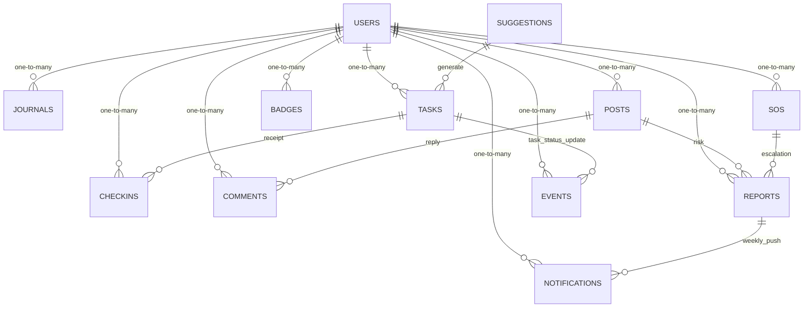

# 关系图与依赖

## 依赖说明
- **情绪 → 建议 → 任务闭环**：`checkins` 触发 `suggestions` 生成，`suggestions` 与 `tasks` 绑定，执行状态同步至 `events`、`reports`。
- **社区 → 风险治理**：`posts` 与 `comments` 产生内容，`reports` 记录高危信号，若升级触发 `sos` 并推送告警通知。
- **激励体系**：`badges` 根据 `checkins`、`tasks`、`events` 聚合结果解锁，通过 `notifications` 推送用户。
- **运维观测**：所有关键行为记录到 `events`，供埋点看板与 A/B 分析；异常链路由 `reports` 及 `sos` 输出给值班同学。

> 若新增集合需在图中补充箭头，并更新对应集合文档的“关系与级联”章节。
