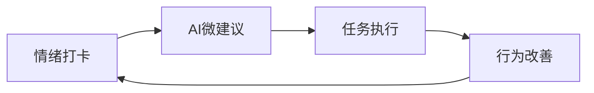
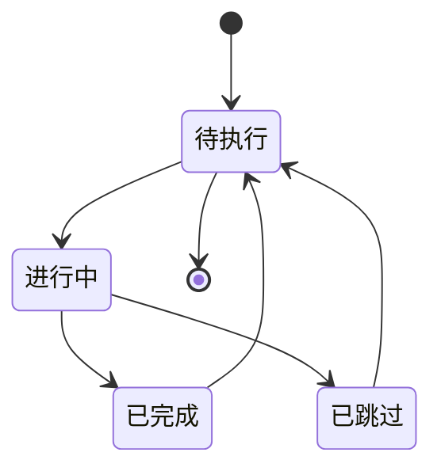

# MindGuard 用户使用指南

> **MindGuard** 心理健康支持小程序使用指南
>
> 版本：v1.0.0 | 更新时间：2025年10月20日
>
> 专为高校学生设计的心理健康管理工具，帮助你建立健康的心理支持系统

---

## 📖 目录

- [快速开始](#快速开始)
- [核心功能](#核心功能)
- [情绪打卡](#情绪打卡)
- [任务管理](#任务管理)
- [社区互动](#社区互动)
- [日记记录](#日记记录)
- [AI对话助手](#ai对话助手)
- [个人中心](#个人中心)
- [紧急求助](#紧急求助)
- [常见问题](#常见问题)

---

## 🚀 快速开始

### 首次使用

1. **打开小程序**
   - 在微信中搜索"MindGuard"
   - 或扫描二维码进入小程序

2. **授权登录**
   - 点击"微信登录"按钮
   - 授权获取基本信息（头像、昵称）
   - 完善个人资料（学校、年级等）

3. **开始体验**
   - 进行第一次情绪打卡
   - 获取个性化建议
   - 探索各项功能

### 主界面导航

小程序底部有5个主要Tab页面：

- **今天** 🏠 - 情绪打卡和微建议
- **任务** 📋 - 任务管理和执行
- **树洞** 💬 - 社区互动和分享
- **随笔** 📔 - 日记记录和REBT分析
- **我的** 👤 - 个人中心和成长记录

---

## ✨ 核心功能

### 心理健康四阶段循环

MindGuard 基于"情绪打卡 → AI建议 → 任务闭环 → 社区守护"的四阶段循环设计：

1. **情绪感知** - 通过每日打卡了解自己的情绪状态
2. **智能分析** - AI基于情绪数据生成个性化建议
3. **行动落实** - 将建议转化为可执行的任务
4. **持续改善** - 通过社区支持和记录反思促进成长

---

## 😊 情绪打卡

### 打卡入口

从"今天"页面进入情绪打卡功能，有三种打卡方式：

#### 1. 快速打卡

最简单的打卡方式，适合日常使用：

1. **选择情绪**
   - 点击情绪轮盘上的情绪区域
   - 或从情绪列表中选择

2. **调整强度**
   - 拖动滑块调整情绪强度（1-5级）
   - 系统会自动记录能量水平

3. **添加标签**（可选）
   - 选择相关的情绪标签
   - 如：学习、社交、运动等

4. **完成打卡**
   - 点击"完成打卡"按钮
   - 系统保存记录并生成心情轮

#### 2. 详细打卡

适合需要深入记录的情况：

1. **基础信息**（同快速打卡）
2. **情绪说明**
   - 在文本框中详细描述当前情绪
   - 记录引起情绪的具体事件
   - 分享感受和想法

3. **情境信息**
   - 选择当前所在场景（教室、宿舍、图书馆等）
   - 记录正在进行的活动的信息

#### 3. 语音打卡

使用语音快速记录情绪状态：

1. **点击语音按钮**
   - 长按录音按钮开始录制
   - 说出当前的情绪和感受
   - 松开按钮结束录制

2. **语音转文字**
   - 系统自动将语音转换为文字
   - 可以手动编辑转换结果

### 情绪类型说明

MindGuard 支持8种基本情绪类型：

| 情绪类型 | 特征描述 | 适用场景 |
|---------|----------|----------|
| **喜悦** 😊 | 快乐、满足、兴奋 | 取得好成绩、收到好消息 |
| **平静** 😌 | 安静、放松、平和 | 冥想、阅读、听音乐 |
| **专注** 🎯 | 集中、投入、有目标 | 学习、工作、创作 |
| **低落** 😔 | 悲伤、失落、沮丧 | 遇到挫折、思念家乡 |
| **焦虑** 😰 | 紧张、担心、不安 | 考试前、面对挑战 |
| **愤怒** 😠 | 生气、不满、愤慨 | 遇到不公、被误解 |
| **倦怠** 😴 | 疲劳、乏力、提不起劲 | 熬夜、过度劳累 |
| **其他** 🤔 | 复杂情绪、难以归类 | 情绪复杂、多种情绪混合 |

### 情绪强度说明

情绪强度分为5个等级：

- **1级** 🟢 - 轻微感受，几乎不影响日常活动
- **2级** 🟡 - 轻度感受，稍有影响但可以正常活动
- **3级** 🟠 - 中度感受，明显影响注意力
- **4级** 🔴 - 强烈感受，难以专注于其他事情
- **5级** ⚫ - 极强感受，需要立即关注和处理

### 心情轮解读

打卡完成后，系统会生成个性化心情轮：

- **颜色分布** - 显示各种情绪的比例
- **趋势变化** - 展示近期的情绪变化趋势
- **情绪标签云** - 显示出现频率高的情绪标签
- **建议卡片** - 基于情绪状态生成建议

---

## 📋 任务管理

### 任务来源

MindGuard 中的任务主要来自三个渠道：

#### 1. AI微建议 → 任务转化

系统根据你的情绪状态智能生成建议，可以一键转化为任务：

1. **查看建议**
   - 在"今天"页面浏览AI生成的建议
   - 查看建议的详细说明和执行步骤

2. **接受建议**
   - 点击"接受"按钮
   - 可以自定义任务标题和截止时间
   - 系统自动创建任务

3. **执行任务**
   - 在"任务"页面查看待执行任务
   - 点击任务查看详细步骤
   - 完成后标记为已完成

#### 2. 日记反思 → 行动计划

通过REBT日记分析后，系统会推荐具体的行动建议：

1. **分析日记**
   - 在"随笔"页面记录日记
   - 系统进行REBT分析
   - 识别需要改进的思维模式

2. **生成行动计划**
   - 基于分析结果推荐具体行动
   - 设置优先级和执行时间
   - 转化为可执行任务

#### 3. 社区互动 → 行动卡

在社区中获得的启发和建议可以转化为行动：

1. **参与社区**
   - 在"树洞"中分享和互动
   - 获得他人的建议和支持
   - 收到"行动卡"推荐

2. **接受行动卡**
   - 查看行动卡的具体内容
   - 转化为个人任务
   - 跟踪执行进度

### 任务状态管理

任务有四种状态，支持灵活的状态流转：

- **待执行** 📝 - 新创建的任务，等待开始执行
- **进行中** ⏳ - 正在执行中的任务
- **已完成** ✅ - 已成功完成的任务
- **已跳过** ⏭️ - 暂时跳过的任务，可以重新激活

### 任务分类

系统支持6种任务分类，帮助你更好地组织任务：

| 分类 | 图标 | 适用场景 | 示例任务 |
|------|------|----------|----------|
| **情绪管理** 💙 | 情绪调节、压力管理 | 深呼吸练习、情绪日记 |
| **人际关系** 💚 | 社交、沟通、友谊 | 与室友交流、参加社团活动 |
| **学习成长** 💛 | 学习、技能、目标 | 制定学习计划、时间管理 |
| **健康生活** 💜 | 运动、睡眠、饮食 | 晨跑、规律作息、健康饮食 |
| **工作实习** ❤️ | 实习、兼职、项目 | 完成实习报告、准备面试 |
| **其他事务** 🤍 | 日常生活、杂项 | 整理房间、购买生活用品 |

### 任务执行技巧

#### 1. 任务拆分

对于复杂任务，系统提供检查清单功能：

1. **查看任务详情**
   - 点击任务卡片查看完整信息
   - 查看预设的执行步骤

2. **逐步完成**
   - 按顺序完成检查清单中的每个步骤
   - 实时更新完成状态
   - 查看整体完成进度

#### 2. 时间管理

- **设置截止时间** - 为任务设置合理的截止时间
- **预估时长** - 根据任务复杂度预估执行时间
- **实际记录** - 完成后记录实际用时，优化时间预估

#### 3. 优先级管理

- **高优先级** 🔴 - 紧急且重要的任务，优先处理
- **中优先级** 🟡 - 重要但不紧急的任务，合理规划
- **低优先级** 🟢 - 可以延后处理的任务

---

## 💬 社区互动

### 社区特色

MindGuard 社区是一个温暖、匿名的心理健康支持平台：

#### 1. 匿名保护

- **完全匿名** - 使用化名发帖，保护个人隐私
- **身份选择** - 可选择匿名模式或使用昵称
- **安全审核** - 智能内容审核，确保社区安全

#### 2. 温暖互动

- **抱抱功能** - 用"抱抱"表达支持和关心
- **理性回复** - 鼓励建设性的建议和分享
- **情绪温度计** - 直观展示帖子情绪状态

### 发布帖子

#### 1. 创建帖子

1. **点击发布**
   - 在"树洞"页面点击"发布"按钮
   - 选择发帖类型（分享、求助、讨论）

2. **填写内容**
   - 标题：简明扼要地概括主题
   - 正文：详细描述情况和感受
   - 选择匿名模式

3. **添加标签**
   - 选择相关话题标签
   - 设置情绪温度计
   - 上传相关图片（可选）

4. **风险自检**
   - 系统自动进行内容风险评估
   - 高风险内容会获得特别关注
   - 提供专业支持资源

#### 2. 帖子类型

| 类型 | 描述 | 适用场景 | 示例标题 |
|------|------|----------|----------|
| **分享** 🌟 | 分享经验、感悟、方法 | 成功经验、心得体会 | "我如何克服考试焦虑" |
| **求助** 🆘 | 寻求建议、支持、帮助 | 遇到困难、需要帮助 | "室友关系紧张，怎么办？" |
| **讨论** 💭 | 开放话题、观点交流 | 兴趣话题、观点分享 | "大家觉得什么运动最能解压？" |

### 社区互动

#### 1. 评论回复

- **表达支持** - 用温暖的语言表达理解和关心
- **分享经验** - 分享类似经历和应对方法
- **提供建议** - 给出建设性的建议和资源

#### 2. 抱抱系统

- **发送抱抱** - 点击抱抱按钮表达支持
- **抱抱统计** - 查看收到的抱抱数量
- **温暖互动** - 营造温暖的社区氛围

#### 3. 行动卡

在社区互动中，你可能收到"行动卡"：

- **个性化建议** - 基于你的情况推荐具体行动
- **可操作性强** - 每个行动卡都有明确的执行步骤
- **一键转化** - 可以直接转化为个人任务

### 社区规则

为了维护良好的社区环境，请大家遵守以下规则：

1. **尊重他人** - 用友善的语言交流
2. **保护隐私** - 不询问他人个人信息
3. **建设性互动** - 提供有价值的回复和建议
4. **理性表达** - 避免极端情绪化表达
5. **专业求助** - 严重问题请寻求专业帮助

---

## 📔 日记记录

### 日记类型

MindGuard 支持多种日记记录方式：

#### 1. 文本日记

传统的文字记录方式：

1. **创建日记**
   - 点击"随笔"页面的"写日记"按钮
   - 选择日记类型：文本、语音、图片

2. **内容记录**
   - 标题：为日记起一个简短的标题
   - 正文：详细记录事件、感受和思考
   - 设置情绪评分（0-100分）

3. **添加标签**
   - 选择相关的情绪标签
   - 添加事件标签（学习、社交、健康等）

#### 2. 语音日记

用语音快速记录想法：

1. **录制语音**
   - 点击录音按钮开始录制
   - 自然地讲述今天的经历和感受
   - 时长建议在1-5分钟

2. **语音转文字**
   - 系统自动转换为文字
   - 可以手动编辑和补充
   - 保留原始语音文件

#### 3. 图片日记

用图片记录心情：

1. **选择图片**
   - 拍照或从相册选择
   - 可选择多张图片
   - 支持添加图片说明

2. **添加描述**
   - 为图片添加文字说明
   - 记录图片背后的故事
   - 表达相关情绪

### REBT 理性情绪行为疗法

MindGuard 集成了 REBT 分析功能，帮助你识别和改变不合理信念：

#### 1. REBT 五要素

| 要素 | 英文 | 说明 | 示例 |
|------|------|------|------|
| **A** | Activating Event | 诱发事件 | 室友打游戏很吵 |
| **B** | Belief | 信念/想法 | 他们不尊重我 |
| **C** | Consequence | 情绪后果 | 感到焦虑 |
| **D** | Disputation | 辩论/质疑 | 也许他们只是放松 |
| **E** | Effect | 新的有效信念 | 我可以沟通解决 |

#### 2. 自动分析

1. **内容分析**
   - 系统自动分析日记内容
   - 识别潜在的A-B-C模式
   - 提供REBT分析框架

2. **智能建议**
   - 针对不合理信念提供质疑角度
   - 建议更有效的思维模式
   - 生成具体的行动建议

#### 3. 手动分析

你也可以手动进行REBT分析：

1. **识别事件(A)**
   - 明确引发情绪的具体事件
   - 客观描述事实，避免主观判断

2. **探索想法(B)**
   - 记录当时的自动化想法
   - 识别其中的绝对化要求

3. **觉察情绪(C)**
   - 描述产生的情绪和行为反应
   - 评估情绪强度

4. **理性质疑(D)**
   - 挑战不合理信念
   - 寻找证据支持或反驳

5. **建立新信念(E)**
   - 形成更理性、更灵活的信念
   - 制定具体的行动计划

### 日记管理

#### 1. 日记分类

- **全部日记** - 查看所有日记记录
- **按标签筛选** - 根据情绪标签筛选
- **按时间筛选** - 选择特定时间范围
- **按情绪评分** - 筛选特定情绪区间的日记

#### 2. 隐私设置

- **私密** - 仅自己可见
- **守护者可见** - 指定的守护者可以查看
- **公开** - 可以分享到社区（匿名）

#### 3. 日记导出

- **文本导出** - 导出为文本文件
- **PDF导出** - 生成格式化的PDF文档
- **数据分析** - 生成情绪趋势分析报告

---

## 🤖 AI对话助手

### 助手介绍

MindGuard 提供多个专业AI助手，为你提供个性化的心理支持：

#### 1. CBT助手 🧠

**专业领域：** 认知行为疗法

**擅长帮助：**

- 识别和改变负面思维模式
- 建立积极的认知习惯
- 制定行为改变计划
- 处理焦虑和抑郁情绪

**特色功能：**

- 思维模式分析
- 认知重建指导
- 行为激活建议
- 进度跟踪评估

#### 2. 情绪伙伴 💗

**专业领域：** 情感支持

**擅长帮助：**

- 情绪宣泄和倾听
- 提供情感支持
- 压力缓解技巧
- 情绪调节方法

**特色功能：**

- 温暖的倾听回应
- 情绪识别和分析
- 放松技巧指导
- 积极情绪培养

#### 3. 学习顾问 📚

**专业领域：** 学习心理

**擅长帮助：**

- 学习焦虑缓解
- 时间管理技巧
- 学习动力提升
- 考试压力应对

**特色功能：**

- 学习方法建议
- 目标设定指导
- 动机激励机制
- 进度规划制定

#### 4. 睡眠助手 😴

**专业领域：** 睡眠健康

**擅长帮助：**

- 入睡困难改善
- 睡眠质量提升
- 睡眠习惯建立
- 失眠问题缓解

**特色功能：**

- 睡眠环境优化
- 放松技巧教学
- 睡眠日记分析
- 个性化睡眠方案

### 对话使用

#### 1. 开始对话

1. **选择助手**
   - 在"心语精灵"页面浏览可用助手
   - 查看助手的详细介绍和专业领域
   - 选择最适合当前需求的助手

2. **创建会话**
   - 点击"开始对话"按钮
   - 可以设置会话标题（可选）
   - 输入初始问题描述

3. **自由交流**
   - 自然地描述你的情况和感受
   - 助手会提供专业的回应和建议
   - 可以随时询问相关问题

#### 2. 对话技巧

- **开放表达** - 真实地表达想法和感受
- **具体描述** - 提供具体的事件和情境
- **主动提问** - 不清楚的地方主动询问
- **记录要点** - 记录重要的建议和行动计划

#### 3. 对话记录

- **历史保存** - 所有对话都会自动保存
- **搜索功能** - 可以搜索历史对话内容
- **重要标记** - 标记重要的对话内容
- **导出功能** - 支持导出对话记录

### 隐私保护

- **数据加密** - 对话内容采用端到端加密
- **匿名处理** - 不会关联个人身份信息
- **定期清理** - 定期清理过期对话记录
- **权限控制** - 你完全控制对话记录的保存和删除

---

## 👤 个人中心

### 个人资料

#### 1. 基本信息

- **头像和昵称** - 微信授权获取，可自定义
- **学校信息** - 学校、学院、专业、年级
- **联系方式** - 紧急联系人信息
- **个人简介** - 简短的自我介绍

#### 2. 隐私设置

- **信息可见性** - 控制个人信息的可见范围
- **数据分享** - 选择是否参与匿名数据研究
- **消息通知** - 设置通知偏好
- **账号安全** - 管理登录设备和权限

### 成长记录

#### 1. 数据统计

- **打卡统计**
  - 总打卡天数
  - 连续打卡天数
  - 打卡完成率
  - 情绪分布图

- **任务统计**
  - 总任务数量
  - 完成率趋势
  - 分类完成情况
  - 时间效率分析

- **社区贡献**
  - 发帖数量
  - 获得抱抱数
  - 帮助他人次数
  - 社区活跃度

#### 2. 徽章系统

通过积极使用 MindGuard，你可以获得各种成就徽章：

| 徽章 | 获得条件 | 含义 |
|------|----------|------|
| 🌟 **打卡新手** | 完成3次情绪打卡 | 开始关注心理健康 |
| 🔥 **连续打卡** | 连续打卡7天 | 养成良好习惯 |
| 💪 **任务达人** | 完成20个任务 | 积极行动改变 |
| 🤝 **社区之星** | 帮助他人10次 | 温暖支持他人 |
| 📖 **反思专家** | 写10篇REBT日记 | 深度自我反思 |
| 🎯 **目标达成** | 完成周目标 | 持续改进成长 |

### 护心周报

#### 1. 周报内容

每周一，系统会自动生成你的个人护心周报：

- **情绪总览** - 本周情绪状态总结
- **任务完成** - 任务执行情况和效率分析
- **成长亮点** - 本周的重要进步和成就
- **下周建议** - 基于本周情况的改进建议
- **风险提醒** - 需要关注的潜在问题

#### 2. 周报功能

- **查看详情** - 深入了解各项数据分析
- **历史对比** - 对比不同时期的周报
- **分享功能** - 分享给信任的人或导师
- **导出保存** - 导出PDF版本保存记录

### 资源地图

#### 1. 校内资源

- **心理咨询中心** - 预约咨询和紧急联系方式
- **学业指导中心** - 学习压力和时间管理指导
- **学生事务处** - 生活适应和人际关系支持
- **社团活动** - 丰富的校园活动和社团信息

#### 2. 校外资源

- **专业机构** - 认证的心理健康服务机构
- **热线电话** - 24小时心理危机干预热线
- **在线资源** - 优质的心理健康网站和APP
- **书籍推荐** - 心理健康和自我成长书籍

#### 3. 自助工具

- **放松练习** - 引导式冥想和呼吸练习
- **情绪调节** - 即时可用的情绪管理技巧
- **时间管理** - 高效的时间规划工具
- **压力测试** - 压力水平评估和缓解建议

---

## 🆘 紧急求助

### SOS功能

当你遇到紧急情况或危机时，MindGuard 提供SOS紧急求助功能：

#### 1. 触发条件

- **自动识别** - 系统检测到高风险内容
- **主动求助** - 用户主动点击SOS按钮
- **好友协助** - 社区好友触发求助流程

#### 2. 求助流程

1. **立即响应**
   - 显示紧急求助界面
   - 提供即时安慰和稳定化技巧
   - 引导深呼吸和放松练习

2. **资源提供**
   - 显示最近的求助资源
   - 提供24小时热线电话
   - 推荐就近的专业机构

3. **通知机制**
   - 通知指定的紧急联系人
   - 联系学校心理咨询中心
   - 在必要时联系专业机构

4. **后续跟进**
   - 24小时内发送关怀信息
   - 提供后续支持建议
   - 推荐长期帮助方案

### 危机干预

#### 1. 风险等级

| 等级 | 描述 | 处理方式 |
|------|------|----------|
| **Level 1** 🟢 | 轻度困扰 | 自助资源和社区支持 |
| **Level 2** 🟡 | 中度困扰 | 专业咨询建议 |
| **Level 3** 🟠 | 重度困扰 | 立即专业介入 |
| **Level 4** 🔴 | 危机状态 | 紧急干预措施 |

#### 2. 干预措施

- **即时支持** - 提供情绪稳定化技巧
- **资源连接** - 链接专业帮助资源
- **安全计划** - 制定个人安全计划
- **持续跟进** - 定期跟进和支持

---

## ❓ 常见问题

### 使用相关

**Q: 如何开始使用 MindGuard？**
A: 下载微信，搜索"MindGuard"小程序，授权登录后即可开始使用。建议从情绪打卡开始体验。

**Q: 我的隐私会被保护吗？**
A: 是的，我们采用多重隐私保护措施：匿名发帖、数据加密、权限控制。你可以完全控制个人信息的可见性。

**Q: AI助手的建议专业吗？**
A: AI助手基于专业的心理学理论（如CBT、REBT等）设计，但不能替代专业心理咨询。严重问题请寻求专业帮助。

**Q: 如何获得徽章？**
A: 通过积极使用各项功能：情绪打卡、完成任务、社区互动、记录日记等。系统会自动评估并授予相应徽章。

### 功能相关

**Q: 情绪打卡有什么用？**
A: 情绪打卡帮助你：1) 觉察和识别情绪 2) 建立情绪记录 3) 获得个性化建议 4) 跟踪情绪变化趋势。

**Q: 任务如何生成？**
A: 任务主要来自：1) AI基于情绪状态生成的建议 2) REBT日记分析后的行动计划 3) 社区互动中的行动卡。

**Q: 社区是匿名的吗？**
A: 是的，社区支持完全匿名发帖。你可以选择匿名模式或使用昵称，系统不会显示真实身份信息。

**Q: REBT分析如何工作？**
A: REBT分析帮助你识别诱发事件(A)、信念(B)、情绪后果(C)，通过质疑(D)建立更有效的信念(E)，从而改善情绪状态。

### 技术相关

**Q: 数据会保存多久？**
A: 个人数据会按照隐私政策保存。你可以随时删除个人数据。SOS相关记录会有特殊的安全保存机制。

**Q: 可以导出我的数据吗？**
A: 可以，支持导出：情绪记录、任务统计、日记内容、对话记录等。数据格式包括PDF、文本等。

**Q: 遇到技术问题怎么办？**
A: 可以通过"我的"页面中的"意见反馈"功能报告问题，我们会及时处理。

### 专业相关

**Q: MindGuard 可以替代心理咨询吗？**
A: 不可以。MindGuard 是心理健康辅助工具，不能替代专业心理咨询。严重或持续的心理问题请寻求专业帮助。

**Q: 什么情况下需要寻求专业帮助？**
A: 出现以下情况建议寻求专业帮助：

- 情绪困扰持续2周以上
- 严重影响日常生活功能
- 出现自伤或伤害他人的想法
- 长期睡眠或食欲问题

**Q: 如何找到合适的心理咨询师？**
A: 可以通过：1) 学校心理咨询中心 2) 医院心理科 3) 认证心理咨询平台 4) 专业心理机构。

---

## 📞 联系支持

### 技术支持

- **意见反馈**：小程序内"我的" → "意见反馈"
- **功能建议**：欢迎提出改进建议
- **问题报告**：遇到问题请详细描述情况

### 专业支持

**24小时心理危机干预热线：**

- 全国心理援助热线：400-161-9995
- 青少年心理热线：12355
- 大学生心理热线：400-161-9995

**校内资源：**

- 心理咨询中心：[你的学校心理咨询中心联系方式]
- 学工部/学生处：[你的学校学生工作部门联系方式]

---

## 📖 附录

### 专业术语解释

- **CBT (Cognitive Behavioral Therapy)**：认知行为疗法，通过改变思维模式来改善情绪和行为。
- **REBT (Rational Emotive Behavior Therapy)**：理性情绪行为疗法，CBT的一种形式。
- **情绪调节**：管理和控制情绪反应的能力。
- **心理韧性**：面对逆境和压力时的适应和恢复能力。

### 推荐阅读

- 《感受自己的情绪》 - 卡罗尔·塔夫里斯
- 《情绪急救》 - 盖伊·温奇
- 《认知行为疗法入门》 - 朱迪斯·贝克
- 《积极心理学》 - 马丁·塞利格曼

---

*本指南会持续更新，请关注最新版本。如果你有任何建议或问题，欢迎反馈给我们。*

**MindGuard 开发团队** ❤️
*为你的心理健康保驾护航*
