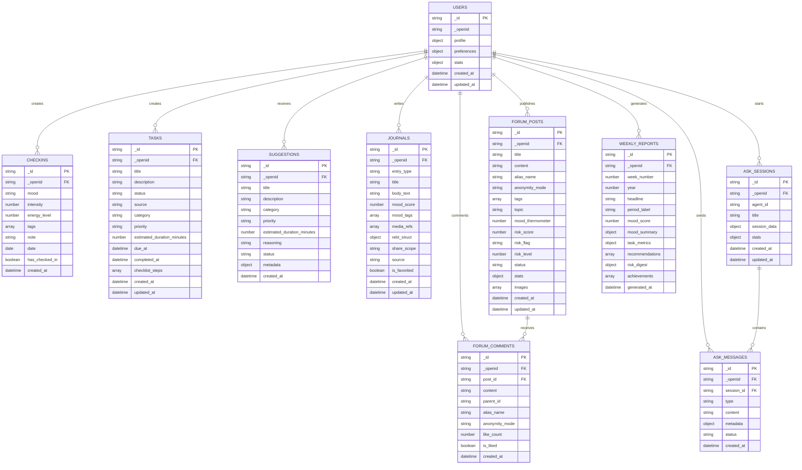

# MindGuard 系统架构图

> **MindGuard** 心理健康支持小程序系统架构可视化文档
>
> 版本：v1.0.0 | 更新时间：2025年10月20日
>
> 架构图采用 Mermaid 语法，支持实时渲染和交互式浏览

---

## 📋 目录

- [总体架构](#总体架构)
- [前端架构](#前端架构)
- [服务层架构](#服务层架构)
- [云函数架构](#云函数架构)
- [数据层架构](#数据层架构)
- [AI工作流架构](#ai工作流架构)
- [安全架构](#安全架构)
- [部署架构](#部署架构)

---

## 🏗️ 总体架构

### 系统整体架构图


### 技术栈架构图


---

## 📱 前端架构

### 小程序页面架构


### 前端数据流架构


---

## ⚙️ 服务层架构

### 服务层模块关系图


### 服务层调用时序图


---

## ☁️ 云函数架构

### 云函数分类架构


### 云函数执行流程


---

## 🤖 AI工作流架构

### Dify工作流集成架构

```mermaid
graph TB
    subgraph "触发源"
        CHECKIN[情绪打卡]
        JOURNAL[日记记录]
        FORUM[社区帖子]
        ASK[AI对话]
        SOS[紧急求助]
    end

    subgraph "Dify工作流引擎"
        WORKFLOW1[情绪分析工作流]
        WORKFLOW2[建议生成工作流]
        WORKFLOW3[风险评估工作流]
        WORKFLOW4[内容审核工作流]
        WORKFLOW5[智能对话工作流]
        WORKFLOW6[危机干预工作流]
    end

    subgraph "AI模型服务"
        LLM1[情绪识别模型]
        LLM2[文本生成模型]
        LLM3[风险识别模型]
        LLM4[内容理解模型]
        LLM5[对话模型]
        LLM6[心理评估模型]
    end

    subgraph "知识库"
        KNOWLEDGE1[心理知识库]
        KNOWLEDGE2[REBT疗法库]
        KNOWLEDGE3[危机处理库]
        KNOWLEDGE4[校园资源库]
    end

    subgraph "结果处理"
        RESULT1[情绪分析结果]
        RESULT2[个性化建议]
        RESULT3[风险评估报告]
        RESULT4[审核结果]
        RESULT5[对话回复]
        RESULT6[干预方案]
    end

    CHECKIN --> WORKFLOW1
    JOURNAL --> WORKFLOW1
    JOURNAL --> WORKFLOW2
    FORUM --> WORKFLOW3
    FORUM --> WORKFLOW4
    ASK --> WORKFLOW5
    SOS --> WORKFLOW6

    WORKFLOW1 --> LLM1
    WORKFLOW2 --> LLM2
    WORKFLOW3 --> LLM3
    WORKFLOW4 --> LLM4
    WORKFLOW5 --> LLM5
    WORKFLOW6 --> LLM6

    LLM1 --> KNOWLEDGE1
    LLM2 --> KNOWLEDGE2
    LLM3 --> KNOWLEDGE3
    LLM4 --> KNOWLEDGE1
    LLM5 --> KNOWLEDGE1
    LLM6 --> KNOWLEDGE3

    KNOWLEDGE1 --> RESULT1
    KNOWLEDGE2 --> RESULT2
    KNOWLEDGE3 --> RESULT3
    KNOWLEDGE1 --> RESULT4
    KNOWLEDGE1 --> RESULT5
    KNOWLEDGE3 --> RESULT6

    RESULT1 --> CHECKIN
    RESULT2 --> JOURNAL
    RESULT3 --> FORUM
    RESULT4 --> FORUM
    RESULT5 --> ASK
    RESULT6 --> SOS
```

### AI对话系统架构


---

## 🗄️ 数据层架构

### 数据库集合架构



### 数据访问层架构


---

## 🔒 安全架构

### 安全防护体系架构


### 用户隐私保护架构


---

## 🚀 部署架构

### 微信云开发部署架构


### 分包加载策略架构


---

## 📊 性能监控架构

### 性能监控体系


### 缓存架构设计


---

## 🔄 数据流架构

### 情绪健康闭环数据流


### 社区守护数据流


---

## 📈 扩展性架构

### 水平扩展架构

```mermaid
graph TB
    subgraph "负载均衡层"
        LB[负载均衡器]
        ROUTER[智能路由]
        HEALTH[健康检查]
    end

    subgraph "应用服务层"
        APP1[应用实例1]
        APP2[应用实例2]
        APP3[应用实例N]
    end

    subgraph "数据层"
        MASTER[(主数据库)]
        SLAVE1[(从数据库1)]
        SLAVE2[(从数据库2)]
        SLAVEN[(从数据库N)]
    end

    subgraph "缓存层"
        REDIS1[Redis集群1]
        REDIS2[Redis集群2]
        REDISN[Redis集群N]
    end

    subgraph "消息队列"
        QUEUE1[消息队列1]
        QUEUE2[消息队列2]
        QUEUEN[消息队列N]
    end

    LB --> ROUTER
    ROUTER --> HEALTH
    ROUTER --> APP1
    ROUTER --> APP2
    ROUTER --> APP3

    APP1 --> MASTER
    APP2 --> MASTER
    APP3 --> MASTER

    MASTER --> SLAVE1
    MASTER --> SLAVE2
    MASTER --> SLAVEN

    APP1 --> REDIS1
    APP2 --> REDIS2
    APP3 --> REDISN

    APP1 --> QUEUE1
    APP2 --> QUEUE2
    APP3 --> QUEUEN
```

### 微服务演进架构

```mermaid
graph LR
    subgraph "当前架构 - 单体"
        MONOLITH[单体应用]
        DB1[(单一数据库)]
    end

    subgraph "演进阶段1 - 服务分离"
        USERSVC[用户服务]
        MOODSVC[情绪服务]
        COMMUNITYSVC[社区服务]
        DB2[(用户数据库)]
        DB3[(情绪数据库)]
        DB4[(社区数据库)]
    end

    subgraph "演进阶段2 - 微服务"
        AUTHSVC[认证服务]
        CHECKINSVC[打卡服务]
        SUGGESTIONSVC[建议服务]
        TASKSVC[任务服务]
        FORUMSVC[论坛服务]
        AICHAT[AI聊天服务]
        DB5[(分布式数据库)]
    end

    subgraph "演进阶段3 - 云原生"
        CONTAINER1[容器化服务1]
        CONTAINER2[容器化服务2]
        CONTAINERN[容器化服务N]
        ORCHESTRATOR[容器编排]
        SERVICEGRID[服务网格]
    end

    MONOLITH --> USERSVC
    USERSVC --> AUTHSVC
    AUTHSVC --> CONTAINER1

    DB1 --> DB2
    DB2 --> DB5
    DB5 --> ORCHESTRATOR

    DB3 --> DB4
    DB4 --> DB5

    CONTAINER1 --> SERVICEGRID
    CONTAINER2 --> SERVICEGRID
    CONTAINERN --> SERVICEGRID
```

---

## 🎯 架构决策记录

### 关键架构决策

| 决策内容 | 背景原因 | 选择的方案 | 替代方案 | 决策时间 |
|---------|----------|-----------|----------|----------|
| 前端框架 | 微信小程序生态限制 | 原生小程序开发 | Taro、uni-app | 2024-01 |
| 状态管理 | 小程序复杂度适中 | 页面级状态管理 | Redux、MobX | 2024-01 |
| 数据库 | 微信云开发集成 | NoSQL文档数据库 | 关系型数据库 | 2024-01 |
| 缓存策略 | 提升用户体验 | 多级缓存 | 单一缓存 | 2024-02 |
| AI集成 | 需要智能分析能力 | Dify工作流 | 自建AI服务 | 2024-03 |
| 安全方案 | 用户隐私保护 | 多层安全防护 | 基础安全措施 | 2024-03 |
| 分包策略 | 小程序大小限制 | 功能分包 | 单一包体 | 2024-04 |
| 监控方案 | 运维需求 | 遥测系统 | 日志监控 | 2024-05 |

### 技术债务管理

```mermaid
graph TB
    subgraph "当前技术债务"
        DEBT1[代码重复]
        DEBT2[缺少测试]
        DEBT3[文档不全]
        DEBT4[性能优化]
    end

    subgraph "解决策略"
        REFACTOR[代码重构]
        TESTING[补充测试]
        DOCS[完善文档]
        OPTIMIZE[性能优化]
    end

    subgraph "预防措施"
        CODE REVIEW[代码审查]
        CI_CD[自动化流程]
        STANDARDS[编码规范]
        TRAINING[团队培训]
    end

    DEBT1 --> REFACTOR
    DEBT2 --> TESTING
    DEBT3 --> DOCS
    DEBT4 --> OPTIMIZE

    REFACTOR --> CODE REVIEW
    TESTING --> CI_CD
    DOCS --> STANDARDS
    OPTIMIZE --> TRAINING
```

---

## 🔮 未来架构演进

### 短期演进计划（3-6个月）

```mermaid
graph TB
    subgraph "性能优化"
        CACHE1[缓存优化]
        LAZYLOAD[懒加载优化]
        COMPRESSION[资源压缩]
    end

    subgraph "功能增强"
        OFFLINE[离线支持]
        PUSH[推送通知]
        SHARE[分享功能]
    end

    subgraph "安全加固"
        ENCRYPTION1[端到端加密]
        AUDIT1[审计增强]
        PRIVACY1[隐私保护]
    end

    subgraph "开发体验"
        TESTING1[单元测试]
        MONITOR1[监控增强]
        DEBUG[调试工具]
    end
```

### 中期演进计划（6-12个月）

```mermaid
graph TB
    subgraph "架构升级"
        MICROSERVICE[微服务化]
        CONTAINER[容器化]
        ORCHESTRATION[服务编排]
    end

    subgraph "AI能力提升"
        MULTIMODAL[多模态AI]
        PERSONALIZATION[个性化推荐]
        PREDICTIVE[预测分析]
    end

    subgraph "生态扩展"
        OPENAPI[开放API]
        PLUGIN[插件系统]
        INTEGRATION[第三方集成]
    end

    subgraph "数据智能"
        BIGDATA[大数据分析]
        DASHBOARD[数据仪表板]
        INSIGHTS[智能洞察]
    end
```

### 长期演进计划（1-2年）

```mermaid
graph TB
    subgraph "平台化"
        MULTIPLATFORM[多平台支持]
        SAAS[SaaS化]
        MARKETPLACE[应用市场]
    end

    subgraph "智能化"
        AUTOMATION[智能自动化]
        AGENT[智能体平台]
        KNOWLEDGE[知识图谱]
    end

    subgraph "生态建设"
        DEVELOPER[开发者生态]
        PARTNER[合作伙伴]
        COMMUNITY[用户社区]
    end

    subgraph "技术前沿"
        WEB3[Web3集成]
        METADATA[元数据管理]
        QUANTUM[量子计算准备]
    end
```

---

## 📚 相关文档

- [API文档](./API文档.md)
- [数据库设计](./数据库设计.md)
- [安全规范](./安全规范.md)
- [性能优化指南](./性能优化指南.md)
- [部署运维手册](./部署运维手册.md)

---

## 📞 联系信息

- **架构设计**: 开发团队
- **文档维护**: 架构师
- **最后更新**: 2025年10月20日
- **版本**: v1.0.0

---

*本架构文档采用 Mermaid 语法编写，支持在 GitHub、GitLab 等平台直接渲染。如需修改架构图，请更新对应的 Mermaid 代码。*