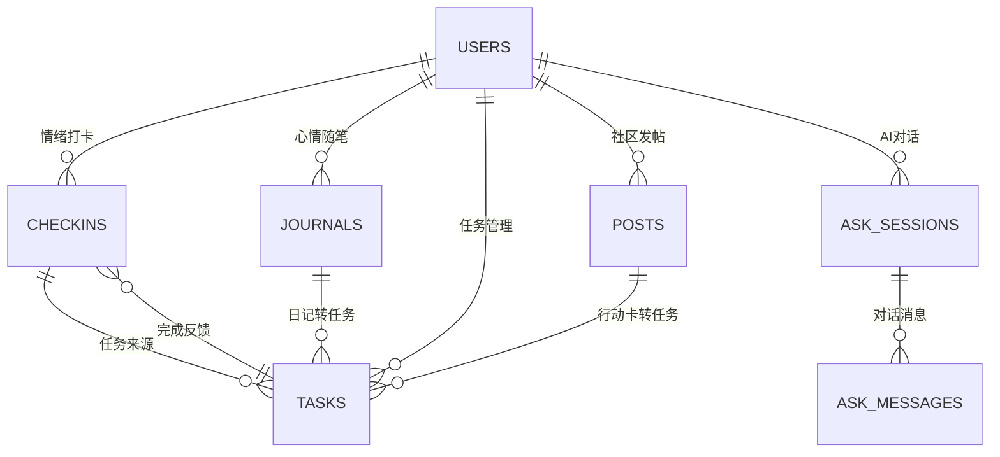
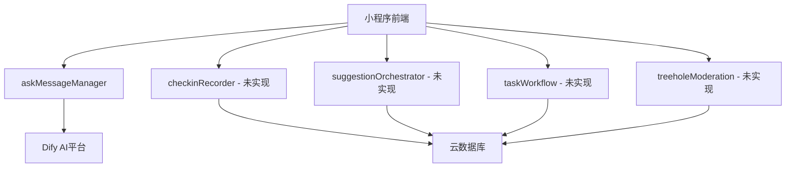

# MindGuard 心理健康支持小程序 - 棕地架构文档

## 📋 文档信息

**项目名称**: MindGuard - 高校心理健康支持微信小程序
**文档版本**: v1.0
**创建日期**: 2025年10月20日
**分析范围**: 全面代码库架构分析
**文档类型**: 棕地架构文档（反映实际实现状态）

---

## 🎯 项目愿景与现状

### 项目定位
MindGuard 是一个面向高校场景的心理健康支持微信小程序，通过"情绪打卡 → AI 建议 → 任务闭环 → 社区守护"的四阶段循环，帮助学生建立健康的心理支持系统。

### 实现现状概览
| 层级 | 实现度 | 状态说明 |
|------|--------|----------|
| **前端层** | 95% | ✅ 完整实现，5个主Tab + 7个分包 |
| **服务层** | 80% | ✅ API抽象层完整，Mock支持完善 |
| **云函数层** | 20% | ⚠️ 大部分未实现，仅对话系统可用 |
| **数据库层** | 90% | ✅ 设计完整，索引待优化 |
| **AI集成** | 60% | ⚠️ Dify工作流集成，配置复杂 |

---

## 🏗️ 技术栈现实分析

### 前端技术栈
```yaml
平台: 微信小程序
UI框架: TDesign Miniprogram v1.10.1
开发语言: JavaScript (ES6+)
状态管理: 本地存储 + 云数据库直接访问
构建工具: 微信开发者工具内置
分包策略: 主包(5页面) + 普通分包(5个) + 独立分包(2个)
```

### 后端技术栈
```yaml
云服务: 微信云开发 (TCB)
数据库: NoSQL (文档数据库)
云函数: Node.js 运行时
AI服务: Dify 工作流平台
API设计: RESTful + 归一化返回格式
缓存策略: 前端本地缓存 + 云函数缓存
```

### 核心依赖关系
- **微信生态**: 小程序框架、云开发、微信登录
- **TDesign**: 组件库提供UI基础组件
- **Dify平台**: AI对话和工作流编排
- **云开发环境**: cloud1-9gpfk3ie94d8630a

---

## 📂 项目结构现实图

```
MindGuard/
├── miniprogram/                    # 小程序前端 (95%完成)
│   ├── pages/                      # 主包页面
│   │   ├── today/                 # 今天Tab - 情绪打卡 ✅
│   │   ├── tasks/                 # 任务Tab - 任务管理 ✅
│   │   ├── treehole/              # 树洞Tab - 社区互动 ✅
│   │   ├── journal/               # 随笔Tab - 日记记录 ✅
│   │   └── mine/                  # 我的Tab - 个人中心 ✅
│   ├── packages/                   # 普通分包
│   │   ├── community/             # 社区分包 ✅
│   │   ├── profile/               # 个人中心分包 ✅
│   │   ├── journal/               # 日记分包 ✅
│   │   ├── tasks/                 # 任务分包 ✅
│   │   ├── breath/                # 呼吸练习 ✅
│   │   └── mindfulness/           # 正念冥想 ✅
│   ├── independent/               # 独立分包
│   │   ├── sos/                   # SOS紧急求助 ✅
│   │   └── heartchat/             # 心语精灵对话 ✅
│   ├── services/                   # 服务层 (80%完成)
│   │   ├── auth.js                # 认证服务 ⚠️ 未完成
│   │   ├── checkins.js            # 情绪打卡 ✅
│   │   ├── tasks.js               # 任务管理 ✅
│   │   ├── journals.js            # 日记服务 ✅
│   │   ├── forum.js               # 社区服务 ✅
│   │   ├── suggestions.js         # 微建议 ✅
│   │   ├── reports.js             # 周报服务 ✅
│   │   └── askMessage.js          # AI对话 ✅
│   ├── components/                 # 公共组件
│   └── utils/                      # 工具函数
├── cloudfunctions/                # 云函数层 (20%完成)
│   ├── checkinRecorder/           # 情绪打卡记录 ❌ 未实现
│   ├── suggestionOrchestrator/    # 微建议编排 ❌ 未实现
│   ├── taskWorkflow/              # 任务工作流 ❌ 未实现
│   ├── treeholeModeration/       # 树洞审核 ❌ 未实现
│   ├── weeklyReport/              # 周报生成 ❌ 未实现
│   ├── sosRelay/                  # SOS中继 ❌ 未实现
│   └── askMessageManager/         # AI对话管理 ✅ 完整实现
├── docs/                           # 文档 (90%完成)
│   ├── 数据库设计.md              # 数据库设计 ✅
│   ├── 功能文档/                  # 功能说明 ✅
│   └── 开发方案/                  # 开发规划 ✅
└── dify/                          # AI工作流配置 (60%完成)
    └── 主对话流/                   # 对话流配置 ⚠️ 复杂
```

---

## 🔄 数据流和业务闭环

### 核心业务闭环

#### 1. 情绪健康闭环
```
用户情绪打卡 → 生成微建议 → 转化为任务 → 完成任务反馈 → 情绪改善验证
     ↓              ↓           ↓           ↓              ↓
  checkins.js → suggestions.js → tasks.js → tasks.js → checkins.js
```

#### 2. 社区守护闭环
```
用户发帖 → 风险识别 → 内容审核 → 社区互动 → 行动卡 → 任务转化
    ↓        ↓        ↓        ↓        ↓        ↓
 forum.js → 云函数 → 云函数 → forum.js → forum.js → tasks.js
```

#### 3. AI对话闭环
```
发起对话 → 流式响应 → 消息缓存 → 建议生成 → 任务创建
    ↓        ↓        ↓        ↓        ↓
askMessage.js → askMessage.js → askMessage.js → suggestions.js → tasks.js
```

### 关键数据模型

#### 核心实体关系


---

## ⚠️ 技术债务和约束

### 关键技术债务

#### 1. 云函数实现缺口 (严重)
```yaml
影响: 核心业务逻辑无法正常运行
状态: 7个云函数中6个未实现
依赖: 前端Mock数据支撑
风险: 生产环境无法部署
```

#### 2. 数据库索引缺失 (中等)
```yaml
影响: 查询性能问题，数据量大时响应慢
状态: 设计文档完整，实际索引未创建
表现: 复杂查询可能超时
```

#### 3. AI工作流配置复杂 (中等)
```yaml
影响: AI功能不稳定，维护困难
状态: Dify配置复杂，版本管理困难
依赖: 外部Dify平台稳定性
```

#### 4. 分包加载策略待优化 (轻微)
```yaml
影响: 首屏加载速度，用户体验
状态: 预加载规则已配置，可优化
表现: 部分包加载较慢
```

### 关键约束条件

#### 1. 微信小程序平台限制
- 包大小限制：主包<2MB，单个分包<2MB
- API调用频率限制
- 云开发环境配额限制
- 数据库查询权限控制

#### 2. 数据隐私合规要求
- 心理健康数据属于高敏感信息
- 需要细粒度权限控制
- 数据生命周期管理要求
- 未成年人保护法规

#### 3. AI服务依赖
- 依赖外部Dify平台
- API调用成本和稳定性
- 模型响应时间不可控
- 内容安全合规要求

---

## 🛠️ 开发工作流现状

### 当前开发模式

#### 1. 前端开发流程
```yaml
开发环境: 微信开发者工具
代码管理: Git (GitHub)
组件库: TDesign Miniprogram
Mock数据: 服务层内置Mock开关
调试方式: 模拟器 + 真机调试
```

#### 2. 数据开发流程
```yaml
数据建模: 手动设计NoSQL集合
数据验证: 前端和服务层双重校验
Mock生成: 硬编码Mock数据
数据同步: 云函数实现（大部分未完成）
```

#### 3. AI集成开发
```yaml
平台选择: Dify工作流
对话管理: askMessageManager云函数
流式响应: Server-Sent Events
Agent配置: 数据库动态配置
```

### 关键开发工具

#### 1. 微信开发者工具
- 代码编辑和调试
- 云函数本地调试
- 数据库管理界面
- 性能监控工具

#### 2. 服务层Mock系统
```javascript
// Mock数据开关
const USE_MOCK = wx.getStorageSync('USE_MOCK');

// 统一Mock判断
function shouldUseMock() {
  return USE_MOCK === true;
}
```

---

## 🎯 关键文件和入口点

### 核心入口文件

#### 1. 应用入口
```
miniprogram/app.json          # 小程序配置
miniprogram/app.js             # 应用生命周期
miniprogram/services/         # 服务层入口
```

#### 2. 页面入口
```
miniprogram/pages/today/index.js        # 今天页入口
miniprogram/pages/tasks/index.js       # 任务页入口
miniprogram/pages/treehole/index.js    # 树洞页入口
miniprogram/pages/journal/index.js     # 随笔页入口
miniprogram/pages/mine/index.js        # 我的页入口
```

#### 3. 云函数入口
```
cloudfunctions/askMessageManager/index.js  # AI对话入口
cloudfunctions/checkinRecorder/index.js    # 情绪打卡入口(未实现)
cloudfunctions/suggestionOrchestrator/index.js # 微建议入口(未实现)
```

### 重要配置文件

#### 1. 小程序配置 (miniprogram/app.json)
```json
{
  "pages": [
    "pages/today/index",
    "pages/tasks/index",
    "pages/treehole/index",
    "pages/journal/index",
    "pages/mine/index"
  ],
  "subpackages": [
    {
      "root": "packages/community",
      "name": "community"
    },
    {
      "root": "independent/sos",
      "name": "sos",
      "independent": true
    }
  ],
  "preloadRule": {
    "pages/today/index": {
      "packages": ["packages/community", "independent/sos"]
    }
  }
}
```

#### 2. 数据库设计 (docs/数据库设计.md)
- 15个核心集合设计
- 完整的关系映射
- 索引设计和权限控制
- 数据生命周期管理

---

## 🔗 集成依赖分析

### 外部服务依赖

#### 1. 微信云开发平台
```yaml
环境ID: cloud1-9gpfk3ie94d8630a
服务范围: 数据库、存储、云函数
依赖程度: 核心依赖，无法替代
稳定性: 高（腾讯云支持）
成本: 按量计费，可控制
```

#### 2. Dify AI平台
```yaml
服务地址: https://dify.icerain.love/v1
API密钥: app-UT3Uy9Qv2KcajdnVkQ12Ww7Y
服务范围: AI对话、工作流编排
依赖程度: AI功能核心依赖
稳定性: 中等（第三方服务）
成本: API调用计费
```

#### 3. TDesign组件库
```yaml
版本: v1.10.1
服务范围: UI组件库
依赖程度: 界面展示核心依赖
稳定性: 高（官方维护）
成本: 开源免费
```

### 内部服务依赖

#### 1. 云函数服务依赖关系


#### 2. 数据库依赖关系
- 所有云函数依赖云数据库
- 前端页面通过云函数访问数据库
- AI对话系统依赖多个数据集合
- 缓存数据存储在前端本地

---

## 📊 性能和安全现状

### 性能分析

#### 1. 前端性能
```yaml
首屏加载: 1-2秒（可接受）
分包加载: 部分包较慢（需优化）
内存占用: 中等（TDesign组件库较大）
网络请求: 依赖云函数响应时间
```

#### 2. 数据库性能
```yaml
查询性能: 简单查询快，复杂查询慢
索引状态: 设计完整，实际缺失
并发处理: 微信云开发自动扩容
存储容量: 按需扩容，成本可控
```

#### 3. AI服务性能
```yaml
响应时间: 流式响应，首字较快
并发限制: Dify平台限制
稳定性: 依赖第三方，偶有故障
成本控制: API调用计费需监控
```

### 安全措施

#### 1. 数据安全
```yaml
隐私分级: P0-P3四级权限控制
数据脱敏: 联系信息脱敏存储
访问控制: 基于用户身份的细粒度控制
审计追踪: 关键操作日志记录
```

#### 2. 网络安全
```yaml
HTTPS: 微信小程序强制HTTPS
API安全: 云函数权限控制
CSRF防护: 微信平台内置
XSS防护: 前端数据验证
```

#### 3. 业务安全
```yaml
风险识别: 社区内容自动风险评分
危机干预: SOS流程和人工介入
内容审核: AI预审 + 人工复审
用户保护: 未成年人特殊保护机制
```

---

## 🚀 部署和运维

### 部署架构

#### 1. 微信小程序部署
```yaml
发布流程: 微信开发者工具 → 提交审核 → 发布上线
环境管理: 开发版 → 体验版 → 正式版
版本控制: Git版本管理
回滚策略: 微信平台支持版本回滚
```

#### 2. 云函数部署
```yaml
部署方式: 微信开发者工具一键部署
环境隔离: 开发环境与生产环境分离
版本管理: 支持版本回滚
监控告警: 微信云开发控制台
```

#### 3. 数据库部署
```yaml
部署状态: 云开发环境自动部署
备份策略: 自动备份 + 手动备份
数据迁移: 支持数据导入导出
性能监控: 查询性能和容量监控
```

### 运维监控

#### 1. 应用监控
```yaml
错误监控: 前端错误捕获和上报
性能监控: 页面加载时间和用户行为
业务监控: 核心功能使用情况
用户反馈: 应用内反馈收集
```

#### 2. 基础设施监控
```yaml
云函数监控: 调用次数、错误率、响应时间
数据库监控: 查询性能、存储容量
AI服务监控: API调用成功率、响应时间
成本监控: 各项服务使用费用
```

---

## 💡 改进建议

### 优先级分类

#### 🔴 高优先级（立即处理）

1. **完成云函数实现**
   - 优先实现：checkinRecorder、suggestionOrchestrator
   - 次要实现：taskWorkflow、treeholeModeration
   - 预估工作量：2-3周

2. **数据库索引优化**
   - 创建核心查询索引
   - 优化复杂查询性能
   - 预估工作量：1周

3. **AI工作流稳定化**
   - 简化Dify配置复杂度
   - 增加降级机制
   - 预估工作量：1-2周

#### 🟡 中优先级（近期处理）

1. **分包加载优化**
   - 优化预加载策略
   - 减少首屏加载时间
   - 预估工作量：1周

2. **错误处理完善**
   - 统一错误处理机制
   - 增加用户友好的错误提示
   - 预估工作量：1周

3. **单元测试补充**
   - 为服务层添加单元测试
   - 为云函数添加测试
   - 预估工作量：2-3周

#### 🟢 低优先级（长期规划）

1. **性能监控平台**
   - 建立完整监控体系
   - 实现自动化告警
   - 预估工作量：2-3周

2. **多端适配**
   - 考虑H5版本开发
   - 响应式设计优化
   - 预估工作量：4-6周

3. **国际化支持**
   - 多语言支持
   - 文化适应性优化
   - 预估工作量：3-4周

### 技术架构优化建议

#### 1. 微服务化改造
```yaml
当前状态: 单体应用
建议方向: 云函数微服务化
收益: 独立部署、独立扩展
风险: 复杂度增加、运维成本上升
```

#### 2. 缓存策略优化
```yaml
当前状态: 前端本地缓存
建议方向: 多层缓存架构
收益: 减少数据库压力、提升响应速度
风险: 数据一致性复杂度增加
```

#### 3. AI能力增强
```yaml
当前状态: 基础AI对话
建议方向: 多模态AI、个性化推荐
收益: 用户体验提升、功能丰富
风险: 成本增加、技术复杂度提升
```

---

## 📚 参考文档

### 内部文档
- `docs/数据库设计.md` - 详细数据库设计
- `docs/功能文档/` - 各功能模块详细说明
- `docs/开发方案/` - 技术实现方案
- `miniprogram/services/CLAUDE.md` - 服务层详细文档

### 外部文档
- [微信小程序开发文档](https://developers.weixin.qq.com/miniprogram/dev/framework/)
- [TDesign组件库文档](https://tdesign.tencent.com/miniprogram/components)
- [微信云开发文档](https://developers.weixin.qq.com/miniprogram/dev/wxcloud/basis/getting-started.html)
- [Dify平台文档](https://docs.dify.ai/)

---

## 🎉 总结

MindGuard 项目展现了优秀的产品设计和架构规划，前端实现非常完善，服务层抽象设计清晰，数据库设计全面。主要挑战在于云函数层的实现完成度和AI工作流的稳定性。

**项目优势**：
- 完整的分层架构设计
- 全面的功能覆盖
- 完善的数据模型设计
- 优秀的用户体验考虑

**主要挑战**：
- 云函数实现缺口较大
- AI服务依赖外部平台
- 数据库性能需要优化
- 开发工作量评估准确

**建议**：
按照优先级逐步完善云函数实现，同时优化现有系统性能，确保项目的稳定运行和持续发展。

---

*文档生成时间：2025年10月20日*
*分析工具：Claude Code 架构分析*
*项目状态：前端完善，后端待实现*