# Vibot 企业级 AI 协作平台全栈架构文档

## Introduction

这个文档概述了 Vibot 企业级 AI 协作平台的完整全栈架构，包括后端系统、前端实现及其集成。它作为 AI 驱动开发的单一事实来源，确保整个技术栈的一致性。

这种统一的方法结合了传统上分离的后端和前端架构文档，为现代全栈应用程序简化了开发流程，因为这些关注点日益紧密地交织在一起。

### Starter Template or Existing Project

根据 PRD 分析，Vibot 基于现有的 Vue Vben Admin 5.5.9 monorepo 项目：

**现有项目基础：**

- **框架**: Vue Vben Admin 5.5.9
- **技术栈**: Vue 3.5+, TypeScript 5.8+, Vite 7.1+, Pinia 3.0+
- **架构**: Monorepo with pnpm workspace
- **UI 组件库**: Ant Design Vue 4.2+
- **构建工具**: Turbo + Vite
- **测试**: Vitest + Playwright

**约束条件：**

- 必须保持现有技术栈兼容性
- 需要扩展现有权限系统支持多公司架构
- 集成 Dify 平台需要安全 iframe 嵌入
- 支持现有模块化架构模式

### Repository State Assessment（现状映射）

对当前仓库的关键模块进行一次“现状 → 架构映射”的基线评估，作为后续演进与验收的锚点：

- apps/web-antd（主 Web 应用）
  - 已有 AI 助手模块与对话页：`apps/web-antd/src/views/ai-assistant/chat/index.vue`，以 iframe 方式嵌入 Dify；支持通过路由 `url|base|token|inputs|hideBrand` 或 env 配置。
  - 认证与权限 API 封装齐全：`apps/web-antd/src/api/core/auth.ts`（login/refresh/logout/codes）。
  - UI 栈与构建工具（Vue3/TS/Vite/Ant Design Vue/Pinia）与本架构文档假设一致，可直接承载 Conversation Shell/命令面板/卡片渲染等基座能力。
- apps/backend-mock（Nitro Mock 服务）
  - 已提供认证、用户、菜单、系统数据、表格、上传等端点，用于前后端并行开发与契约验证。
  - 具备统一响应与 JWT/Refresh/Cookie 工具，可作为 BFF 调用 Supabase 的“形态参考”；迁移后保留为前端离线开发和单元测试的 Mock 层（通过 Supabase schema 自动生成数据模型）。
- docs 与 playground
  - `docs/prd.md` 与本文件需保持双向一致（契约、里程碑、SRE 约束）。
  - `playground/` 提供 E2E 场景，适合承载融合式交互（Conversation Shell + CardSchema）回归用例。

结论：现状已满足前端基座与 Mock 并行开发的先决条件；需按里程碑逐步引入 Dify 安全签名/双向通信、命令面板/搜索基座、多租户上下文传播与审计闭环。

### Change Log

| 日期       | 版本 | 描述                               | 作者                |
| ---------- | ---- | ---------------------------------- | ------------------- |
| 2025-10-17 | 1.0  | 初始架构文档创建                   | Winston (Architect) |
| 2025-10-23 | 1.1  | 增补AI融合式导航/交互架构          | Vibot AI        |
| 2025-10-23 | 1.2  | 对齐 PRD v1.2：Dify 契约/权限/观测 | Winston (Architect) |
| 2025-10-23 | 1.3  | 增补仓库现状映射/里程碑/契约快照     | Winston (Architect) |
| 2025-10-23 | 1.4  | 命令面板/Provider 契约与 ActionBus TS | Winston (Architect) |

---

## High Level Architecture

### Technical Summary

Vibot 企业级 AI 协作平台采用 **Supabase 优先（BaaS-first）** 架构：前端继续使用 Vue 3 + TypeScript + Ant Design Vue 构建统一界面，后端则以 Supabase 提供的全托管 PostgreSQL、Auth、Storage、Edge Functions 与 Realtime/PostgREST API 为核心。API 网关/BFF 将最小化，仅负责前端聚合与 Dify 安全代理，大部分数据访问与权限控制直接通过 Supabase 客户端与自动生成的 PostgREST API 完成。多租户隔离、审批流、财务分析等企业级需求通过行级安全（RLS）、策略函数及 Edge Functions 编排实现，确保三家公司的数据安全与治理能力。

### Platform and Infrastructure Choice

**推荐方案：Supabase 全托管 + 轻量自托管辅助服务**

- **Supabase 托管服务**：
  - **Supabase Auth**：统一用户认证、OAuth、组织邀请与会话管理。
  - **Supabase Database (PostgreSQL)**：托管多租户核心业务库，启用 RLS 与自定义策略函数。
  - **Supabase Storage**：用于归档 BOM 文档、审批附件、财务凭证扫描件。
  - **Supabase Edge Functions (Deno)**：承载复杂审批规则、钉钉回调、定时汇总与安全签名逻辑。
- **阿里云辅助组件**：Dify 安全代理、对象备份、日志归档（可选）。
- **部署区域建议**：Supabase 选择 `ap-southeast-1`（新加坡）满足中国大陆与海外访问延迟平衡，自托管边缘服务部署在阿里云华东 1，确保钉钉等国内依赖的低延迟访问。

### Repository Structure

**结构**: Monorepo（保持现有）  |  **工具**: pnpm workspace + Turbo（现有）  |  **包组织策略**: 基于功能域的模块化

```
Vibot/
├── apps/
│   ├── web-antd/              # 主应用 (现有)
│   ├── backend-mock/          # Mock服务 (现有)
│   └── supabase-admin/        # Supabase Edge Functions / 管理脚本 (目标)
├── packages/
│   ├── @core/                 # 核心包 (现有)
│   ├── effects/               # 效果包 (现有)
│   ├── business/              # 业务包 (目标)
│   │   ├── auth/             # 认证授权
│   │   ├── ai/               # AI相关
│   │   ├── finance/          # 财务管理
│   │   └── workflow/         # 工作流
│   └── integration/           # 集成包 (目标)
│       ├── dingtalk/         # 钉钉集成（Edge Function 调用封装）
│       ├── dify/             # Dify集成
│       └── supabase-client/  # Supabase 客户端与策略 SDK
├── internal/                  # 内部工具 (现有)
└── supabase/                # Supabase 资源（现有）
    ├── functions/           # Edge Functions 源码
    ├── migrations/          # SQL 迁移与 RLS 策略
    └── seeds/               # 初始化数据脚本
```

### Information Architecture & Navigation

- 工作台
  - 今日概览（智能摘要与下一步建议）
  - 待办/我发起/我参与
  - 最近活动与通知
  - 全局搜索/命令面板
- 项目管理
  - 对话（项目）：自然语言创建/查询/调整进度与成本
  - 项目列表
  - 甘特图
  - 看板
  - 成本分析
  - 周交付
  - 报表与仪表盘
  - 模板中心
- 财务管理
  - 对话（财务）：自然语言生成报表/解读指标/告警溯因
  - 报表（日/周/月）
  - 指标预警
  - 历史采购对比
  - 财务仪表盘
- 客户管理
  - 对话（客户）：同步客户/供应商档案、应收应付风险提醒
  - 客户/供应商档案
  - 银行账户与收款信息
  - 合作标签与跟进记录
- 产品中心
  - 对话（产品）：维护产品规格、BOM、变更记录
  - 产品目录
  - BOM 与工艺配置
  - 版本与合规检查
- 订单中心
  - 对话（订单）：创建/查询销售与采购订单、跟踪状态
  - 销售订单列表
  - 采购订单列表
  - 发货与收货进度
- 生产管理
  - 对话（生产）：工单排程、工序进度、异常提醒
  - 工单排程
  - 工序产量上报
  - 质量与废品统计
- 审批管理
  - 对话（审批）：发起/催办/回撤/解释规则
  - 发起申请
  - 待我处理
  - 我发起的
  - 审批历史
  - 流程配置与规则
- 员工管理
  - 对话（人事）：查档、变更、周/月报生成、绩效问答
  - 组织架构
  - 员工档案
  - 效率评估
  - 报告生成（周报/月报）
- 资料库
  - 对话（资料）：语义检索/对比/引用与版本建议
  - 方案资料库
  - 设计零件资料库
  - PLC 设计资料库
  - 智能检索
  - 上传与版本
- 目标与 BI
  - 对话（目标）：目标拆解/校验/跟踪与复盘
  - 目标管理
  - 目标审核
  - 业务数据挖掘
  - 宣传材料生成
  - 业务智能仪表盘
- 数据与集成
  - 对话（数据）：同步状态问答/排障/调度建议
  - 钉钉集成
  - 数据库连接器
  - 同步调度
  - 统一数据访问层
  - 数据质量
- 设置与安全
  - 对话（设置）：权限解释/最小授权建议/异常排查
  - 公司切换
  - 权限与角色
  - 数据源配置
  - 安全与认证
  - 审计日志
- 帮助与支持
  - 对话（帮助）：问文档/提工单/诊断报告
  - 使用指南
  - 反馈与工单
  - 版本与更新
  - 关于
- 个人中心
  - 我的资料
  - 偏好设置（默认“智能模式”）
  - 我的收藏
  - 最近访问

### Implementation Milestones（与 PRD 对齐）

- M1 基座与安全：
  - Conversation Shell（消息流、上下文、卡片渲染器、动作执行器）与 CardSchema v1；
  - 命令面板/全局搜索（Provider + ActionBus），只读动作优先；
  - Dify 安全签名（HMAC+nonce+ts）与 PostMessage 双向通信（只读卡片通路）；
  - 多租户上下文传播与基本审计（traceId/幂等）。
- M2 业务闭环：
  - 项目/财务两域“对话（模块）+ 典型视图 + 关键报表/动作”端到端闭环；
  - RBAC/ABAC 前置判定、草稿/二次确认/审批联动、错误/降级策略落地。
- M3 横向扩展与 SRE 固化：
  - 员工/审批/资料库/BI、统一数据访问层、多 DB 连接器；
  - 缓存/限流/熔断/降级与指标/日志/追踪打通，容量压测与 SLO 验证。

### Mock 接口扩展数据模型与开发方案（2025-10-29）

为支撑“请假流程、审批流程、打卡流程、员工管理、注册登录、权限分配”的前端开发，新增一套与 `apps/backend-mock` 对齐的数据模型与 Mock 接口。核心类型在 `apps/web-antd/src/api/Vibot/types.ts` 中声明，同时 Mock 端通过 `utils/mock-store.ts` 维护统一的内存数据源。

**核心数据类型**

| 类型 | 关键字段 | 说明 |
| --- | --- | --- |
| `RequestCategory` | `leave｜travel｜reimburse｜seal｜custom` | 业务申请分类，目前前端/Mock 以请假为主，可扩展更多场景 |
| `RequestStatus` | `draft｜running｜approved｜rejected｜withdrawn` | 申请生命周期状态；`running` 与 `ApprovalTask.status=pending` 联动 |
| `LeaveRequestDetail` | `code、applicant*、leaveType、timeline[]` | 请假申请详情，包含时间线、附件、审批人/关注人等 |
| `ApprovalTask` | `node、priority、status、history[]` | 审批待办与历史的统一结构，`history` 记录所有操作（同意/驳回/转办/催办等） |
| `AttendanceRecord` | `recordDate、checkInTime、status、note` | 打卡明细；前端用于异常筛查/报表 |
| `AttendanceSummary` | `totalDays、lateDays、absentDays、overtimeHours` | 近 7 日汇总；支撑效率面板指标 |
| `EmployeeProfile` | `employeeNo、deptName、status、tags[]` | 员工档案信息，Mock 会为新注册用户自动补充 |
| `OrgTreeNode` | `type: company｜department` | 组织树节点，支持公司/部门层级渲染 |

**开发方案摘要**

1. **Mock 服务扩展**
   - 在 `apps/backend-mock/api` 下新增注册、请假、审批、考勤、员工相关接口；通过 `mock-store` 统一维护数据与状态流转。
   - 注册接口完成用户/权限码入库，并生成关联的 `EmployeeProfile`，确保前端登录流程无缝衔接。
   - 审批动作（同意、驳回、转办、加签、催办）直接调用 `mock-store` 中的操作函数，实现申请状态与审批任务的同步。

2. **前端 API 封装**
   - 新建 `apps/web-antd/src/api/Vibot` 目录，按业务域拆分 `requests.ts`、`approvals.ts`、`attendance.ts`、`hr.ts`，并在 `api/index.ts` 汇出。
   - `core/auth.ts` 新增 `registerApi`，携带公司/部门等扩展字段，保证注册成功后自动登录。

3. **页面联动**
   - 审批模块的“待我处理 / 审批历史 / 我发起”三页接入新接口，支持路由驱动的分页、筛选与主操作（同意、驳回、撤回等）。
   - 人力模块接通组织树、员工档案、效率评估面板及打卡报表，利用 Ant Design Vue 组件实现表格/图卡展示。
   - 所有页面统一使用路由查询参数保存筛选状态，方便导航与分享。

4. **验证与基线**
   - `pnpm -F @vben/web-antd exec tsc --noEmit` 通过，新增的 `vue-shim.d.ts` 解决 `.vue` 类型解析问题。
   - `pnpm test:unit` 成功运行，Happy DOM 抛出的 `ECONNREFUSED` 为模拟脚本的预期行为，不影响结果。

**后续扩展建议**

- 基于现有类型，继续补齐报销、出差等 `RequestCategory` 的字段差异与审批流规则。
- 将 Mock 数据迁移到可配置的 JSON/YAML，便于不同环境覆写。
- 在 `docs/prd.md` 对应功能条目下同步接口参数和状态说明，确保 PRD 与实现保持一致。

### High Level Architecture Diagram

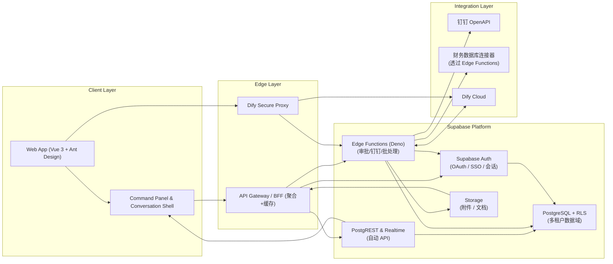

#### 设计理由 (Design Rationale)

- **拥抱 Supabase 核心能力**：将 Auth、PostgREST、Edge Functions、Storage 集中在 “Supabase Platform” 中，体现 BaaS 优先策略，避免重复建设微服务。
- **满足 PRD 多租户与审批需求**：PostgreSQL + RLS 承载三家公司隔离需求，Edge Functions 处理审批、钉钉回调与财务汇总，覆盖项目管理、财务报表、审批流等关键功能。
- **降低运维成本**：BFF 仅保留聚合、缓存与少量自定义逻辑，主要计算下沉至 Supabase 托管层，相比原自建微服务显著降低部署和扩容复杂度。

### Architectural Patterns

- **BaaS 优先架构**：以 Supabase 提供的托管能力为核心，减少自研服务，确保快速交付与集中治理。
- **细粒度 RLS 权限模型**：利用 PostgreSQL RLS 与策略函数，以公司/角色粒度隔离数据，满足多租户合规。
- **Edge Functions Orchestration**：对审批流、钉钉集成、财务计算使用 Edge Functions 实现无服务器业务逻辑，支持按需扩缩与定时任务。
- **API 聚合 BFF**：BFF 只负责跨域聚合、缓存、Dify 安全代理以及对 PostgREST 的查询包装，保证前端体验稳定。
- **实时数据+推送**：借助 Supabase Realtime 和前端订阅，支撑审批通知、项目进度变更等实时场景。
- **iframe 沙箱模式**：继续使用 Dify iframe + 消息签名保证 AI 能力集成安全。
- **前端组件库模式**：延续 Ant Design Vue 组件库策略，确保多模块 UI 一致性。

### Security, Multitenancy & Audit（安全/多租户/审计）

- 多租户上下文传播：`company_id`、`user_id`、`role_keys` 随 JWT 传递至前端、BFF、PostgREST 与 Edge Functions；默认跨租户访问拒绝，仅允许经过策略函数授权的跨公司操作。
- 权限判定：Supabase RLS + 策略函数负责行级权限，Edge Functions 对关键动作进行二次校验（如审批签署人、财务复核）。字段级脱敏通过视图或 `column mask` 实现。
- 审计：利用 Supabase Log Explorer、Edge Functions 审计表记录消息 ID、参数散列、权限决策与执行结果；BFF 注入 `trace_id`，便于跨层追踪与导出。
- 速率限制：BFF/Cloudflare Workers 提供速率限制与断路器；Supabase Edge Functions 对外部回调（Dify、钉钉）添加重试退避与告警，避免级联故障。

### AI 融合式交互架构

核心原则：模块内默认“智能模式”与“表单模式”可切换；首屏即聊天栏，以对话驱动业务动作，必要时弹出表单片段进行补全/确认。

- 对话入口统一：每个业务域的第一子路由为 `chat`（如 `projects/chat`、`finance/chat`）。
- 对话运行时：
  - 前端：`@vben/web-antd` 中提供 Conversation Shell（消息流、上下文、卡片渲染器、动作执行器）。
  - AI 集成：通过 `packages/integration/dify` 以 iframe + PostMessage 双向通信；服务侧提供请求签名与上下文裁剪。
  - 权限：动作触发前执行 RBAC/ABAC 校验；需二次确认的动作由卡片按钮触发模态片段（表单模式片段）。
- 卡片化回复：
  - 标准卡片类型：摘要、表格、图表、列表、步骤/建议、操作（含“提交/生成报表/导出”）。
  - 渲染协议：前端定义 `CardSchema`（JSON）与渲染注册表，AI 返回结构化负载或带前缀的 Markdown 指令。
- 上下文与记忆：
  - 会话上下文包含公司、部门、当前模块、选中实体（项目/报表/流程），用于缩小检索与动作范围。
  - 重要状态入库（AIConversation），保证跨端与跨会话的延续性与审计追踪。

补充（与 PRD 对齐）：

- Dify 输入编码：浏览器侧可按键值进行 gzip + base64 + encodeURIComponent 编码（CompressionStream 可用则启用）。
- 版本化：CardSchema/Action 协议版本化（meta.version），保持向后兼容；命令/搜索候选使用稳定 ID。

#### Conversation Shell 组件划分
- MessageStream：渲染消息与卡片，支持流式追加和骨架占位。
- ContextPanel：显示当前对象/过滤条件/变量；支持一键注入 Prompt 参数。
- ActionExecutor：统一执行卡片动作，内置权限校验、二次确认与乐观更新。
- AuditInline：在提交弹窗中展示参数摘要、签名校验状态与 traceId。

#### CardSchema（v1）契约要点
- 字段：`type | title | subtitle | body | data | actions[] | meta{source,time,traceId}`
- 图表：`chart{kind,line|bar|pie|funnel|gantt|heatmap, series, unit, note}`
- 约束：每卡片≤1个主行动、≤3个次行动；支持“跳转保持上下文/回填对话”。

#### CardSchema（v1）TypeScript 接口（草案）

```ts
export type CardType = 'summary' | 'table' | 'chart' | 'list' | 'steps' | 'action' | 'preview';

export interface CardAction {
  id: string;              // 稳定 ID（用于审计与遥测）
  kind: 'primary' | 'secondary' | 'danger' | 'link';
  label: string;
  action: string;          // 动作名（交由 ActionBus 处理）
  params?: Record<string, unknown>;
  confirm?: boolean;       // 是否需二次确认/表单片段
}

export interface CardSchema {
  type: CardType;
  title?: string;
  subtitle?: string;
  body?: string;           // Markdown 片段或富文本
  data?: unknown;          // 结构化数据（表格/图表/list 数据）
  chart?: {
    kind?: 'line' | 'bar' | 'pie' | 'funnel' | 'gantt' | 'heatmap';
    series?: Array<Record<string, unknown>>;
    unit?: string;
    note?: string;
  };
  actions?: CardAction[];  // 主行动置于首位
  meta?: {
    source?: string;
    time?: string;         // ISO8601
    traceId?: string;
    version?: string;      // 协议版本
  };
}
```

### Interface Contracts Snapshot（接口契约快照，与 PRD 一致）

以 Supabase PostgREST 为主的 v1 契约说明：

- **认证**：通过 `supabase.auth.signIn*` 系列方法获取 access_token/refresh_token；BFF 使用 `supabase.auth.getUser()` 验证和刷新。
- **用户信息**：`/rest/v1/users_view`（视图）返回用户档案、公司、角色列表；菜单权限由 `role_menus` 视图提供。
- **基础数据**：`/rest/v1/departments`、`/rest/v1/roles`、`/rest/v1/menus`，支持 PostgREST 过滤与分页。
- **业务资源**：
  - 项目：`/rest/v1/projects`、`/rest/v1/project_milestones`
  - 订单：`/rest/v1/orders?select=*,order_line_items(*)`
  - 财务：`/rest/v1/financial_records`、`/rest/v1/rpc/run_finance_snapshot`
  - 审批：`/rest/v1/approval_requests`、`/rest/v1/rpc/submit_approval`
- **文件上传**：通过 Supabase Storage `Vibot` 桶，使用签名 URL 上传；元数据写入 `/rest/v1/attachments`。

BFF 负责补充以下横切能力：

- 统一注入 `company_id` 头并写入审计日志。
- 对复杂聚合场景提供 `/api/composite/<domain>` 辅助端点（内部仍调用 Supabase）。
- 兼容 `apps/backend-mock` legacy 接口，将请求转换为 Supabase 调用。

OpenAPI 契约：BFF 侧仅为兼容端点生成最小文档，真实数据契约以数据库 schema + PostgREST 文档为准。

#### PostMessage 契约（TypeScript 草案）

```ts
export interface DifyRequest {
  traceId: string;
  appId: string;
  userId: string;
  companyId: string;
  scope: 'projects' | 'finance' | 'approvals' | 'hr' | 'knowledge' | 'settings';
  intent: string;
  params?: Record<string, unknown>;
  context?: { locale?: string; tz?: string };
  nonce: string;
  ts: number;                // epoch seconds
  sig: string;               // HMAC-SHA256(base64)
}

export interface DifyResponse {
  traceId: string;
  cards: CardSchema[];
  actions?: CardAction[];
  tokensUsed?: number;
  warnings?: string[];
  error?: { code: string; message: string };
}
```

#### Dify 集成契约（iframe + PostMessage）
- 通道：`Vibot:dify:request` / `Vibot:dify:response`
- 请求：
```
{
  "traceId":"uuid","appId":"dify-app-id","userId":"u123","companyId":"c001",
  "scope":"projects|finance|approvals|hr|knowledge",
  "intent":"generate_weekly_report",
  "params":{"projectId":"p1","week":"2025-W42"},
  "context":{"locale":"zh-CN","tz":"Asia/Shanghai"},
  "nonce":"n-123","ts":1730000000,
  "sig":"HMAC-SHA256(base64)"
}
```
- 响应：`{ traceId, cards:[CardSchema...], actions:[...], tokensUsed, warnings[] }`
- 安全：服务端 HMAC 签名；`ts` 60s 过期；`nonce` 防重放；`Idempotency-Key=traceId` 确保幂等。

#### 权限与审批联动
- 动作执行路径：`palette/chat -> ActionExecutor -> RBAC/ABAC -> 二次确认(可含表单片段) -> 审批(可选) -> 审计入库`。
- 导出策略：需导出权限；自动水印与文件指纹；审计记录包含导出范围与过滤条件。

#### 性能与降级
- 目标：对话首卡片 P95 < 4s；命令面板 P95 < 300ms。
- 策略：模型流式输出→先渲染摘要卡片，图表懒加载；20s 超时自动提供“转离线任务”卡片；错误三段式反馈（问题/原因/建议）。

#### 审计与可追溯
- 审计字段：`traceId/userId/companyId/resource/action/params-hash/result/latency`，保留期≥180天。
- 会话与动作串联：AIConversation.id 关联卡片与结果，支持回放与合规导出。

#### 时序图：会话 → 卡片 → 动作 → 审批 → 审计

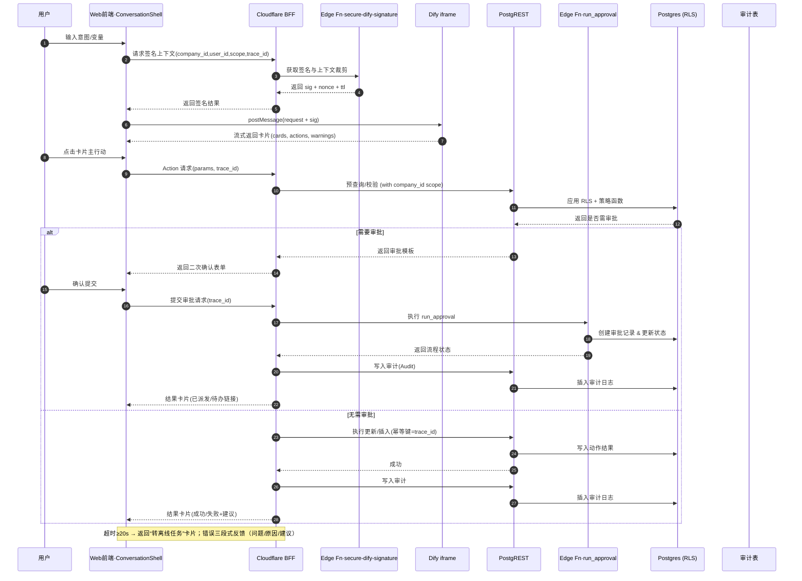

### Non-Functional Requirements（NFR，与 PRD 对齐）

- 安全与隐私：端到端加密，敏感字段最小化传输与脱敏；Prompt 注入防护；跨租户严格隔离。
- 性能预算：
  - UI 首屏 ≤ 3s；常用交互 ≤ 200ms；
  - 对话首 token 延迟 P95 ≤ 800ms；常规问答 P95 ≤ 2.5s；含工具动作 P95 ≤ 5s（流式优先）。
- 可用性与退化：命令面板与对话服务 ≥ 99.9%；外部 AI 不可用时回退模板/缓存与人工流程。
- 权限与审计：对话触发动作 100% 记录（消息ID、请求参数、审批/权限决策、结果）；可追溯、可导出。
- 兼容性与响应式：桌/平/移一致体验；WCAG AA。
- 国际化：中英双语；命令与对话支持多语言输入输出。
- 版本化与兼容：CardSchema/Action 协议版本化；命令/搜索稳定 ID。
- 速率限制与熔断：对外部系统/数据库统一限流、重试与熔断策略。

### Feature Flags & Rollback（开关与回滚策略）

- 新增安全签名/权限网关/命令面板/统一访问层等能力均以开关灰度发布。
- 前端保留旧 iframe 直连与本地权限判定路径作为兜底；可一键回退。
- 伴随 OpenAPI 契约与前端接口文档更新；提供演示用例与快速回滚剧本。

### 命令面板与全局搜索架构

- 命令面板（Command Palette）：
  - 触发：`Cmd/Ctrl + K`；支持自然语言与命令短语（如 `#项目 新建 看板`）。
  - 提供者：按模块注册 `CommandProvider`，暴露“可执行动作 + 快速跳转”。
  - 执行：统一的 `ActionBus` 分发执行；内置权限校验、乐观更新与失败回滚。
- 全局搜索：
  - 索引源：项目、任务、财务凭证/报表、审批单、员工、文档/资料库条目等；结合 `packages/integration/database` 的统一查询接口。
  - 语义检索：对接 AI 向量检索（资料库）与关键词检索混排；结果可直接转化为命令或打开视图。
  - 公司上下文：基于当前公司过滤；管理员可切换跨公司搜索（受限）。
  - 可解释性：权限不足的结果以灰态显示，附“申请最小权限”入口与规则解释弹层。

#### 时序图：命令面板执行

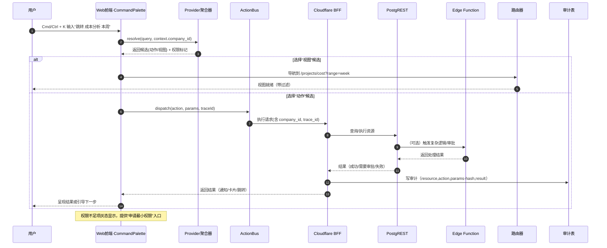

#### 时序图：命令面板执行（错误与降级）

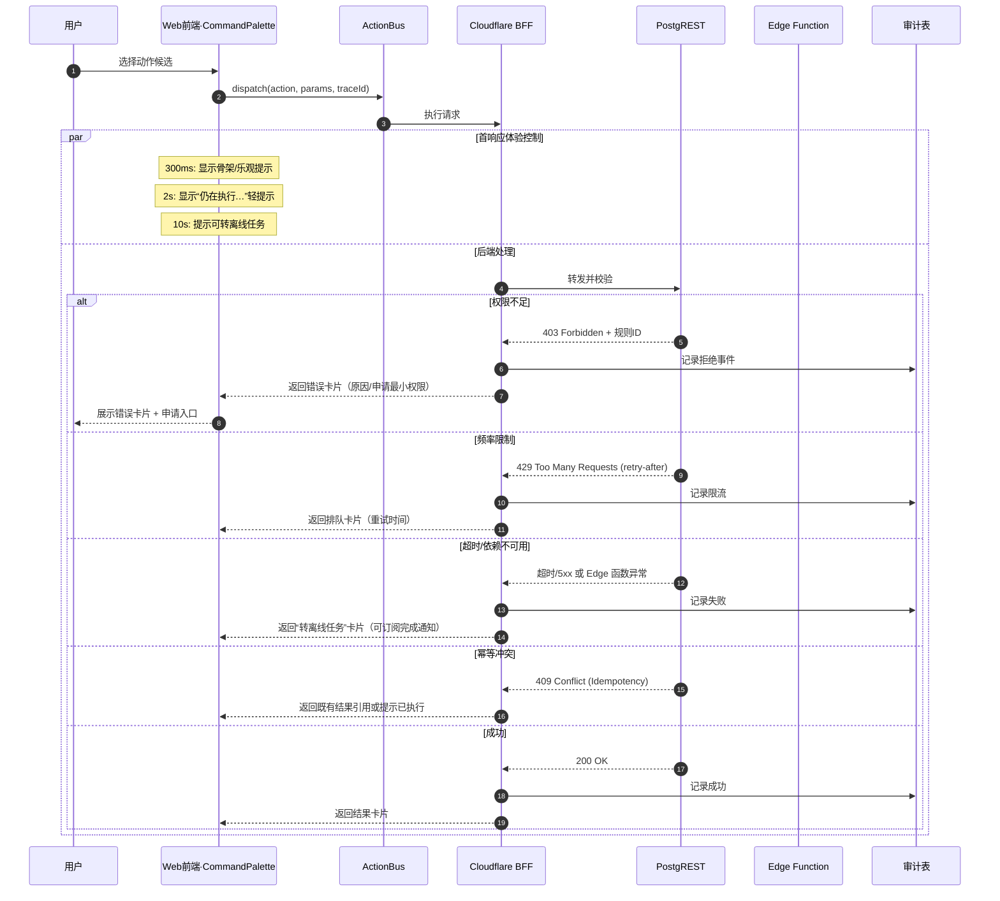

### 命令面板/Provider 契约（TypeScript 草案）

```ts
export interface CommandContext {
  companyId: string;
  userId: string;
  roles: string[];
  locale?: string;
  tz?: string;
  // 可选：当前模块/实体上下文（用于收敛搜索与默认参数回填）
  scope?: 'projects' | 'finance' | 'approvals' | 'hr' | 'knowledge' | 'settings';
  entity?: { type: string; id: string } | null;
}

export type CommandKind = 'action' | 'view' | 'entity';

export interface PermissionHint {
  allowed: boolean;
  reason?: string;           // 不允许时的解释（用于灰态提示）
  minimalPermission?: string; // 最小授权建议（如：perm:finance.report.read）
}

export interface RouteTarget {
  path: string;              // 如：/projects/cost
  params?: Record<string, string | number>;
  query?: Record<string, string | number | boolean>;
}

export interface ParamSpec<T = unknown> {
  name: string;
  required?: boolean;
  description?: string;
  schema?: 'string' | 'number' | 'boolean' | 'date' | 'json' | 'enum';
  enumValues?: Array<string | number>;
  default?: T;
  // 简易校验器（前端可用）；复杂校验由服务端兜底
  validate?: (v: unknown) => boolean;
}

export interface ConfirmSpec {
  required: boolean;
  title?: string;
  message?: string;
  // 可选：表单片段参数（与表单模式片段一致）
  formParams?: ParamSpec[];
}

export interface CommandItem {
  id: string;                // 稳定 ID（用于审计/遥测）
  kind: CommandKind;
  title: string;             // 展示标题
  subtitle?: string;         // 说明/命中原因
  icon?: string;             // 图标标识
  // 权限提示：决定是否可选/灰态
  permission: PermissionHint;
  // 视图跳转目标（kind=view/entity）
  target?: RouteTarget;
  // 动作定义（kind=action）
  action?: {
    name: string;            // 动作名（交由 ActionBus 处理）
    params?: ParamSpec[];    // 需要的参数定义
    confirm?: ConfirmSpec;   // 是否需要二次确认/表单片段
  };
  // 排序/权重/分组信息
  score?: number;
  group?: string;            // 如：项目/财务/审批
}

export interface CommandProvider {
  id: string;                // 提供者 ID（模块维度）
  displayName: string;       // 供调试/可视化使用
  // 将用户输入解析为候选项列表
  resolve: (
    query: string,
    context: CommandContext
  ) => Promise<CommandItem[]>;
}

export interface CommandPaletteAPI {
  registerProvider: (provider: CommandProvider) => void;
  unregisterProvider: (id: string) => void;
  search: (query: string, context: CommandContext) => Promise<CommandItem[]>;
}
```

### ActionBus 执行路径（TypeScript 草案）

```ts
export interface ActionContext extends CommandContext {
  traceId: string;            // 前端生成并贯穿
  idempotencyKey?: string;    // 默认=traceId
}

export interface ActionRequest {
  actionId: string;           // 对应 CommandItem.id 或 action.name
  params?: Record<string, unknown>;
  context: ActionContext;
}

export type ActionStatus =
  | 'success'
  | 'requiresApproval'
  | 'denied'
  | 'queued'
  | 'error';

export interface ApprovalInfo {
  approvalId: string;
  previewCard?: CardSchema;   // 审批前的预览卡片
}

export interface RedirectInfo {
  to: RouteTarget;            // 成功后建议跳转
  preserveContext?: boolean;  // 是否保留对话上下文
}

export interface ActionResult {
  status: ActionStatus;
  message?: string;
  cards?: CardSchema[];       // 执行结果以卡片返回（建议）
  approval?: ApprovalInfo;    // 需要审批时返回
  redirect?: RedirectInfo;    // 可选跳转
  warnings?: string[];
  error?: { code: string; detail?: string };
}

export interface PrecheckResult {
  allowed: boolean;
  reason?: string;
  // 需要确认/补参
  confirm?: ConfirmSpec;
}

export interface ActionBus {
  // 注册动作处理器（模块内）
  register: (actionId: string, handler: (req: ActionRequest) => Promise<ActionResult>) => void;
  unregister: (actionId: string) => void;

  // 可选：执行前检查（权限/参数/配额等）
  precheck?: (req: ActionRequest) => Promise<PrecheckResult>;

  // 分发执行：统一注入 RBAC/ABAC 判定、幂等键、审计
  dispatch: (req: ActionRequest) => Promise<ActionResult>;
}
```

说明与约束：
- CommandProvider 仅负责“解析查询 → 候选项”，不直接执行；执行统一走 ActionBus，保证 RBAC/ABAC 判定、审计与降级策略一致。
- ActionBus.dispatch 在发送给后端前注入 `traceId/idempotencyKey`，后端执行结果建议以 CardSchema 返回，前端可直接渲染并提供后续行动。
- 错误与降级统一：`denied/queued/error` 均以卡片/提示返回，包含重试/申请最小权限/转离线任务等建议。

### 多租户上下文传播
- 上下文载体：Supabase JWT 中的 `company_id`、`role_keys` 与 `X-Vibot-Context` 头（locale、tz、tenantHint）。
- 前端：公司切换器更新 Pinia Store，并通知路由/搜索/对话收敛数据域，同时刷新 Supabase Session（若切换跨公司账号）。
- BFF：校验 JWT、注入 traceId、传递 `X-Vibot-Context` 到 Supabase 请求头，并执行 Cloudflare KV 限流。
- Supabase：PostgREST + RLS 强制 `company_id` 过滤；跨公司操作需调用 Edge Function `grant_tenant_access` 生成短期策略。

#### 时序图：多租户上下文传播

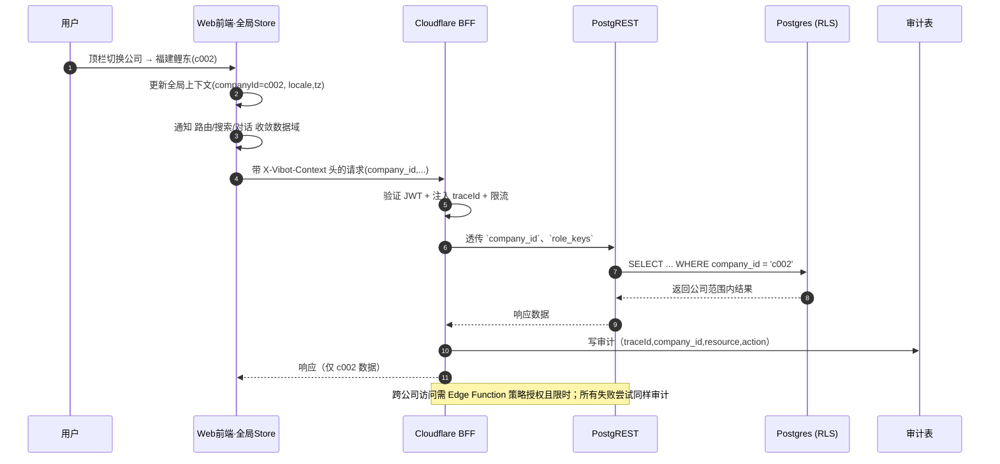

#### 时序图：多租户上下文传播（错误与降级）

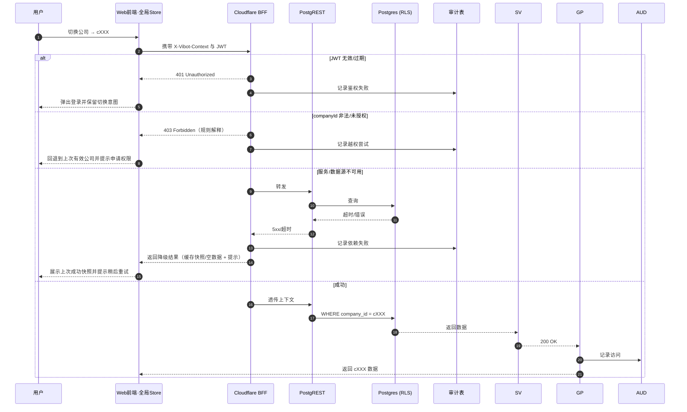

### 前端实现要点（指引）

- 路由规范：
  - 每个模块文件位于 `apps/web-antd/src/router/modules/<domain>.ts`；默认导出 `RouteRecordRaw[]`，首路由为 `<domain>-chat`。
  - 示例：`projects` 模块包含 `projects-chat`、`projects-list`、`projects-gantt`、`projects-kanban`、`projects-cost` 等。
- 视图规范：
  - `views/<domain>/Chat.vue` 用统一 `ConversationShell`，支持卡片渲染与表单片段挂载。
  - `views/<domain>/*` 其余视图对应功能页；在对话中可通过操作卡片跳转或执行后台动作。
- 组件与状态：
  - `packages/stores` 提供会话、命令、搜索、权限等 Store；
  - `packages/utils` 提供 CardSchema、ActionBus、PostMessage 封装、权限工具。

### SRE 与可观测性计划（目标）

- 指标与预算：
  - 对话首卡片 P95 < 4s；命令面板 P95 < 300ms；后端服务可用性 ≥ 99.9%。
  - Dify 依赖超时 20s 进入离线任务降级；全链路幂等冲突 409 归一化处理。
- 可观测性：
  - 指标：cards 渲染时延、action 执行成功率、限流/熔断次数、外部依赖错误率；
  - 日志：结构化、traceId 贯通；
  - 追踪：gateway→service→db 链路 + 前端关键交互埋点（采样）。
- 可靠性：
  - 多级缓存（BFF 内存 + Cloudflare Cache）+ 限流 + 熔断 + 重试退避；
  - 金丝雀/灰度发布，回滚模板；
  - 事后审计：对话/命令/视图/API 全链路审计与合规导出。

#### AI 助手视图与路由示例（apps/web-antd/src/views/ai-assistant）

- 路由示例（RouteRecordRaw）：
```ts
// apps/web-antd/src/router/modules/assistant.ts
import type { RouteRecordRaw } from 'vue-router';

export const assistantRoutes: RouteRecordRaw = {
  name: 'assistant',
  path: '/assistant',
  redirect: '/assistant/chat',
  meta: { title: 'AI 助手', requiresAuth: true },
  children: [
    {
      name: 'assistant-chat',
      path: 'chat',
      component: () => import('@/views/ai-assistant/AssistantChat.vue'),
      meta: { title: 'AI 助手 · 对话' },
    },
  ],
};
```

- 组件结构（建议）：
  - `AssistantChat.vue`：组合 ConversationShell，挂载右侧 `AssistantToolsPanel`
  - `AssistantToolsPanel.vue`：文档/视频/书写/专家建议工具入口与参数面板
  - `cards/`：卡片渲染适配器（与全局 CardSchema 注册表复用）
  - `useAssistant.ts`：封装 Dify postMessage 调用、签名、幂等与降级

- 与业务协作：在各模块 Chat 中通过抽屉方式复用 `AssistantToolsPanel`，将生成内容通过“插入到当前上下文”回填到项目周报/审批草稿等。

### 服务与模块对齐

| 服务 / 组件            | 对应 PRD 模块                                   | 关键对话动作与业务场景                                                                                                                                     |
| ---------------------- | ----------------------------------------------- | ---------------------------------------------------------------------------------------------------------------------------------------------------------- |
| Customer Service       | 客户管理（CRM）                                 | “对话（客户）”维护档案、校验银行信息；生成信用预警卡片；支撑运费付款申请中的客户检索。                                                                    |
| Product Service        | 产品中心（PIM/PLM）                             | “对话（产品）”录入规格、BOM、工艺；推送变更影响分析；支持微柏机器人手臂、鲤东后桥壳等实例。                                                              |
| Order Service          | 订单中心（OMS）、项目管理（Projects）           | “对话（订单）”创建销售/采购订单；自动将高价值订单同步到项目里程碑；和审批、财务联动。                                                                    |
| Manufacturing Service  | 生产管理（MES）                                 | “对话（生产）”排程工单，采集吴维丁工序产量；当废品超阈触发审批与财务预警。                                                                                |
| Finance Service        | 财务管理（Finance）                             | “对话（财务）”回溯付款、成本与订单关联；触发业财一体化对账。                                                                                              |
| Workflow Service       | 审批管理（Approvals）                           | 大额采购订单、新产品入库、生产工单变更触发审批；与对话式审批联动。                                                                                        |
| Project Service        | 项目管理（Projects）                            | 基于订单进度生成项目节点，尤其针对微柏自动化项目的交付；提供周报/成本卡片。                                                                                |
| Integration Service    | 数据与集成                                       | 钉钉消息、数据库同步；对话触发调度或诊断建议。                                                                                                            |
| AI Conversation Shell  | 全局与交互框架、命令面板                         | 提供统一的对话入口、命令面板、卡片操作，连接到各业务服务的 Action Endpoint。                                                                               |
| Auth / HR Service      | 员工管理（HR）、设置与安全、权限/多公司策略     | 对话解析“为什么没有权限”等问题；同步员工档案与效率评估。                                                                                                 |
| Knowledge Service      | 资料库、帮助与支持                               | 对话检索资料、生成诊断报告；输出使用指南卡片。                                                                                                            |
| Dify Proxy + Vector    | AI 层                                            | 提供安全上下文、Embedding 检索，支撑微柏/鲤东场景化问答。                                                                                                |

## Tech Stack

### Technology Stack Table

| 类别 | 技术 | 版本 | 用途 | 理由 |
| --- | --- | --- | --- | --- |
| Frontend Language | TypeScript | 5.8+ | 类型安全的JavaScript | 提供类型安全，支持大型项目开发，与现有技术栈一致 |
| Frontend Framework | Vue 3 | 3.5+ | 渐进式JavaScript框架 | 现有技术栈，优秀的响应式系统，组合式API |
| UI Component Library | Ant Design Vue | 4.2+ | 企业级UI设计语言 | 现有技术栈，丰富的企业组件，设计一致性 |
| State Management | Pinia | 3.0+ | Vue状态管理库 | 现有技术栈，TypeScript友好，简单易用 |
| Backend Platform | Supabase Platform | 最新 | 统一后端 BaaS | 托管 Postgres、Auth、Storage、Realtime，一站式满足业务需求 |
| API Style | Supabase PostgREST | 最新 | 自动生成 REST API | 零维护 API 层，遵循 PostgreSQL schema 自动暴露 |
| Database | Supabase PostgreSQL | 15+ | 主数据库 | 内建 RLS、可扩展 JSON/地理等特性，支持多租户隔离 |
| Authentication | Supabase Auth | 最新 | 用户认证/第三方登录 | 原生支持邮箱、短信、OAuth、SSO，自动管理会话 |
| Serverless Runtime | Supabase Edge Functions (Deno) | 最新 | 复杂业务逻辑 | 运行审批、钉钉集成、批处理任务，按需伸缩 |
| Storage | Supabase Storage | 最新 | 附件/文档存储 | 集成访问控制，支持签名 URL 与版本管理 |
| API Aggregation | Cloudflare Workers / Nitro Edge (Deno) | 最新 | 前端聚合与缓存 | 轻量聚合 Supabase 调用、注入 Trace、缓存热点数据 |
| Observability | Supabase Logs + OpenTelemetry | 最新 | 日志与追踪 | 利用 Supabase Log Explorer 并接入 OTEL 汇总跨层数据 |
| Build Tool | Vite | 7.1+ | 构建工具 | 现有技术栈，开发体验好，构建速度快 |
| Bundler | Turbo | 1.11+ | Monorepo构建工具 | 现有技术栈，缓存优化，并行构建 |
| IaC Tool | Terraform + Supabase CLI | 1.6+ / 最新 | 基础设施与 Supabase 管理 | IaC 管理边缘资源，Supabase CLI 负责迁移/函数部署 |
| Frontend Testing | Vitest | 1.0+ | 单元测试框架 | 与Vite深度集成，速度快，API友好 |
| E2E Testing | Playwright | 1.40+ | 端到端测试 | 跨浏览器，自动等待，调试工具完善 |
| CI/CD | GitHub Actions | 5.0+ | 持续集成部署 | 集成 Supabase CLI、前端构建与 Edge Functions 发布 |
| Monitoring | Supabase Insights + Grafana Cloud | 最新 | 托管监控 | Supabase 提供数据库运行指标，Grafana 汇总前后端视图 |
| Logging | Supabase Log Explorer + Loki | 最新 | 日志管理 | 利用 Supabase 日志并集中到 Loki 统一检索 |
| CSS Framework | Tailwind CSS | 3.4+ | 原子化CSS | 现有技术栈，高度可定制，性能优秀 |

### 特殊技术栈补充：

| 类别 | 技术 | 版本 | 用途 | 理由 |
| --- | --- | --- | --- | --- |
| AI Integration | Dify Platform | Latest | AI对话能力 | 专业AI平台，安全可靠，功能完善 |
| Communication | PostMessage API | HTML5 | iframe通信 | 标准API，安全性好，兼容性强 |
| Database Tooling | Supabase CLI | Latest | 迁移、RLS、Edge Functions 管理 | 官方工具链，保证与托管平台一致 |
| Policy Library | Supabase RLS Templates | Latest | 行级安全模板 | 快速定义 company_id / role 绑定策略，减少安全漏洞 |
| Scheduler | Supabase Edge Scheduler | Latest | 定时任务 | 内建 Cron 触发，执行财务报表与审批提醒 |
| Integration SDK | `@supabase/supabase-js` | 2.x | 前端/Edge 客户端 | 官方 SDK，支持 PostgREST、Storage、Realtime、Auth |

#### 设计理由 (Design Rationale)

- **充分利用 Supabase 原生能力**：以 Supabase 平台组件替换自建 Node.js 微服务、ORM 和文件存储，减少运维负担并获得托管 RLS、安全日志、备份等能力。
- **满足 PRD 对多租户与审批的需求**：PostgreSQL RLS、Supabase Auth 与 Edge Functions 的组合，为多公司隔离、审批流自动化、钉钉集成和财务报表生成提供原生支持。
- **提升交付效率**：通过 PostgREST 自动 API、`@supabase/supabase-js` SDK 与官方 CLI，避免重复造轮子，同时保持与现有前端栈的契合。

---

## Data Models

所有业务表部署在 Supabase 托管的 PostgreSQL 中，使用 `public` schema 暴露给 PostgREST，`private` schema 存放安全函数与审计触发器。每张表默认开启 RLS，由 `company_id`、`auth.uid()` 与 `app_metadata.role_keys` 驱动访问控制，保证三家公司之间的数据隔离。

```ts
export type ISODateTime = string;
export type UUID = string;

export interface Customer {
  id: UUID;
  companyId: UUID;
  customerCode?: string;
  name: string;
  customerType: 'supplier' | 'customer' | 'logistics' | 'employee' | 'other';
  contactName?: string;
  contactPhone?: string;
  contactEmail?: string;
  taxId?: string;
  status: 'potential' | 'negotiating' | 'active' | 'paused';
  bankAccounts: BankAccount[];
  tags: string[];
  metadata: Record<string, unknown>;
  createdBy?: UUID;
  updatedBy?: UUID;
  createdAt: ISODateTime;
  updatedAt: ISODateTime;
}

export interface BankAccount {
  bankName: string;
  accountName: string;
  accountNumber: string;
  currency: string;
  isDefault?: boolean;
}

export interface Product {
  id: UUID;
  companyId: UUID;
  productCode: string;
  name: string;
  specification?: string;
  productType: 'assembly' | 'component' | 'service';
  unit: string;
  lifecycleStatus: 'design' | 'pilot' | 'mass' | 'retired';
  defaultProcessFlow?: ProcessFlow;
  bom?: BomNode[];
  documents: ProductDocument[];
  metadata: Record<string, unknown>;
  createdBy?: UUID;
  updatedBy?: UUID;
  createdAt: ISODateTime;
  updatedAt: ISODateTime;
}

export interface ProcessFlow {
  steps: Array<{
    stepCode: string;
    name: string;
    durationHours?: number;
    workstation?: string;
  }>;
}

export interface BomNode {
  itemId: UUID;
  itemCode: string;
  itemName: string;
  quantity: number;
  unit: string;
  children?: BomNode[];
}

export interface ProductDocument {
  fileId: UUID;
  title: string;
  version?: string;
  type: 'spec' | 'drawing' | 'qa' | 'other';
}

export interface Order {
  id: UUID;
  companyId: UUID;
  orderCode: string;
  orderType: 'sales' | 'purchase';
  status: 'draft' | 'approving' | 'scheduled' | 'in_progress' | 'shipped' | 'completed' | 'canceled';
  approvalStatus: 'pending' | 'approved' | 'rejected';
  customerId: UUID;
  projectId?: UUID;
  currency: string;
  amountTotal: number;
  taxAmount?: number;
  paymentTerms?: string;
  summary?: string;
  lineItems: OrderLineItem[];
  attachments: AttachmentRef[];
  invoiceStatus: 'pending' | 'in_progress' | 'issued';
  paymentMethod?: string;
  paymentDate?: string;
  sourcePayload: Record<string, unknown>;
  createdBy?: UUID;
  updatedBy?: UUID;
  createdAt: ISODateTime;
  updatedAt: ISODateTime;
}

export interface OrderLineItem {
  productId: UUID;
  productNameSnapshot: string;
  specificationSnapshot?: string;
  quantity: number;
  unitPrice: number;
  currency: string;
  discountRate?: number;
  taxRate?: number;
  metadata?: Record<string, unknown>;
}

export interface WorkOrder {
  id: UUID;
  companyId: UUID;
  workOrderCode: string;
  orderId: UUID;
  productId: UUID;
  productNameSnapshot: string;
  specificationSnapshot?: string;
  batchNo?: string;
  processName: string;
  nextProcess?: string;
  status: 'planned' | 'in_progress' | 'paused' | 'completed' | 'canceled';
  approvalStatus: 'pending' | 'approved' | 'rejected';
  metrics: {
    plannedQuantity?: number;
    actualQuantity?: number;
    qualifiedQuantity?: number;
    scrap?: {
      material?: number;
      process?: number;
    };
  };
  durationHours?: number;
  operatorName?: string;
  workDate?: string;
  attachments: AttachmentRef[];
  metadata: Record<string, unknown>;
  createdBy?: UUID;
  updatedBy?: UUID;
  createdAt: ISODateTime;
  updatedAt: ISODateTime;
}

export interface FinancialRecord {
  id: UUID;
  companyId: UUID;
  orderId?: UUID;
  counterpartyId?: UUID;
  recordCode: string;
  recordType: 'payment' | 'receipt' | 'cost' | 'adjustment';
  status: 'pending' | 'posted' | 'void';
  flowDirection: 'inflow' | 'outflow';
  amount: number;
  currency: string;
  occurredAt: ISODateTime;
  reportingWindow?: string;
  sourcePayload: Record<string, unknown>;
  dimensions: Record<string, unknown>;
  alertFlags: Record<string, unknown>;
  attachments: AttachmentRef[];
  createdBy?: UUID;
  updatedBy?: UUID;
  createdAt: ISODateTime;
  updatedAt: ISODateTime;
}

export interface ApprovalRequest {
  id: UUID;
  companyId: UUID;
  workflowId: UUID;
  requestCode: string;
  title: string;
  requesterId: UUID;
  status: 'draft' | 'in_progress' | 'completed' | 'canceled';
  approvalResult: 'pending' | 'approved' | 'rejected';
  formPayload: Record<string, unknown>;
  timeline: ApprovalTimelineEntry[];
  linkedResources: {
    orderId?: UUID;
    workOrderId?: UUID;
    customerId?: UUID;
    productId?: UUID;
    financialRecordId?: UUID;
  };
  attachments: AttachmentRef[];
  resultPayload?: Record<string, unknown>;
  submittedAt?: ISODateTime;
  decidedAt?: ISODateTime;
  createdAt: ISODateTime;
  updatedAt: ISODateTime;
}

export interface ApprovalTimelineEntry {
  actorId: UUID;
  actorName: string;
  action: 'submit' | 'approve' | 'reject' | 'comment' | 'transfer' | 'notify';
  comment?: string;
  createdAt: ISODateTime;
  metadata?: Record<string, unknown>;
}

export interface AttachmentRef {
  attachmentId: UUID;
  fileName: string;
  url?: string;
  category?: string;
}
```

### 多租户与行级安全 (RLS) 实现

- **基础策略**：对 `projects`、`orders`、`financial_records`、`approval_requests`、`customers`、`products` 等核心表执行 `ALTER TABLE ... ENABLE ROW LEVEL SECURITY;`，并关闭默认策略，确保所有访问均需显式授权。
- **公司维度隔离**：策略统一判断 `company_id` 与 JWT 中的 `company_id` 是否一致：

```sql
create policy "tenant_isolation" on public.projects
  for all to authenticated
  using (
    company_id = (select coalesce(current_setting('request.jwt.claims', true)::json ->> 'company_id', ''))
  )
  with check (
    company_id = (select coalesce(current_setting('request.jwt.claims', true)::json ->> 'company_id', ''))
  );
```

- **角色控制**：通过 `auth.jwt() -> 'app_metadata' -> 'role_keys'` 区分审批人、财务管理员等角色，限制写入或审批动作。例如：

```sql
create policy "finance_write" on public.financial_records
  for insert, update, delete to authenticated
  using (
    (auth.jwt() -> 'app_metadata' -> 'role_keys') ? 'finance_controller'
    and company_id = (select current_setting('request.jwt.claims', true)::json ->> 'company_id')
  );
```

- **函数复用**：在 `private` schema 中编写 `security definer` 函数（如 `private.has_project_access(project_id uuid)`），供多张表的 RLS 复用，减少重复逻辑并提升性能。
- **审计触发器**：借助 `auth.uid()` 自动填充 `created_by` / `updated_by`，Edge Functions 通过服务角色执行批量导入时，可写入委托用户。
- **附件对齐**：`storage.objects` 策略同步检查 `metadata.company_id`，与业务表中的 `company_id` 一致，保障审批附件、财务凭证等文件级别隔离。

#### 设计理由 (Design Rationale)

- **多租户与合规**：RLS 策略直接在数据库层面保证三家企业的数据隔离，杜绝越权查询，满足 PRD 的多租户要求。
- **统一授权模型**：通过 JWT `app_metadata` 提供单一权限源，Edge Functions、PostgREST 和前端统一以 Supabase Auth 的令牌为准，减少重复实现。
- **可扩展性与性能**：策略函数集中在数据库中，结合 Supabase 的策略优化（如 `select auth.uid()` 缓存技巧），即使在大规模数据量下也能保持良好性能。

## API Specification

Vibot 不再维护自定义 `api-spec.md`。所有数据访问统一通过 Supabase 自动生成的 PostgREST API；复杂操作由 Edge Functions 暴露 RPC 风格端点。

### PostgREST 访问规范

- **基础 URL**：`https://<project-ref>.supabase.co/rest/v1/`
- **认证**：前端与 BFF 使用 `supabase.auth` 获取 access token，在请求头中传递 `Authorization: Bearer <token>` 与 `apikey: <anon-key>`。
- **资源路径示例**：
  - `/rest/v1/projects`
  - `/rest/v1/orders`
  - `/rest/v1/financial_records`
  - `/rest/v1/approval_requests`
- **查询规则**：遵循 PostgREST 过滤语法，例如 `GET /rest/v1/orders?company_id=eq.{companyId}&select=*,order_line_items(*)`。
- **分页策略**：统一采用 `Range: items=start-end` 头或 `limit`/`offset` 参数；前端封装 `useSupabasePagination` 组件以适配列表需求。
- **视图与 RPC**：通过数据库视图暴露报表（如 `GET /rest/v1/report_project_overview`），或通过 `POST /rest/v1/rpc/run_finance_snapshot` 调用存储过程。
- **官方文档**：详细规范参考 Supabase 官方文档 <https://supabase.com/docs/reference/postgrest>。

### Edge Functions API

Supabase Edge Functions 负责以下非 CRUD 场景：

| 函数名称 | 触发方式 | 功能说明 |
| --- | --- | --- |
| `dingtalk-webhook` | HTTP | 验证钉钉回调并写入 `approval_requests`、推送通知 |
| `finance-daily-rollup` | Scheduler | 聚合日度财务流水到 `financial_snapshots`，触发预警 |
| `project-gantt-sync` | HTTP | 同步外部项目计划到 `project_milestones`，校验权限后写入 |
| `secure-dify-signature` | HTTP | 为 Dify iframe 生成签名、裁剪上下文，保护敏感数据 |

Edge Functions 使用服务角色密钥配合 `supabase-js`，遵守最小权限原则：默认沿用 RLS，如需穿透则通过 `security definer` 函数完成。

### BFF 增强能力

BFF 仅在以下场景作为薄层代理：

- 聚合跨业务域数据（例如项目 + 财务 + 审批状态）后缓存短期结果。
- 注入审计 `trace_id`、`company_id` 等头部，便于 Supabase 日志与指标分析。
- 对旧有前端模块保留兼容接口，并逐步指导迁移到 Supabase SDK。

#### 设计理由 (Design Rationale)

- **零维护 API 层**：PostgREST 直接映射数据库 schema，避免重复编写 CRUD 控制器，保证文档自动同步。
- **补齐复杂场景**：Edge Functions 提供审批、钉钉集成、财务汇总等高阶能力，确保无法以纯 CRUD 表达的需求仍可落地。
- **平滑迁移**：薄层 BFF 让现有前端逐步过渡到 Supabase 客户端，同时维持统一的日志与审计策略。

## Components

### Component List

| 组件 / 服务                     | 职责描述                                                                                                                                                                        |
| ------------------------------- | --------------------------------------------------------------------------------------------------------------------------------------------------------------------------- |
| Cloudflare BFF / API Gateway    | 聚合前端请求、注入 `company_id`、实现短期缓存与速率限制，并封装 Supabase 调用。                                                                                           |
| Supabase Auth                   | 管理用户认证、OAuth/SSO、MFA 与会话生命周期，生成包含 `company_id`、`role_keys` 的 JWT。                                                                                     |
| Supabase PostgREST & Realtime   | 自动暴露数据库表、视图与存储过程 API，并向前端推送审批、项目、财务数据的实时变更。                                                                                           |
| Supabase PostgreSQL (RLS)       | 承载多租户数据模型，启用 RLS、策略函数与审计触发器，保障数据隔离与可追溯性。                                                                                                 |
| Supabase Edge Functions         | 执行业务逻辑（审批回调、财务汇总、项目同步、Dify 签名、定时任务），可访问服务角色权限。                                                                                       |
| Supabase Storage                | 存放审批附件、财务凭证、BOM 文档，结合桶策略与签名 URL 控制访问。                                                                                                             |
| Integration Layer (钉钉/DB 连接) | 通过 Edge Functions 调用钉钉、外部数据库/ERP，写回 Supabase 表或触发工作流。                                                                                                   |
| Dify Proxy                      | 验证对话上下文、生成签名、裁剪敏感数据，与 Supabase Edge Functions 协作保障 AI 流程安全。                                                                                   |
| AI Conversation Shell           | 前端对话层、命令面板、卡片渲染、ActionBus，直接调用 Supabase SDK 与 Edge Functions。                                                                                        |

### Component Interaction Diagram

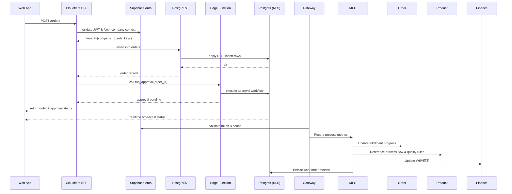

## External APIs

### Dify Platform API

- **Purpose**: 提供 AI 对话能力，支持文档编辑、视频制作、财务分析等多种 AI 助手
- **Documentation**: `https://docs.dify.ai/`
- **Authentication**: API Key + JWT Token
- **Rate Limits**: 基础版: 100 requests/minute, 专业版: 1000 requests/minute, 企业版: 5000 requests/minute
- **Key Endpoints Used**: `POST /chat-messages`, `GET /conversations`, `POST /conversations`
- **Integration Notes**: 使用 iframe 嵌入方式集成 Dify 聊天界面，通过 PostMessage API 实现前后端安全通信

### DingTalk API

- **Purpose**: 同步企业通信数据、组织架构和员工信息
- **Documentation**: `https://open.dingtalk.com/document/`
- **Authentication**: App Key + App Secret + Access Token
- **Rate Limits**: 100 requests/minute per application
- **Key Endpoints Used**: `GET /user/getuserinfo`, `GET /department/list`, `POST /message/workconversation/send`
- **Integration Notes**: 实现增量数据同步，处理钉钉 API 的分页和限流

### 银行财务 API

- **Purpose**: 获取银行账户信息、交易记录和财务对账数据
- **Documentation**: 各银行不同的 API 文档
- **Authentication**: API Key + 数字证书 + 签名验证
- **Rate Limits**: 根据银行政策不同
- **Key Endpoints Used**: `GET /accounts`, `GET /transactions`, `POST /reconciliation`
- **Integration Notes**: 不同银行需要不同的集成适配器，需要处理银行 API 的安全认证和数据加密

### 云存储 API (阿里云 OSS)

- **Purpose**: 存储和管理文件，包括文档、图片、视频等
- **Documentation**: `https://help.aliyun.com/product/31815.html`
- **Authentication**: Access Key ID + Access Key Secret + STS Token
- **Rate Limits**: 10000 requests/second
- **Key Endpoints Used**: `PUT /{bucket}/{object}`, `GET /{bucket}/{object}`
- **Integration Notes**: 实现文件上传的进度跟踪和断点续传，支持大文件分片上传

### 邮件服务 API (阿里云邮件推送)

- **Purpose**: 发送系统通知、报表和提醒邮件
- **Documentation**: `https://help.aliyun.com/product/29412.html`
- **Authentication**: Access Key + Region ID
- **Rate Limits**: 根据邮件套餐不同
- **Key Endpoints Used**: `POST /singleSendMail`, `POST /batchSendMail`
- **Integration Notes**: 实现邮件模板管理，支持邮件发送状态跟踪和统计

### 消息队列 API (阿里云 MQ)

- **Purpose**: 处理异步任务和系统解耦
- **Documentation**: `https://help.aliyun.com/product/29530.html`
- **Authentication**: Access Key + Instance ID
- **Rate Limits**: 根据实例规格不同
- **Key Endpoints Used**: `POST /messages/publish`, `POST /messages/consume`
- **Integration Notes**: 实现消息的可靠投递和重试机制，支持消息优先级和延迟消息

**外部 API 集成策略：**

- **统一适配器模式**： 为每个外部 API 创建适配器，统一接口格式
- **错误处理和重试**： 实现指数退避重试和熔断机制
- **监控和告警**： 监控 API 调用性能和可用性
- **缓存策略**： 对不常变化的数据实施缓存
- **安全防护**： 实现API密钥管理和访问控制
- **数据同步**： 支持增量同步和冲突解决

---

## Core Workflows

### 用户认证和权限验证流程

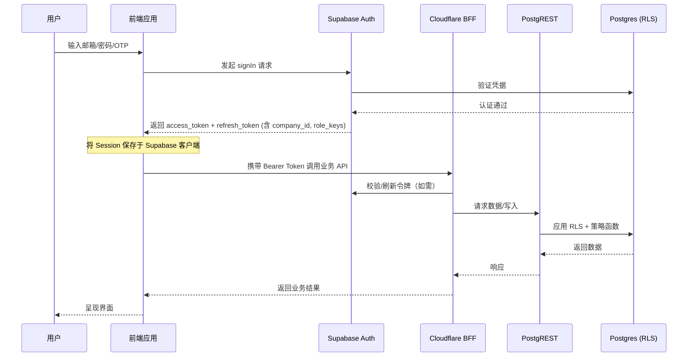

### AI 对话交互流程

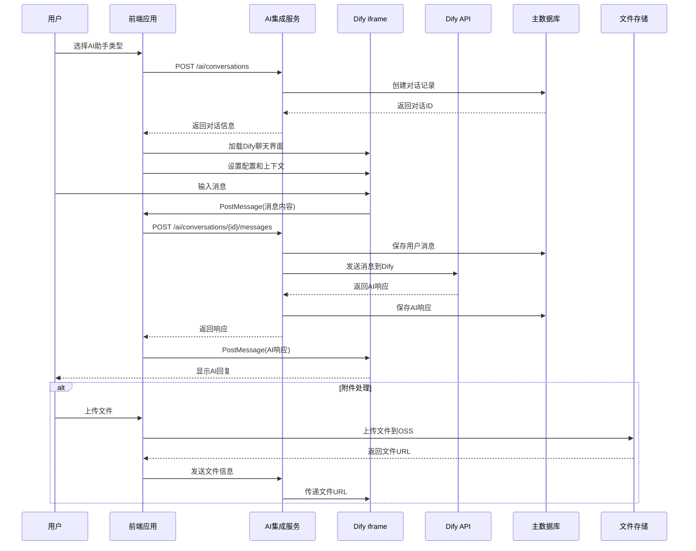

### 财务报表生成流程

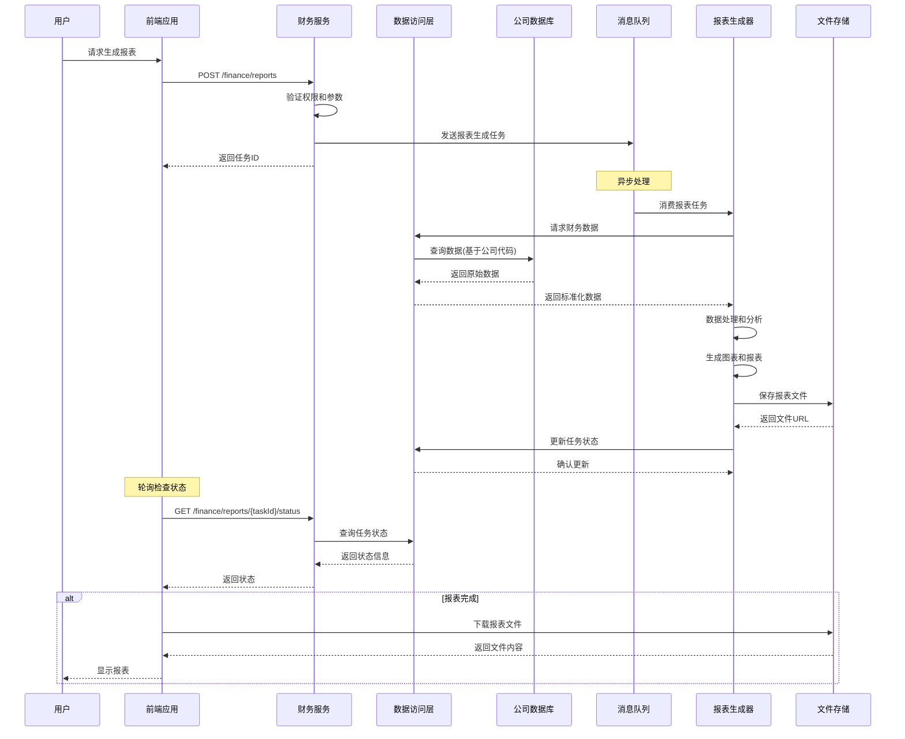

### 审批流程执行

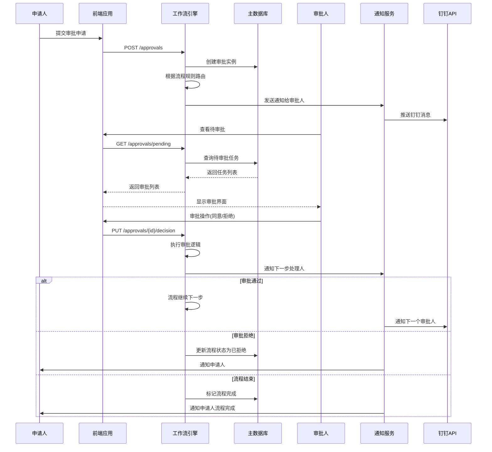

### 多数据源同步流程

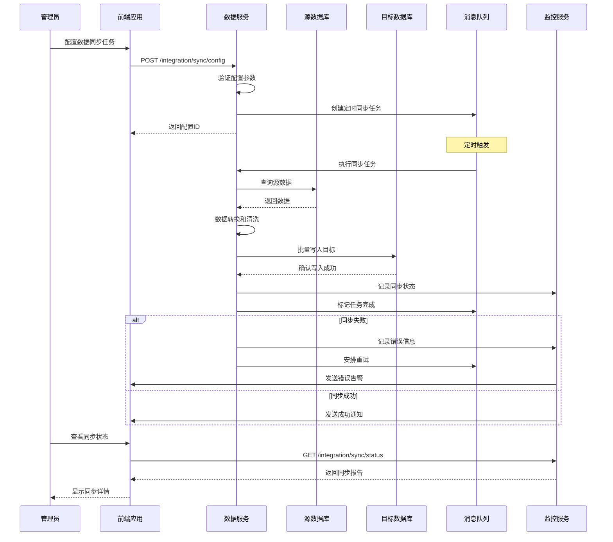

**工作流设计理由：**

- **清晰的角色定义**： 每个参与者都有明确的职责
- **错误处理**： 包含完整的错误处理和恢复机制
- **异步处理**： 长时间任务使用异步模式，避免阻塞
- **监控和日志**： 所有关键操作都有监控和日志记录
- **用户体验**： 提供实时反馈和状态更新

---

## Database Schema

### 主数据库架构 (PostgreSQL)

```sql
-- 用户表
CREATE TABLE users (
    id UUID PRIMARY KEY DEFAULT gen_random_uuid(),
    email VARCHAR(255) UNIQUE NOT NULL,
    username VARCHAR(100) UNIQUE NOT NULL,
    password_hash VARCHAR(255) NOT NULL,
    company_id UUID NOT NULL,
    status VARCHAR(20) DEFAULT 'active' CHECK (status IN ('active', 'inactive', 'locked')),
    created_at TIMESTAMP WITH TIME ZONE DEFAULT CURRENT_TIMESTAMP,
    updated_at TIMESTAMP WITH TIME ZONE DEFAULT CURRENT_TIMESTAMP
);

-- 公司表
CREATE TABLE companies (
    id UUID PRIMARY KEY DEFAULT gen_random_uuid(),
    name VARCHAR(200) NOT NULL,
    code VARCHAR(50) UNIQUE NOT NULL,
    type VARCHAR(50) NOT NULL CHECK (type IN ('weibo', 'lidong_fujian', 'lidong_chengdu')),
    settings JSONB DEFAULT '{}',
    status VARCHAR(20) DEFAULT 'active' CHECK (status IN ('active', 'suspended', 'trial')),
    created_at TIMESTAMP WITH TIME ZONE DEFAULT CURRENT_TIMESTAMP,
    updated_at TIMESTAMP WITH TIME ZONE DEFAULT CURRENT_TIMESTAMP
);

-- AI对话表
CREATE TABLE ai_conversations (
    id UUID PRIMARY KEY DEFAULT gen_random_uuid(),
    user_id UUID NOT NULL REFERENCES users(id) ON DELETE CASCADE,
    agent_type VARCHAR(50) NOT NULL,
    session_id VARCHAR(200) NOT NULL,
    status VARCHAR(20) DEFAULT 'active' CHECK (status IN ('active', 'completed', 'archived')),
    created_at TIMESTAMP WITH TIME ZONE DEFAULT CURRENT_TIMESTAMP,
    updated_at TIMESTAMP WITH TIME ZONE DEFAULT CURRENT_TIMESTAMP
);

-- 项目表
CREATE TABLE projects (
    id UUID PRIMARY KEY DEFAULT gen_random_uuid(),
    company_id UUID NOT NULL REFERENCES companies(id) ON DELETE CASCADE,
    name VARCHAR(300) NOT NULL,
    manager_id UUID NOT NULL REFERENCES users(id),
    status VARCHAR(20) DEFAULT 'planning',
    created_at TIMESTAMP WITH TIME ZONE DEFAULT CURRENT_TIMESTAMP,
    updated_at TIMESTAMP WITH TIME ZONE DEFAULT CURRENT_TIMESTAMP
);

-- 创建索引
CREATE INDEX idx_users_company_id ON users(company_id);
CREATE INDEX idx_ai_conversations_user_id ON ai_conversations(user_id);
CREATE INDEX idx_projects_company_id ON projects(company_id);
```

### 财务数据库架构 (各公司独立)

#### 福建微柏 MySQL 财务数据库

```sql
CREATE TABLE financial_records (
    id BIGINT AUTO_INCREMENT PRIMARY KEY,
    type ENUM('income', 'expense', 'transfer') NOT NULL,
    amount DECIMAL(15,2) NOT NULL,
    currency VARCHAR(10) DEFAULT 'CNY',
    description TEXT,
    date DATE NOT NULL,
    created_at TIMESTAMP DEFAULT CURRENT_TIMESTAMP,
    updated_at TIMESTAMP DEFAULT CURRENT_TIMESTAMP ON UPDATE CURRENT_TIMESTAMP
);
```

#### 福建鲤东 PostgreSQL 财务数据库

```sql
CREATE TABLE financial_records (
    id UUID PRIMARY KEY DEFAULT gen_random_uuid(),
    type VARCHAR(20) NOT NULL CHECK (type IN ('income', 'expense', 'transfer')),
    amount DECIMAL(15,2) NOT NULL,
    currency VARCHAR(10) DEFAULT 'CNY',
    description TEXT,
    date DATE NOT NULL,
    created_at TIMESTAMP WITH TIME ZONE DEFAULT CURRENT_TIMESTAMP,
    updated_at TIMESTAMP WITH TIME ZONE DEFAULT CURRENT_TIMESTAMP
);
```

#### 成都鲤东 SQL Server 财务数据库

```sql
CREATE TABLE financial_records (
    id UNIQUEIDENTIFIER PRIMARY KEY DEFAULT NEWID(),
    type NVARCHAR(20) NOT NULL CHECK (type IN ('income', 'expense', 'transfer')),
    amount DECIMAL(15,2) NOT NULL,
    currency NVARCHAR(10) DEFAULT 'CNY',
    description NVARCHAR(MAX),
    date DATE NOT NULL,
    created_at DATETIME2 DEFAULT SYSDATETIME(),
    updated_at DATETIME2 DEFAULT SYSDATETIME()
);
```

**数据库设计理由：**

- **多数据库支持**： 针对不同公司的现有数据库架构设计
- **数据隔离**： 每个公司使用独立的数据库实例
- **标准化和定制化**： 主数据库统一管理用户和权限，财务数据库适配现有系统
- **性能优化**： 创建合适的索引支持查询性能
- **扩展性**： 使用 JSONB 字段支持未来扩展需求
- **审计追踪**： 包含创建时间和更新时间
- **数据完整性**： 使用外键约束确保数据一致性

---

## Frontend Architecture

### Component Architecture

#### Component Organization

```
src/
├── components/           # 通用组件
│   ├── common/
│   ├── forms/
│   ├── charts/
│   ├── tables/
│   └── ai/
├── pages/                # 页面组件
├── layouts/              # 布局组件
├── hooks/                # 组合式函数
├── stores/               # 状态管理 (Pinia)
├── services/             # API服务
├── utils/                # 工具函数
├── types/                # TypeScript类型
├── styles/               # 样式文件
└── assets/               # 静态资源
```

### State Management Architecture

- **单一数据源**： 每个状态域都有专门的 store 管理
- **组合式 API**： 使用 Vue 3 的 setup 语法
- **类型安全**： 完整的 TypeScript 类型定义
- **持久化**： 关键状态自动保存到 localStorage
- **响应式**： 利用 Vue 3 的响应式系统
- **模块化**： 按功能域拆分不同的 store

### Routing Architecture

- **路由懒加载**： 使用 `defineAsyncComponent` 按需加载页面组件
- **路由守卫**： 在 `router.beforeEach` 中实现认证检查和权限验证
- **元数据驱动权限**： 在路由配置的 `meta` 字段中定义所需权限和角色
- **嵌套路由**： 用于实现复杂的页面布局和子视图

### Frontend Services Layer

- **统一API客户端**： 使用 `axios` 创建一个统一的 API 实例，包含请求/响应拦截器。
- **拦截器**：
  - **请求拦截器**: 自动附加 `Authorization` 头 (JWT Token) 和 `X-Company-Code` 头。
  - **响应拦截器**: 统一处理 API 错误，实现 JWT Token 的自动刷新逻辑。
- **服务模块化**： 按业务域（如 `projectsAPI`, `authAPI`）创建独立的服务文件，封装所有相关 API 调用。

**前端架构设计理由：**

- **组件化设计**： 基于功能域的组件拆分，提高复用性
- **类型安全**： 完整的 TypeScript 类型定义
- **状态管理**： 使用 Pinia 进行统一状态管理
- **路由权限**： 基于权限和角色的路由守卫
- **API 抽象**： 统一的 API 客户端和错误处理
- **响应式设计**： 支持多设备适配
- **性能优化**： 路由懒加载和组件缓存

---

## Backend Architecture

Vibot 后端以 Supabase 为核心，取消自建微服务。业务逻辑分布在 PostgREST、SQL 策略与 Edge Functions 中，BFF 仅作为聚合层。

### 数据访问与 API

- **PostgREST 自动 API**：所有 CRUD 操作直接通过 `/rest/v1/<table>`，前端使用 `@supabase/supabase-js`，BFF 作为缓存聚合层。
- **视图/函数暴露**：报表与多表聚合以视图形式暴露，例如 `report_project_overview`，并使用 `rpc` 调用存储过程执行复杂查询。
- **事件驱动**：利用 Supabase Realtime channel 订阅 `approval_requests`、`projects` 变更，驱动前端通知与工作台待办刷新。
- **兼容旧系统**：BFF 在迁移期提供 `/api/legacy/*` 端点，内部调用 Supabase API，逐步淘汰。

### 业务逻辑实现

- **Edge Functions**：
  - `finance-daily-rollup`：定时聚合财务流水，写入 `financial_snapshots`。
  - `approval-webhook`：处理钉钉/邮箱回调、完成审批意见落库。
  - `sync-external-project`：拉取外部项目管理系统数据，对齐 `project_milestones`。
  - `secure-dify-signature`：生成 Dify iframe token 与上下文过滤。
- **数据库策略函数**：在 `private` schema 维护 `security definer` 函数，用于审批状态流转、财务自动分类等。业务流程尽量以 SQL/触发器实现，保证事务一致性。
- **Edge Scheduler**：利用 Supabase 调度器执行日/周/月报表任务，满足 PRD 对财务报表和效率评估的频率要求。

### 认证与授权

- **Supabase Auth**：邮箱、短信、OAuth（钉钉、微信企业版）统一在 Supabase Auth 中配置，使用 Magic Link 辅助登录。
- **组织/角色映射**：注册后触发 `on_auth_user_created` Edge Function，将用户绑定到 `companies_users` 与 `role_assignments` 表，`app_metadata` 写入 `company_id` 与 `role_keys`。
- **行级安全 (RLS)**：所有核心表（项目、订单、财务、审批）启用 RLS，使用 JWT `company_id` + 角色数组区分权限，审批动作通过 `rpc` + 策略函数校验是否具备签署权。
- **会话管理**：利用 Supabase Auth 的刷新机制，BFF 守护进程监听 Session 事件以同步 Dify token，有效期缩短为 1 小时，敏感操作要求重新验证。

### 设计理由 (Design Rationale)

- **避免重复造后端**：通过 PostgREST、SQL 与 Edge Functions 承载全部业务逻辑，淘汰自建微服务减少运维成本。
- **满足复杂业务需求**：Edge Functions + 数据库函数可以实现审批流、财务汇总、钉钉集成等 PRD 中的关键能力，且可与 RLS 无缝协作。
- **统一安全模型**：Supabase Auth + RLS 确保认证、授权与数据隔离集中管理，减少中间件层级并提升一致性。

---

## Unified Project Structure

```
Vibot/
├── .github/                 # GitHub Actions CI/CD
├── apps/                    # 应用程序包
│   ├── web-antd/            # 主Web应用
│   └── backend-mock/        # Mock后端服务 (用于前端开发联调)
├── packages/                # 共享包
│   ├── @core/               # 核心UI和逻辑
│   ├── business/            # 业务相关包 (auth, ai, finance)
│   └── integration/         # 集成包 (dingtalk, supabase-client)
├── supabase/                # Supabase 资源目录
│   ├── functions/           # Edge Functions (Deno)
│   ├── migrations/          # SQL 迁移 & RLS 策略
│   ├── seeds/               # 初始化数据
│   └── config/              # 环境配置、类型定义
├── scripts/                 # 构建和部署脚本
│   └── supabase/            # Supabase CLI 自动化脚本
├── docs/                    # 项目文档
├── .env.example
├── package.json
├── pnpm-workspace.yaml
└── turbo.json
```

---

## Development Workflow

- **Local Setup**：开发者安装 Supabase CLI，执行 `supabase link` 绑定项目；运行 `supabase start` 启动本地模拟环境（Postgres + Auth + Storage），或使用 `supabase db remote commit` 直接对托管库执行迁移。
- **Development Commands**：使用 `pnpm -F @vben/web-antd run dev` 启动前端，`pnpm run supabase:watch` 监听 Edge Functions 变更并热加载到 Supabase。本地 Mock 仍可用于前端离线开发。
- **Environment Configuration**：
  - `.env.local`：前端 `NEXT_PUBLIC_SUPABASE_URL`、`NEXT_PUBLIC_SUPABASE_ANON_KEY` 等。
  - `supabase/.env`：Edge Functions 服务角色密钥、钉钉应用凭证。
  - `supabase/config/link.toml`：记录项目 `project_ref` 及地区。
- **Workflow**：保持 Git Flow，所有 SQL 迁移与 Edge Functions 代码随 PR 提交并经 CI 验证，通过 Supabase CLI 部署到 Staging/Production。

---

## Deployment Architecture

### Deployment Strategy

- **Frontend**：部署到 Vercel / 阿里云 CDN，配置 Supabase 环境变量与 Edge Function 入口；使用 Supabase Storage 作为静态资产备份。
- **Supabase 平台**：数据库、Auth、Storage、Realtime、Edge Functions 统一由 Supabase 管理；迁移通过 `supabase db push`，函数通过 `supabase functions deploy`。
- **BFF / API Gateway**：轻量部署在 Cloudflare Workers 或 Nitro Server（Deno 模式），主要提供缓存与日志增强，可按需水平扩展。
- **Dify Secure Proxy**：部署在阿里云函数计算，负责签名与合规审计，与 Supabase Edge Functions 交互。

### CI/CD Pipeline

使用 GitHub Actions 实现自动化 CI/CD：

1. **Push/PR Trigger**：在 `develop`、`main` 分支触发。
2. **Lint & Test**：执行 `pnpm lint`、`pnpm test:unit`、`pnpm test:e2e`，并运行 `supabase db lint` 校验迁移。
3. **Preview Edge Functions**：使用 `supabase functions serve --no-verify-jwt` 运行集成测试，确保函数调用成功。
4. **Build Frontend**：`pnpm -F @vben/web-antd run build`，产出静态资源。
5. **Release**：
   - `develop` → 部署 Supabase 数据库迁移 + Edge Functions 到 Staging，前端发布到测试环境。
   - `main` → 部署 Supabase 生产环境（`supabase db push --db-url`），前端发布生产环境。

### Environments

| 环境 | 前端 URL | Supabase 项目 | BFF/Proxy | 用途 |
| --- | --- | --- | --- | --- |
| Development | http://localhost:3100 | 本地 `supabase start` 或 Dev 项目 | http://localhost:3333 (可选) | 本地开发与调试 |
| Staging | https://staging.Vibot.com | `https://staging-ref.supabase.co` | https://staging-api.Vibot.com | 集成测试，验证 RLS 与 Edge Functions |
| Production | https://Vibot.com | `https://prod-ref.supabase.co` | https://api.Vibot.com | 生产环境，启用审计与告警 |

---

## Security and Performance

### Security Requirements

- **Frontend**：持续执行严格的 CSP、Subresource Integrity、`sameSite=strict` Cookie 与 iframe 沙箱策略，防止 Dify 集成带来的注入风险。
- **Supabase**：
  - 启用 RLS 与 `security definer` 函数，所有表禁止匿名访问。
  - 使用 Supabase Auth MFA、SSO 与密码策略；开启登录警报和会话过期提醒。
  - 配置 Storage 桶策略，附件访问必须匹配 JWT 中的 `company_id`。
- **BFF / Edge Functions**：校验 Supabase JWT、限制服务角色使用范围，所有外部回调（钉钉）签名验证后再访问数据库。
- **Rate Limiting**：BFF 使用 Cloudflare Turnstile + KV 速率限制；Supabase 端启用 WAF（pgbouncer 限流、Logflare 监控）避免滥用。

### Performance Optimization

- **Frontend**:
  - **代码分割**: 按路由懒加载组件。
  - **资源优化**: 压缩图片，使用 WebP 格式。
  - **缓存**: 使用 Service Worker 和 HTTP 缓存策略。
- **Supabase / BFF**：
  - 合理利用 PostgREST 过滤与 `prefer=return=minimal` 头减少 payload，使用 `select` 控制字段。
  - 对项目、审批等热点表建立复合索引与物化视图，使用 `supabase db check` 校验绩效。
  - BFF 针对报表结果使用 KV / Cloudflare Cache 缓存 30~60 秒，减轻数据库压力。
  - **异步处理**: 使用消息队列处理耗时任务（如报表生成）。

---

## Testing Strategy

### Testing Pyramid

- **Unit Tests (70%)**: 使用 Vitest (前端) 和 Jest (后端) 对单个组件、函数和类进行测试。
- **Integration Tests (20%)**: 测试服务与数据库、外部 API 等的交互。
- **E2E Tests (10%)**: 使用 Playwright 模拟真实用户流程，覆盖关键业务场景。

### Test Organization

测试代码与源代码并存，遵循 `*.test.ts` (单元/集成) 和 `*.spec.ts` (E2E) 的命名约定。测试将在 CI 流程中自动运行，不通过的构建将无法合并和部署。

---

## Coding Standards

### Critical Fullstack Rules

- **多公司数据隔离**: 所有数据库查询必须包含 `companyId` 过滤条件。
- **AI安全集成**: 与Dify的通信必须通过`PostMessage` API，所有消息必须验证和过滤。
- **权限验证**: 所有API端点必须实现权限检查。
- **输入验证**: 所有用户输入必须经过验证和清理。
- **类型安全**: 前后端必须使用TypeScript，禁止`any`类型。
- **敏感数据处理**: 密码、Token等敏感信息必须加密存储，日志中禁止记录。

### Naming Conventions

| 元素      | 前端                 | 后端       | 示例                        |
| --------- | -------------------- | ---------- | --------------------------- |
| 组件      | PascalCase           | -          | `UserProfile.vue`           |
| 钩子函数  | camelCase with 'use' | -          | `useAuth.ts`                |
| API路由   | -                    | kebab-case | `/api/user-profile`         |
| 数据库表  | -                    | snake_case | `users`, `ai_conversations` |
| 变量/函数 | camelCase            | camelCase  | `getUserData()`             |

---

## Error Handling Strategy

- **统一响应结构**：BFF 与 Edge Functions 返回 `{ code, message, request_id, details }`，并使用 `trace_id` 与 Supabase Log Explorer 对齐。
- **Frontend**：封装 `useSupabaseRequest` 拦截器，对 HTTP 与 PostgREST 错误分类（RLS 拒绝、验证失败、系统异常），提示用户同时写入 Sentry。
- **Edge Functions**：通过 `try/catch` 捕获外部调用异常（钉钉、第三方 API），使用 `reportError()` 记录到 Supabase Logs 并返回可审计 `request_id`。
- **数据库层**：RLS 拒绝与触发器错误会以 Postgres 错误码返回，BFF 将其转换为业务码（如 `TENANT_DENIED`、`APPROVAL_NOT_ALLOWED`）。

---

## Monitoring and Observability

- **监控栈**：Supabase Insights（数据库指标）、Logflare / Supabase Logs（Edge Functions & PostgREST 日志）、Grafana Cloud（自定义仪表）、Sentry（前端/Edge 异常）。
- **关键指标**：
  - **前端**：Core Web Vitals、Supabase 请求成功率、对话卡片渲染延迟。
  - **Supabase**：Postgres 连接数、RLS 拒绝数、Edge Functions 成功率、Scheduler 延迟。
  - **AI 服务**：Dify 请求耗时、签名失败率、Token 消耗。
- **告警策略**：使用 Grafana Alert + Supabase 阈值告警（如复制延迟、磁盘利用率），钉钉机器人推送，严重事件自动创建工单。

---

## Summary

该架构以 Supabase 为核心，提供托管级的数据库、认证、存储与 Edge Functions 能力，结合 Vue 前端与轻量 BFF，构建了稳健、安全且可扩展的技术基础。通过 RLS 多租户设计、Edge Functions 业务逻辑与 Dify 集成，系统能够有效支撑三家公司的项目管理、财务报表、审批流等复杂需求。下一步依据本架构推进迁移计划与基线数据落地。
