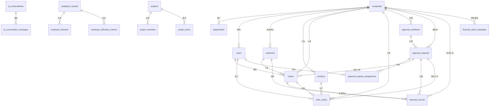

# Vibot 数据库

> 本文档同时定义数据模型与在 Supabase PostgreSQL 中强制执行的行级安全（Row-Level Security, RLS）策略，所有示例 SQL 均可直接纳入迁移脚本。

## 核心安全模型：行级安全 (RLS) 设计原则

1. **JWT 驱动租户隔离**：所有请求携带的 Supabase JWT 中包含 `company_id`（`auth.jwt() ->> 'company_id'`）。RLS 策略通过该字段将表数据限定在当前公司范围内，实现多租户隔离。
2. **角色键控制权限**：JWT 的 `app_metadata.role_keys`（数组）记录用户拥有的角色，如 `Vibot.project_manager`、`Vibot.finance_controller`。策略及辅助函数根据角色键授予读取/写入权限，遵循最小权限原则。
3. **默认拒绝**：启用 RLS 后未显式授权的操作默认拒绝。每张核心表均提供显式的 `SELECT/INSERT/UPDATE/DELETE` 策略，并在必要时使用 `SECURITY DEFINER` 函数封装复杂逻辑。
4. **安全即代码**：策略与函数应当和数据模型一同维护在迁移脚本中，变更流程必须通过代码审查，确保安全模型与业务逻辑同步演进。

## 设计目标
- 数据驱动：以真实付款单、运费申请、工序产量单反向建模核心业务表。
- 精简聚合：审批与财务域分别收敛到 3 张及 2 张主表，取消冗余细表。
- 业务贯通：新增 `customers`、`products`、`orders`、`work_orders` 串联采购、物流与制造。
- 审批耦合：所有订单与工单均可追溯到审批单，满足 PRD 与 API 的合规要求。

## 实体关系图


## 表结构说明

### 核心多租户与权限

#### companies (公司)
多租户单位的主数据及默认配置。

| field_name | data_type | constraints | comment |
| --- | --- | --- | --- |
| id | uuid | PRIMARY KEY DEFAULT gen_random_uuid() | 公司唯一标识 |
| code | varchar(32) | NOT NULL UNIQUE | 公司编码 |
| name | varchar(255) | NOT NULL | 公司名称 |
| status | varchar(20) | NOT NULL DEFAULT 'active' CHECK (status IN ('active','suspended','closed')) | 公司状态 |
| timezone | varchar(50) | NULL | 默认时区 |
| locale | varchar(10) | NOT NULL DEFAULT 'zh-CN' | 默认语言 |
| metadata | jsonb | NOT NULL DEFAULT '{}'::jsonb | 企业扩展配置 |
| created_at | timestamptz | NOT NULL DEFAULT CURRENT_TIMESTAMP | 创建时间 |
| updated_at | timestamptz | NOT NULL DEFAULT CURRENT_TIMESTAMP | 更新时间 |

**设计权衡**：把多租户参数集中在 metadata，避免频繁 DDL，但需要服务层做结构校验。

##### Row-Level Security (RLS) Policies

```sql
-- 强制启用 RLS（默认拒绝所有访问）
ALTER TABLE public.companies ENABLE ROW LEVEL SECURITY;

-- 仅允许平台管理员（拥有 Vibot.admin 角色）读取公司列表
CREATE POLICY "Tenant admins can view companies"
    ON public.companies
    FOR SELECT
    USING (
      has_role('Vibot.admin')
    );

-- 限制写操作为平台管理员（公司信息仅由平台侧维护）
CREATE POLICY "Tenant admins manage companies"
    ON public.companies
    FOR UPDATE
    USING (
      has_role('Vibot.admin')
    )
    WITH CHECK (
      has_role('Vibot.admin')
    );

CREATE POLICY "Tenant admins insert companies"
    ON public.companies
    FOR INSERT
    WITH CHECK (
      has_role('Vibot.admin')
    );

CREATE POLICY "Tenant admins delete companies"
    ON public.companies
    FOR DELETE
    USING (
      has_role('Vibot.admin')
    );
```

#### departments (部门)
公司内部组织结构，支持树型层级。

| field_name | data_type | constraints | comment |
| --- | --- | --- | --- |
| id | uuid | PRIMARY KEY DEFAULT gen_random_uuid() | 部门唯一标识 |
| company_id | uuid | NOT NULL REFERENCES companies(id) ON DELETE CASCADE | 所属公司 |
| parent_id | uuid | NULL REFERENCES departments(id) | 上级部门 |
| path | ltree | NOT NULL | 层级路径 |
| name | varchar(150) | NOT NULL | 部门名称 |
| leader_id | uuid | NULL REFERENCES users(id) | 负责人 |
| metadata | jsonb | NOT NULL DEFAULT '{}'::jsonb | 自定义标签 |
| created_at | timestamptz | NOT NULL DEFAULT CURRENT_TIMESTAMP | 创建时间 |
| updated_at | timestamptz | NOT NULL DEFAULT CURRENT_TIMESTAMP | 更新时间 |

**设计权衡**：使用 ltree 存储层级路径，查询灵活但依赖 PostgreSQL 扩展。

##### Row-Level Security (RLS) Policies

```sql
ALTER TABLE public.departments ENABLE ROW LEVEL SECURITY;

-- 任何登录用户仅能查看所属公司的部门数据
CREATE POLICY "Departments readable within company"
    ON public.departments
    FOR SELECT
    USING (
      company_id = current_company_id()
    );

-- 仅管理员或 HR 经理可维护部门记录
CREATE POLICY "Department records managed by admins"
    ON public.departments
    FOR UPDATE
    USING (
      company_id = current_company_id()
      AND (has_role('Vibot.admin') OR has_role('Vibot.hr_manager'))
    )
    WITH CHECK (
      company_id = current_company_id()
      AND (has_role('Vibot.admin') OR has_role('Vibot.hr_manager'))
    );

CREATE POLICY "Department records created by admins"
    ON public.departments
    FOR INSERT
    WITH CHECK (
      company_id = current_company_id()
      AND (has_role('Vibot.admin') OR has_role('Vibot.hr_manager'))
    );

CREATE POLICY "Department records deleted by admins"
    ON public.departments
    FOR DELETE
    USING (
      company_id = current_company_id()
      AND (has_role('Vibot.admin') OR has_role('Vibot.hr_manager'))
    );
```

#### permissions (权限)
平台支持的操作权限清单。

| field_name | data_type | constraints | comment |
| --- | --- | --- | --- |
| id | uuid | PRIMARY KEY DEFAULT gen_random_uuid() | 权限唯一标识 |
| code | varchar(100) | NOT NULL UNIQUE | 权限编码 |
| description | text | NOT NULL | 权限说明 |
| category | varchar(50) | NOT NULL | 权限分类 |
| is_system | boolean | NOT NULL DEFAULT true | 是否系统内置 |
| created_at | timestamptz | NOT NULL DEFAULT CURRENT_TIMESTAMP | 创建时间 |
| updated_at | timestamptz | NOT NULL DEFAULT CURRENT_TIMESTAMP | 更新时间 |

**设计权衡**：权限保持全局表，避免多租户重复定义，但自定义权限需另行扩展。

##### Row-Level Security (RLS) Policies

```sql
ALTER TABLE public.permissions ENABLE ROW LEVEL SECURITY;

CREATE POLICY "Permissions readable by platform admins"
    ON public.permissions
    FOR SELECT
    USING (
      has_role('Vibot.admin')
    );

CREATE POLICY "Permissions managed by platform admins"
    ON public.permissions
    FOR ALL
    USING (
      has_role('Vibot.admin')
    )
    WITH CHECK (
      has_role('Vibot.admin')
    );
```

##### Role_permissions (角色权限关联)
角色与权限的绑定关系。

| field_name | data_type | constraints | comment |
| --- | --- | --- | --- |
| role_id | uuid | NOT NULL REFERENCES roles(id) ON DELETE CASCADE | 角色 |
| permission_id | uuid | NOT NULL REFERENCES permissions(id) ON DELETE CASCADE | 权限 |
| company_id | uuid | NOT NULL REFERENCES companies(id) ON DELETE CASCADE | 所属公司 |
| granted_at | timestamptz | NOT NULL DEFAULT CURRENT_TIMESTAMP | 授权时间 |
| granted_by | uuid | NULL REFERENCES users(id) | 授权人 |

**设计权衡**：维持传统多对多表结构，查询直接但删除角色或权限需谨慎使用级联。

##### Row-Level Security (RLS) Policies

```sql
ALTER TABLE public.role_permissions ENABLE ROW LEVEL SECURITY;

CREATE POLICY "Role permissions readable within company"
    ON public.role_permissions
    FOR SELECT
    USING (
      company_id = current_company_id()
      AND (
        has_role('Vibot.admin')
        OR has_role('Vibot.hr_manager')
      )
    );

CREATE POLICY "Role permissions managed by admins"
    ON public.role_permissions
    FOR ALL
    USING (
      company_id = current_company_id()
      AND has_role('Vibot.admin')
    )
    WITH CHECK (
      company_id = current_company_id()
      AND has_role('Vibot.admin')
    );
```

##### Roles (角色)
公司内可分配的角色定义。

| field_name | data_type | constraints | comment |
| --- | --- | --- | --- |
| id | uuid | PRIMARY KEY DEFAULT gen_random_uuid() | 角色唯一标识 |
| company_id | uuid | NOT NULL REFERENCES companies(id) ON DELETE CASCADE | 所属公司 |
| code | varchar(50) | NOT NULL | 角色编码 |
| name | varchar(100) | NOT NULL | 角色名称 |
| description | text | NULL | 角色说明 |
| scope | varchar(30) | NOT NULL DEFAULT 'global' | 作用域 |
| created_at | timestamptz | NOT NULL DEFAULT CURRENT_TIMESTAMP | 创建时间 |
| updated_at | timestamptz | NOT NULL DEFAULT CURRENT_TIMESTAMP | 更新时间 |

**设计权衡**：保留 scope 字段满足项目级授权，但需业务约束防止过度碎片化。

##### Row-Level Security (RLS) Policies

```sql
ALTER TABLE public.roles ENABLE ROW LEVEL SECURITY;

CREATE POLICY "Roles readable within company"
    ON public.roles
    FOR SELECT
    USING (
      company_id = current_company_id()
    );

CREATE POLICY "Roles manageable by admins"
    ON public.roles
    FOR ALL
    USING (
      company_id = current_company_id()
      AND has_role('Vibot.admin')
    )
    WITH CHECK (
      company_id = current_company_id()
      AND has_role('Vibot.admin')
    );
```

#### user_roles (用户角色关联)
用户在公司范围及资源范围内获得的角色。

| field_name | data_type | constraints | comment |
| --- | --- | --- | --- |
| id | uuid | PRIMARY KEY DEFAULT gen_random_uuid() | 记录标识 |
| user_id | uuid | NOT NULL REFERENCES users(id) ON DELETE CASCADE | 用户 |
| role_id | uuid | NOT NULL REFERENCES roles(id) ON DELETE CASCADE | 角色 |
| company_id | uuid | NOT NULL REFERENCES companies(id) ON DELETE CASCADE | 所属公司 |
| scope_resource_type | varchar(50) | NULL | 作用域资源类型 |
| scope_resource_id | uuid | NULL | 作用域资源ID |
| assigned_at | timestamptz | NOT NULL DEFAULT CURRENT_TIMESTAMP | 分配时间 |
| assigned_by | uuid | NULL REFERENCES users(id) | 分配人 |

**设计权衡**：复合主键消除重复授权，但 scope 字段的可空性增加 SQL 复杂度。

##### Row-Level Security (RLS) Policies

```sql
ALTER TABLE public.user_roles ENABLE ROW LEVEL SECURITY;

CREATE POLICY "User roles readable within company"
    ON public.user_roles
    FOR SELECT
    USING (
      company_id = current_company_id()
      AND (
        has_role('Vibot.admin')
        OR has_role('Vibot.hr_manager')
        OR user_id = auth.uid()
      )
    );

CREATE POLICY "User roles managed by admins"
    ON public.user_roles
    FOR ALL
    USING (
      company_id = current_company_id()
      AND has_role('Vibot.admin')
    )
    WITH CHECK (
      company_id = current_company_id()
      AND has_role('Vibot.admin')
    );
```

#### users (用户)
平台用户及其登录、偏好信息。

| field_name | data_type | constraints | comment |
| --- | --- | --- | --- |
| id | uuid | PRIMARY KEY DEFAULT gen_random_uuid() | 用户唯一标识 |
| auth_user_id | uuid | NOT NULL UNIQUE REFERENCES auth.users(id) ON DELETE CASCADE | Supabase Auth 用户 ID |
| company_id | uuid | NOT NULL REFERENCES companies(id) ON DELETE CASCADE | 所属公司 |
| department_id | uuid | NULL REFERENCES departments(id) | 所属部门 |
| email | varchar(255) | NOT NULL UNIQUE | 登录邮箱 |
| display_name | varchar(150) | NOT NULL | 显示名称 |
| phone | varchar(30) | NULL | 手机号 |
| password_hash | varchar(255) | NOT NULL | 密码哈希 |
| status | varchar(20) | NOT NULL DEFAULT 'active' CHECK (status IN ('active','inactive','locked')) | 用户状态 |
| auth_provider | varchar(50) | NOT NULL DEFAULT 'password' | 认证来源 |
| locale | varchar(10) | NOT NULL DEFAULT 'zh-CN' | 语言偏好 |
| timezone | varchar(50) | NULL | 时区 |
| last_login_at | timestamptz | NULL | 最近登录时间 |
| profile | jsonb | NOT NULL DEFAULT '{}'::jsonb | 扩展档案 |
| settings | jsonb | NOT NULL DEFAULT '{}'::jsonb | 个性化设置 |
| created_at | timestamptz | NOT NULL DEFAULT CURRENT_TIMESTAMP | 创建时间 |
| updated_at | timestamptz | NOT NULL DEFAULT CURRENT_TIMESTAMP | 更新时间 |

**设计权衡**：扩展属性集中到 profile/settings，减少列扩散，但 JSON 索引维护成本更高；通过 `auth_user_id` 与 Supabase Auth 解耦，便于 SSO 与多因子策略统一管理。

##### Row-Level Security (RLS) Policies

```sql
ALTER TABLE public.users ENABLE ROW LEVEL SECURITY;

CREATE POLICY "Users readable within company"
    ON public.users
    FOR SELECT
    USING (
      company_id = current_company_id()
      AND (
        has_role('Vibot.admin')
        OR has_role('Vibot.hr_manager')
        OR id = auth.uid()
      )
    );

CREATE POLICY "Users insertable by admins"
    ON public.users
    FOR INSERT
    WITH CHECK (
      company_id = current_company_id()
      AND has_role('Vibot.admin')
    );

CREATE POLICY "Users updatable by admins"
    ON public.users
    FOR UPDATE
    USING (
      company_id = current_company_id()
      AND (
        has_role('Vibot.admin')
        OR id = auth.uid()
      )
    )
    WITH CHECK (
      company_id = current_company_id()
      AND (
        has_role('Vibot.admin')
        OR id = auth.uid()
      )
    );

CREATE POLICY "Users deletable by admins"
    ON public.users
    FOR DELETE
    USING (
      company_id = current_company_id()
      AND has_role('Vibot.admin')
    );
```

#### user_profiles (用户扩展档案)
与 `auth.users` 关联的扩展信息，存储头像、签名、偏好与安全设置。

| field_name | data_type | constraints | comment |
| --- | --- | --- | --- |
| id | uuid | PRIMARY KEY DEFAULT gen_random_uuid() | 记录唯一标识 |
| user_id | uuid | NOT NULL UNIQUE REFERENCES users(id) ON DELETE CASCADE | 对应用户 |
| company_id | uuid | NOT NULL REFERENCES companies(id) ON DELETE CASCADE | 所属公司 |
| title | varchar(150) | NULL | 职务/头衔 |
| avatar_url | text | NULL | 头像地址 |
| timezone | varchar(50) | NULL | 时区偏好 |
| locale | varchar(10) | NULL | 语言偏好 |
| contact | jsonb | NOT NULL DEFAULT '{}'::jsonb | 联系方式（IM、电话） |
| preferences | jsonb | NOT NULL DEFAULT '{}'::jsonb | 通知与快捷设置 |
| security_metadata | jsonb | NOT NULL DEFAULT '{}'::jsonb | 安全标记（MFA、设备） |
| updated_at | timestamptz | NOT NULL DEFAULT CURRENT_TIMESTAMP | 更新时间 |

**设计权衡**：独立表承载个性化与安全字段，避免 `users` 过于膨胀，同时可按公司隔离并与审计联动。

##### Row-Level Security (RLS) Policies

```sql
ALTER TABLE public.user_profiles ENABLE ROW LEVEL SECURITY;

CREATE POLICY "Profiles readable by owner"
    ON public.user_profiles
    FOR SELECT
    USING (
      company_id = current_company_id()
      AND (
        user_id = auth.uid()
        OR has_role('Vibot.admin')
        OR has_role('Vibot.hr_manager')
      )
    );

CREATE POLICY "Profiles updatable by owner"
    ON public.user_profiles
    FOR UPDATE
    USING (
      company_id = current_company_id()
      AND (
        user_id = auth.uid()
        OR has_role('Vibot.admin')
        OR has_role('Vibot.hr_manager')
      )
    )
    WITH CHECK (
      company_id = current_company_id()
      AND (
        user_id = auth.uid()
        OR has_role('Vibot.admin')
        OR has_role('Vibot.hr_manager')
      )
    );
```


### 通用资产

#### attachments (附件)
二进制资源及其元数据的统一注册表。

| field_name | data_type | constraints | comment |
| --- | --- | --- | --- |
| id | uuid | PRIMARY KEY DEFAULT gen_random_uuid() | 附件唯一标识 |
| company_id | uuid | NOT NULL REFERENCES companies(id) ON DELETE CASCADE | 所属公司 |
| file_name | varchar(255) | NOT NULL | 文件名 |
| content_type | varchar(120) | NOT NULL | 内容类型 |
| size_bytes | bigint | NOT NULL | 文件大小 |
| storage_path | varchar(500) | NOT NULL | 存储路径或对象存储键 |
| checksum | varchar(128) | NOT NULL | 完整性校验 |
| category | varchar(50) | NOT NULL DEFAULT 'general' | 附件类别 |
| owner_id | uuid | NULL REFERENCES users(id) | 上传人 |
| metadata | jsonb | NOT NULL DEFAULT '{}'::jsonb | 扩展信息 |
| uploaded_at | timestamptz | NOT NULL DEFAULT CURRENT_TIMESTAMP | 上传时间 |

**设计权衡**：附件均以引用方式关联，降低交叉外键，但需应用层控制一致性。

##### Row-Level Security (RLS) Policies

```sql
ALTER TABLE public.attachments ENABLE ROW LEVEL SECURITY;

CREATE POLICY "Attachments readable within company"
    ON public.attachments
    FOR SELECT
    USING (
      company_id = current_company_id()
    );

CREATE POLICY "Attachments managed by owners"
    ON public.attachments
    FOR ALL
    USING (
      company_id = current_company_id()
      AND (
        has_role('Vibot.admin')
        OR owner_id = auth.uid()
      )
    )
    WITH CHECK (
      company_id = current_company_id()
      AND (
        has_role('Vibot.admin')
        OR owner_id = auth.uid()
      )
    );
```


### 业务基础域

#### customers (客户/供应商)
来源于付款单与运费申请的核心往来单位。

| field_name | data_type | constraints | comment |
| --- | --- | --- | --- |
| id | uuid | PRIMARY KEY DEFAULT gen_random_uuid() | 往来单位唯一标识 |
| company_id | uuid | NOT NULL REFERENCES companies(id) ON DELETE CASCADE | 所属公司 |
| customer_code | varchar(50) | NULL | 外部或第三方编码 |
| name | varchar(255) | NOT NULL | 名称 |
| customer_type | varchar(20) | NOT NULL CHECK (customer_type IN ('supplier','customer','logistics','employee','other')) | 类型 |
| tax_id | varchar(50) | NULL | 纳税识别号 |
| contact_name | varchar(100) | NULL | 联系人 |
| contact_phone | varchar(30) | NULL | 联系电话 |
| bank_account_name | varchar(255) | NULL | 收款账户名 |
| bank_name | varchar(255) | NULL | 开户行 |
| bank_account | varchar(100) | NULL | 银行账号 |
| address | varchar(255) | NULL | 地址 |
| payment_terms | varchar(100) | NULL | 付款条件 |
| metadata | jsonb | NOT NULL DEFAULT '{}'::jsonb | 与 ERP 同步的额外字段 |
| created_by | uuid | NULL REFERENCES users(id) | 创建人 |
| updated_by | uuid | NULL REFERENCES users(id) | 更新人 |
| created_at | timestamptz | NOT NULL DEFAULT CURRENT_TIMESTAMP | 创建时间 |
| updated_at | timestamptz | NOT NULL DEFAULT CURRENT_TIMESTAMP | 更新时间 |

**设计权衡**：把物流公司、供应商统一建模，减少表数量，但需通过 customer_type 区分业务流程。

##### Row-Level Security (RLS) Policies

```sql
ALTER TABLE public.customers ENABLE ROW LEVEL SECURITY;

-- 同公司用户可读取往来单位资料
CREATE POLICY "Customers readable within company"
    ON public.customers
    FOR SELECT
    USING (
      company_id = current_company_id()
      AND (has_role('Vibot.employee') OR has_role('Vibot.project_manager') OR has_role('Vibot.finance_controller') OR has_role('Vibot.admin'))
    );

-- 仅项目经理或财务可新增往来单位
CREATE POLICY "Customers creatable by managers or finance"
    ON public.customers
    FOR INSERT
    WITH CHECK (
      company_id = current_company_id()
      AND (has_role('Vibot.project_manager') OR has_role('Vibot.finance_controller') OR has_role('Vibot.admin'))
    );

-- 仅项目经理或财务可修改往来单位
CREATE POLICY "Customers updatable by managers or finance"
    ON public.customers
    FOR UPDATE
    USING (
      company_id = current_company_id()
      AND (has_role('Vibot.project_manager') OR has_role('Vibot.finance_controller') OR has_role('Vibot.admin'))
    )
    WITH CHECK (
      company_id = current_company_id()
      AND (has_role('Vibot.project_manager') OR has_role('Vibot.finance_controller') OR has_role('Vibot.admin'))
    );

-- 禁止普通用户删除往来单位，仅平台或公司管理员可执行
CREATE POLICY "Customers deletable by admins"
    ON public.customers
    FOR DELETE
    USING (
      company_id = current_company_id()
      AND has_role('Vibot.admin')
    );
```

#### orders (订单)
来自付款单和运费申请的最小可行订单模型，串联审批与财务。

| field_name | data_type | constraints | comment |
| --- | --- | --- | --- |
| id | uuid | PRIMARY KEY DEFAULT gen_random_uuid() | 订单唯一标识 |
| company_id | uuid | NOT NULL REFERENCES companies(id) ON DELETE CASCADE | 所属公司 |
| order_code | varchar(50) | NOT NULL | 业务单号/审批编号 |
| order_type | varchar(30) | NOT NULL CHECK (order_type IN ('freight_payment','ap_payment','ar_refund','other')) | 订单类型 |
| order_status | varchar(20) | NOT NULL DEFAULT 'draft' | 业务状态 |
| approval_status | varchar(20) | NOT NULL DEFAULT 'pending' | 审批结果 |
| approval_request_id | uuid | NULL REFERENCES approval_requests(id) ON DELETE SET NULL | 关联审批 |
| customer_id | uuid | NULL REFERENCES customers(id) ON DELETE SET NULL | 往来单位 |
| amount_total | numeric(18,2) | NOT NULL | 订单金额 |
| amount_total_uppercase | text | NULL | 金额大写 |
| tax_amount | numeric(18,2) | NULL | 税额 |
| currency | char(3) | NOT NULL DEFAULT 'CNY' | 币种 |
| payment_method | varchar(30) | NOT NULL DEFAULT 'transfer' | 付款方式 |
| payment_date | date | NULL | 计划或实际付款日 |
| payee_bank_name | varchar(255) | NULL | 收款开户行 |
| payee_bank_account | varchar(100) | NULL | 收款账号 |
| payee_account_name | varchar(255) | NULL | 收款账号户名 |
| invoice_status | varchar(30) | NOT NULL DEFAULT 'pending' | 开票状态 |
| has_invoice | boolean | NOT NULL DEFAULT false | 是否已有发票 |
| summary | text | NULL | 付款事由/摘要 |
| line_items | jsonb | NOT NULL DEFAULT '[]'::jsonb | 订单明细（来自审批表单） |
| source_payload | jsonb | NOT NULL DEFAULT '{}'::jsonb | 原始审批记录快照 |
| attachments | jsonb | NOT NULL DEFAULT '[]'::jsonb | 附件列表 |
| created_by | uuid | NULL REFERENCES users(id) | 创建人 |
| updated_by | uuid | NULL REFERENCES users(id) | 更新人 |
| created_at | timestamptz | NOT NULL DEFAULT CURRENT_TIMESTAMP | 创建时间 |
| updated_at | timestamptz | NOT NULL DEFAULT CURRENT_TIMESTAMP | 更新时间 |

**设计权衡**：将审批单直接建模为订单，显著缩短上线周期，但订单行结构需通过 JSON 承载，统计时需借助物化视图。

##### Row-Level Security (RLS) Policies

```sql
ALTER TABLE public.orders ENABLE ROW LEVEL SECURITY;

-- 订单读取：同公司且满足角色或为创建者
CREATE POLICY "Orders readable within company"
    ON public.orders
    FOR SELECT
    USING (
      company_id = current_company_id()
      AND (
        has_role('Vibot.project_manager')
        OR has_role('Vibot.finance_controller')
        OR has_role('Vibot.admin')
        OR created_by = auth.uid()
      )
    );

-- 订单创建：项目经理或财务可提交
CREATE POLICY "Orders creatable by project or finance"
    ON public.orders
    FOR INSERT
    WITH CHECK (
      company_id = current_company_id()
      AND (
        has_role('Vibot.project_manager')
        OR has_role('Vibot.finance_controller')
        OR has_role('Vibot.admin')
      )
    );

-- 订单更新：仅项目经理、财务或审批流程回写（通过函数内授权）
CREATE POLICY "Orders updatable by project or finance"
    ON public.orders
    FOR UPDATE
    USING (
      company_id = current_company_id()
      AND (
        has_role('Vibot.project_manager')
        OR has_role('Vibot.finance_controller')
        OR has_role('Vibot.admin')
      )
    )
    WITH CHECK (
      company_id = current_company_id()
      AND (
        has_role('Vibot.project_manager')
        OR has_role('Vibot.finance_controller')
        OR has_role('Vibot.admin')
      )
    );

-- 订单删除：严格限制为管理员（正常流程倾向软删除）
CREATE POLICY "Orders deletable by admin"
    ON public.orders
    FOR DELETE
    USING (
      company_id = current_company_id()
      AND has_role('Vibot.admin')
    );
```

#### products (产品)
基于工序产量单抽象出的可生产或交付的产品定义。

| field_name | data_type | constraints | comment |
| --- | --- | --- | --- |
| id | uuid | PRIMARY KEY DEFAULT gen_random_uuid() | 产品唯一标识 |
| company_id | uuid | NOT NULL REFERENCES companies(id) ON DELETE CASCADE | 所属公司 |
| product_code | varchar(100) | NOT NULL | 产品编码或物料号 |
| name | varchar(255) | NOT NULL | 产品名称 |
| specification | varchar(255) | NULL | 规格/型号 |
| product_type | varchar(50) | NOT NULL DEFAULT 'component' | 分类 |
| unit | varchar(20) | NOT NULL DEFAULT '件' | 计量单位 |
| default_process_flow | jsonb | NOT NULL DEFAULT '{}'::jsonb | 默认工序流程 |
| metadata | jsonb | NOT NULL DEFAULT '{}'::jsonb | 扩展信息 |
| is_active | boolean | NOT NULL DEFAULT true | 是否启用 |
| created_by | uuid | NULL REFERENCES users(id) | 创建人 |
| updated_by | uuid | NULL REFERENCES users(id) | 更新人 |
| created_at | timestamptz | NOT NULL DEFAULT CURRENT_TIMESTAMP | 创建时间 |
| updated_at | timestamptz | NOT NULL DEFAULT CURRENT_TIMESTAMP | 更新时间 |

**设计权衡**：产品规格差异大，通过 JSON 保存流程，避免为每种工艺建立子表，但标准化校验需在应用层完成。

##### Row-Level Security (RLS) Policies

```sql
ALTER TABLE public.products ENABLE ROW LEVEL SECURITY;

CREATE POLICY "Products readable within company"
    ON public.products
    FOR SELECT
    USING (
      company_id = current_company_id()
    );

CREATE POLICY "Products creatable by project managers"
    ON public.products
    FOR INSERT
    WITH CHECK (
      company_id = current_company_id()
      AND (has_role('Vibot.project_manager') OR has_role('Vibot.admin'))
    );

CREATE POLICY "Products updatable by project managers"
    ON public.products
    FOR UPDATE
    USING (
      company_id = current_company_id()
      AND (has_role('Vibot.project_manager') OR has_role('Vibot.admin'))
    )
    WITH CHECK (
      company_id = current_company_id()
      AND (has_role('Vibot.project_manager') OR has_role('Vibot.admin'))
    );

CREATE POLICY "Products deletable by admin"
    ON public.products
    FOR DELETE
    USING (
      company_id = current_company_id()
      AND has_role('Vibot.admin')
    );
```

#### work_orders (工序工单)
对工序产量送检单的简化建模，聚焦产品、批号与工序产出。

| field_name | data_type | constraints | comment |
| --- | --- | --- | --- |
| id | uuid | PRIMARY KEY DEFAULT gen_random_uuid() | 工单唯一标识 |
| company_id | uuid | NOT NULL REFERENCES companies(id) ON DELETE CASCADE | 所属公司 |
| work_order_code | varchar(50) | NOT NULL | 审批编号/工单号 |
| approval_request_id | uuid | NULL REFERENCES approval_requests(id) ON DELETE SET NULL | 关联审批 |
| related_order_id | uuid | NULL REFERENCES orders(id) ON DELETE SET NULL | 关联订单 |
| product_id | uuid | NULL REFERENCES products(id) ON DELETE SET NULL | 关联产品 |
| product_name_snapshot | varchar(255) | NOT NULL | 当时的产品名称 |
| specification_snapshot | varchar(255) | NULL | 当时的规格 |
| batch_no | varchar(100) | NULL | 生产批号 |
| process_name | varchar(100) | NOT NULL | 加工工序 |
| next_process | varchar(100) | NULL | 下一道工序 |
| status | varchar(20) | NOT NULL DEFAULT 'in_progress' | 审批状态 |
| approval_status | varchar(20) | NOT NULL DEFAULT 'pending' | 审批结果 |
| metrics | jsonb | NOT NULL DEFAULT '{}'::jsonb | 产量及良品率指标 |
| duration_hours | numeric(10,2) | NULL | 本工序耗时（小时） |
| duration_details | jsonb | NOT NULL DEFAULT '[]'::jsonb | 耗时拆分 |
| operator_name | varchar(100) | NULL | 经办人 |
| work_date | date | NULL | 作业日期 |
| attachments | jsonb | NOT NULL DEFAULT '[]'::jsonb | 附件列表 |
| remarks | text | NULL | 备注 |
| metadata | jsonb | NOT NULL DEFAULT '{}'::jsonb | 扩展信息 |
| created_by | uuid | NULL REFERENCES users(id) | 创建人 |
| updated_by | uuid | NULL REFERENCES users(id) | 更新人 |
| created_at | timestamptz | NOT NULL DEFAULT CURRENT_TIMESTAMP | 创建时间 |
| updated_at | timestamptz | NOT NULL DEFAULT CURRENT_TIMESTAMP | 更新时间 |

**设计权衡**：将多列拆分值揉成 JSON，显著减少子表，但后续要配合指标解析或物化视图做报表。

##### Row-Level Security (RLS) Policies

```sql
ALTER TABLE public.work_orders ENABLE ROW LEVEL SECURITY;

CREATE POLICY "Work orders readable to project teams"
    ON public.work_orders
    FOR SELECT
    USING (
      company_id = current_company_id()
      AND (
        has_role('Vibot.manufacturing_lead')
        OR has_role('Vibot.project_manager')
        OR created_by = auth.uid()
      )
    );

CREATE POLICY "Work orders creatable by manufacturing"
    ON public.work_orders
    FOR INSERT
    WITH CHECK (
      company_id = current_company_id()
      AND (
        has_role('Vibot.manufacturing_lead')
        OR has_role('Vibot.project_manager')
      )
    );

CREATE POLICY "Work orders updatable by manufacturing"
    ON public.work_orders
    FOR UPDATE
    USING (
      company_id = current_company_id()
      AND (
        has_role('Vibot.manufacturing_lead')
        OR has_role('Vibot.project_manager')
      )
    )
    WITH CHECK (
      company_id = current_company_id()
      AND (
        has_role('Vibot.manufacturing_lead')
        OR has_role('Vibot.project_manager')
      )
    );

CREATE POLICY "Work orders deletable by admin"
    ON public.work_orders
    FOR DELETE
    USING (
      company_id = current_company_id()
      AND has_role('Vibot.admin')
    );
```


### 动态表单与流程扩展

#### form_templates (表单模板)
多租户下可复用的动态表单定义，驱动请假/报销/采购/出差等业务。

| field_name | data_type | constraints | comment |
| --- | --- | --- | --- |
| id | uuid | PRIMARY KEY DEFAULT gen_random_uuid() | 模板唯一标识 |
| company_id | uuid | NOT NULL REFERENCES companies(id) ON DELETE CASCADE | 所属公司 |
| code | varchar(80) | NOT NULL | 模板编码（租户内唯一） |
| name | varchar(150) | NOT NULL | 模板名称 |
| category | varchar(50) | NOT NULL CHECK (category IN ('leave','expense','procurement','travel','custom')) | 模板分类 |
| latest_revision | integer | NOT NULL DEFAULT 1 | 当前生效版本 |
| schema_def | jsonb | NOT NULL DEFAULT '{}'::jsonb | JSON Schema 字段描述 |
| ui_schema | jsonb | NOT NULL DEFAULT '{}'::jsonb | 前端渲染配置 |
| validation_rules | jsonb | NOT NULL DEFAULT '[]'::jsonb | 自定义校验规则 |
| metadata | jsonb | NOT NULL DEFAULT '{}'::jsonb | 扩展配置 |
| created_by | uuid | NULL REFERENCES users(id) | 创建人 |
| updated_by | uuid | NULL REFERENCES users(id) | 更新人 |
| created_at | timestamptz | NOT NULL DEFAULT NOW() | 创建时间 |
| updated_at | timestamptz | NOT NULL DEFAULT NOW() | 更新时间 |

**设计权衡**：通过 JSON Schema/UISchema 统一描述字段与界面，避免为各业务表单重复建表；版本迭代依赖 revision 表存档。

```sql
ALTER TABLE public.form_templates ENABLE ROW LEVEL SECURITY;

CREATE POLICY "Form templates readable in tenant"
    ON public.form_templates
    FOR SELECT
    USING (
      company_id = current_company_id()
      AND (
        has_role('Vibot.admin')
        OR has_role('Vibot.approval_designer')
        OR has_role('Vibot.hr_manager')
        OR has_role('Vibot.finance_controller')
      )
    );

CREATE POLICY "Form templates manageable by designer"
    ON public.form_templates
    FOR ALL
    USING (
      company_id = current_company_id()
      AND (
        has_role('Vibot.admin')
        OR has_role('Vibot.approval_designer')
      )
    )
    WITH CHECK (
      company_id = current_company_id()
      AND (
        has_role('Vibot.admin')
        OR has_role('Vibot.approval_designer')
      )
    );
```

#### approval_templates (审批模板)
关联表单、流程与默认通知策略的组合模板。

| field_name | data_type | constraints | comment |
| --- | --- | --- | --- |
| id | uuid | PRIMARY KEY DEFAULT gen_random_uuid() | 模板唯一标识 |
| company_id | uuid | NOT NULL REFERENCES companies(id) ON DELETE CASCADE | 所属公司 |
| template_code | varchar(50) | NOT NULL | 模板编码 |
| name | varchar(255) | NOT NULL | 模板名称 |
| description | text | NULL | 说明 |
| form_template_id | uuid | NULL REFERENCES form_templates(id) | 默认表单 |
| workflow_id | uuid | NULL REFERENCES approval_workflows(id) | 默认流程 |
| default_payload | jsonb | NOT NULL DEFAULT '{}'::jsonb | 预填表单/字段 |
| default_assignments | jsonb | NOT NULL DEFAULT '[]'::jsonb | 默认抄送/审批人 |
| notification_settings | jsonb | NOT NULL DEFAULT '[]'::jsonb | 通知通道配置 |
| is_active | boolean | NOT NULL DEFAULT true | 是否启用 |
| created_by | uuid | NOT NULL REFERENCES users(id) | 创建人 |
| updated_by | uuid | NULL REFERENCES users(id) | 更新人 |
| created_at | timestamptz | NOT NULL DEFAULT NOW() | 创建时间 |
| updated_at | timestamptz | NOT NULL DEFAULT NOW() | 更新时间 |

**设计权衡**：审批模板聚合常用表单 + 流程 + 通知方案，便于多租户快速启用标准审批路径。

##### Row-Level Security (RLS) Policies

```sql
ALTER TABLE public.approval_templates ENABLE ROW LEVEL SECURITY;

CREATE POLICY "Approval templates readable"
    ON public.approval_templates
    FOR SELECT
    USING (
      company_id = current_company_id()
    );

CREATE POLICY "Approval templates managed by designer"
    ON public.approval_templates
    FOR ALL
    USING (
      company_id = current_company_id()
      AND (
        has_role('Vibot.admin')
        OR has_role('Vibot.approval_designer')
      )
    )
    WITH CHECK (
      company_id = current_company_id()
      AND (
        has_role('Vibot.admin')
        OR has_role('Vibot.approval_designer')
      )
    );
```

#### form_template_revisions (表单模板版本)
保存每次发布的模板快照，支撑历史审批回溯。

| field_name | data_type | constraints | comment |
| --- | --- | --- | --- |
| id | uuid | PRIMARY KEY DEFAULT gen_random_uuid() | 版本唯一标识 |
| company_id | uuid | NOT NULL REFERENCES companies(id) ON DELETE CASCADE | 所属公司 |
| template_id | uuid | NOT NULL REFERENCES form_templates(id) ON DELETE CASCADE | 模板 |
| revision | integer | NOT NULL | 版本号 |
| schema_def | jsonb | NOT NULL | 字段定义快照 |
| ui_schema | jsonb | NOT NULL | 渲染配置快照 |
| validation_rules | jsonb | NOT NULL | 校验规则快照 |
| changelog | text | NULL | 变更说明 |
| published_by | uuid | NULL REFERENCES users(id) | 发布者 |
| published_at | timestamptz | NOT NULL DEFAULT NOW() | 发布时间 |

```sql
ALTER TABLE public.form_template_revisions ENABLE ROW LEVEL SECURITY;

CREATE POLICY "Template revisions readable in tenant"
    ON public.form_template_revisions
    FOR SELECT
    USING (company_id = current_company_id());

CREATE POLICY "Template revisions insertable by designer"
    ON public.form_template_revisions
    FOR INSERT
    WITH CHECK (
      company_id = current_company_id()
      AND (
        has_role('Vibot.admin')
        OR has_role('Vibot.approval_designer')
      )
    );
```

#### form_instances (表单实例)
审批单、草稿与回写的统一载体，绑定审批请求。

| field_name | data_type | constraints | comment |
| --- | --- | --- | --- |
| id | uuid | PRIMARY KEY DEFAULT gen_random_uuid() | 实例唯一标识 |
| company_id | uuid | NOT NULL REFERENCES companies(id) ON DELETE CASCADE | 所属公司 |
| template_id | uuid | NOT NULL REFERENCES form_templates(id) | 模板 |
| template_revision | integer | NOT NULL | 模板版本 |
| request_id | uuid | NULL REFERENCES approval_requests(id) ON DELETE SET NULL | 关联审批 |
| draft_owner_id | uuid | NULL REFERENCES users(id) | 草稿所有人 |
| status | varchar(20) | NOT NULL DEFAULT 'draft' CHECK (status IN ('draft','submitted','synced')) | 表单状态 |
| form_payload | jsonb | NOT NULL DEFAULT '{}'::jsonb | 表单内容 |
| attachments | jsonb | NOT NULL DEFAULT '[]'::jsonb | 附件列表 |
| computed_summary | jsonb | NOT NULL DEFAULT '{}'::jsonb | 数据摘要 |
| created_at | timestamptz | NOT NULL DEFAULT NOW() | 创建时间 |
| updated_at | timestamptz | NOT NULL DEFAULT NOW() | 更新时间 |

```sql
ALTER TABLE public.form_instances ENABLE ROW LEVEL SECURITY;

CREATE POLICY "Form instances readable to participants"
    ON public.form_instances
    FOR SELECT
    USING (
      company_id = current_company_id()
      AND (
        has_role('Vibot.admin')
        OR draft_owner_id = auth.uid()
        OR EXISTS (
          SELECT 1 FROM public.approval_requests ar
          WHERE ar.id = form_instances.request_id
            AND ar.company_id = current_company_id()
            AND (
              ar.requester_id = auth.uid()
              OR EXISTS (
                SELECT 1
                FROM public.approval_request_assignments ara
                WHERE ara.request_id = ar.id
                  AND ara.assignee_id = auth.uid()
              )
            )
        )
      )
    );

CREATE POLICY "Form instances creatable by employees"
    ON public.form_instances
    FOR INSERT
    WITH CHECK (
      company_id = current_company_id()
      AND (
        has_role('Vibot.employee')
        OR has_role('Vibot.admin')
        OR has_role('Vibot.project_manager')
        OR has_role('Vibot.hr_manager')
        OR has_role('Vibot.finance_controller')
      )
    );

CREATE POLICY "Form instances updatable by owner or engine"
    ON public.form_instances
    FOR UPDATE
    USING (
      company_id = current_company_id()
      AND (
        draft_owner_id = auth.uid()
        OR has_role('Vibot.admin')
        OR has_role('Vibot.approver')
      )
    )
    WITH CHECK (
      company_id = current_company_id()
      AND (
        draft_owner_id = auth.uid()
        OR has_role('Vibot.admin')
        OR has_role('Vibot.approver')
      )
    );
```

#### approval_workflow_revisions (审批流程版本)
记录流程拓扑、节点表单映射与 SLA 配置。

| field_name | data_type | constraints | comment |
| --- | --- | --- | --- |
| id | uuid | PRIMARY KEY DEFAULT gen_random_uuid() | 版本唯一标识 |
| company_id | uuid | NOT NULL REFERENCES companies(id) ON DELETE CASCADE | 所属公司 |
| workflow_id | uuid | NOT NULL REFERENCES approval_workflows(id) ON DELETE CASCADE | 流程定义 |
| revision | integer | NOT NULL | 版本号 |
| definition | jsonb | NOT NULL | 节点/连线配置 |
| form_template_map | jsonb | NOT NULL | 节点对应表单片段 |
| sla_rules | jsonb | NOT NULL DEFAULT '[]'::jsonb | 超期规则 |
| auto_actions | jsonb | NOT NULL DEFAULT '[]'::jsonb | 条件自动化 |
| published_by | uuid | NULL REFERENCES users(id) | 发布者 |
| published_at | timestamptz | NOT NULL DEFAULT NOW() | 发布时间 |

```sql
ALTER TABLE public.approval_workflow_revisions ENABLE ROW LEVEL SECURITY;

CREATE POLICY "Workflow revisions readable in tenant"
    ON public.approval_workflow_revisions
    FOR SELECT
    USING (company_id = current_company_id());

CREATE POLICY "Workflow revisions manageable"
    ON public.approval_workflow_revisions
    FOR ALL
    USING (
      company_id = current_company_id()
      AND (
        has_role('Vibot.admin')
        OR has_role('Vibot.approval_designer')
      )
    )
    WITH CHECK (
      company_id = current_company_id()
      AND (
        has_role('Vibot.admin')
        OR has_role('Vibot.approval_designer')
      )
    );
```

#### approval_workflow_rules (审批流程规则)
流程层面的动态分配、条件跳转、自动化配置。

| field_name | data_type | constraints | comment |
| --- | --- | --- | --- |
| id | uuid | PRIMARY KEY DEFAULT gen_random_uuid() | 规则唯一标识 |
| company_id | uuid | NOT NULL REFERENCES companies(id) ON DELETE CASCADE | 所属公司 |
| workflow_id | uuid | NOT NULL REFERENCES approval_workflows(id) ON DELETE CASCADE | 所属流程 |
| workflow_revision | integer | NOT NULL | 匹配流程版本 |
| rule_name | varchar(120) | NOT NULL | 规则名称 |
| rule_type | varchar(40) | NOT NULL CHECK (rule_type IN ('stage_assignment','auto_decision','escalation')) | 规则类型 |
| condition | jsonb | NOT NULL DEFAULT '{}'::jsonb | 条件表达式（rule engine） |
| target_stage | varchar(100) | NOT NULL | 目标节点/阶段 |
| escalation_config | jsonb | NOT NULL DEFAULT '{}'::jsonb | 升级/通知配置 |
| order_index | integer | NOT NULL DEFAULT 0 | 执行顺序 |
| is_active | boolean | NOT NULL DEFAULT true | 是否启用 |
| created_by | uuid | NOT NULL REFERENCES users(id) | 创建人 |
| created_at | timestamptz | NOT NULL DEFAULT CURRENT_TIMESTAMP | 创建时间 |

**设计权衡**：独立规则表使审批流程具备可插拔逻辑，避免硬编码审核人或条件，支持多版本共存。

##### Row-Level Security (RLS) Policies

```sql
ALTER TABLE public.approval_workflow_rules ENABLE ROW LEVEL SECURITY;

CREATE POLICY "Workflow rules readable"
    ON public.approval_workflow_rules
    FOR SELECT
    USING (
      company_id = current_company_id()
      AND (
        has_role('Vibot.admin')
        OR has_role('Vibot.approval_designer')
      )
    );

CREATE POLICY "Workflow rules manageable"
    ON public.approval_workflow_rules
    FOR ALL
    USING (
      company_id = current_company_id()
      AND (
        has_role('Vibot.admin')
        OR has_role('Vibot.approval_designer')
      )
    )
    WITH CHECK (
      company_id = current_company_id()
      AND (
        has_role('Vibot.admin')
        OR has_role('Vibot.approval_designer')
      )
    );
```

#### approval_approvers (审批人配置)
定义每个节点/阶段的候选审批人、最小票数与动态变量。

| field_name | data_type | constraints | comment |
| --- | --- | --- | --- |
| id | uuid | PRIMARY KEY DEFAULT gen_random_uuid() | 记录标识 |
| company_id | uuid | NOT NULL REFERENCES companies(id) ON DELETE CASCADE | 所属公司 |
| workflow_id | uuid | NOT NULL REFERENCES approval_workflows(id) ON DELETE CASCADE | 流程 |
| workflow_revision | integer | NOT NULL | 版本 |
| stage_key | varchar(100) | NOT NULL | 节点标识 |
| approver_type | varchar(30) | NOT NULL CHECK (approver_type IN ('role','user','dynamic')) | 审批人类型 |
| approver_value | uuid | NULL | 当类型为 user/role 时存放 ID |
| expression | text | NULL | 动态脚本（如根据表单字段提取） |
| min_approvals | integer | NOT NULL DEFAULT 1 | 最小票数 |
| metadata | jsonb | NOT NULL DEFAULT '{}'::jsonb | 扩展配置 |
| created_by | uuid | NOT NULL REFERENCES users(id) | 创建人 |
| created_at | timestamptz | NOT NULL DEFAULT CURRENT_TIMESTAMP | 创建时间 |

**设计权衡**：节点审批配置与流程版本绑定，可根据 approver_type 灵活引用角色、具体用户或动态表达式。

##### Row-Level Security (RLS) Policies

```sql
ALTER TABLE public.approval_approvers ENABLE ROW LEVEL SECURITY;

CREATE POLICY "Approver config readable"
    ON public.approval_approvers
    FOR SELECT
    USING (
      company_id = current_company_id()
    );

CREATE POLICY "Approver config manageable"
    ON public.approval_approvers
    FOR ALL
    USING (
      company_id = current_company_id()
      AND (
        has_role('Vibot.admin')
        OR has_role('Vibot.approval_designer')
      )
    )
    WITH CHECK (
      company_id = current_company_id()
      AND (
        has_role('Vibot.admin')
        OR has_role('Vibot.approval_designer')
      )
    );
```

#### approval_sla_rules (审批 SLA 配置)
配置节点超时、提醒与升级策略，保障流程可观测。

| field_name | data_type | constraints | comment |
| --- | --- | --- | --- |
| id | uuid | PRIMARY KEY DEFAULT gen_random_uuid() | 规则标识 |
| company_id | uuid | NOT NULL REFERENCES companies(id) ON DELETE CASCADE | 所属公司 |
| workflow_id | uuid | NOT NULL REFERENCES approval_workflows(id) ON DELETE CASCADE | 流程 |
| stage_key | varchar(100) | NOT NULL | 阶段 |
| duration_minutes | integer | NOT NULL | 超时时长（分钟） |
| reminder_offsets | integer[] | NULL | 提醒偏移（分钟） |
| escalation_type | varchar(20) | NOT NULL DEFAULT 'notify' | 升级方式 |
| escalation_target | uuid | NULL | 升级对象（用户/角色） |
| metadata | jsonb | NOT NULL DEFAULT '{}'::jsonb | 额外策略 |
| created_by | uuid | NOT NULL REFERENCES users(id) | 创建人 |
| created_at | timestamptz | NOT NULL DEFAULT CURRENT_TIMESTAMP | 创建时间 |

**设计权衡**：SLA 作为独立可配置实体，支持自定义提醒偏移与升级策略，便于对接通知与审计。

##### Row-Level Security (RLS) Policies

```sql
ALTER TABLE public.approval_sla_rules ENABLE ROW LEVEL SECURITY;

CREATE POLICY "SLA rules readable"
    ON public.approval_sla_rules
    FOR SELECT
    USING (
      company_id = current_company_id()
    );

CREATE POLICY "SLA rules manageable"
    ON public.approval_sla_rules
    FOR ALL
    USING (
      company_id = current_company_id()
      AND (
        has_role('Vibot.admin')
        OR has_role('Vibot.approval_designer')
      )
    )
    WITH CHECK (
      company_id = current_company_id()
      AND (
        has_role('Vibot.admin')
        OR has_role('Vibot.approval_designer')
      )
    );
```

#### approval_actions (审批动作)
记录每次审批操作的审计数据。

| field_name | data_type | constraints | comment |
| --- | --- | --- | --- |
| id | uuid | PRIMARY KEY DEFAULT gen_random_uuid() | 动作唯一标识 |
| company_id | uuid | NOT NULL REFERENCES companies(id) ON DELETE CASCADE | 所属公司 |
| request_id | uuid | NOT NULL REFERENCES approval_requests(id) ON DELETE CASCADE | 审批请求 |
| assignment_id | uuid | NULL REFERENCES approval_request_assignments(id) ON DELETE SET NULL | 原待办 |
| actor_id | uuid | NOT NULL REFERENCES users(id) | 操作人 |
| action_type | varchar(20) | NOT NULL CHECK (action_type IN ('approve','reject','transfer','add_sign','comment','recall')) | 动作类型 |
| action_payload | jsonb | NOT NULL DEFAULT '{}'::jsonb | 附加信息 |
| previous_state | jsonb | NOT NULL DEFAULT '{}'::jsonb | 操作前快照 |
| next_state | jsonb | NOT NULL DEFAULT '{}'::jsonb | 操作后快照 |
| ip_address | inet | NULL | IP |
| user_agent | text | NULL | 客户端信息 |
| created_at | timestamptz | NOT NULL DEFAULT NOW() | 创建时间 |

```sql
ALTER TABLE public.approval_actions ENABLE ROW LEVEL SECURITY;

CREATE POLICY "Approval actions readable to participants"
    ON public.approval_actions
    FOR SELECT
    USING (
      company_id = current_company_id()
      AND (
        has_role('Vibot.admin')
        OR EXISTS (
          SELECT 1 FROM public.approval_requests ar
          WHERE ar.id = approval_actions.request_id
            AND ar.company_id = current_company_id()
            AND (
              ar.requester_id = auth.uid()
              OR EXISTS (
                SELECT 1
                FROM public.approval_request_assignments ara
                WHERE ara.request_id = ar.id
                  AND ara.assignee_id = auth.uid()
              )
            )
        )
      )
    );

CREATE POLICY "Approval actions inserted by engine"
    ON public.approval_actions
    FOR INSERT
    WITH CHECK (
      company_id = current_company_id()
      AND (
        has_role('Vibot.admin')
        OR has_role('Vibot.approver')
        OR has_role('Vibot.notification_admin')
      )
    );
```

#### approval_delegations (审批委派)
跟踪转交与加签链路。

| field_name | data_type | constraints | comment |
| --- | --- | --- | --- |
| id | uuid | PRIMARY KEY DEFAULT gen_random_uuid() | 委派唯一标识 |
| company_id | uuid | NOT NULL REFERENCES companies(id) ON DELETE CASCADE | 所属公司 |
| request_id | uuid | NOT NULL REFERENCES approval_requests(id) | 审批请求 |
| from_assignment_id | uuid | NOT NULL REFERENCES approval_request_assignments(id) | 原待办 |
| to_user_id | uuid | NOT NULL REFERENCES users(id) | 目标审批人 |
| delegation_type | varchar(20) | NOT NULL CHECK (delegation_type IN ('transfer','add_sign')) | 委派类型 |
| effective_at | timestamptz | NOT NULL DEFAULT NOW() | 生效时间 |
| expires_at | timestamptz | NULL | 失效时间 |
| reason | text | NULL | 原因 |
| metadata | jsonb | NOT NULL DEFAULT '{}'::jsonb | 扩展信息 |
| created_by | uuid | NULL REFERENCES users(id) | 创建人 |

```sql
ALTER TABLE public.approval_delegations ENABLE ROW LEVEL SECURITY;

CREATE POLICY "Delegations readable to participants"
    ON public.approval_delegations
    FOR SELECT
    USING (
      company_id = current_company_id()
      AND (
        has_role('Vibot.admin')
        OR has_role('Vibot.approver')
        OR EXISTS (
          SELECT 1 FROM public.approval_requests ar
          WHERE ar.id = approval_delegations.request_id
            AND ar.company_id = current_company_id()
            AND (
              ar.requester_id = auth.uid()
              OR EXISTS (
                SELECT 1
                FROM public.approval_request_assignments ara
                WHERE ara.request_id = ar.id
                  AND ara.assignee_id = auth.uid()
              )
            )
        )
      )
    );

CREATE POLICY "Delegations managed by approver"
    ON public.approval_delegations
    FOR ALL
    USING (
      company_id = current_company_id()
      AND (
        has_role('Vibot.admin')
        OR has_role('Vibot.approver')
      )
    )
    WITH CHECK (
      company_id = current_company_id()
      AND (
        has_role('Vibot.admin')
        OR has_role('Vibot.approver')
      )
    );
```

#### approval_escalations (审批升级队列)
为超期提醒、自动升级提供追踪。

| field_name | data_type | constraints | comment |
| --- | --- | --- | --- |
| id | uuid | PRIMARY KEY DEFAULT gen_random_uuid() | 升级唯一标识 |
| company_id | uuid | NOT NULL REFERENCES companies(id) ON DELETE CASCADE | 所属公司 |
| assignment_id | uuid | NOT NULL REFERENCES approval_request_assignments(id) ON DELETE CASCADE | 关联待办 |
| escalation_state | varchar(20) | NOT NULL CHECK (escalation_state IN ('queued','sent','acknowledged','auto_delegated')) | 状态 |
| last_sent_at | timestamptz | NULL | 最近发送时间 |
| target_user_id | uuid | NULL REFERENCES users(id) | 升级对象 |
| channel_payload | jsonb | NOT NULL DEFAULT '{}'::jsonb | 渠道配置 |
| retry_count | integer | NOT NULL DEFAULT 0 | 重试次数 |
| metadata | jsonb | NOT NULL DEFAULT '{}'::jsonb | 扩展信息 |
| created_at | timestamptz | NOT NULL DEFAULT NOW() | 创建时间 |
| updated_at | timestamptz | NOT NULL DEFAULT NOW() | 更新时间 |

```sql
ALTER TABLE public.approval_escalations ENABLE ROW LEVEL SECURITY;

CREATE POLICY "Escalations manageable by notifier"
    ON public.approval_escalations
    FOR ALL
    USING (
      company_id = current_company_id()
      AND (
        has_role('Vibot.admin')
        OR has_role('Vibot.notification_admin')
      )
    )
    WITH CHECK (
      company_id = current_company_id()
      AND (
        has_role('Vibot.admin')
        OR has_role('Vibot.notification_admin')
      )
    );
```

#### notification_channels (用户通知渠道)
持久化钉钉、邮件、App 推送配置。

| field_name | data_type | constraints | comment |
| --- | --- | --- | --- |
| id | uuid | PRIMARY KEY DEFAULT gen_random_uuid() | 渠道唯一标识 |
| company_id | uuid | NOT NULL REFERENCES companies(id) ON DELETE CASCADE | 所属公司 |
| user_id | uuid | NOT NULL REFERENCES users(id) ON DELETE CASCADE | 用户 |
| channel_type | varchar(20) | NOT NULL CHECK (channel_type IN ('dingtalk','email','app','webhook')) | 通道类型 |
| is_enabled | boolean | NOT NULL DEFAULT true | 是否启用 |
| config | jsonb | NOT NULL DEFAULT '{}'::jsonb | 配置内容 |
| last_verified_at | timestamptz | NULL | 校验时间 |
| created_at | timestamptz | NOT NULL DEFAULT NOW() | 创建时间 |
| updated_at | timestamptz | NOT NULL DEFAULT NOW() | 更新时间 |

```sql
ALTER TABLE public.notification_channels ENABLE ROW LEVEL SECURITY;

CREATE POLICY "Notification channels readable to owner"
    ON public.notification_channels
    FOR SELECT
    USING (
      company_id = current_company_id()
      AND (
        user_id = auth.uid()
        OR has_role('Vibot.admin')
        OR has_role('Vibot.notification_admin')
      )
    );

CREATE POLICY "Notification channels upsertable"
    ON public.notification_channels
    FOR ALL
    USING (
      company_id = current_company_id()
      AND (
        user_id = auth.uid()
        OR has_role('Vibot.admin')
        OR has_role('Vibot.notification_admin')
      )
    )
    WITH CHECK (
      company_id = current_company_id()
      AND (
        user_id = auth.uid()
        OR has_role('Vibot.admin')
        OR has_role('Vibot.notification_admin')
      )
    );
```

#### notifications (通知记录)
记录审批、SLA、系统提醒的发送与阅读状态。

| field_name | data_type | constraints | comment |
| --- | --- | --- | --- |
| id | uuid | PRIMARY KEY DEFAULT gen_random_uuid() | 通知唯一标识 |
| company_id | uuid | NOT NULL REFERENCES companies(id) ON DELETE CASCADE | 所属公司 |
| recipient_id | uuid | NOT NULL REFERENCES users(id) ON DELETE CASCADE | 接收人 |
| channel | varchar(20) | NOT NULL CHECK (channel IN ('inbox','email','dingtalk','sms','webhook')) | 渠道 |
| category | varchar(30) | NOT NULL | 分类（approval、sla 等） |
| payload | jsonb | NOT NULL DEFAULT '{}'::jsonb | 内容载荷 |
| related_request_id | uuid | NULL REFERENCES approval_requests(id) ON DELETE SET NULL | 关联审批 |
| delivery_status | varchar(20) | NOT NULL DEFAULT 'pending' | 投递状态 |
| error_message | text | NULL | 失败原因 |
| sent_at | timestamptz | NULL | 发送时间 |
| read_at | timestamptz | NULL | 阅读时间 |
| created_at | timestamptz | NOT NULL DEFAULT NOW() | 创建时间 |

**设计权衡**：通知记录作为审计友好的事件表，与渠道配置表解耦，便于重试和多渠道投递。

##### Row-Level Security (RLS) Policies

```sql
ALTER TABLE public.notifications ENABLE ROW LEVEL SECURITY;

CREATE POLICY "Notifications readable by recipient"
    ON public.notifications
    FOR SELECT
    USING (
      company_id = current_company_id()
      AND (
        recipient_id = auth.uid()
        OR has_role('Vibot.admin')
        OR has_role('Vibot.notification_admin')
      )
    );

CREATE POLICY "Notifications insertable by engines"
    ON public.notifications
    FOR INSERT
    WITH CHECK (
      company_id = current_company_id()
      AND (
        has_role('Vibot.admin')
        OR has_role('Vibot.notification_admin')
        OR has_role('Vibot.approval_engine')
      )
    );
```

### 审批辅助函数

- `public.assert_assignment_actor(p_assignment_id uuid)`：校验当前用户是否对待办拥有操作权。
- `public.apply_approval_action(p_request_id uuid, p_assignment_id uuid, p_action text, p_payload jsonb)`：封装审批动作并调用 Edge Function 工作流引擎。
- `public.enqueue_escalation(p_assignment_id uuid, p_target uuid, p_channel jsonb)`：记录审批升级队列。
- `public.form_instance_from_template(p_template_id uuid, p_draft_owner uuid)`：根据模板快速初始化草稿。
- `public.project_workflow_revision(p_workflow_id uuid, p_revision integer)`：读取指定流程版本。

所有函数默认 `SECURITY INVOKER` 与 `SET search_path = ''`，仅当需要服务账号运行时改为 `SECURITY DEFINER` 并在迁移脚本说明原因。

### 项目执行域

#### project_items (项目事项)
统一承载任务、里程碑、交付物及周报节点。

| field_name | data_type | constraints | comment |
| --- | --- | --- | --- |
| id | uuid | PRIMARY KEY DEFAULT gen_random_uuid() | 事项唯一标识 |
| project_id | uuid | NOT NULL REFERENCES projects(id) ON DELETE CASCADE | 关联项目 |
| company_id | uuid | NOT NULL REFERENCES companies(id) ON DELETE CASCADE | 所属公司 |
| parent_item_id | uuid | NULL REFERENCES project_items(id) ON DELETE SET NULL | 父事项 |
| item_type | varchar(30) | NOT NULL CHECK (item_type IN ('task','milestone','deliverable','update')) | 事项类型 |
| title | varchar(255) | NOT NULL | 标题 |
| description | text | NULL | 说明 |
| status | varchar(30) | NOT NULL DEFAULT 'open' | 状态 |
| priority | varchar(20) | NOT NULL DEFAULT 'normal' | 优先级 |
| assignee_id | uuid | NULL REFERENCES users(id) | 负责人 |
| dependency_ids | uuid[] | NULL | 依赖事项 |
| planned_start | date | NULL | 计划开始 |
| planned_end | date | NULL | 计划结束 |
| actual_start | date | NULL | 实际开始 |
| actual_end | date | NULL | 实际结束 |
| progress_metrics | jsonb | NOT NULL DEFAULT '{}'::jsonb | 进度指标 |
| timeline | jsonb | NOT NULL DEFAULT '[]'::jsonb | 活动时间线 |
| linked_resources | jsonb | NOT NULL DEFAULT '{}'::jsonb | 关联资源 |
| tags | text[] | NULL | 标签 |
| created_by | uuid | NOT NULL REFERENCES users(id) | 创建人 |
| updated_by | uuid | NULL REFERENCES users(id) | 更新人 |
| created_at | timestamptz | NOT NULL DEFAULT CURRENT_TIMESTAMP | 创建时间 |
| updated_at | timestamptz | NOT NULL DEFAULT CURRENT_TIMESTAMP | 更新时间 |

**设计权衡**：单表承载多种事项，结构简洁，但类型特有字段需通过 JSON 处理。

##### Row-Level Security (RLS) Policies

```sql
ALTER TABLE public.project_items ENABLE ROW LEVEL SECURITY;

CREATE POLICY "Project items readable by project team"
    ON public.project_items
    FOR SELECT
    USING (
      company_id = current_company_id()
      AND (
        has_role('Vibot.project_manager')
        OR has_role('Vibot.admin')
        OR is_project_member(project_id, auth.uid())
        OR assignee_id = auth.uid()
        OR created_by = auth.uid()
      )
    );

CREATE POLICY "Project items creatable by team"
    ON public.project_items
    FOR INSERT
    WITH CHECK (
      company_id = current_company_id()
      AND (
        has_role('Vibot.project_manager')
        OR has_role('Vibot.admin')
        OR is_project_member(project_id, auth.uid())
      )
    );

CREATE POLICY "Project items updatable by owner or manager"
    ON public.project_items
    FOR UPDATE
    USING (
      company_id = current_company_id()
      AND (
        has_role('Vibot.project_manager')
        OR has_role('Vibot.admin')
        OR is_project_member(project_id, auth.uid())
        OR created_by = auth.uid()
      )
    )
    WITH CHECK (
      company_id = current_company_id()
      AND (
        has_role('Vibot.project_manager')
        OR has_role('Vibot.admin')
        OR is_project_member(project_id, auth.uid())
        OR created_by = auth.uid()
      )
    );

CREATE POLICY "Project items deletable by managers"
    ON public.project_items
    FOR DELETE
    USING (
      company_id = current_company_id()
      AND (
        has_role('Vibot.project_manager')
        OR has_role('Vibot.admin')
      )
    );
```

#### project_members (项目成员)
关联项目与成员的角色、投入信息。

| field_name | data_type | constraints | comment |
| --- | --- | --- | --- |
| id | uuid | PRIMARY KEY DEFAULT gen_random_uuid() | 记录标识 |
| project_id | uuid | NOT NULL REFERENCES projects(id) ON DELETE CASCADE | 项目 |
| company_id | uuid | NOT NULL REFERENCES companies(id) ON DELETE CASCADE | 所属公司 |
| user_id | uuid | NOT NULL REFERENCES users(id) ON DELETE CASCADE | 成员 |
| role | varchar(50) | NOT NULL | 项目角色 |
| allocation_pct | numeric(5,2) | NULL | 投入占比 |
| joined_at | date | NULL | 加入日期 |
| left_at | date | NULL | 离开日期 |
| permissions | jsonb | NOT NULL DEFAULT '{}'::jsonb | 项目内特定权限 |
| created_at | timestamptz | NOT NULL DEFAULT CURRENT_TIMESTAMP | 创建时间 |
| updated_at | timestamptz | NOT NULL DEFAULT CURRENT_TIMESTAMP | 更新时间 |

**设计权衡**：成员权限用 JSON，避免额外中间表，但授权校验需在服务层实现。

##### Row-Level Security (RLS) Policies

```sql
ALTER TABLE public.project_members ENABLE ROW LEVEL SECURITY;

CREATE POLICY "Project membership readable by project team"
    ON public.project_members
    FOR SELECT
    USING (
      company_id = current_company_id()
      AND (
        has_role('Vibot.project_manager')
        OR has_role('Vibot.admin')
        OR user_id = auth.uid()
        OR is_project_member(project_id, auth.uid())
      )
    );

CREATE POLICY "Project membership managed by managers"
    ON public.project_members
    FOR INSERT
    WITH CHECK (
      company_id = current_company_id()
      AND (
        has_role('Vibot.project_manager')
        OR has_role('Vibot.admin')
      )
    );

CREATE POLICY "Project membership updated by managers"
    ON public.project_members
    FOR UPDATE
    USING (
      company_id = current_company_id()
      AND (
        has_role('Vibot.project_manager')
        OR has_role('Vibot.admin')
      )
    )
    WITH CHECK (
      company_id = current_company_id()
      AND (
        has_role('Vibot.project_manager')
        OR has_role('Vibot.admin')
      )
    );

CREATE POLICY "Project membership deleted by managers"
    ON public.project_members
    FOR DELETE
    USING (
      company_id = current_company_id()
      AND (
        has_role('Vibot.project_manager')
        OR has_role('Vibot.admin')
      )
    );
```

#### projects (项目)
项目主记录，承载预算与健康度概览。

| field_name | data_type | constraints | comment |
| --- | --- | --- | --- |
| id | uuid | PRIMARY KEY DEFAULT gen_random_uuid() | 项目唯一标识 |
| company_id | uuid | NOT NULL REFERENCES companies(id) ON DELETE CASCADE | 所属公司 |
| code | varchar(50) | NOT NULL | 项目编码 |
| name | varchar(255) | NOT NULL | 项目名称 |
| status | varchar(30) | NOT NULL DEFAULT 'active' | 项目状态 |
| project_type | varchar(30) | NOT NULL DEFAULT 'delivery' | 项目类型 |
| owner_id | uuid | NOT NULL REFERENCES users(id) | 负责人 |
| department_id | uuid | NULL REFERENCES departments(id) | 所属部门 |
| health_color | varchar(10) | NOT NULL DEFAULT 'green' | 健康度 |
| start_date | date | NULL | 开工日期 |
| end_date | date | NULL | 完工日期 |
| budget_amount | numeric(18,2) | NULL | 预算金额 |
| budget_currency | char(3) | NULL | 预算币种 |
| reporting_summary | jsonb | NOT NULL DEFAULT '{}'::jsonb | 进度与风险概览 |
| custom_fields | jsonb | NOT NULL DEFAULT '{}'::jsonb | 自定义字段 |
| created_at | timestamptz | NOT NULL DEFAULT CURRENT_TIMESTAMP | 创建时间 |
| updated_at | timestamptz | NOT NULL DEFAULT CURRENT_TIMESTAMP | 更新时间 |

**设计权衡**：项目指标聚合到 JSON，减少派生表，但复杂报表需依赖物化视图缓存。

##### Row-Level Security (RLS) Policies

```sql
ALTER TABLE public.projects ENABLE ROW LEVEL SECURITY;

-- 项目读取：公司内的项目成员、负责人、项目经理角色均可访问
CREATE POLICY "Projects readable by members"
    ON public.projects
    FOR SELECT
    USING (
      company_id = current_company_id()
      AND (
        has_role('Vibot.project_manager')
        OR has_role('Vibot.admin')
        OR owner_id = auth.uid()
        OR is_project_member(id, auth.uid())
      )
    );

-- 项目创建：仅项目经理或管理员
CREATE POLICY "Projects creatable by managers"
    ON public.projects
    FOR INSERT
    WITH CHECK (
      company_id = current_company_id()
      AND (
        has_role('Vibot.project_manager')
        OR has_role('Vibot.admin')
      )
    );

-- 项目更新：项目负责人、项目经理或管理员
CREATE POLICY "Projects updatable by owner or manager"
    ON public.projects
    FOR UPDATE
    USING (
      company_id = current_company_id()
      AND (
        has_role('Vibot.project_manager')
        OR has_role('Vibot.admin')
        OR owner_id = auth.uid()
      )
    )
    WITH CHECK (
      company_id = current_company_id()
      AND (
        has_role('Vibot.project_manager')
        OR has_role('Vibot.admin')
        OR owner_id = auth.uid()
      )
    );

CREATE POLICY "Projects deletable by admin"
    ON public.projects
    FOR DELETE
    USING (
      company_id = current_company_id()
      AND has_role('Vibot.admin')
    );
```


### 人力与效率域

#### employee_efficiency_metrics (员工效率指标)
整合原评分与报表，存储各期效率量化数据。

| field_name | data_type | constraints | comment |
| --- | --- | --- | --- |
| id | uuid | PRIMARY KEY DEFAULT gen_random_uuid() | 记录唯一标识 |
| company_id | uuid | NOT NULL REFERENCES companies(id) ON DELETE CASCADE | 所属公司 |
| employee_id | uuid | NOT NULL REFERENCES employee_records(id) ON DELETE CASCADE | 员工 |
| conversation_id | uuid | NULL REFERENCES ai_conversations(id) | AI 评估来源 |
| metric_period_start | date | NOT NULL | 统计期开始 |
| metric_period_end | date | NOT NULL | 统计期结束 |
| metric_type | varchar(30) | NOT NULL | 指标类型 |
| score | numeric(5,2) | NULL | 评分 |
| metrics | jsonb | NOT NULL DEFAULT '{}'::jsonb | 详细指标 |
| comments | jsonb | NOT NULL DEFAULT '[]'::jsonb | 评语 |
| created_by | uuid | NULL REFERENCES users(id) | 创建人 |
| created_at | timestamptz | NOT NULL DEFAULT CURRENT_TIMESTAMP | 创建时间 |

**设计权衡**：评分和报告统一存储，生成逻辑更简单，但历史版本区分需依靠统计期与类型组合。

##### Row-Level Security (RLS) Policies

```sql
ALTER TABLE public.employee_efficiency_metrics ENABLE ROW LEVEL SECURITY;

CREATE POLICY "Efficiency metrics readable within company"
    ON public.employee_efficiency_metrics
    FOR SELECT
    USING (
      company_id = current_company_id()
      AND (
        has_role('Vibot.admin')
        OR has_role('Vibot.hr_manager')
        OR employee_id IN (
          SELECT er.id FROM public.employee_records er
          WHERE er.user_id = auth.uid()
        )
      )
    );

CREATE POLICY "Efficiency metrics managed by HR"
    ON public.employee_efficiency_metrics
    FOR ALL
    USING (
      company_id = current_company_id()
      AND (has_role('Vibot.admin') OR has_role('Vibot.hr_manager'))
    )
    WITH CHECK (
      company_id = current_company_id()
      AND (has_role('Vibot.admin') OR has_role('Vibot.hr_manager'))
    );
```

#### employee_histories (员工变更记录)
员工关键事件的历史轨迹。

| field_name | data_type | constraints | comment |
| --- | --- | --- | --- |
| id | uuid | PRIMARY KEY DEFAULT gen_random_uuid() | 记录唯一标识 |
| company_id | uuid | NOT NULL REFERENCES companies(id) ON DELETE CASCADE | 所属公司 |
| employee_id | uuid | NOT NULL REFERENCES employee_records(id) ON DELETE CASCADE | 员工档案 |
| change_type | varchar(50) | NOT NULL | 变更类型 |
| effective_at | timestamptz | NOT NULL | 生效时间 |
| change_summary | text | NULL | 摘要 |
| payload | jsonb | NOT NULL DEFAULT '{}'::jsonb | 变更详情 |
| approval_request_id | uuid | NULL REFERENCES approval_requests(id) | 关联审批 |
| created_by | uuid | NOT NULL REFERENCES users(id) | 记录人 |
| created_at | timestamptz | NOT NULL DEFAULT CURRENT_TIMESTAMP | 创建时间 |

**设计权衡**：payload 承接多类型历史，减少专用表，但针对特定字段的统计需要 JSON 索引优化。

##### Row-Level Security (RLS) Policies

```sql
ALTER TABLE public.employee_histories ENABLE ROW LEVEL SECURITY;

CREATE POLICY "Employee histories readable within company"
    ON public.employee_histories
    FOR SELECT
    USING (
      company_id = current_company_id()
      AND (
        has_role('Vibot.admin')
        OR has_role('Vibot.hr_manager')
        OR employee_id IN (
          SELECT er.id FROM public.employee_records er
          WHERE er.user_id = auth.uid()
        )
      )
    );

CREATE POLICY "Employee histories managed by HR"
    ON public.employee_histories
    FOR ALL
    USING (
      company_id = current_company_id()
      AND (has_role('Vibot.admin') OR has_role('Vibot.hr_manager'))
    )
    WITH CHECK (
      company_id = current_company_id()
      AND (has_role('Vibot.admin') OR has_role('Vibot.hr_manager'))
    );
```

#### employee_records (员工档案)
员工主数据与雇佣信息。

| field_name | data_type | constraints | comment |
| --- | --- | --- | --- |
| id | uuid | PRIMARY KEY DEFAULT gen_random_uuid() | 档案唯一标识 |
| company_id | uuid | NOT NULL REFERENCES companies(id) ON DELETE CASCADE | 所属公司 |
| user_id | uuid | NOT NULL REFERENCES users(id) ON DELETE CASCADE | 关联用户 |
| employee_code | varchar(50) | NOT NULL | 员工编号 |
| employment_type | varchar(30) | NOT NULL | 用工类型 |
| position_title | varchar(150) | NOT NULL | 职位 |
| manager_id | uuid | NULL REFERENCES employee_records(id) | 直属上级 |
| hire_date | date | NULL | 入职日期 |
| termination_date | date | NULL | 离职日期 |
| salary_currency | char(3) | NULL | 薪资币种 |
| salary_amount | numeric(12,2) | NULL | 薪资金额 |
| org_path | ltree | NULL | 组织路径 |
| profile | jsonb | NOT NULL DEFAULT '{}'::jsonb | 扩展信息 |
| status | varchar(20) | NOT NULL DEFAULT 'active' | 在职状态 |
| created_at | timestamptz | NOT NULL DEFAULT CURRENT_TIMESTAMP | 创建时间 |
| updated_at | timestamptz | NOT NULL DEFAULT CURRENT_TIMESTAMP | 更新时间 |

**设计权衡**：去除技能相关表后把能力标签并入 profile，结构简单但缺乏关系约束。

##### Row-Level Security (RLS) Policies

```sql
ALTER TABLE public.employee_records ENABLE ROW LEVEL SECURITY;

CREATE POLICY "Employee records readable within company"
    ON public.employee_records
    FOR SELECT
    USING (
      company_id = current_company_id()
      AND (
        has_role('Vibot.admin')
        OR has_role('Vibot.hr_manager')
        OR user_id = auth.uid()
        OR manager_id IN (
          SELECT id FROM public.employee_records er
          WHERE er.user_id = auth.uid()
        )
      )
    );

CREATE POLICY "Employee records managed by HR"
    ON public.employee_records
    FOR ALL
    USING (
      company_id = current_company_id()
      AND (has_role('Vibot.admin') OR has_role('Vibot.hr_manager'))
    )
    WITH CHECK (
      company_id = current_company_id()
      AND (has_role('Vibot.admin') OR has_role('Vibot.hr_manager'))
    );
```


### AI 协作域

#### ai_conversation_messages (AI 会话消息)
AI 会话中的具体消息与模型响应。

| field_name | data_type | constraints | comment |
| --- | --- | --- | --- |
| id | uuid | PRIMARY KEY DEFAULT gen_random_uuid() | 消息唯一标识 |
| conversation_id | uuid | NOT NULL REFERENCES ai_conversations(id) ON DELETE CASCADE | 所属会话 |
| company_id | uuid | NOT NULL REFERENCES companies(id) ON DELETE CASCADE | 所属公司 |
| sequence | bigint | NOT NULL | 顺序号 |
| sender_type | varchar(20) | NOT NULL | 发送方类型 |
| sender_id | uuid | NULL | 发送方标识 |
| role | varchar(20) | NOT NULL | 消息角色 |
| content | text | NOT NULL | 消息内容 |
| token_usage | jsonb | NOT NULL DEFAULT '{}'::jsonb | Token 消耗 |
| metadata | jsonb | NOT NULL DEFAULT '{}'::jsonb | 模型及参数 |
| created_at | timestamptz | NOT NULL DEFAULT CURRENT_TIMESTAMP | 创建时间 |

**设计权衡**：保留全文内容便于回放，但需结合存储策略定期归档历史会话。

##### Row-Level Security (RLS) Policies

```sql
ALTER TABLE public.ai_conversation_messages ENABLE ROW LEVEL SECURITY;

CREATE POLICY "Conversation messages readable to participants"
    ON public.ai_conversation_messages
    FOR SELECT
    USING (
      company_id = current_company_id()
      AND EXISTS (
        SELECT 1
        FROM public.ai_conversations ac
        WHERE ac.id = ai_conversation_messages.conversation_id
          AND ac.company_id = current_company_id()
          AND (
            ac.owner_id = auth.uid()
            OR has_role('Vibot.admin')
          )
      )
    );

CREATE POLICY "Conversation messages inserted by participants"
    ON public.ai_conversation_messages
    FOR INSERT
    WITH CHECK (
      company_id = current_company_id()
      AND EXISTS (
        SELECT 1
        FROM public.ai_conversations ac
        WHERE ac.id = ai_conversation_messages.conversation_id
          AND ac.company_id = current_company_id()
          AND (
            ac.owner_id = auth.uid()
            OR has_role('Vibot.admin')
          )
      )
    );
```

#### ai_conversations (AI 会话)
AI 协作会话主记录，涵盖上下文与关联资源。

| field_name | data_type | constraints | comment |
| --- | --- | --- | --- |
| id | uuid | PRIMARY KEY DEFAULT gen_random_uuid() | 会话唯一标识 |
| company_id | uuid | NOT NULL REFERENCES companies(id) ON DELETE CASCADE | 所属公司 |
| owner_id | uuid | NOT NULL REFERENCES users(id) | 发起人 |
| topic | varchar(255) | NOT NULL | 主题 |
| conversation_type | varchar(30) | NOT NULL DEFAULT 'assistant' | 会话类型 |
| status | varchar(20) | NOT NULL DEFAULT 'active' | 会话状态 |
| context | jsonb | NOT NULL DEFAULT '{}'::jsonb | 上下文存档 |
| linked_resources | jsonb | NOT NULL DEFAULT '{}'::jsonb | 外部关联 |
| created_at | timestamptz | NOT NULL DEFAULT CURRENT_TIMESTAMP | 创建时间 |
| updated_at | timestamptz | NOT NULL DEFAULT CURRENT_TIMESTAMP | 更新时间 |
| last_message_at | timestamptz | NULL | 最近消息时间 |

**设计权衡**：统一管理上下文，利于追溯但需控制 JSON 字段大小以降低存储成本。

##### Row-Level Security (RLS) Policies

```sql
ALTER TABLE public.ai_conversations ENABLE ROW LEVEL SECURITY;

CREATE POLICY "Conversations readable within company"
    ON public.ai_conversations
    FOR SELECT
    USING (
      company_id = current_company_id()
      AND (
        owner_id = auth.uid()
        OR has_role('Vibot.admin')
      )
    );

CREATE POLICY "Conversations manageable by owners"
    ON public.ai_conversations
    FOR ALL
    USING (
      company_id = current_company_id()
      AND (
        owner_id = auth.uid()
        OR has_role('Vibot.admin')
      )
    )
    WITH CHECK (
      company_id = current_company_id()
      AND (
        owner_id = auth.uid()
        OR has_role('Vibot.admin')
      )
    );
```


### 财务域

#### financial_records (财务记录)
统一的财务流水表，兼容采购、运费等多种场景。

| field_name | data_type | constraints | comment |
| --- | --- | --- | --- |
| id | uuid | PRIMARY KEY DEFAULT gen_random_uuid() | 记录唯一标识 |
| company_id | uuid | NOT NULL REFERENCES companies(id) ON DELETE CASCADE | 所属公司 |
| order_id | uuid | NULL REFERENCES orders(id) ON DELETE SET NULL | 关联订单 |
| counterparty_id | uuid | NULL REFERENCES customers(id) ON DELETE SET NULL | 往来单位 |
| record_code | varchar(50) | NOT NULL | 业务编码 |
| record_type | varchar(30) | NOT NULL | 记录类型 |
| status | varchar(20) | NOT NULL DEFAULT 'pending' | 当前状态 |
| flow_direction | varchar(10) | NOT NULL CHECK (flow_direction IN ('inflow','outflow')) | 现金方向 |
| amount | numeric(18,2) | NOT NULL | 金额 |
| currency | char(3) | NOT NULL | 币种 |
| fx_rate | numeric(12,6) | NULL | 折算汇率 |
| amount_base | numeric(18,2) | NULL | 基准币种金额 |
| occurred_at | timestamptz | NOT NULL | 发生时间 |
| recognized_at | timestamptz | NULL | 确认时间 |
| reporting_window | daterange | NULL | 所属报表区间 |
| project_id | uuid | NULL REFERENCES projects(id) | 关联项目 |
| department_id | uuid | NULL REFERENCES departments(id) | 关联部门 |
| approval_request_id | uuid | NULL REFERENCES approval_requests(id) | 关联审批 |
| source | varchar(20) | NOT NULL DEFAULT 'manual' | 来源 |
| source_reference | varchar(100) | NULL | 来源凭证 |
| source_payload | jsonb | NOT NULL DEFAULT '{}'::jsonb | 原始明细 |
| ingestion_snapshot | jsonb | NOT NULL DEFAULT '{}'::jsonb | 同步状态 |
| dimensions | jsonb | NOT NULL DEFAULT '{}'::jsonb | 自定义维度 |
| tags | text[] | NULL | 标签 |
| alert_flags | jsonb | NOT NULL DEFAULT '{}'::jsonb | 预警标记 |
| attachments | jsonb | NOT NULL DEFAULT '[]'::jsonb | 附件列表 |
| created_by | uuid | NULL REFERENCES users(id) | 创建人 |
| updated_by | uuid | NULL REFERENCES users(id) | 更新人 |
| created_at | timestamptz | NOT NULL DEFAULT CURRENT_TIMESTAMP | 创建时间 |
| updated_at | timestamptz | NOT NULL DEFAULT CURRENT_TIMESTAMP | 更新时间 |

**设计权衡**：历史运行、采购、预警信息全部进入 JSON，显著减少表数量，但报表需结合物化视图或外部仓库。

##### Row-Level Security (RLS) Policies

```sql
ALTER TABLE public.financial_records ENABLE ROW LEVEL SECURITY;

-- 仅财务、审计或管理员可查看更多公司财务数据
CREATE POLICY "Financial records readable by finance"
    ON public.financial_records
    FOR SELECT
    USING (
      company_id = current_company_id()
      AND (
        has_role('Vibot.finance_controller')
        OR has_role('Vibot.finance_auditor')
        OR has_role('Vibot.admin')
        OR created_by = auth.uid()
      )
    );

CREATE POLICY "Financial records creatable by finance"
    ON public.financial_records
    FOR INSERT
    WITH CHECK (
      company_id = current_company_id()
      AND (
        has_role('Vibot.finance_controller')
        OR has_role('Vibot.admin')
      )
    );

CREATE POLICY "Financial records updatable by finance"
    ON public.financial_records
    FOR UPDATE
    USING (
      company_id = current_company_id()
      AND (
        has_role('Vibot.finance_controller')
        OR has_role('Vibot.admin')
      )
    )
    WITH CHECK (
      company_id = current_company_id()
      AND (
        has_role('Vibot.finance_controller')
        OR has_role('Vibot.admin')
      )
    );

CREATE POLICY "Financial records deletable by admin"
    ON public.financial_records
    FOR DELETE
    USING (
      company_id = current_company_id()
      AND has_role('Vibot.admin')
    );
```

#### financial_report_templates (财务报表模板)
报表、预警与订阅配置的统一定义。

| field_name | data_type | constraints | comment |
| --- | --- | --- | --- |
| id | uuid | PRIMARY KEY DEFAULT gen_random_uuid() | 模板唯一标识 |
| company_id | uuid | NOT NULL REFERENCES companies(id) ON DELETE CASCADE | 所属公司 |
| template_code | varchar(50) | NOT NULL | 模板编码 |
| name | varchar(255) | NOT NULL | 模板名称 |
| description | text | NULL | 模板说明 |
| status | varchar(20) | NOT NULL DEFAULT 'active' | 状态 |
| report_scope | varchar(20) | NOT NULL | 报表范围 |
| layout | jsonb | NOT NULL DEFAULT '{}'::jsonb | 布局定义 |
| filters | jsonb | NOT NULL DEFAULT '{}'::jsonb | 筛选条件 |
| schedule | jsonb | NOT NULL DEFAULT '{}'::jsonb | 调度配置 |
| subscriptions | jsonb | NOT NULL DEFAULT '[]'::jsonb | 订阅人列表 |
| alert_rules | jsonb | NOT NULL DEFAULT '[]'::jsonb | 预警规则 |
| alert_history | jsonb | NOT NULL DEFAULT '[]'::jsonb | 预警历史 |
| run_history | jsonb | NOT NULL DEFAULT '[]'::jsonb | 运行历史 |
| data_sources | jsonb | NOT NULL DEFAULT '[]'::jsonb | 数据源配置 |
| sync_state | jsonb | NOT NULL DEFAULT '{}'::jsonb | 同步作业状态 |
| last_run_at | timestamptz | NULL | 最近运行时间 |
| last_run_status | varchar(20) | NULL | 最近运行状态 |
| owner_id | uuid | NOT NULL REFERENCES users(id) | 模板负责人 |
| timezone | varchar(50) | NULL | 调度时区 |
| created_at | timestamptz | NOT NULL DEFAULT CURRENT_TIMESTAMP | 创建时间 |
| updated_at | timestamptz | NOT NULL DEFAULT CURRENT_TIMESTAMP | 更新时间 |

**设计权衡**：运行历史与预警全部存入 JSON，极大降低表数量，但查询需依赖 JSON 索引与物化快照。

##### Row-Level Security (RLS) Policies

```sql
ALTER TABLE public.financial_report_templates ENABLE ROW LEVEL SECURITY;

CREATE POLICY "Report templates readable within company"
    ON public.financial_report_templates
    FOR SELECT
    USING (
      company_id = current_company_id()
    );

CREATE POLICY "Report templates managed by finance"
    ON public.financial_report_templates
    FOR ALL
    USING (
      company_id = current_company_id()
      AND (
        has_role('Vibot.finance_controller')
        OR has_role('Vibot.admin')
      )
    )
    WITH CHECK (
      company_id = current_company_id()
      AND (
        has_role('Vibot.finance_controller')
        OR has_role('Vibot.admin')
      )
    );
```


### 审批域

#### approval_request_assignments (审批待办索引)
审批待办的扁平索引，提升按人员查询效率。

| field_name | data_type | constraints | comment |
| --- | --- | --- | --- |
| id | uuid | PRIMARY KEY DEFAULT gen_random_uuid() | 记录唯一标识 |
| company_id | uuid | NOT NULL REFERENCES companies(id) ON DELETE CASCADE | 所属公司 |
| request_id | uuid | NOT NULL REFERENCES approval_requests(id) ON DELETE CASCADE | 审批单 |
| workflow_id | uuid | NOT NULL REFERENCES approval_workflows(id) ON DELETE CASCADE | 所属流程 |
| stage_key | varchar(100) | NOT NULL | 当前节点 |
| assignee_id | uuid | NOT NULL REFERENCES users(id) ON DELETE CASCADE | 处理人 |
| role_type | varchar(20) | NOT NULL | 角色类型 |
| assignment_type | varchar(20) | NOT NULL DEFAULT 'primary' | 任务分类（primary/cc/escalation） |
| assignment_state | varchar(20) | NOT NULL DEFAULT 'pending' | 任务状态 |
| due_at | timestamptz | NULL | 到期时间 |
| completed_at | timestamptz | NULL | 完成时间 |
| reminder_state | jsonb | NOT NULL DEFAULT '{}'::jsonb | 提醒信息 |
| metadata | jsonb | NOT NULL DEFAULT '{}'::jsonb | 扩展字段 |
| created_at | timestamptz | NOT NULL DEFAULT CURRENT_TIMESTAMP | 创建时间 |
| updated_at | timestamptz | NOT NULL DEFAULT CURRENT_TIMESTAMP | 更新时间 |

**设计权衡**：通过索引表换取按人检索效率，并显式记录 `workflow_id`/`stage_key` 便于 SLA、路由和广播触发，需配合触发器保持与审批单 JSON 同步。

##### Row-Level Security (RLS) Policies

```sql
ALTER TABLE public.approval_request_assignments ENABLE ROW LEVEL SECURITY;

CREATE POLICY "Approval assignments visible to assignee"
    ON public.approval_request_assignments
    FOR SELECT
    USING (
      EXISTS (
        SELECT 1
        FROM public.approval_requests ar
        WHERE ar.id = approval_request_assignments.request_id
          AND ar.company_id = current_company_id()
      )
      AND (
        has_role('Vibot.admin')
        OR has_role('Vibot.approver')
        OR assignee_id = auth.uid()
      )
    );

CREATE POLICY "Approval assignments managed by approver"
    ON public.approval_request_assignments
    FOR UPDATE
    USING (
      EXISTS (
        SELECT 1 FROM public.approval_requests ar
        WHERE ar.id = approval_request_assignments.request_id
          AND ar.company_id = current_company_id()
      )
      AND (
        has_role('Vibot.admin')
        OR has_role('Vibot.approver')
      )
    )
    WITH CHECK (
      EXISTS (
        SELECT 1 FROM public.approval_requests ar
        WHERE ar.id = approval_request_assignments.request_id
          AND ar.company_id = current_company_id()
      )
      AND (
        has_role('Vibot.admin')
        OR has_role('Vibot.approver')
      )
    );

CREATE POLICY "Approval assignments inserted by workflow"
    ON public.approval_request_assignments
    FOR INSERT
    WITH CHECK (
      EXISTS (
        SELECT 1 FROM public.approval_requests ar
        WHERE ar.id = approval_request_assignments.request_id
          AND ar.company_id = current_company_id()
      )
      AND (
        has_role('Vibot.admin')
        OR has_role('Vibot.approver')
      )
    );

CREATE POLICY "Approval assignments deletable by admin"
    ON public.approval_request_assignments
    FOR DELETE
    USING (
      EXISTS (
        SELECT 1 FROM public.approval_requests ar
        WHERE ar.id = approval_request_assignments.request_id
          AND ar.company_id = current_company_id()
      )
      AND has_role('Vibot.admin')
    );
```

#### approval_requests (审批单)
审批实例及其流程执行轨迹，是订单与财务的粘合剂。

| field_name | data_type | constraints | comment |
| --- | --- | --- | --- |
| id | uuid | PRIMARY KEY DEFAULT gen_random_uuid() | 审批唯一标识 |
| company_id | uuid | NOT NULL REFERENCES companies(id) ON DELETE CASCADE | 所属公司 |
| workflow_id | uuid | NOT NULL REFERENCES approval_workflows(id) | 流程定义 |
| workflow_revision | integer | NOT NULL | 使用版本 |
| request_code | varchar(50) | NOT NULL | 审批编号 |
| title | varchar(255) | NOT NULL | 审批标题 |
| requester_id | uuid | NOT NULL REFERENCES users(id) | 发起人 |
| priority | varchar(20) | NOT NULL DEFAULT 'normal' | 优先级 |
| status | varchar(20) | NOT NULL DEFAULT 'draft' | 审批状态 |
| approval_result | varchar(20) | NOT NULL DEFAULT 'pending' | 审批结果 |
| current_stage | varchar(100) | NULL | 当前节点 |
| current_stage_started_at | timestamptz | NULL | 当前节点开始时间 |
| due_at | timestamptz | NULL | 到期时间 |
| submitted_at | timestamptz | NULL | 提交时间 |
| decided_at | timestamptz | NULL | 完成时间 |
| primary_order_id | uuid | NULL REFERENCES orders(id) ON DELETE SET NULL | 关联订单 |
| form_payload | jsonb | NOT NULL DEFAULT '{}'::jsonb | 表单数据 |
| timeline | jsonb | NOT NULL DEFAULT '[]'::jsonb | 执行历史 |
| active_assignments | jsonb | NOT NULL DEFAULT '[]'::jsonb | 当前待办 |
| linked_resources | jsonb | NOT NULL DEFAULT '{}'::jsonb | 外部关联 |
| attachments | jsonb | NOT NULL DEFAULT '[]'::jsonb | 附件列表 |
| ai_assist_summary | jsonb | NOT NULL DEFAULT '{}'::jsonb | AI 辅助摘要 |
| conversation_id | uuid | NULL REFERENCES ai_conversations(id) | 关联会话 |
| result_payload | jsonb | NOT NULL DEFAULT '{}'::jsonb | 最终结论 |
| created_at | timestamptz | NOT NULL DEFAULT CURRENT_TIMESTAMP | 创建时间 |
| updated_at | timestamptz | NOT NULL DEFAULT CURRENT_TIMESTAMP | 更新时间 |
| archived_at | timestamptz | NULL | 归档时间 |

**设计权衡**：步骤、动作聚合在 timeline JSON，极大降低表数量，但细粒度统计需依赖 JSON 索引或分析管道。

##### Row-Level Security (RLS) Policies

```sql
ALTER TABLE public.approval_requests ENABLE ROW LEVEL SECURITY;

CREATE POLICY "Approvals readable to participants"
    ON public.approval_requests
    FOR SELECT
    USING (
      company_id = current_company_id()
      AND (
        has_role('Vibot.admin')
        OR has_role('Vibot.approver')
        OR requester_id = auth.uid()
        OR EXISTS (
          SELECT 1
          FROM public.approval_request_assignments ara
          WHERE ara.request_id = approval_requests.id
            AND ara.assignee_id = auth.uid()
        )
      )
    );

CREATE POLICY "Approvals creatable by employees"
    ON public.approval_requests
    FOR INSERT
    WITH CHECK (
      company_id = current_company_id()
      AND (
        has_role('Vibot.employee')
        OR has_role('Vibot.approver')
        OR has_role('Vibot.admin')
      )
    );

CREATE POLICY "Approvals updatable by workflow actors"
    ON public.approval_requests
    FOR UPDATE
    USING (
      company_id = current_company_id()
      AND (
        has_role('Vibot.admin')
        OR has_role('Vibot.approver')
        OR requester_id = auth.uid()
      )
    )
    WITH CHECK (
      company_id = current_company_id()
      AND (
        has_role('Vibot.admin')
        OR has_role('Vibot.approver')
        OR requester_id = auth.uid()
      )
    );

CREATE POLICY "Approvals deletable by admin"
    ON public.approval_requests
    FOR DELETE
    USING (
      company_id = current_company_id()
      AND has_role('Vibot.admin')
    );
```

#### approval_workflows (审批流程)
审批流程定义、版本与表单配置。

| field_name | data_type | constraints | comment |
| --- | --- | --- | --- |
| id | uuid | PRIMARY KEY DEFAULT gen_random_uuid() | 流程唯一标识 |
| company_id | uuid | NOT NULL REFERENCES companies(id) ON DELETE CASCADE | 所属公司 |
| code | varchar(50) | NOT NULL | 流程编码 |
| name | varchar(255) | NOT NULL | 流程名称 |
| category | varchar(50) | NOT NULL | 流程分类 |
| status | varchar(20) | NOT NULL DEFAULT 'active' | 流程状态 |
| latest_revision | integer | NOT NULL DEFAULT 1 | 最新版本号 |
| definition | jsonb | NOT NULL DEFAULT '{}'::jsonb | 流程图定义 |
| form_schema | jsonb | NOT NULL DEFAULT '{}'::jsonb | 表单结构 |
| metadata | jsonb | NOT NULL DEFAULT '{}'::jsonb | 扩展配置 |
| published_at | timestamptz | NULL | 最近发布时间 |
| retired_at | timestamptz | NULL | 下线时间 |
| created_by | uuid | NOT NULL REFERENCES users(id) | 创建人 |
| updated_by | uuid | NULL REFERENCES users(id) | 更新人 |
| created_at | timestamptz | NOT NULL DEFAULT CURRENT_TIMESTAMP | 创建时间 |
| updated_at | timestamptz | NOT NULL DEFAULT CURRENT_TIMESTAMP | 更新时间 |

**设计权衡**：版本信息嵌入 JSON，减少版本表，但需要在应用层管理 revision 快照。

##### Row-Level Security (RLS) Policies

```sql
ALTER TABLE public.approval_workflows ENABLE ROW LEVEL SECURITY;

CREATE POLICY "Approval workflows readable within company"
    ON public.approval_workflows
    FOR SELECT
    USING (
      company_id = current_company_id()
      AND (
        has_role('Vibot.admin')
        OR has_role('Vibot.approver')
        OR has_role('Vibot.project_manager')
      )
    );

CREATE POLICY "Approval workflows manageable by admins"
    ON public.approval_workflows
    FOR ALL
    USING (
      company_id = current_company_id()
      AND has_role('Vibot.admin')
    )
    WITH CHECK (
      company_id = current_company_id()
      AND has_role('Vibot.admin')
    );
```

### 资料库与语义检索域

#### knowledge_spaces (资料库空间)
资料库命名空间，按公司与业务域划分访问边界。

| field_name | data_type | constraints | comment |
| --- | --- | --- | --- |
| id | uuid | PRIMARY KEY DEFAULT gen_random_uuid() | 空间唯一标识 |
| company_id | uuid | NOT NULL REFERENCES companies(id) ON DELETE CASCADE | 所属公司 |
| code | varchar(50) | NOT NULL | 空间编码（公司内唯一） |
| name | varchar(255) | NOT NULL | 名称 |
| description | text | NULL | 说明 |
| visibility | varchar(20) | NOT NULL DEFAULT 'company' CHECK (visibility IN ('private','company','public')) | 可见范围 |
| default_permissions | jsonb | NOT NULL DEFAULT '{}'::jsonb | 角色权限模板 |
| metadata | jsonb | NOT NULL DEFAULT '{}'::jsonb | 扩展配置 |
| created_by | uuid | NOT NULL REFERENCES users(id) | 创建人 |
| updated_by | uuid | NULL REFERENCES users(id) | 更新人 |
| created_at | timestamptz | NOT NULL DEFAULT CURRENT_TIMESTAMP | 创建时间 |
| updated_at | timestamptz | NOT NULL DEFAULT CURRENT_TIMESTAMP | 更新时间 |

**设计权衡**：空间粒度授权便于对接不同资料类型，但需要前端同步展示 visibility 状态，避免误公开。

##### Row-Level Security (RLS) Policies

```sql
ALTER TABLE public.knowledge_spaces ENABLE ROW LEVEL SECURITY;

CREATE POLICY "Knowledge spaces readable within company"
    ON public.knowledge_spaces
    FOR SELECT
    USING (
      company_id = current_company_id()
      AND (
        visibility <> 'private'
        OR created_by = auth.uid()
        OR has_role('Vibot.admin')
      )
    );

CREATE POLICY "Knowledge spaces manageable by owners"
    ON public.knowledge_spaces
    FOR ALL
    USING (
      company_id = current_company_id()
      AND (
        created_by = auth.uid()
        OR has_role('Vibot.admin')
      )
    )
    WITH CHECK (
      company_id = current_company_id()
      AND (
        created_by = auth.uid()
        OR has_role('Vibot.admin')
      )
    );
```

#### knowledge_assets (资料条目)

| field_name | data_type | constraints | comment |
| --- | --- | --- | --- |
| id | uuid | PRIMARY KEY DEFAULT gen_random_uuid() | 资料唯一标识 |
| company_id | uuid | NOT NULL REFERENCES companies(id) ON DELETE CASCADE | 所属公司 |
| space_id | uuid | NOT NULL REFERENCES knowledge_spaces(id) ON DELETE CASCADE | 所属空间 |
| asset_type | varchar(30) | NOT NULL | 资料类型（方案、PLC、零件、视频等） |
| title | varchar(255) | NOT NULL | 标题 |
| summary | text | NULL | 摘要 |
| latest_version_id | uuid | NULL REFERENCES knowledge_asset_versions(id) | 最近版本 |
| status | varchar(20) | NOT NULL DEFAULT 'active' | 状态 |
| tags | text[] | NULL | 标签 |
| attachments | jsonb | NOT NULL DEFAULT '[]'::jsonb | 附件引用 |
| owner_id | uuid | NOT NULL REFERENCES users(id) | 负责人 |
| metadata | jsonb | NOT NULL DEFAULT '{}'::jsonb | 扩展字段 |
| created_at | timestamptz | NOT NULL DEFAULT CURRENT_TIMESTAMP | 创建时间 |
| updated_at | timestamptz | NOT NULL DEFAULT CURRENT_TIMESTAMP | 更新时间 |

**设计权衡**：保留最新版本引用以便快速查询，历史差异放在版本表中，兼顾性能与追溯。

##### Row-Level Security (RLS) Policies

```sql
ALTER TABLE public.knowledge_assets ENABLE ROW LEVEL SECURITY;

CREATE POLICY "Knowledge assets readable via space policy"
    ON public.knowledge_assets
    FOR SELECT
    USING (
      company_id = current_company_id()
      AND EXISTS (
        SELECT 1 FROM public.knowledge_spaces ks
        WHERE ks.id = knowledge_assets.space_id
          AND ks.company_id = current_company_id()
          AND (
            ks.visibility <> 'private'
            OR ks.created_by = auth.uid()
            OR knowledge_assets.owner_id = auth.uid()
            OR has_role('Vibot.admin')
          )
      )
    );

CREATE POLICY "Knowledge assets manageable by owners"
    ON public.knowledge_assets
    FOR ALL
    USING (
      company_id = current_company_id()
      AND (
        owner_id = auth.uid()
        OR has_role('Vibot.admin')
      )
    )
    WITH CHECK (
      company_id = current_company_id()
      AND (
        owner_id = auth.uid()
        OR has_role('Vibot.admin')
      )
    );
```

#### knowledge_asset_versions (资料版本)

| field_name | data_type | constraints | comment |
| --- | --- | --- | --- |
| id | uuid | PRIMARY KEY DEFAULT gen_random_uuid() | 版本唯一标识 |
| company_id | uuid | NOT NULL REFERENCES companies(id) ON DELETE CASCADE | 所属公司 |
| asset_id | uuid | NOT NULL REFERENCES knowledge_assets(id) ON DELETE CASCADE | 归属资料 |
| version_number | integer | NOT NULL | 版本号 |
| change_summary | text | NULL | 变更摘要 |
| content | jsonb | NOT NULL DEFAULT '{}'::jsonb | 结构化内容（富文本、Markdown 片段等） |
| embedding | vector(1536) | NULL | 语义向量（依赖 pgvector） |
| attachments | jsonb | NOT NULL DEFAULT '[]'::jsonb | 附件列表 |
| generated_by | uuid | NULL REFERENCES ai_conversations(id) | AI 会话引用 |
| published_by | uuid | NULL REFERENCES users(id) | 发布者 |
| published_at | timestamptz | NOT NULL DEFAULT CURRENT_TIMESTAMP | 发布时间 |

**设计权衡**：直接将 embedding 存于版本表，省去附加关联表，pgvector 索引用于语义检索。

##### Row-Level Security (RLS) Policies

```sql
ALTER TABLE public.knowledge_asset_versions ENABLE ROW LEVEL SECURITY;

CREATE POLICY "Knowledge versions readable via asset"
    ON public.knowledge_asset_versions
    FOR SELECT
    USING (
      company_id = current_company_id()
      AND EXISTS (
        SELECT 1 FROM public.knowledge_assets ka
        WHERE ka.id = knowledge_asset_versions.asset_id
          AND ka.company_id = current_company_id()
      )
    );

CREATE POLICY "Knowledge versions managed by owners"
    ON public.knowledge_asset_versions
    FOR ALL
    USING (
      company_id = current_company_id()
      AND EXISTS (
        SELECT 1 FROM public.knowledge_assets ka
        WHERE ka.id = knowledge_asset_versions.asset_id
          AND ka.company_id = current_company_id()
          AND (
            ka.owner_id = auth.uid()
            OR has_role('Vibot.admin')
          )
      )
    )
    WITH CHECK (
      company_id = current_company_id()
      AND EXISTS (
        SELECT 1 FROM public.knowledge_assets ka
        WHERE ka.id = knowledge_asset_versions.asset_id
          AND ka.company_id = current_company_id()
          AND (
            ka.owner_id = auth.uid()
            OR has_role('Vibot.admin')
          )
      )
    );
```

### 目标与智能分析域

#### goal_sets (目标集)

| field_name | data_type | constraints | comment |
| --- | --- | --- | --- |
| id | uuid | PRIMARY KEY DEFAULT gen_random_uuid() | 目标集唯一标识 |
| company_id | uuid | NOT NULL REFERENCES companies(id) ON DELETE CASCADE | 所属公司 |
| code | varchar(50) | NOT NULL | 目标集编码 |
| title | varchar(255) | NOT NULL | 标题 |
| cycle_type | varchar(20) | NOT NULL CHECK (cycle_type IN ('monthly','quarterly','yearly','custom')) | 周期类型 |
| cycle_start | date | NOT NULL | 周期开始 |
| cycle_end | date | NOT NULL | 周期结束 |
| owner_id | uuid | NOT NULL REFERENCES users(id) | 负责人 |
| reviewer_id | uuid | NULL REFERENCES users(id) | 审核人 |
| status | varchar(20) | NOT NULL DEFAULT 'draft' | 状态 |
| priority | varchar(10) | NOT NULL DEFAULT 'M' | 重要度 |
| force_review | boolean | NOT NULL DEFAULT false | 是否强制审核 |
| metadata | jsonb | NOT NULL DEFAULT '{}'::jsonb | 扩展字段 |
| created_at | timestamptz | NOT NULL DEFAULT CURRENT_TIMESTAMP | 创建时间 |
| updated_at | timestamptz | NOT NULL DEFAULT CURRENT_TIMESTAMP | 更新时间 |

##### Row-Level Security (RLS) Policies

```sql
ALTER TABLE public.goal_sets ENABLE ROW LEVEL SECURITY;

CREATE POLICY "Goal sets readable within company"
    ON public.goal_sets
    FOR SELECT
    USING (
      company_id = current_company_id()
      AND (
        owner_id = auth.uid()
        OR reviewer_id = auth.uid()
        OR has_role('Vibot.admin')
      )
    );

CREATE POLICY "Goal sets manageable by owners"
    ON public.goal_sets
    FOR ALL
    USING (
      company_id = current_company_id()
      AND (
        owner_id = auth.uid()
        OR has_role('Vibot.admin')
      )
    )
    WITH CHECK (
      company_id = current_company_id()
      AND (
        owner_id = auth.uid()
        OR has_role('Vibot.admin')
      )
    );
```

#### goal_milestones (目标里程碑)

| field_name | data_type | constraints | comment |
| --- | --- | --- | --- |
| id | uuid | PRIMARY KEY DEFAULT gen_random_uuid() | 里程碑唯一标识 |
| company_id | uuid | NOT NULL REFERENCES companies(id) ON DELETE CASCADE | 所属公司 |
| goal_id | uuid | NOT NULL REFERENCES goal_sets(id) ON DELETE CASCADE | 所属目标 |
| title | varchar(255) | NOT NULL | 里程碑标题 |
| due_date | date | NOT NULL | 截止日期 |
| progress_percent | numeric(5,2) | NULL | 进度 |
| status | varchar(20) | NOT NULL DEFAULT 'pending' | 状态 |
| risk_level | varchar(10) | NOT NULL DEFAULT 'low' | 风险等级 |
| plan_payload | jsonb | NOT NULL DEFAULT '{}'::jsonb | 计划详情 |
| actual_payload | jsonb | NOT NULL DEFAULT '{}'::jsonb | 实际情况 |
| created_by | uuid | NOT NULL REFERENCES users(id) | 创建人 |
| updated_by | uuid | NULL REFERENCES users(id) | 更新人 |
| created_at | timestamptz | NOT NULL DEFAULT CURRENT_TIMESTAMP | 创建时间 |
| updated_at | timestamptz | NOT NULL DEFAULT CURRENT_TIMESTAMP | 更新时间 |

##### Row-Level Security (RLS) Policies

```sql
ALTER TABLE public.goal_milestones ENABLE ROW LEVEL SECURITY;

CREATE POLICY "Goal milestones follow parent goal"
    ON public.goal_milestones
    FOR ALL
    USING (
      company_id = current_company_id()
      AND EXISTS (
        SELECT 1 FROM public.goal_sets gs
        WHERE gs.id = goal_milestones.goal_id
          AND gs.company_id = current_company_id()
          AND (
            gs.owner_id = auth.uid()
            OR gs.reviewer_id = auth.uid()
            OR has_role('Vibot.admin')
          )
      )
    )
    WITH CHECK (
      company_id = current_company_id()
      AND EXISTS (
        SELECT 1 FROM public.goal_sets gs
        WHERE gs.id = goal_milestones.goal_id
          AND gs.company_id = current_company_id()
          AND (
            gs.owner_id = auth.uid()
            OR gs.reviewer_id = auth.uid()
            OR has_role('Vibot.admin')
          )
      )
    );
```

#### goal_reviews (复盘/审核记录)

| field_name | data_type | constraints | comment |
| --- | --- | --- | --- |
| id | uuid | PRIMARY KEY DEFAULT gen_random_uuid() | 记录唯一标识 |
| company_id | uuid | NOT NULL REFERENCES companies(id) ON DELETE CASCADE | 所属公司 |
| goal_id | uuid | NOT NULL REFERENCES goal_sets(id) ON DELETE CASCADE | 所属目标 |
| review_type | varchar(20) | NOT NULL | 类型（pre_check/post_review 等） |
| reviewer_id | uuid | NOT NULL REFERENCES users(id) | 审核人 |
| review_notes | text | NULL | 备注 |
| result | varchar(20) | NOT NULL DEFAULT 'pending' | 结果 |
| action_items | jsonb | NOT NULL DEFAULT '[]'::jsonb | 行动项 |
| review_at | timestamptz | NOT NULL DEFAULT CURRENT_TIMESTAMP | 审核时间 |

##### Row-Level Security (RLS) Policies

```sql
ALTER TABLE public.goal_reviews ENABLE ROW LEVEL SECURITY;

CREATE POLICY "Goal reviews readable within company"
    ON public.goal_reviews
    FOR SELECT
    USING (
      company_id = current_company_id()
    );

CREATE POLICY "Goal reviews insertable by reviewers"
    ON public.goal_reviews
    FOR INSERT
    WITH CHECK (
      company_id = current_company_id()
      AND (reviewer_id = auth.uid() OR has_role('Vibot.admin'))
    );
```

#### promotion_assets (宣传素材草稿)

| field_name | data_type | constraints | comment |
| --- | --- | --- | --- |
| id | uuid | PRIMARY KEY DEFAULT gen_random_uuid() | 素材唯一标识 |
| company_id | uuid | NOT NULL REFERENCES companies(id) ON DELETE CASCADE | 所属公司 |
| goal_id | uuid | NULL REFERENCES goal_sets(id) ON DELETE SET NULL | 关联目标 |
| asset_type | varchar(20) | NOT NULL | 类型（copy/image/video） |
| channel | varchar(30) | NOT NULL | 渠道 |
| draft_payload | jsonb | NOT NULL DEFAULT '{}'::jsonb | AI 生成草稿 |
| status | varchar(20) | NOT NULL DEFAULT 'draft' | 状态 |
| generated_by | uuid | NULL REFERENCES ai_conversations(id) | 生成来源 |
| owner_id | uuid | NOT NULL REFERENCES users(id) | 负责人 |
| created_at | timestamptz | NOT NULL DEFAULT CURRENT_TIMESTAMP | 创建时间 |
| updated_at | timestamptz | NOT NULL DEFAULT CURRENT_TIMESTAMP | 更新时间 |

##### Row-Level Security (RLS) Policies

```sql
ALTER TABLE public.promotion_assets ENABLE ROW LEVEL SECURITY;

CREATE POLICY "Promotion assets readable within company"
    ON public.promotion_assets
    FOR SELECT
    USING (
      company_id = current_company_id()
    );

CREATE POLICY "Promotion assets manageable by owner"
    ON public.promotion_assets
    FOR ALL
    USING (
      company_id = current_company_id()
      AND (
        owner_id = auth.uid()
        OR has_role('Vibot.admin')
      )
    )
    WITH CHECK (
      company_id = current_company_id()
      AND (
        owner_id = auth.uid()
        OR has_role('Vibot.admin')
      )
    );
```

### 集成与数据质量域

#### integration_connectors (连接器定义)

| field_name | data_type | constraints | comment |
| --- | --- | --- | --- |
| id | uuid | PRIMARY KEY DEFAULT gen_random_uuid() | 连接器唯一标识 |
| company_id | uuid | NOT NULL REFERENCES companies(id) ON DELETE CASCADE | 所属公司 |
| provider | varchar(50) | NOT NULL | 服务商（dingtalk、mysql 等） |
| connector_type | varchar(30) | NOT NULL | 模式（webhook、database、file 等） |
| status | varchar(20) | NOT NULL DEFAULT 'inactive' | 状态 |
| config | jsonb | NOT NULL DEFAULT '{}'::jsonb | 非敏感配置 |
| schedule | jsonb | NOT NULL DEFAULT '{}'::jsonb | 调度设置 |
| last_synced_at | timestamptz | NULL | 最近同步时间 |
| created_by | uuid | NOT NULL REFERENCES users(id) | 创建人 |
| updated_by | uuid | NULL REFERENCES users(id) | 更新人 |
| created_at | timestamptz | NOT NULL DEFAULT CURRENT_TIMESTAMP | 创建时间 |
| updated_at | timestamptz | NOT NULL DEFAULT CURRENT_TIMESTAMP | 更新时间 |

##### Row-Level Security (RLS) Policies

```sql
ALTER TABLE public.integration_connectors ENABLE ROW LEVEL SECURITY;

CREATE POLICY "Connectors readable within company"
    ON public.integration_connectors
    FOR SELECT
    USING (
      company_id = current_company_id()
    );

CREATE POLICY "Connectors manageable by admins"
    ON public.integration_connectors
    FOR ALL
    USING (
      company_id = current_company_id()
      AND has_role('Vibot.admin')
    )
    WITH CHECK (
      company_id = current_company_id()
      AND has_role('Vibot.admin')
    );
```

#### connector_credentials (连接器凭据)

| field_name | data_type | constraints | comment |
| --- | --- | --- | --- |
| id | uuid | PRIMARY KEY DEFAULT gen_random_uuid() | 凭据唯一标识 |
| company_id | uuid | NOT NULL REFERENCES companies(id) ON DELETE CASCADE | 所属公司 |
| connector_id | uuid | NOT NULL REFERENCES integration_connectors(id) ON DELETE CASCADE | 关联连接器 |
| version | integer | NOT NULL | 版本号 |
| secret_ciphertext | bytea | NOT NULL | 使用 pgcrypto 加密后的密文 |
| checksum | varchar(128) | NOT NULL | 完整性校验 |
| rotated_at | timestamptz | NOT NULL DEFAULT CURRENT_TIMESTAMP | 最近轮换时间 |
| rotated_by | uuid | NULL REFERENCES users(id) | 操作人 |

##### Row-Level Security (RLS) Policies

```sql
ALTER TABLE public.connector_credentials ENABLE ROW LEVEL SECURITY;

CREATE POLICY "Connector credentials managed by admins"
    ON public.connector_credentials
    FOR ALL
    USING (
      company_id = current_company_id()
      AND has_role('Vibot.admin')
    )
    WITH CHECK (
      company_id = current_company_id()
      AND has_role('Vibot.admin')
    );
```

#### sync_jobs (调度任务)

| field_name | data_type | constraints | comment |
| --- | --- | --- | --- |
| id | uuid | PRIMARY KEY DEFAULT gen_random_uuid() | 任务唯一标识 |
| company_id | uuid | NOT NULL REFERENCES companies(id) ON DELETE CASCADE | 所属公司 |
| connector_id | uuid | NOT NULL REFERENCES integration_connectors(id) | 连接器 |
| job_type | varchar(30) | NOT NULL | 任务类型（sync、replay、repair 等） |
| payload | jsonb | NOT NULL DEFAULT '{}'::jsonb | 任务参数 |
| schedule | jsonb | NOT NULL DEFAULT '{}'::jsonb | 调度设置 |
| status | varchar(20) | NOT NULL DEFAULT 'idle' | 当前状态 |
| priority | integer | NOT NULL DEFAULT 0 | 优先级 |
| next_run_at | timestamptz | NULL | 下次运行时间 |
| last_run_at | timestamptz | NULL | 最近运行时间 |
| created_at | timestamptz | NOT NULL DEFAULT CURRENT_TIMESTAMP | 创建时间 |
| updated_at | timestamptz | NOT NULL DEFAULT CURRENT_TIMESTAMP | 更新时间 |

##### Row-Level Security (RLS) Policies

```sql
ALTER TABLE public.sync_jobs ENABLE ROW LEVEL SECURITY;

CREATE POLICY "Sync jobs readable within company"
    ON public.sync_jobs
    FOR SELECT
    USING (
      company_id = current_company_id()
    );

CREATE POLICY "Sync jobs managed by admins"
    ON public.sync_jobs
    FOR ALL
    USING (
      company_id = current_company_id()
      AND has_role('Vibot.admin')
    )
    WITH CHECK (
      company_id = current_company_id()
      AND has_role('Vibot.admin')
    );
```

#### sync_run_logs (任务运行记录)

| field_name | data_type | constraints | comment |
| --- | --- | --- | --- |
| id | uuid | PRIMARY KEY DEFAULT gen_random_uuid() | 运行唯一标识 |
| company_id | uuid | NOT NULL REFERENCES companies(id) ON DELETE CASCADE | 所属公司 |
| job_id | uuid | NOT NULL REFERENCES sync_jobs(id) ON DELETE CASCADE | 对应任务 |
| started_at | timestamptz | NOT NULL | 启动时间 |
| finished_at | timestamptz | NULL | 结束时间 |
| status | varchar(20) | NOT NULL | 运行结果 |
| metrics | jsonb | NOT NULL DEFAULT '{}'::jsonb | 统计指标 |
| error_detail | text | NULL | 错误详情 |
| applied_actions | jsonb | NOT NULL DEFAULT '[]'::jsonb | 自动化处理记录 |

##### Row-Level Security (RLS) Policies

```sql
ALTER TABLE public.sync_run_logs ENABLE ROW LEVEL SECURITY;

CREATE POLICY "Sync run logs readable within company"
    ON public.sync_run_logs
    FOR SELECT
    USING (
      company_id = current_company_id()
    );
```

#### data_quality_events (数据质量事件)

| field_name | data_type | constraints | comment |
| --- | --- | --- | --- |
| id | uuid | PRIMARY KEY DEFAULT gen_random_uuid() | 事件唯一标识 |
| company_id | uuid | NOT NULL REFERENCES companies(id) ON DELETE CASCADE | 所属公司 |
| source_table | varchar(128) | NOT NULL | 数据源 |
| rule_code | varchar(50) | NOT NULL | 规则编码 |
| severity | varchar(10) | NOT NULL | 严重级别 |
| detected_at | timestamptz | NOT NULL | 发现时间 |
| status | varchar(20) | NOT NULL DEFAULT 'open' | 状态 |
| summary | text | NULL | 概述 |
| remediation | jsonb | NOT NULL DEFAULT '{}'::jsonb | 修复建议 |
| related_run_id | uuid | NULL REFERENCES sync_run_logs(id) | 关联运行 |
| created_at | timestamptz | NOT NULL DEFAULT CURRENT_TIMESTAMP | 创建时间 |

##### Row-Level Security (RLS) Policies

```sql
ALTER TABLE public.data_quality_events ENABLE ROW LEVEL SECURITY;

CREATE POLICY "Data quality events readable within company"
    ON public.data_quality_events
    FOR SELECT
    USING (
      company_id = current_company_id()
    );

CREATE POLICY "Data quality events manageable by admins"
    ON public.data_quality_events
    FOR ALL
    USING (
      company_id = current_company_id()
      AND has_role('Vibot.admin')
    )
    WITH CHECK (
      company_id = current_company_id()
      AND has_role('Vibot.admin')
    );
```

### 安全与审计域

#### audit_logs (审计事件)

| field_name | data_type | constraints | comment |
| --- | --- | --- | --- |
| id | uuid | PRIMARY KEY DEFAULT gen_random_uuid() | 事件唯一标识 |
| company_id | uuid | NOT NULL REFERENCES companies(id) ON DELETE CASCADE | 所属公司 |
| actor_id | uuid | NULL REFERENCES users(id) | 操作者 |
| actor_type | varchar(20) | NOT NULL | 角色类型（user/service 等） |
| resource_type | varchar(50) | NOT NULL | 资源类型 |
| resource_id | uuid | NULL | 资源标识 |
| action | varchar(50) | NOT NULL | 动作 |
| trace_id | uuid | NULL | Trace 标识 |
| metadata | jsonb | NOT NULL DEFAULT '{}'::jsonb | 上下文 |
| client_ip | inet | NULL | IP |
| user_agent | text | NULL | UA |
| occurred_at | timestamptz | NOT NULL DEFAULT CURRENT_TIMESTAMP | 发生时间 |

##### Row-Level Security (RLS) Policies

```sql
ALTER TABLE public.audit_logs ENABLE ROW LEVEL SECURITY;

CREATE POLICY "Audit logs readable within company"
    ON public.audit_logs
    FOR SELECT
    USING (
      company_id = current_company_id()
      AND (
        has_role('Vibot.admin')
        OR has_role('Vibot.audit_viewer')
      )
    );
```

#### data_sources (数据源配置)

| field_name | data_type | constraints | comment |
| --- | --- | --- | --- |
| id | uuid | PRIMARY KEY DEFAULT gen_random_uuid() | 数据源唯一标识 |
| company_id | uuid | NOT NULL REFERENCES companies(id) ON DELETE CASCADE | 所属公司 |
| source_type | varchar(30) | NOT NULL | 类型 |
| display_name | varchar(255) | NOT NULL | 名称 |
| config | jsonb | NOT NULL DEFAULT '{}'::jsonb | 公共配置 |
| credentials_id | uuid | NULL REFERENCES connector_credentials(id) | 凭据引用 |
| status | varchar(20) | NOT NULL DEFAULT 'inactive' | 状态 |
| last_verified_at | timestamptz | NULL | 最近验证 |
| created_at | timestamptz | NOT NULL DEFAULT CURRENT_TIMESTAMP | 创建时间 |
| updated_at | timestamptz | NOT NULL DEFAULT CURRENT_TIMESTAMP | 更新时间 |

##### Row-Level Security (RLS) Policies

```sql
ALTER TABLE public.data_sources ENABLE ROW LEVEL SECURITY;

CREATE POLICY "Data sources manageable by admins"
    ON public.data_sources
    FOR ALL
    USING (
      company_id = current_company_id()
      AND has_role('Vibot.admin')
    )
    WITH CHECK (
      company_id = current_company_id()
      AND has_role('Vibot.admin')
    );
```

#### permission_change_requests (权限变更请求)

| field_name | data_type | constraints | comment |
| --- | --- | --- | --- |
| id | uuid | PRIMARY KEY DEFAULT gen_random_uuid() | 请求唯一标识 |
| company_id | uuid | NOT NULL REFERENCES companies(id) ON DELETE CASCADE | 所属公司 |
| requester_id | uuid | NOT NULL REFERENCES users(id) | 申请人 |
| target_user_id | uuid | NOT NULL REFERENCES users(id) | 目标用户 |
| diff | jsonb | NOT NULL DEFAULT '{}'::jsonb | 拟变更内容 |
| status | varchar(20) | NOT NULL DEFAULT 'pending' | 状态 |
| approval_flow | jsonb | NOT NULL DEFAULT '[]'::jsonb | 审批链 |
| decided_at | timestamptz | NULL | 决策时间 |
| decision_by | uuid | NULL REFERENCES users(id) | 审批人 |
| created_at | timestamptz | NOT NULL DEFAULT CURRENT_TIMESTAMP | 提交时间 |

##### Row-Level Security (RLS) Policies

```sql
ALTER TABLE public.permission_change_requests ENABLE ROW LEVEL SECURITY;

CREATE POLICY "Permission change requests readable within company"
    ON public.permission_change_requests
    FOR SELECT
    USING (
      company_id = current_company_id()
      AND (
        requester_id = auth.uid()
        OR target_user_id = auth.uid()
        OR has_role('Vibot.admin')
      )
    );

CREATE POLICY "Permission change requests manageable by admins"
    ON public.permission_change_requests
    FOR ALL
    USING (
      company_id = current_company_id()
      AND has_role('Vibot.admin')
    )
    WITH CHECK (
      company_id = current_company_id()
      AND has_role('Vibot.admin')
    );
```

### 个人中心与偏好域

#### user_favorites (收藏记录)

| field_name | data_type | constraints | comment |
| --- | --- | --- | --- |
| id | uuid | PRIMARY KEY DEFAULT gen_random_uuid() | 收藏唯一标识 |
| user_id | uuid | NOT NULL REFERENCES users(id) ON DELETE CASCADE | 用户 |
| company_id | uuid | NOT NULL REFERENCES companies(id) ON DELETE CASCADE | 公司 |
| favorite_type | varchar(30) | NOT NULL | 类型（view,command 等） |
| target_id | varchar(200) | NOT NULL | 目标标识 |
| metadata | jsonb | NOT NULL DEFAULT '{}'::jsonb | 上下文 |
| created_at | timestamptz | NOT NULL DEFAULT CURRENT_TIMESTAMP | 创建时间 |

##### Row-Level Security (RLS) Policies

```sql
ALTER TABLE public.user_favorites ENABLE ROW LEVEL SECURITY;

CREATE POLICY "Favorites readable by owner"
    ON public.user_favorites
    FOR ALL
    USING (
      user_id = auth.uid()
      AND company_id = current_company_id()
    )
    WITH CHECK (
      user_id = auth.uid()
      AND company_id = current_company_id()
    );
```

#### user_recent_items (最近访问)

| field_name | data_type | constraints | comment |
| --- | --- | --- | --- |
| id | uuid | PRIMARY KEY DEFAULT gen_random_uuid() | 记录唯一标识 |
| user_id | uuid | NOT NULL REFERENCES users(id) ON DELETE CASCADE | 用户 |
| company_id | uuid | NOT NULL REFERENCES companies(id) ON DELETE CASCADE | 公司 |
| item_type | varchar(30) | NOT NULL | 类型 |
| target_id | varchar(200) | NOT NULL | 目标标识 |
| visited_at | timestamptz | NOT NULL DEFAULT CURRENT_TIMESTAMP | 最近访问时间 |
| context | jsonb | NOT NULL DEFAULT '{}'::jsonb | 命令面板上下文 |

##### Row-Level Security (RLS) Policies

```sql
ALTER TABLE public.user_recent_items ENABLE ROW LEVEL SECURITY;

CREATE POLICY "Recent items readable by owner"
    ON public.user_recent_items
    FOR ALL
    USING (
      user_id = auth.uid()
      AND company_id = current_company_id()
    )
    WITH CHECK (
      user_id = auth.uid()
      AND company_id = current_company_id()
    );
```

### 帮助与诊断域

#### support_tickets (工单)

| field_name | data_type | constraints | comment |
| --- | --- | --- | --- |
| id | uuid | PRIMARY KEY DEFAULT gen_random_uuid() | 工单唯一标识 |
| company_id | uuid | NOT NULL REFERENCES companies(id) ON DELETE CASCADE | 所属公司 |
| ticket_code | varchar(50) | NOT NULL | 工单编号 |
| requester_id | uuid | NOT NULL REFERENCES users(id) | 申请人 |
| subject | varchar(255) | NOT NULL | 主题 |
| category | varchar(30) | NOT NULL | 分类 |
| priority | varchar(20) | NOT NULL DEFAULT 'normal' | 优先级 |
| status | varchar(20) | NOT NULL DEFAULT 'open' | 状态 |
| assignee_id | uuid | NULL REFERENCES users(id) | 处理人 |
| context | jsonb | NOT NULL DEFAULT '{}'::jsonb | 诊断上下文 |
| resolution | jsonb | NOT NULL DEFAULT '{}'::jsonb | 解决记录 |
| created_at | timestamptz | NOT NULL DEFAULT CURRENT_TIMESTAMP | 创建时间 |
| updated_at | timestamptz | NOT NULL DEFAULT CURRENT_TIMESTAMP | 更新时间 |
| closed_at | timestamptz | NULL | 关闭时间 |

##### Row-Level Security (RLS) Policies

```sql
ALTER TABLE public.support_tickets ENABLE ROW LEVEL SECURITY;

CREATE POLICY "Support tickets readable to participants"
    ON public.support_tickets
    FOR SELECT
    USING (
      company_id = current_company_id()
      AND (
        requester_id = auth.uid()
        OR assignee_id = auth.uid()
        OR has_role('Vibot.admin')
      )
    );

CREATE POLICY "Support tickets manageable by handler"
    ON public.support_tickets
    FOR UPDATE
    USING (
      company_id = current_company_id()
      AND (
        requester_id = auth.uid()
        OR assignee_id = auth.uid()
        OR has_role('Vibot.admin')
      )
    )
    WITH CHECK (
      company_id = current_company_id()
      AND (
        requester_id = auth.uid()
        OR assignee_id = auth.uid()
        OR has_role('Vibot.admin')
      )
    );
```

#### diagnostic_reports (诊断报告)

| field_name | data_type | constraints | comment |
| --- | --- | --- | --- |
| id | uuid | PRIMARY KEY DEFAULT gen_random_uuid() | 报告唯一标识 |
| company_id | uuid | NOT NULL REFERENCES companies(id) ON DELETE CASCADE | 所属公司 |
| ticket_id | uuid | NULL REFERENCES support_tickets(id) ON DELETE SET NULL | 关联工单 |
| trigger_context | jsonb | NOT NULL DEFAULT '{}'::jsonb | 触发上下文 |
| summary | text | NOT NULL | 诊断摘要 |
| recommendations | jsonb | NOT NULL DEFAULT '[]'::jsonb | 建议清单 |
| generated_by | uuid | NULL REFERENCES ai_conversations(id) | AI 会话 |
| created_by | uuid | NOT NULL REFERENCES users(id) | 生成者 |
| created_at | timestamptz | NOT NULL DEFAULT CURRENT_TIMESTAMP | 创建时间 |

##### Row-Level Security (RLS) Policies

```sql
ALTER TABLE public.diagnostic_reports ENABLE ROW LEVEL SECURITY;

CREATE POLICY "Diagnostic reports readable to participants"
    ON public.diagnostic_reports
    FOR SELECT
    USING (
      company_id = current_company_id()
      AND (
        created_by = auth.uid()
        OR has_role('Vibot.admin')
      )
    );
```

## 数据库安全辅助函数

```sql
-- 当前请求所属公司。若 JWT 未携带 company_id，返回 NULL 从而触发策略拒绝。
CREATE OR REPLACE FUNCTION public.current_company_id()
RETURNS uuid
LANGUAGE sql
STABLE
SECURITY DEFINER
SET search_path = public
AS $$
  SELECT nullif(auth.jwt() ->> 'company_id', '')::uuid;
$$;

COMMENT ON FUNCTION public.current_company_id() IS 'Return the tenant company_id embedded in the Supabase JWT.';

-- 判断当前用户是否拥有指定角色键，角色存储于 JWT app_metadata.role_keys。
CREATE OR REPLACE FUNCTION public.has_role(role_key text)
RETURNS boolean
LANGUAGE sql
STABLE
SECURITY DEFINER
SET search_path = public
AS $$
  SELECT (
    coalesce((auth.jwt() -> 'app_metadata' -> 'role_keys')::jsonb, '[]'::jsonb)
    ? role_key
  );
$$;

COMMENT ON FUNCTION public.has_role(text) IS 'Check whether the current JWT contains the given role key.';

-- 检查用户是否为项目成员（含项目经理等角色），用于项目及事项的 RLS 判定。
CREATE OR REPLACE FUNCTION public.is_project_member(p_project_id uuid, p_user_id uuid)
RETURNS boolean
LANGUAGE sql
STABLE
SECURITY DEFINER
SET search_path = public
AS $$
  SELECT EXISTS (
    SELECT 1
    FROM public.project_members pm
    WHERE pm.project_id = p_project_id
      AND pm.user_id = p_user_id
      AND pm.company_id = current_company_id()
  );
$$;

COMMENT ON FUNCTION public.is_project_member(uuid, uuid) IS 'Check whether a user belongs to the project within the current tenant scope.';
```
