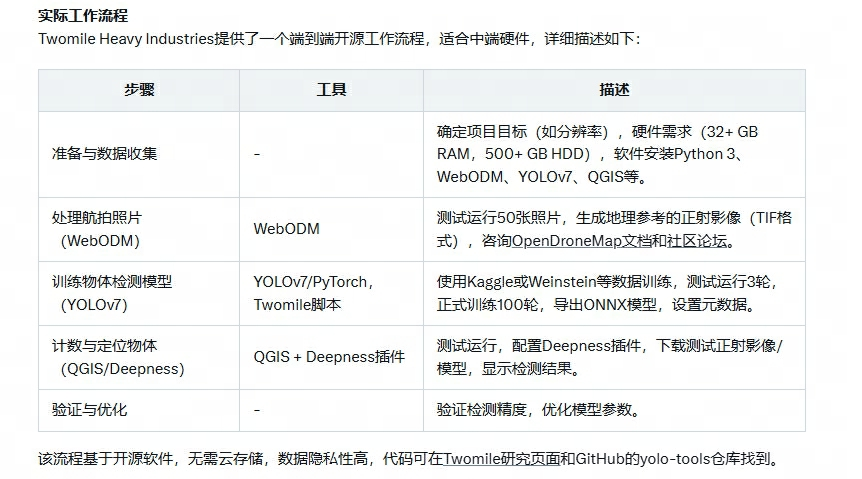

# VisDrone

## 背景
无人机通过搭载摄像头和识别算法，可以检测并标记物体或人，这在安防、农业和城市规划等领域有广泛应用。研究显示，结合开源工具和数据集，能显著提升效率。

## 关键工具与数据集
VisDrone 数据集：一个广泛使用的基准，包含无人机捕获的图像和视频，标注了行人、车辆等，适合训练检测模型。相关代码可在 GitHub 找到，例如 Drone_FasterRCNN 和 VisDrone-dataset-python-toolkit。

YOLO 模型：如 YOLOv 7，常用于实时检测，Twomile Heavy Industries 的工作流程中结合 WebODM 处理图像，再用 YOLO 检测，效果显著。

## 实际应用
Twomile Heavy Industries 提供了一个开源工作流程，使用 WebODM 处理航拍照片，YOLOv 7 进行检测，QGIS 显示结果，适合中端硬件，代码可在他们的研究页面找到 Open Source Drone Mapping and Object Counting。

## 调研报告
无人机结合识别技术用于识别物体或人并标记后，近年来已成为计算机视觉和无人机应用领域的重要研究方向。以下是详细调研，涵盖相关研究、开源代码和总结，旨在为用户提供全面信息。

### 研究背景与重要性
无人机（UAV）通过搭载高分辨率摄像头和先进的识别算法，可实时捕获并分析环境中的物体或人，广泛应用于安防监控、农业监测、城市规划和野生动物保护等场景。识别后标记（如绘制边界框）是关键步骤，确保检测结果可视化并易于分析。研究表明，结合开源工具和数据集，能显著降低开发成本，提升模型性能。

### 关键数据集与研究
#### VisDrone 数据集
VisDrone 数据集是无人机视觉研究的重要基准，由天津大学 AISKYEYE 团队收集，包含 288 个视频片段（261,908 帧）和 10,209 张静态图像，覆盖中国 14 个城市，标注了行人、车辆、自行车等超过 260 万个边界框。数据集支持多种任务，包括：
- 图像中的物体检测
- 视频中的物体检测
- 单目标跟踪
- 多目标跟踪
- 人群计数

该数据集因其多样性（不同环境、密度和光照条件）而广泛用于研究。相关研究如 Dawei Du 等人的论文"The Unmanned Aerial Vehicle Benchmark: Object Detection and Tracking"[European Conference on Computer Vision (ECCV), 2018]，奠定了 VisDrone 的基础。

#### 挑战结果论文
VisDrone 挑战结果论文如"VisDrone-DET 2019: The Vision Meets Drone Object Detection in Image Challenge Results"总结了 33 种物体检测算法的性能，提供了评估平台，推进了领域发展。这些论文通常列出参与团队的方法，许多团队在 GitHub 上开源代码，可通过 Papers with Code - VisDrone-DET 2019 找到。

### 开源代码与工具
研究中，许多项目提供了开源代码，支持无人机识别的开发。以下是几个代表性项目：

#### GitHub 上的相关仓库
https://github.com/VisDrone/VisDrone-Dataset 
描述：官方数据集仓库，提供图像/视频和标注，支持研究者开发检测算法。  
内容：包括任务 1-5 的工具和数据，适合学术研究。  
链接：VisDrone/VisDrone-Dataset

https://github.com/oulutan/Drone_FasterRCNN 
描述：基于 Faster R-CNN 的模型，训练于 VisDrone 数据集，专注于从无人机视角检测物体。  
内容：提供训练脚本和模型权重，示例输出视频可通过 Google Drive 查看。  
链接：Drone_FasterRCNN

https://github.com/dronefreak/VisDrone-dataset-python-toolkit
描述：Python 工具包，支持 VisDrone 数据集的处理，将标注转换为 PASCAL-VOC 格式。  
内容：包括 Faster-RCNN-InceptionV 3 的训练代码，适合静态图像检测。  
链接：VisDrone-dataset-python-toolkit

VisDrone/DroneVehicle  
描述：专注于 RGB-红外跨模态车辆检测，数据集包含 28,439 对图像，涵盖白天到夜晚场景。  
内容：提出 UA-CMDet 框架，实验证明在低光条件下性能提升。  
链接： https://github.com/VisDrone/DroneVehicle

https://twomile.com/research/open-source-drone-mapping-and-object-counting/

### 研究总结
**数据集与基准**：VisDrone 数据集是核心资源，支持多种检测任务，研究者可利用其开发和评估模型。挑战结果论文提供了领域进展的综述。

**算法与模型**：YOLO 系列（如 YOLOv 7）和 Faster R-CNN 是常见选择，适合实时和精确检测，跨模态方法如 UA-CMDet 在低光条件下表现优异。

**开源工具**：GitHub 上的仓库提供了丰富的代码支持，涵盖数据处理、模型训练和结果可视化。Twomile 的工作流程为实际应用提供了可操作的参考。

**应用场景**：检测后标记（如边界框）在安防（如无人机入侵识别）、交通管理（如车辆计数）和野生动物监测（如人群密度分析）中应用广泛。

综上，无人机识别物体或人的研究活跃，结合 VisDrone 数据集和开源工具，如 YOLO 和 QGIS，可实现高效的检测与标记，满足用户需求。
