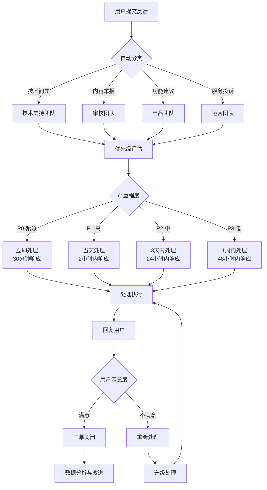

# FAQ 与用户反馈

## 常见问题解答（FAQ）

### 一、账号与登录问题

**Q: 如何注册 MindGuard 账号？**
A: MindGuard 采用微信授权登录，无需单独注册。首次使用时会要求您授权微信基本信息，系统会自动创建账号并关联您的微信身份。

**Q: 是否支持手机号/学号登录？**
A: 支持微信授权登录，首次进入需绑定校园学号验证。已绑定账号可在"我的 → 隐私与授权"中查看和解除。

**Q: 忘记授权或换设备怎么办？**
A: 重新授权后系统会自动识别同一学号并同步历史数据，如需解绑旧设备，可在隐私中心选择"撤销授权"。

**Q: 如何修改个人资料信息？**
A: 进入"我的"页面 → 点击头像或昵称 → 进入资料编辑页 → 可修改昵称、头像、校区信息等非敏感信息 → 点击保存。

**Q: 如何注销账号？**
A: 在账号设置页选择"一键注销" → 系统会提示数据清理说明和冷静期 → 确认后提交注销申请 → 客服和风控部门会进行审核处理。

### 二、隐私与授权问题

**Q: 我的个人数据会被如何使用？**
A: 我们遵循最小必要原则，仅收集提供服务所必需的数据。您可以随时在隐私授权中心查看和管理数据使用权限，所有敏感数据都经过加密处理。

**Q: 情绪打卡会不会被别人看到？**
A: 情绪打卡数据默认仅自己可见，汇总信息用于生成周报与个性化建议。只有在主动授权辅导员查看时才会共享。

**Q: 如何添加紧急联系人（守护人）？**
A: 进入"我的"页面 → 隐私与授权中心 → 守护人管理 → 点击"添加守护人" → 填写联系人信息并设置权限级别。

**Q: 可以撤销已授权的权限吗？**
A: 可以。在隐私授权中心可以查看所有授权对象，点击相应授权可以查看详情、修改权限范围或撤销授权。

**Q: 匿名反馈是否真的匿名？**
A: 是的。选择匿名反馈后，处理人员将无法查看您的身份信息，但为了安全考虑，我们会保留必要的技术标识。

**Q: 使用 REBT 模板后内容存在哪里？**
A: 心情随笔内容加密存储于专属数据库，只能本人查看；系统仅记录结构化标签用于情绪趋势分析。

**Q: 可以导出心情随笔吗？**
A: 目前支持导出最近 30 天的心情随笔 PDF，路径："我的 → 心情随笔导出"。导出前需二次验证身份。

### 三、情绪打卡功能

**Q: 如何进行情绪打卡？**
A: 在"今天"页面点击顶部情绪状态卡 → 选择情绪评分（五档表情） → 选择情绪标签和场景 → 添加备注 → 点击保存。

**Q: 可以多次打卡吗？**
A: 支持同一天内多次打卡，系统会记录每次打卡的时间点，并在情绪曲线上显示当日的情绪波动情况。

**Q: 情绪数据会被如何分析和使用？**
A: AI会分析您的情绪状态生成个性化建议，负向情绪会触发风险预警和主动关怀。所有数据都经过脱敏处理，仅用于为您提供更好的服务。

**Q: 可以删除历史打卡记录吗？**
A: 可以。在情绪趋势页面选择要删除的记录，系统会询问确认。删除操作不可恢复，请谨慎操作。

**Q: 任务卡提醒太频繁怎么办？**
A: 在"任务 → 设置"中可调整提醒频率或开启"低扰动模式"。

### 四、树洞社区互动

**Q: 如何在树洞发布帖子？**
A: 进入"树洞"页面 → 点击"发布"按钮 → 填写内容并选择标签 → 选择匿名模式 → 完成自检流程 → 发布。

**Q: 什么是自检流程？**
A: 自检流程确保内容符合社区规范，包括确认礼仪规则、选择匿名方式、了解风险提示等步骤。

**Q: 发帖需要实名吗？**
A: 树洞默认匿名，可选择化名展示。敏感词和风险内容会在本地草稿阶段提示并给出替代建议。

**Q: 如何举报不当内容？**
A: 在帖子详情页点击"举报"按钮 → 选择举报原因 → 提供详细说明 → 系统会在24小时内处理。

**Q: 如何获得更多回应？**
A: 建议为帖子添加话题标签（如 #考试周），并参与温和互动（抱抱、留言），系统会提升该帖曝光。

**Q: 抱抱功能有什么作用？**
A: 抱抱是一种情感支持表达，当您看到需要安慰的帖子时可以给予抱抱，传递温暖和关怀。

### 五、任务闭环系统

**Q: 微建议是如何生成的？**
A: AI基于您的情绪状态、行为模式和偏好，智能生成个性化的改进建议，如"与室友约定安静时段"等。

**Q: 如何将建议转化为任务？**
A: 在微建议列表中点击"接受" → 系统会自动创建相应任务 → 您可以调整任务细节并设置完成时间。

**Q: 任务完成后需要做什么？**
A: 完成任务后建议进行复盘，记录执行效果和情绪变化，帮助系统优化后续建议。

**Q: 可以自定义任务吗？**
A: 可以。在任务页面点击"新建任务" → 填写任务详情 → 设置优先级和时间 → 保存。

### 六、SOS紧急求助

**Q: 如何触发SOS功能？**
A: 长按界面上的SOS悬浮按钮2秒即可触发紧急求助流程。

**Q: 触发 SOS 会发生什么？**
A: 长按悬浮按钮 2 秒会进入 SOS 对话流程，提供心理急救脚本，并可一键拨打校内或社会热线。若您取消操作不会记录在用户时间线。

**Q: SOS触发后会发生什么？**
A: 系统会立即显示稳定化脚本，引导您进行呼吸练习和环境确认，同时提供紧急联系方式列表。

**Q: SOS信息会通知谁？**
A: 根据您的设置，系统会通知您添加的守护人、校内心理中心、辅导员等资源，但会尊重您的隐私授权。

**Q: 可以取消SOS吗？**
A: SOS触发后，如果确认是误触或状态已稳定，可以在稳定化流程中选择"取消求助"。

**Q: 资源地图是否支持导航？**
A: 支持跳转微信地图/电话拨打，部分资源支持在线预约。

### 七、技术支持问题

**Q: 小程序无法打开怎么办？**
A: 请检查网络连接 → 重启微信 → 清除小程序缓存 → 如仍无法解决，请联系技术支持。

**Q: 数据同步失败如何处理？**
A: 检查网络状态 → 退出重新登录 → 如果问题持续，请提供具体错误信息反馈给我们。

**Q: 如何备份数据？**
A: 您可以在"我的"页面选择"导出数据"功能，系统会生成包含您所有数据的加密文件。

**Q: 支持哪些设备？**
A: 支持iOS 10.0以上和Android 5.0以上的智能手机设备。

---

## 用户反馈收集渠道

### 1. 小程序内反馈
- **问题反馈入口**：我的 → 问题反馈
- **资源评价**：在使用资源地图后可对服务质量进行评价
- **内容举报**：社区帖子、评论等页面的一键举报功能
- **功能建议**：各功能页面的"建议改进"按钮

### 2. 客服支持
- **在线客服**：小程序内智能客服，工作时间9:00-21:00
- **紧急联系**：SOS页面提供的紧急联系人列表
- **邮件支持**：support@mindguard.edu.cn（24小时内回复）
- **电话支持**：400-XXX-XXXX（工作时间）

### 3. 社区渠道
- **官方QQ群**：XXXXXXX
- **微信公众号**：MindGuard心理健康
- **校内辅导员**：各学院辅导员办公室
- **心理中心**：校内心理健康教育与咨询中心

### 4. 线下渠道
- **意见箱**：校内各主要楼宇设置的意见箱
- **座谈会**：定期举办用户体验座谈会
- **问卷调查**：重要版本更新前的用户调研

### 5. 反馈渠道对比表

| 渠道 | 入口 | 适用场景 | 处理时效 |
| --- | --- | --- | --- |
| 小程序内"我的 → 意见反馈" | 表单 + 多选标签（页面问题/建议/情绪支持等） | 日常使用反馈、功能建议 | 48 小时内回复 |
| 树洞"反馈话题" | 话题标签 #产品建议 | 社区内轻量建议、体验分享 | 每周集中回复 |
| 运营邮箱 | `mindguard@campus.com` | 正式问题、数据/隐私相关咨询 | 2 个工作日内响应 |
| 线下辅导中心 | 辅导老师面对面访谈 | 高危/深度心理支持建议 | 现场处理并记录在案 |

---

## 反馈处理流程

### 工单化处理流程
所有用户反馈都会被标准化为工单进行跟踪管理：

### 分级响应标准

#### P0级 - 紧急（立即响应）
- **定义**：系统故障、安全漏洞、紧急求助、高风险预警
- **响应时间**：30分钟内
- **处理时限**：2小时内
- **处理人员**：值班工程师 + 值班经理
- **升级路径**：直接上报技术总监和心理中心负责人

#### P1级 - 高优先级（2小时内响应）
- **定义**：功能异常、数据丢失、高风险举报、隐私问题
- **响应时间**：2小时内
- **处理时限**：24小时内
- **处理人员**：专业团队负责人
- **升级路径**：团队负责人 → 部门经理

#### P2级 - 中优先级（24小时内响应）
- **定义**：一般功能问题、内容建议、中等风险举报
- **响应时间**：24小时内
- **处理时限**：3天内
- **处理人员**：专职处理人员
- **升级路径**：处理人员 → 团队负责人

#### P3级 - 低优先级（48小时内响应）
- **定义**：体验优化建议、一般咨询、低风险举报
- **响应时间**：48小时内
- **处理时限**：1周内
- **处理人员**：标准处理流程
- **升级路径**：标准升级流程

### 详细处理流程

#### 1. 收集阶段
- 小程序表单接入工单系统（飞书服务台），自动生成 Ticket
- 社区反馈通过埋点 `treehole_post_publish` + 话题筛选进入反馈看板
- 自动记录用户环境信息（设备型号、系统版本、网络状态等）

#### 2. 分级分类
- **P0级**：安全、隐私、危机相关 → 立即通知心理老师与产品负责人
- **P1级**：功能缺陷、性能问题 → 指派至研发；24小时内给出处理计划
- **P2级**：体验建议、内容优化 → 纳入需求池，每周优先级评审
- **P3级**：一般咨询、轻微问题 → 标准流程处理

#### 3. 处理与跟进
- 工单系统记录状态（待处理/处理中/已解决/已拒绝）
- 若涉及版本修复，在迭代计划中登记并跟踪测试
- 对提交用户进行回访（小程序消息或邮箱），确认问题解决
- 重大问题建立专项小组，制定详细解决方案

#### 4. 沉淀与复盘
- 每月整理 Top 问题与改进措施，更新 FAQ
- 重大反馈形成复盘文档，记录背景、根因、改进动作
- 基于反馈数据分析优化产品功能和用户体验

### 闭环处理机制

#### 1. 自动化处理
- **智能分类**：基于反馈内容自动分配到相应团队
- **优先级计算**：根据反馈类型、严重程度、用户级别计算优先级
- **自动回复**：常见问题自动回复，提高响应效率
- **进度提醒**：自动向用户发送处理进度通知

#### 2. 质量控制
- **双重审核**：重要反馈需要双重审核确认
- **满意度调查**：处理后自动发送满意度调查
- **质量评估**：定期评估处理质量和效率
- **持续改进**：基于反馈数据持续优化流程

#### 3. 数据分析
- **趋势分析**：分析反馈类型和处理趋势
- **问题定位**：识别系统性问题和改进点
- **用户画像**：了解不同用户群体的需求差异
- **效果评估**：评估改进措施的实际效果

### 特殊情况处理

#### 紧急情况处理
- **SOS相关反馈**：立即启动紧急处理流程
- **安全威胁**：立即通知安全团队和相关部门
- **大规模故障**：启动应急预案，统一对外沟通

#### 隐私保护处理
- **敏感信息**：专门流程处理涉及隐私的反馈
- **匿名反馈**：保护用户匿名性，但确保有效处理
- **数据安全**：严格遵守数据保护法规要求

---

## 数据与隐私要求

- 收集反馈时最少化用户敏感信息，仅保留联系方式（可选）与反馈内容
- 工单系统访问权限基于角色控制，敏感反馈需加密存储
- 反馈记录保存不少于 12 个月，以便追溯与复盘
- 用户可随时查看自己的反馈记录和处理状态
- 敏感反馈采用端到端加密传输和存储

---

## 后续提升方向

- 在意见反馈入口引入情绪选择题，帮助判断紧急程度
- 建立 NPS 调研机制，每季度推送小样本问卷
- 对树洞反馈贴建立官方账号定期总结，让社区看到改进进展
- 引入AI智能分类和自动回复，提高处理效率
- 建立用户反馈奖励机制，鼓励积极参与产品改进

---

## 变更记录

| 日期 | 版本 | 变更内容 | 变更人 |
|------|------|----------|--------|
| 2025-09-22 | v1.0 | 首次创建FAQ文档，整合账号登录、隐私授权、树洞互动、任务闭环、SOS等常见问题 | Claude |
| 2025-09-22 | v1.0 | 建立用户反馈收集渠道体系，包含小程序内、客服、社区、线下四大渠道 | Claude |
| 2025-09-22 | v1.0 | 设计工单化反馈处理流程，实现P0-P3四级响应标准和闭环处理机制 | Claude |
| 2025-09-22 | v1.0 | 添加Mermaid流程图展示反馈处理全流程，包含分类、优先级评估、处理执行和满意度跟踪 | Claude |

