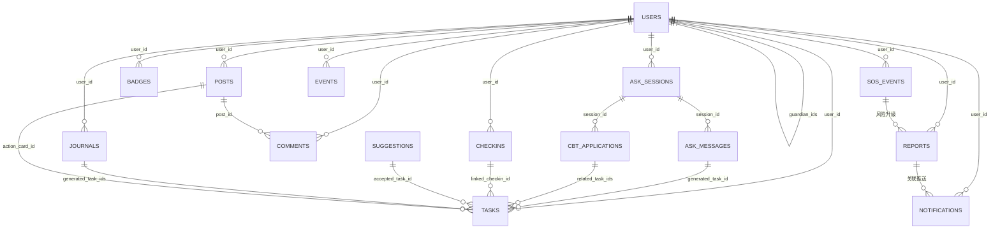

# MindGuard 数据库设计

> 版本：v2.0.0 | 更新日期：2025-09-22
> 基于功能文档、页面文档、接口占位文档、分包规划、埋点分析与UI组件文档的完整对齐

本文档提供了 MindGuard 微信小程序的完整数据模型概览，设计遵循"最小必要信息""安全审计留痕"原则，支撑情绪健康闭环、社区守护系统、安全保障机制与成长激励体系等核心业务。文档与 `docs/数据库/` 目录下的详细集合设计文件保持一致。

## 数据库概览

### 技术选型
- **数据库类型**：微信云开发 TCB（NoSQL 文档数据库）
- **部署架构**：云端托管，自动扩缩容
- **访问控制**：基于 TCB 权限系统的精细化读写控制
- **备份策略**：自动备份 + 增量同步

### 命名约定
- **集合名**：小写复数（users, posts, checkins）
- **字段名**：snake_case（例：last_checkin_at）
- **时间格式**：ISO 8601 字符串
- **ID规范**：集合前缀 + 时间戳/序号（例：ck_20240406_a）

### 权限策略
- **P0**：公开数据（基础统计）
- **P1**：内部数据（昵称、头像）
- **P2**：个人敏感（联系方式、位置）
- **P3**：高度敏感（情绪数据、求助内容）

## 实体与关系概览

| 核心域 | 关键集合 | 主要关系说明 |
| --- | --- | --- |
| **用户与权限** | `users`、`events`、`notifications` | users 为所有数据的主键，包含角色权限和守护配置；events 记录全量用户行为，支撑画像分析和 A/B 测试；notifications 负责及时触达。 |
| **情绪健康闭环** | `checkins`、`journals`、`suggestions`、`tasks` | 情绪打卡与心情随笔沉淀原始数据，微建议系统生成任务清单，通过 `linked_checkin_id` 建立任务与情绪改善的关联，形成完整闭环。 |
| **AI对话系统** | `ask_sessions`、`ask_messages`、`cbt_applications` | 基于CBT的AI对话支持，记录完整会话过程、消息内容和技巧应用效果，与情绪数据和任务系统形成协同效应。 |
| **社区守护系统** | `posts`、`comments`、`feedback` | 树洞发帖支持匿名互动，多层风险识别触发守护流程，行动卡引导积极行动，反馈系统保障内容安全。 |
| **安全保障机制** | `sos_events`、`reports`、`notifications` | SOS 呼救记录风险等级和处置过程，周报与风险报告提供健康洞察，通知系统确保关键信息不遗漏。 |
| **资源与激励** | `resources`、`badges` | 资源地图提供校内外心理支持统一入口，徽章体系基于用户行为数据计算成就进度，形成正向激励循环。 |

## 集合清单

### 核心业务集合

| 集合名 | 用途 | 主要字段 | 隐私分级 |
|--------|------|---------|---------|
| `users` | 用户基础资料与权限 | _openid, nickname, role, risk_tier, guardian_ids | P1-P3 |
| `checkins` | 情绪打卡数据 | mood_score, primary_emotion, risk_level, context_note | P3 |
| `journals` | 心情随笔记录 | body_text, mood_tags, rebt_struct, derived_summary | P3 |
| `tasks` | 任务清单管理 | status, source, review_data, linked_checkin_id | P1-P2 |
| `posts` | 树洞社区帖子 | content, risk_score, anonymity_mode, action_card_id | P1-P3 |
| `suggestions` | 微建议系统 | category, source, status, accepted_task_id | P2 |
| `comments` | 社区互动记录 | action_type, content, mood_thermometer | P1-P3 |

### AI对话集合

| 集合名 | 用途 | 主要字段 | 隐私分级 |
|--------|------|---------|---------|
| `ask_sessions` | AI对话会话管理 | session_type, trigger_source, cbt_focus, risk_level, session_summary | P1-P3 |
| `ask_messages` | AI对话消息记录 | message_type, cbt_technique, content, effectiveness_score, cognitive_distortions | P2-P3 |
| `cbt_applications` | CBT技巧应用记录 | technique_type, application_context, effectiveness_rating, skill_mastery_level | P1-P3 |

### 支撑服务集合

| 集合名 | 用途 | 主要字段 | 隐私分级 |
|--------|------|---------|---------|
| `badges` | 徽章成就体系 | badge_code, status, progress_value | P1 |
| `notifications` | 通知推送系统 | message_type, status, payload | P2 |
| `reports` | 周报与风控 | report_type, mood_summary, risk_digest | P2-P3 |
| `resources` | 资源地图导航 | category, contact_info, operating_hours | P1 |
| `sos_events` | SOS紧急求助 | trigger_source, severity_level, escalation_steps | P3 |
| `events` | 用户行为埋点 | event_name, event_params, trace_id | P1-P2 |
| `feedback` | 用户反馈系统 | feedback_type, target_type, resolution_action | P2-P3 |

## 集合关系图



## 详细集合设计

### USERS（用户基础信息）

**用途**：存储用户基础资料、权限配置和守护关系，是所有业务数据的核心实体。

**字段定义**：

| 字段 | 类型 | 说明 | 索引 | 权限 |
| --- | --- | --- | --- | --- |
| `_id` | string | 主键 | PK | P1 |
| `_openid` | string | 微信 OpenID，唯一标识 | UK | P2 |
| `nickname` | string | 昵称 | - | P1 |
| `avatar_url` | string | 头像地址 | - | P1 |
| `campus_affiliation` | string | 校区/院系标签 | IDX | P1 |
| `status` | string | 账号状态 (active/inactive/restricted/suspended) | IDX | P1 |
| `role` | string | 用户角色 (user/counselor/mentor/guardian/ops) | IDX | P1 |
| `risk_tier` | string | 风险画像等级 (low/mid/high/critical) | IDX | P2 |
| `badge_ids` | array | 已获得徽章列表 | - | P1 |
| `guardian_ids` | array | 绑定守护者列表 | - | P2 |
| `counselor_id` | string | 绑定辅导员 | FK | P2 |
| `emergency_contacts` | array | 紧急联系人列表 | - | P3 |
| `statistics` | object | 用户统计信息 | - | P1 |
| `preference_profile` | object | 偏好设置 | - | P2 |
| `consent_version` | string | 隐私协议版本 | - | P2 |
| `last_login_at` | date | 最近登录时间 | IDX | P1 |
| `last_activity_at` | date | 最后活动时间 | IDX | P1 |
| `is_deleted` | boolean | 软删标记 | IDX | P1 |
| `createdAt` | date | 创建时间 | IDX | P1 |
| `updatedAt` | date | 更新时间 | IDX | P1 |

**索引设计**：
- `_openid_1`: 唯一索引，支持微信登录
- `status_1_risk_tier_1`: 复合索引，支持用户筛选和风险识别
- `role_1_status_1`: 复合索引，支持角色权限管理
- `last_activity_at_-1`: 降序索引，支持活跃用户分析
- `counselor_id_1`: 外键索引，支持辅导员查询下属学生

**关联接口**：
- `GET /api/user/profile` - 读取用户资料
- `PATCH /api/user/profile` - 更新用户资料
- `GET /api/privacy/consents` - 隐私授权管理

**关联云函数**：
- 所有云函数都需要读取用户权限信息
- `sosRelay` 依赖紧急联系人信息
- `weeklyReport` 依赖用户统计信息

**隐私分级**：
- P1: 基础信息（昵称、头像、角色等）
- P2: 敏感信息（风险等级、守护关系、偏好设置）
- P3: 高度敏感（紧急联系人）

**关联事件**：
- `pv_*` 页面访问事件
- `profile_edit_enter`, `profile_save` 资料编辑事件
- `privacy_setting_update` 隐私设置变更事件
- `badge_unlock` 徽章解锁事件

**示例文档**：
```json
{
  "_id": "usr_001",
  "_openid": "oxxxxxxxxxxxxxxxxxx",
  "nickname": "小明",
  "role": "user",
  "risk_tier": "low",
  "status": "active",
  "guardian_ids": ["usr_002", "usr_003"],
  "counselor_id": "csl_001",
  "badge_ids": ["bdg_consistency", "bdg_first_checkin"],
  "statistics": {
    "total_checkins": 45,
    "task_completion_rate": 0.82,
    "mood_trend": "stable"
  },
  "consent_version": "v2.1",
  "createdAt": "2024-01-15T08:30:00Z"
}
```

### CHECKINS（情绪打卡）

**用途**：记录用户每日情绪状态，支持情绪趋势分析和微建议生成，是情绪健康闭环的起点。

**字段定义**：

| 字段 | 类型 | 说明 | 索引 | 权限 |
| --- | --- | --- | --- | --- |
| `_id` | string | 主键 | PK | P1 |
| `_openid` | string | 创建者 openid | - | P2 |
| `user_id` | string | 用户指针 | FK | P1 |
| `mood_score` | number | 情绪分值 (0-100) | IDX | P3 |
| `mood_tags` | array | 场景/人物/地点标签 | - | P3 |
| `scene_tags` | array | 场景标签 | IDX | P3 |
| `primary_emotion` | string | 主情绪类别 | IDX | P3 |
| `risk_level` | string | 风险等级 (L1/L2/L3/L4) | IDX | P3 |
| `context_note` | string | 文本感受摘要 | - | P3 |
| `input_type` | string | 来源入口 | IDX | P2 |
| `related_task_id` | string | 关联任务 | FK | P2 |
| `energy_level` | number | 能量指数 (0-5) | IDX | P3 |
| `mood_wheel_snapshot` | object | 心情轮占比数据 | - | P3 |
| `checkin_date` | date | 打卡日期 | IDX | P2 |
| `suggestion_ids` | array | 当次建议列表 | - | P1 |
| `checkin_count` | number | 当日打卡次数 | - | P1 |
| `createdAt` | date | 创建时间 | IDX | P1 |
| `updatedAt` | date | 更新时间 | IDX | P1 |

**索引设计**：
- `user_id_1_checkin_date_-1`: 复合索引，支持用户情绪历史查询
- `checkin_date_1`: 日期索引，支持每日打卡统计
- `risk_level_1_user_id_1`: 复合索引，支持风险用户识别
- `primary_emotion_1`: 情绪分类索引，支持情绪分析
- `scene_tags_1`: 场景标签索引，支持场景化分析

**关联接口**：
- `GET /api/moods/today` - 获取今日打卡状态
- `POST /api/checkins` - 创建打卡记录
- `GET /api/moods/trend` - 获取情绪趋势

**关联云函数**：
- `checkinRecorder` - 打卡记录与幂等校验
- `suggestionOrchestrator` - 基于打卡生成微建议
- `taskWorkflow` - 任务完成回执关联

**隐私分级**：
- P1: 基础记录信息（打卡时间、次数）
- P2: 敏感信息（用户标识、输入来源）
- P3: 高度敏感（情绪数据、场景标签、风险等级）

**关联事件**：
- `mood_checkin_submit` - 打卡提交事件
- `exp_today_suggestions` - 建议曝光事件
- `suggestion_task_create` - 建议转任务事件

**数据校验**：
- 每用户每天最多5次打卡（防刷机制）
- mood_score 必须在 0-100 范围内
- risk_level 与 mood_score 的对应关系校验
- 防重复打卡校验（基于 user_id 和 checkin_date）

**示例文档**：
```json
{
  "_id": "ck_20240406_a",
  "user_id": "usr_001",
  "mood_score": 72,
  "primary_emotion": "calm",
  "mood_tags": ["学习", "室友", "自习室"],
  "scene_tags": ["学业"],
  "risk_level": "L1",
  "context_note": "专注学习但略累",
  "input_type": "mood_card",
  "energy_level": 3,
  "checkin_date": "2024-04-06",
  "suggestion_ids": ["sg_001", "sg_002"],
  "checkin_count": 1,
  "createdAt": "2024-04-06T14:30:00Z"
}
```

### JOURNALS（心情随笔）

**用途**：支持多模态心情记录，提供REBT理性情绪行为疗法结构化模板，支持深度情绪分析和任务转化。

**字段定义**：

| 字段 | 类型 | 说明 | 索引 | 权限 |
| --- | --- | --- | --- | --- |
| `_id` | string | 主键 | PK | P1 |
| `_openid` | string | 创建人 openid | - | P2 |
| `user_id` | string | 用户指针 | FK | P1 |
| `entry_type` | string | 记录类型 (text/voice/image/mixed/template) | IDX | P2 |
| `title` | string | 可选标题 | - | P2 |
| `body_text` | string | 文本正文或语音转写 | FT | P3 |
| `mood_score` | number | 情绪分值 | IDX | P3 |
| `mood_tags` | array | 标签云来源 | - | P3 |
| `scene_tags` | array | 场景标签 | IDX | P3 |
| `media_refs` | array | 附件引用 | - | P2 |
| `rebt_struct` | object | REBT 结构化内容 | - | P3 |
| `ocr_text` | string | OCR 识别文本 | FT | P3 |
| `derived_summary` | object | AI 摘要 | - | P3 |
| `generated_task_ids` | array | 转任务引用 | - | P1 |
| `share_scope` | string | 分享范围 (private/guardian/shared_link) | IDX | P2 |
| `risk_level` | string | 风险等级 | IDX | P3 |
| `source` | string | 创建入口 | IDX | P2 |
| `is_favorited` | boolean | 收藏标记 | IDX | P1 |
| `word_count` | number | 文本字数统计 | IDX | P2 |
| `audio_duration` | number | 音频时长 | - | P2 |
| `createdAt` | date | 创建时间 | IDX | P1 |
| `updatedAt` | date | 更新时间 | IDX | P1 |

**索引设计**：
- `user_id_1_createdAt_-1`: 复合索引，支持用户日记历史查询
- `entry_type_1_user_id_1`: 复合索引，支持多模态内容筛选
- `risk_level_1_createdAt_-1`: 复合索引，支持风险内容识别
- `is_favorited_1_user_id_1`: 复合索引，支持收藏查询
- `body_text`: 全文索引，支持内容搜索
- `share_scope_1`: 分享范围索引，支持权限控制

**关联接口**：
- `GET /api/journals` - 获取日记列表
- `POST /api/journals` - 创建日记记录
- `GET/PATCH/DELETE /api/journals/{id}` - 日记详情操作
- `POST /api/journals/{id}/extract-rebt` - REBT提取
- `POST /api/journals/{id}/generate-suggestion` - 生成建议

**关联云函数**：
- `suggestionOrchestrator` - 基于日记生成建议
- `analyticsIngest` - 内容分析事件上报

**隐私分级**：
- P1: 基础元数据（创建时间、类型、收藏状态）
- P2: 敏感信息（用户标识、分享范围、字数统计）
- P3: 高度敏感（内容正文、情绪数据、REBT结构）

**关联事件**：
- `journal_entry_submit` - 日记提交事件
- `journal_to_task` - 日记转任务事件
- `exp_*` - 相关内容曝光事件

**AI集成**：
- REBT结构化提取：识别触发事件(A)、信念(B)、情绪后果(C)
- 智能摘要：生成内容要点和情绪洞察
- 风险识别：自动评估内容风险等级
- 任务建议：基于内容生成个性化行动建议

**示例文档**：
```json
{
  "_id": "jnl_20240406_001",
  "user_id": "usr_001",
  "entry_type": "text",
  "title": "与室友调解",
  "body_text": "今天和组员开会比预期顺利，之前的紧张关系有所缓和...",
  "mood_score": 68,
  "mood_tags": ["室友", "沟通", "学习"],
  "scene_tags": ["学业"],
  "rebt_struct": {
    "A": "室友开会时的态度",
    "B": "认为他故意针对我",
    "C": "感到紧张和焦虑",
    "D": "可能只是工作风格不同",
    "E": "决定主动沟通了解情况"
  },
  "derived_summary": {
    "sentiment": "positive",
    "key_topics": ["室友关系", "沟通改善"],
    "action_items": ["主动沟通", "了解室友想法"]
  },
  "generated_task_ids": ["task_001"],
  "share_scope": "private",
  "word_count": 156,
  "createdAt": "2024-04-06T16:45:00Z"
}
```

### TASKS（任务管理）

**用途**：将微建议、随笔内容、行动卡等转化为可执行任务，支持任务全生命周期管理和效果评估。

**字段定义**：

| 字段 | 类型 | 说明 | 索引 | 权限 |
| --- | --- | --- | --- | --- |
| `_id` | string | 主键 | PK | P1 |
| `_openid` | string | 创建人 openid | - | P2 |
| `user_id` | string | 用户 | FK | P1 |
| `title` | string | 任务标题 | FT | P2 |
| `description` | string | 任务说明 | FT | P2 |
| `source` | string | 来源分类 | IDX | P1 |
| `origin_reference_type` | string | 来源实体类型 | IDX | P1 |
| `origin_reference_id` | string | 来源实体 ID | FK | P1 |
| `category` | string | 分类标签 | IDX | P2 |
| `emotion_category` | string | 情绪类别 | IDX | P3 |
| `status` | string | 任务状态 | IDX | P2 |
| `due_at` | date | 截止时间 | IDX | P2 |
| `reminder_at` | date | 提醒时间 | IDX | P2 |
| `estimated_duration_minutes` | number | 预计耗时 | - | P1 |
| `priority` | string | 优先级 | IDX | P2 |
| `checklist_steps` | array | 子步骤 | - | P2 |
| `linked_checkin_id` | string | 完成回执 | FK | P2 |
| `adherence_score` | number | 完成后效果评分 | - | P3 |
| `tags` | array | 自定义标签 | - | P1 |
| `is_pinned` | boolean | 今天页置顶 | IDX | P1 |
| `assignment_info` | object | 真人指派信息 | - | P2 |
| `pomodoro_sessions` | array | 番茄计时记录 | - | P2 |
| `review_data` | object | 复盘数据 | - | P3 |
| `createdAt` | date | 创建时间 | IDX | P1 |
| `updatedAt` | date | 更新时间 | IDX | P1 |

**状态枚举**：
- `pending`: 待开始
- `in_progress`: 进行中
- `completed`: 已完成
- `skipped`: 已跳过
- `expired`: 已过期
- `pending_confirmation`: 待确认
- `needs_review`: 需复盘

**来源枚举**：
- `suggestion`: 微建议生成
- `journal`: 随笔转化
- `action_card`: 行动卡
- `weekly_report`: 周报推荐
- `quick_note`: 快速记录
- `manual`: 手动创建
- `counselor`: 辅导员指派
- `mentor`: 导师指派

**索引设计**：
- `user_id_1_status_1_due_at_1`: 复合索引，支持任务看板查询
- `origin_reference_type_1_origin_reference_id_1`: 复合索引，支持来源追踪
- `status_1_user_id_1_createdAt_-1`: 复合索引，支持状态统计
- `linked_checkin_id_1`: 外键索引，支持效果评估查询
- `category_1_emotion_category_1`: 复合索引，支持分类分析
- `title`: 全文索引，支持任务搜索

**关联接口**：
- `GET /api/tasks` - 获取任务列表
- `POST /api/tasks` - 创建任务
- `PATCH /api/tasks/{id}` - 更新任务状态
- `POST /api/tasks/review` - 提交复盘
- `GET /api/tasks/summary` - 获取任务统计

**关联云函数**：
- `taskWorkflow` - 任务状态流转和效果评估
- `suggestionOrchestrator` - 建议转任务
- `weeklyReport` - 任务统计汇总

**隐私分级**：
- P1: 基础任务信息（标题、分类、创建时间）
- P2: 敏感信息（状态、优先级、截止时间、指派信息）
- P3: 高度敏感（效果评分、复盘数据、情绪类别）

**关联事件**：
- `task_status_update` - 任务状态变更事件
- `task_review_submit` - 复盘提交事件
- `suggestion_task_create` - 建议转任务事件
- `journal_to_task` - 日记转任务事件

**数据校验**：
- 状态流转合法性校验
- 截止时间不能早于创建时间
- 复盘只能在完成后提交
- 任务标题不能为空

**示例文档**：
```json
{
  "_id": "task_001",
  "user_id": "usr_001",
  "title": "和室友约定安静时间",
  "description": "准备三个时段，沟通确认",
  "source": "suggestion",
  "origin_reference_type": "suggestion",
  "origin_reference_id": "sg_001",
  "category": "relationship",
  "emotion_category": "calm",
  "status": "in_progress",
  "due_at": "2024-04-08T15:00:00Z",
  "estimated_duration_minutes": 20,
  "priority": "medium",
  "linked_checkin_id": "ck_20240408_b",
  "pomodoro_sessions": [
    {"start_time": "2024-04-07T14:00:00Z", "duration": 25}
  ],
  "review_data": {
    "mood_before": 45,
    "mood_after": 72,
    "review_notes": "沟通顺利，室友接受了建议"
  },
  "createdAt": "2024-04-06T14:35:00Z"
}
```

### POSTS（树洞帖子）

**用途**：支持匿名社区分享，集成风险识别和内容审核，提供行动卡转化路径。

**字段定义**：

| 字段 | 类型 | 说明 | 索引 | 权限 |
| --- | --- | --- | --- | --- |
| `_id` | string | 主键 | PK | P1 |
| `_openid` | string | 作者 openid | - | P2 |
| `user_id` | string | 用户 | FK | P1 |
| `alias_name` | string | 匿名展示名 | - | P2 |
| `anonymity_mode` | string | 匿名模式 | IDX | P2 |
| `content` | string | 正文 | FT | P3 |
| `tags` | array | 主题标签 | - | P2 |
| `topic` | string | 话题分类 | IDX | P2 |
| `mood_thermometer` | number | 情绪温度 | IDX | P3 |
| `risk_score` | number | 风险模型分值 | IDX | P3 |
| `risk_level` | string | 风险等级 | IDX | P3 |
| `risk_factors` | array | 风险因素 | - | P3 |
| `status` | string | 发布状态 | IDX | P1 |
| `moderation_result` | object | 审核记录 | - | P2 |
| `action_card_id` | string | 行动卡引用 | FK | P1 |
| `self_check_result` | object | 草稿自检结果 | - | P2 |
| `comment_count` | number | 评论数 | - | P1 |
| `hug_count` | number | 抱抱数 | - | P1 |
| `favorite_count` | number | 收藏数 | - | P1 |
| `report_count` | number | 被举报数 | - | P1 |
| `is_featured` | boolean | 精选状态 | IDX | P1 |
| `risk_flag` | string | 风险标记 | IDX | P2 |
| `intervention_triggered` | boolean | 是否触发干预 | IDX | P2 |
| `guardian_notified` | boolean | 守护者已通知 | IDX | P2 |
| `content_hash` | string | 内容哈希 | UK | P2 |
| `last_interaction_at` | date | 最后互动时间 | IDX | P1 |
| `publishedAt` | date | 发布时间 | IDX | P1 |
| `createdAt` | date | 创建时间 | IDX | P1 |
| `updatedAt` | date | 更新时间 | IDX | P1 |

**状态枚举**：
- `draft`: 草稿
- `pending_review`: 待审核
- `published`: 已发布
- `removed`: 已删除
- `archived`: 已归档

**匿名模式**：
- `anon`: 完全匿名
- `pseudonym`: 匿名昵称

**索引设计**：
- `user_id_1_status_1_publishedAt_-1`: 复合索引，支持用户帖子查询
- `topic_1_status_1_publishedAt_-1`: 复合索引，支持话题筛选
- `risk_level_1_status_1`: 复合索引，支持风险内容识别
- `content_hash_1`: 唯一索引，支持内容去重
- `anonymity_mode_1_status_1`: 复合索引，支持匿名内容管理
- `content`: 全文索引，支持内容搜索

**关联接口**：
- `GET /api/treehole/posts` - 获取帖子列表
- `POST /api/treehole/posts` - 发布帖子
- `GET /api/treehole/posts/{id}` - 帖子详情
- `GET /api/forum/highlight` - 社区精选

**关联云函数**：
- `treeholeModeration` - 内容审核与风险识别
- `sosRelay` - 高风险内容触发SOS流程

**隐私分级**：
- P1: 基础元数据（创建时间、状态、互动统计）
- P2: 敏感信息（用户标识、匿名设置、审核结果）
- P3: 高度敏感（内容正文、情绪数据、风险信息）

**关联事件**：
- `treehole_post_publish` - 帖子发布事件
- `pv_treehole_post_detail` - 帖子详情曝光
- `clk_post_action` - 帖子操作事件
- `exp_risk_banner` - 风险横幅曝光

**风险识别机制**：
- 内容风险评分（0-1分值）
- 情绪温度计评估
- 关键词匹配和语义分析
- 自动触发人工审核流程

**内容审核流程**：
1. 草稿自检（用户侧）
2. AI模型预审
3. 人工审核（高风险内容）
4. 发布后监控
5. 举报处理机制

**示例文档**：
```json
{
  "_id": "post_900",
  "user_id": "usr_001",
  "alias_name": "迷茫的小星星",
  "anonymity_mode": "anon",
  "content": "最近准备考研，和室友节奏不同有点焦虑...",
  "topic": "study",
  "mood_thermometer": 38,
  "risk_score": 0.65,
  "risk_level": "L2",
  "risk_factors": ["学业压力", "人际关系"],
  "status": "published",
  "self_check_result": {
    "etiquette_confirmed": true,
    "anonymity_choice": "anon",
    "risk_aware": true
  },
  "action_card_id": "task_901",
  "comment_count": 12,
  "hug_count": 8,
  "intervention_triggered": false,
  "content_hash": "sha256:abc123...",
  "publishedAt": "2024-04-06T15:20:00Z",
  "createdAt": "2024-04-06T15:15:00Z"
}
```

### SUGGESTIONS（微建议系统）

**用途**：基于情绪状态和行为数据生成个性化建议，支持任务转化和效果追踪。

**字段定义**：

| 字段 | 类型 | 说明 | 索引 | 权限 |
| --- | --- | --- | --- | --- |
| `_id` | string | 主键 | PK | P1 |
| `user_id` | string | 用户 | FK | P1 |
| `session_id` | string | 推荐会话标识 | IDX | P2 |
| `title` | string | 建议标题 | FT | P2 |
| `description` | string | 补充说明 | FT | P2 |
| `category` | string | 建议分类 | IDX | P2 |
| `priority_rank` | number | 当前排序 | IDX | P1 |
| `source` | string | 建议来源 | IDX | P1 |
| `feature_snapshot` | object | 生成特征 | - | P2 |
| `task_template_id` | string | 生成任务模板 | FK | P1 |
| `status` | string | 状态 | IDX | P1 |
| `accepted_task_id` | string | 接受后生成的任务 | FK | P1 |
| `refresh_count` | number | 本会话刷新次数 | - | P1 |
| `expired_at` | date | 失效时间 | IDX | P1 |
| `createdAt` | date | 生成时间 | IDX | P1 |
| `updatedAt` | date | 更新时间 | IDX | P1 |

**状态枚举**：
- `active`: 活跃（可接受）
- `accepted`: 已接受
- `skipped`: 已跳过
- `expired`: 已过期

**来源枚举**：
- `model`: AI模型生成
- `curated`: 专家精选
- `manual`: 手动推荐

**索引设计**：
- `user_id_1_session_id_1_priority_rank_1`: 复合索引，支持会话内查询
- `status_1_user_id_1_createdAt_-1`: 复合索引，支持状态追踪
- `category_1_source_1`: 复合索引，支持分类分析
- `expired_at_1`: 失效时间索引，支持清理机制
- `title`: 全文索引，支持建议搜索

**关联接口**：
- `GET /api/micro-tips` - 获取微建议列表
- `PATCH /api/micro-tips/{id}` - 更新建议状态

**关联云函数**：
- `suggestionOrchestrator` - 建议生成和排序
- `taskWorkflow` - 建议转任务处理

**隐私分级**：
- P1: 基础元数据（状态、分类、创建时间）
- P2: 敏感信息（用户标识、建议内容、生成特征）

**关联事件**：
- `exp_today_suggestions` - 建议曝光事件
- `suggestion_task_create` - 建议转任务事件

**AI生成机制**：
- 基于情绪状态特征分析
- 个性化推荐算法
- A/B测试优化策略
- 实时效果反馈

**数据生命周期**：
- 生成后24小时自动过期
- 用户操作后立即更新状态
- 定期清理过期数据

**示例文档**：
```json
{
  "_id": "sg_001",
  "user_id": "usr_001",
  "session_id": "sess_20240406_001",
  "title": "与室友约定安静时段",
  "description": "准备三个时段，沟通确认",
  "category": "relationship",
  "priority_rank": 1,
  "source": "model",
  "feature_snapshot": {
    "mood_score": 72,
    "primary_emotion": "calm",
    "scene_tags": ["学业"],
    "time_of_day": "afternoon"
  },
  "status": "active",
  "refresh_count": 0,
  "expired_at": "2024-04-07T14:30:00Z",
  "createdAt": "2024-04-06T14:32:00Z"
}
```

### BADGES（徽章成就体系）

**用途**：基于用户行为数据计算成就进度，形成正向激励循环。

**字段定义**：

| 字段 | 类型 | 说明 | 索引 | 权限 |
| --- | --- | --- | --- | --- |
| `_id` | string | 主键 | PK | P1 |
| `user_id` | string | 用户 | FK | P1 |
| `badge_code` | string | 徽章编码 | IDX | P1 |
| `status` | string | 当前状态 | IDX | P1 |
| `progress_value` | number | 当前进度 | - | P1 |
| `progress_target` | number | 目标 | - | P1 |
| `progress_detail` | object | 进度详情 | - | P2 |
| `unlocked_at` | date | 解锁时间 | IDX | P1 |
| `first_completed_at` | date | 首次达成时间 | IDX | P1 |
| `source` | string | 更新来源 | IDX | P1 |
| `createdAt` | date | 创建时间 | IDX | P1 |
| `updatedAt` | date | 更新时间 | IDX | P1 |

**状态枚举**：
- `locked`: 未解锁
- `in_progress`: 进行中
- `unlocked`: 已解锁

**徽章编码示例**：
- `consistency`: 连续打卡
- `first_checkin`: 首次打卡
- `task_master`: 任务达人
- `community_helper`: 社区帮手
- `mood_stabilizer`: 情绪稳定者

**索引设计**：
- `user_id_1_badge_code_1`: 复合唯一索引，支持用户徽章查询
- `status_1_user_id_1`: 复合索引，支持状态筛选
- `badge_code_1_status_1`: 复合索引，支持徽章统计

**关联接口**：
- `GET /api/badges` - 获取徽章列表

**关联事件**：
- `badge_unlock` - 徽章解锁事件

**隐私分级**：
- P1: 基础成就信息（徽章编码、状态、进度）
- P2: 敏感信息（详细进度数据、解锁时间）

**示例文档**：
```json
{
  "_id": "bdg_001",
  "user_id": "usr_001",
  "badge_code": "consistency",
  "status": "in_progress",
  "progress_value": 7,
  "progress_target": 30,
  "progress_detail": {
    "current_streak": 7,
    "best_streak": 15,
    "total_checkins": 45
  },
  "createdAt": "2024-01-15T08:30:00Z"
}
```

### COMMENTS（社区互动）

**用途**：记录树洞社区的各种互动行为，支持抱抱、评论、举报等操作。

**字段定义**：

| 字段 | 类型 | 说明 | 索引 | 权限 |
| --- | --- | --- | --- | --- |
| `_id` | string | 主键 | PK | P1 |
| `_openid` | string | 互动者 openid | - | P2 |
| `user_id` | string | 用户 | FK | P1 |
| `post_id` | string | 所属帖子 | FK | P1 |
| `parent_id` | string | 楼中楼引用 | FK | P1 |
| `action_type` | string | 互动类型 | IDX | P1 |
| `content` | string | 文本内容 | FT | P3 |
| `mood_thermometer` | number | 回复时的情绪 | - | P3 |
| `is_anonymous` | boolean | 匿名展示 | IDX | P2 |
| `alias_name` | string | 匿名昵称 | - | P2 |
| `metadata` | object | 附加信息 | - | P1 |
| `risk_flag` | string | 风险标记 | IDX | P2 |
| `status` | string | 状态 | IDX | P1 |
| `createdAt` | date | 创建时间 | IDX | P1 |
| `updatedAt` | date | 更新时间 | IDX | P1 |

**互动类型**：
- `reply`: 评论回复
- `hug`: 抱抱
- `save`: 收藏
- `report`: 举报
- `moderator_note`: 审核备注

**索引设计**：
- `post_id_1_action_type_1_createdAt_-1`: 复合索引，支持帖子互动查询
- `user_id_1_action_type_1`: 复合索引，支持用户行为分析
- `parent_id_1`: 外键索引，支持楼中楼查询
- `action_type_1_status_1`: 复合索引，支持行为统计

**关联接口**：
- `POST /api/treehole/interactions` - 创建互动
- `GET /api/treehole/posts/{id}/comments` - 获取评论列表

**隐私分级**：
- P1: 基础互动信息（类型、状态、时间）
- P2: 敏感信息（用户标识、匿名设置）
- P3: 高度敏感（评论内容、情绪数据）

**关联事件**：
- `act_comment_submit` - 评论提交事件
- `treehole_care_action` - 抱抱等温和行为事件

**示例文档**：
```json
{
  "_id": "cmt_001",
  "user_id": "usr_002",
  "post_id": "post_900",
  "action_type": "hug",
  "is_anonymous": true,
  "alias_name": "温暖的拥抱",
  "status": "active",
  "createdAt": "2024-04-06T15:25:00Z"
}
```

### NOTIFICATIONS（通知推送系统）

**用途**：负责系统通知、提醒和重要信息的及时触达。

**字段定义**：

| 字段 | 类型 | 说明 | 索引 | 权限 |
| --- | --- | --- | --- | --- |
| `_id` | string | 主键 | PK | P1 |
| `user_id` | string | 接收者 | FK | P1 |
| `message_type` | string | 通知类型 | IDX | P1 |
| `template_code` | string | 模板标识 | IDX | P1 |
| `title` | string | 通知标题 | - | P2 |
| `content` | string | 文案摘要 | - | P2 |
| `payload` | object | 结构化参数 | - | P2 |
| `channel` | string | 发送渠道 | IDX | P1 |
| `target_page` | string | 点击跳转 | - | P1 |
| `deeplink` | string | 外部链接 | - | P1 |
| `status` | string | 状态 | IDX | P1 |
| `send_at` | date | 计划发送时间 | IDX | P1 |
| `sent_at` | date | 实际发送时间 | IDX | P1 |
| `read_at` | date | 已读时间 | IDX | P2 |
| `error_message` | string | 失败原因 | - | P1 |
| `createdAt` | date | 创建时间 | IDX | P1 |
| `updatedAt` | date | 更新时间 | IDX | P1 |

**通知类型**：
- `system`: 系统通知
- `task_reminder`: 任务提醒
- `weekly_report`: 周报推送
- `community_reply`: 社区回复
- `risk_alert`: 风险提醒
- `achievement`: 成就解锁

**状态枚举**：
- `pending`: 待发送
- `sending`: 发送中
- `sent`: 已发送
- `failed`: 发送失败
- `read`: 已读

**索引设计**：
- `user_id_1_status_1_createdAt_-1`: 复合索引，支持用户通知查询
- `message_type_1_status_1`: 复合索引，支持类型统计
- `send_at_1_status_1`: 复合索引，支持定时发送
- `template_code_1`: 模板索引，支持模板管理

**关联接口**：
- `GET /api/notifications` - 获取通知列表
- `GET /api/notifications/unread-count` - 获取未读数量

**隐私分级**：
- P1: 基础通知信息（类型、状态、时间）
- P2: 敏感信息（通知内容、跳转链接）

**示例文档**：
```json
{
  "_id": "ntf_001",
  "user_id": "usr_001",
  "message_type": "task_reminder",
  "template_code": "task_due_soon",
  "title": "任务即将到期",
  "content": "您有一个任务将在2小时后到期，请及时完成",
  "payload": {"task_id": "task_001", "due_time": "2024-04-08T15:00:00Z"},
  "channel": "miniprogram",
  "target_page": "/pages/tasks/index",
  "status": "sent",
  "send_at": "2024-04-08T13:00:00Z",
  "sent_at": "2024-04-08T13:00:05Z",
  "createdAt": "2024-04-08T12:55:00Z"
}
```

### EVENTS（用户事件埋点）

**用途**：记录用户行为事件，支持数据分析和用户画像构建。

**字段定义**：

| 字段 | 类型 | 说明 | 索引 | 权限 |
| --- | --- | --- | --- | --- |
| `_id` | string | 主键 | PK | P1 |
| `user_id` | string | 用户 | FK | P2 |
| `openid_hash` | string | openid 哈希 | IDX | P2 |
| `event_name` | string | 事件名称 | IDX | P1 |
| `event_time` | date | 事件时间 | IDX | P1 |
| `page_path` | string | 触发页面 | IDX | P1 |
| `event_params` | object | 事件参数 | - | P2 |
| `session_id` | string | 会话ID | IDX | P2 |
| `trace_id` | string | 追踪ID | IDX | P2 |
| `device` | object | 设备信息 | - | P2 |
| `app_version` | string | 应用版本 | - | P1 |
| `env` | string | 环境 | - | P1 |
| `network_type` | string | 网络类型 | - | P2 |
| `exp_group` | string | 实验分组 | - | P2 |
| `created_at` | date | 创建时间 | IDX | P1 |

**索引设计**：
- `event_name_1_event_time_-1`: 复合索引，支持事件查询
- `user_id_1_event_time_-1`: 复合索引，支持用户行为分析
- `page_path_1_event_name_1`: 复合索引，支持页面事件统计
- `exp_group_1_event_name_1`: 复合索引，支持实验分析

**关联接口**：
- 云函数 `analyticsIngest` - 埋点聚合

**隐私分级**：
- P1: 基础事件信息（事件名称、时间、页面）
- P2: 敏感信息（用户标识、设备信息、网络）

**数据校验**：
- event_name 必须符合命名规范
- event_time 不能为未来时间
- event_params 不允许包含敏感原文

**示例文档**：
```json
{
  "_id": "evt_001",
  "user_id": "usr_001",
  "openid_hash": "hash_123",
  "event_name": "mood_checkin_submit",
  "event_time": "2024-04-06T09:00:00Z",
  "page_path": "/pages/today/index",
  "event_params": {
    "mood_score": 72,
    "primary_emotion": "calm",
    "input_type": "mood_card"
  },
  "session_id": "session_001",
  "trace_id": "trace_001",
  "device": {
    "model": "iPhone 14",
    "platform": "iOS"
  },
  "app_version": "1.0.0",
  "env": "prod",
  "network_type": "wifi",
  "exp_group": "A",
  "created_at": "2024-04-06T09:00:00Z"
}
```

### SOS_EVENTS（紧急求助事件）

**用途**：记录SOS紧急求助事件，支持危机干预和应急响应。

**字段定义**：

| 字段 | 类型 | 说明 | 索引 | 权限 |
| --- | --- | --- | --- | --- |
| `_id` | string | 主键 | PK | P1 |
| `user_id` | string | 用户 | FK | P2 |
| `trigger` | string | 触发方式 | IDX | P2 |
| `risk_level` | string | 风险等级 | IDX | P3 |
| `status` | string | 处理状态 | IDX | P2 |
| `consent_scopes` | array | 授权范围 | - | P3 |
| `preferred_channel` | string | 优先渠道 | - | P3 |
| `location` | object | 位置信息 | - | P3 |
| `contact_info` | object | 联系信息 | - | P3 |
| `handler_id` | string | 处理人 | FK | P2 |
| `response_time` | number | 响应时长 | - | P2 |
| `resolution` | string | 解决方案 | - | P3 |
| `created_at` | date | 创建时间 | IDX | P1 |
| `updated_at` | date | 更新时间 | IDX | P1 |
| `resolved_at` | date | 解决时间 | IDX | P2 |

**枚举值**：
- trigger: `fab_long_press`（长按悬浮按钮）、`voice_command`（语音命令）、`gesture`（手势）
- risk_level: `L1`（一般）、`L2`（关注）、`L3`（需要干预）、`L4`（紧急危机）
- status: `pending`（待处理）、`processing`（处理中）、`resolved`（已解决）、`escalated`（已升级）
- preferred_channel: `phone`（电话）、`chat`（聊天）、`video`（视频）

**索引设计**：
- `user_id_1_created_at_-1`: 复合索引，支持用户求助历史
- `risk_level_1_status_1`: 复合索引，支持风险监控
- `status_1_created_at_-1`: 复合索引，支持待办处理
- `handler_id_1_status_1`: 复合索引，支持工作负载分配

**关联接口**：
- 云函数 `sosRelay` - SOS中继处理

**隐私分级**：
- P1: 基础事件信息（状态、时间）
- P2: 处理信息（处理人、响应时长）
- P3: 敏感信息（用户标识、位置、联系方式）

**数据校验**：
- risk_level 必须为有效枚举值
- location 信息需要用户授权
- contact_info 需要脱敏存储

**示例文档**：
```json
{
  "_id": "sos_001",
  "user_id": "usr_001",
  "trigger": "fab_long_press",
  "risk_level": "L4",
  "status": "processing",
  "consent_scopes": ["share_minimal", "contact_emergency"],
  "preferred_channel": "phone",
  "location": {
    "latitude": 39.9042,
    "longitude": 116.4074,
    "accuracy": 10
  },
  "contact_info": {
    "emergency_phone": "+86-138****8888"
  },
  "handler_id": "counselor_001",
  "response_time": 120,
  "created_at": "2024-04-06T22:30:00Z",
  "updated_at": "2024-04-06T22:32:00Z"
}
```

### REPORTS（报告记录）

**用途**：存储各种报告记录，包括周报、导出报告等。

**字段定义**：

| 字段 | 类型 | 说明 | 索引 | 权限 |
| --- | --- | --- | --- | --- |
| `_id` | string | 主键 | PK | P1 |
| `user_id` | string | 用户 | FK | P2 |
| `report_type` | string | 报告类型 | IDX | P1 |
| `title` | string | 报告标题 | - | P1 |
| `period_label` | string | 时间周期 | - | P1 |
| `content` | object | 报告内容 | - | P2 |
| `file_url` | string | 文件链接 | - | P2 |
| `meta` | object | 元数据 | - | P2 |
| `status` | string | 状态 | IDX | P1 |
| `created_at` | date | 创建时间 | IDX | P1 |
| `updated_at` | date | 更新时间 | IDX | P1 |
| `expires_at` | date | 过期时间 | IDX | P2 |

**枚举值**：
- report_type: `weekly`（周报）、`monthly`（月报）、`custom`（自定义）、`export`（导出）
- status: `generating`（生成中）、`ready`（就绪）、`expired`（已过期）

**索引设计**：
- `user_id_1_report_type_1_created_at_-1`: 复合索引，支持用户报告查询
- `report_type_1_status_1`: 复合索引，支持类型统计
- `expires_at_1`: 过期时间索引，支持清理

**关联接口**：
- `GET /api/reports/weekly` - 获取周报
- `POST /api/reports/export` - 导出报告
- 云函数 `weeklyReport` - 周报生成

**隐私分级**：
- P1: 基础报告信息（类型、标题、状态）
- P2: 敏感信息（报告内容、文件链接）

**数据校验**：
- report_type 必须为有效枚举值
- file_url 必须为有效URL格式
- expires_at 不能早于创建时间

**示例文档**：
```json
{
  "_id": "rep_week_2024w14_usr001",
  "user_id": "usr_001",
  "report_type": "weekly",
  "title": "情绪平衡度提升 12%",
  "period_label": "04.01 - 04.07",
  "content": {
    "moodScore": 67,
    "metrics": [
      {"label": "建议接受率", "value": "82%"},
      {"label": "任务完成率", "value": "74%"}
    ],
    "recommendations": [
      {"title": "继续保持晚安呼吸练习，睡前 10 分钟即可"}
    ]
  },
  "meta": {
    "view_channel": "push",
    "share_action": "none"
  },
  "status": "ready",
  "created_at": "2024-04-07T08:00:00Z",
  "updated_at": "2024-04-07T08:00:00Z",
  "expires_at": "2024-05-07T08:00:00Z"
}
```

### RESOURCES（心理资源）

**用途**：存储校内外心理支持资源信息，提供资源导航。

**字段定义**：

| 字段 | 类型 | 说明 | 索引 | 权限 |
| --- | --- | --- | --- | --- |
| `_id` | string | 主键 | PK | P1 |
| `name` | string | 资源名称 | IDX | P1 |
| `category` | string | 资源分类 | IDX | P1 |
| `description` | string | 资源描述 | - | P1 |
| `contact_info` | object | 联系信息 | - | P2 |
| `location` | object | 位置信息 | - | P2 |
| `available_hours` | string | 服务时间 | - | P1 |
| `tags` | array | 标签数组 | - | P1 |
| `is_internal` | boolean | 校内资源 | IDX | P1 |
| `status` | string | 状态 | IDX | P1 |
| `priority` | number | 优先级 | IDX | P1 |
| `created_at` | date | 创建时间 | IDX | P1 |
| `updated_at` | date | 更新时间 | IDX | P1 |

**枚举值**：
- category: `hotline`（热线）、`counseling`（咨询）、`community`（社团）、`external`（外部）
- status: `active`（活跃）、`inactive`（停用）、`maintenance`（维护中）

**索引设计**：
- `category_1_status_1_priority_1`: 复合索引，支持分类查询
- `is_internal_1_status_1`: 复合索引，支持校内资源筛选
- `tags_1`: 标签索引，支持标签搜索

**关联接口**：
- `GET /api/resources` - 获取资源列表

**隐私分级**：
- P1: 基础资源信息（名称、分类、描述）
- P2: 联系信息（电话、地址、邮箱）

**数据校验**：
- category 必须为有效枚举值
- contact_info 需要脱敏存储
- priority 必须在合理范围内

**示例文档**：
```json
{
  "_id": "res_001",
  "name": "校心理咨询服务",
  "category": "counseling",
  "description": "提供专业心理咨询和辅导服务",
  "contact_info": {
    "phone": "010-12345678",
    "email": "counseling@university.edu.cn",
    "address": "学生活动中心203室"
  },
  "available_hours": "周一至周五 9:00-17:00",
  "tags": ["专业咨询", "免费", "校内"],
  "is_internal": true,
  "status": "active",
  "priority": 1,
  "created_at": "2024-03-01T08:00:00Z",
  "updated_at": "2024-03-15T10:00:00Z"
}
```

### FEEDBACK（用户反馈）

**用途**：存储用户反馈信息，支持产品改进和用户调研。

**字段定义**：

| 字段 | 类型 | 说明 | 索引 | 权限 |
| --- | --- | --- | --- | --- |
| `_id` | string | 主键 | PK | P1 |
| `user_id` | string | 用户 | FK | P2 |
| `feedback_type` | string | 反馈类型 | IDX | P1 |
| `title` | string | 反馈标题 | - | P1 |
| `content` | string | 反馈内容 | - | P2 |
| `screenshot_url` | string | 截图链接 | - | P2 |
| `page_path` | string | 相关页面 | - | P1 |
| `status` | string | 处理状态 | IDX | P1 |
| `priority` | string | 优先级 | IDX | P1 |
| `response` | object | 处理回复 | - | P2 |
| `created_at` | date | 创建时间 | IDX | P1 |
| `updated_at` | date | 更新时间 | IDX | P1 |

**枚举值**：
- feedback_type: `bug`（Bug）、`feature`（功能建议）、`experience`（体验问题）、`other`（其他）
- status: `pending`（待处理）、`processing`（处理中）、`resolved`（已解决）、`rejected`（已拒绝）
- priority: `low`（低）、`medium`（中）、`high`（高）、`urgent`（紧急）

**索引设计**：
- `user_id_1_created_at_-1`: 复合索引，支持用户反馈历史
- `feedback_type_1_status_1`: 复合索引，支持类型统计
- `priority_1_status_1`: 复合索引，支持优先级处理
- `created_at_-1`: 时间索引，支持最新反馈查询

**关联接口**：
- `POST /api/feedback` - 提交反馈
- `GET /api/feedback` - 获取反馈列表（管理后台）

**隐私分级**：
- P1: 基础反馈信息（类型、标题、状态）
- P2: 敏感信息（用户标识、反馈内容、截图）

**数据校验**：
- feedback_type 必须为有效枚举值
- content 长度不能超过2000字符
- screenshot_url 必须为有效URL格式

**示例文档**：
```json
{
  "_id": "fb_001",
  "user_id": "usr_001",
  "feedback_type": "experience",
  "title": "情绪卡片操作不便",
  "content": "情绪选择卡片的滑动操作不够流畅，建议优化交互体验",
  "page_path": "/pages/today/index",
  "status": "processing",
  "priority": "medium",
  "created_at": "2024-04-06T14:30:00Z",
  "updated_at": "2024-04-06T15:00:00Z"
}
```

## 关键关系说明

### 1. 核心业务闭环
- **情绪→建议→任务闭环**：`CHECKINS` → `SUGGESTIONS` → `TASKS` → `CHECKINS`(task_receipt)
- **社区互动闭环**：`POSTS` → `COMMENTS` → `ACTION_CARDS` → `TASKS`
- **成长激励闭环**：`TASKS` → `BADGES` → `REPORTS` → `USERS`

### 2. 数据流转关系
- **用户画像数据**：`USERS` ← `CHECKINS` + `JOURNALS` + `TASKS` + `EVENTS`
- **风险评估数据**：`POSTS` + `CHECKINS` + `JOURNALS` → `SOS_EVENTS`
- **内容审核数据**：`POSTS` + `COMMENTS` → 风控处理 → 状态更新

### 3. 时间维度关系
- **实时数据**：`EVENTS`, `SOS_EVENTS`, `NOTIFICATIONS`
- **日维度数据**：`CHECKINS`, `TASKS`
- **周维度数据**：`REPORTS`, `BADGES`
- **长期数据**：`USERS`, `JOURNALS`

## 数据安全与合规

### 1. 隐私分级管理
- **P0级（公开）**：基础配置信息，所有人可访问
- **P1级（基础）**：用户基础信息，本人可访问
- **P2级（敏感）**：行为数据，需要授权访问
- **P3级（高敏）**：心理健康数据，严格权限控制

### 2. 数据保护策略
- **数据最小化**：仅收集必要字段，避免过度采集
- **脱敏存储**：手机号、邮箱等联系信息脱敏处理
- **访问控制**：基于角色和用户身份的细粒度权限控制
- **审计追踪**：所有数据访问都有操作日志记录

### 3. 数据生命周期
- **活跃期**：用户正常使用期间，数据完整保留
- **保留期**：用户注销后3年内，数据匿名化处理
- **清理期**：超过保留期后，永久删除或彻底匿名化

### 4. 合规要求
- **知情同意**：所有数据收集都需用户明确授权
- **数据导出**：支持用户申请个人数据导出
- **删除权**：支持用户申请账户注销和数据删除
- **未成年人保护**：特别针对高校生的隐私保护机制

## 版本管理与变更策略

### 1. 数据库版本控制
- **主版本号**：重大结构变更（如新增集合、删除字段）
- **次版本号**：新增字段、索引优化
- **修订号**：文档更新、说明修正

### 2. 变更流程
1. **需求分析**：评估变更必要性和影响范围
2. **方案设计**：制定向后兼容的变更方案
3. **灰度测试**：在小范围用户中测试验证
4. **全量发布**：监控性能和数据一致性
5. **文档更新**：同步更新所有相关文档

### 3. 向后兼容性
- **字段新增**：使用默认值，避免破坏现有逻辑
- **字段删除**：标记为废弃，保留至少一个版本
- **类型变更**：新建字段，逐步迁移数据
- **索引调整**：保持现有索引，逐步优化

### 4. 监控与预警
- **数据完整性**：定期检查数据一致性和完整性
- **性能监控**：监控查询性能，及时优化索引
- **错误追踪**：记录数据库操作错误，及时处理
- **容量规划**：监控数据增长，提前规划扩容

## 技术实施建议

### 1. 索引优化策略
- **复合索引**：按照查询模式设计复合索引
- **选择性索引**：为高基数字段创建索引
- **覆盖索引**：设计索引覆盖常用查询字段
- **定期维护**：定期重建索引，优化查询性能

### 2. 查询优化建议
- **避免全表扫描**：确保查询使用索引
- **限制返回字段**：只查询必要的字段
- **分页查询**：大量数据使用分页查询
- **批量操作**：使用批量操作减少数据库调用

### 3. 数据一致性保障
- **事务处理**：关键操作使用事务确保一致性
- **乐观锁**：使用版本号控制并发更新
- **数据校验**：应用层和数据库层双重校验
- **备份恢复**：定期备份数据，测试恢复流程

### 4. 性能优化建议
- **读写分离**：查询和更新操作分离
- **缓存策略**：热点数据使用缓存
- **连接池**：使用数据库连接池
- **异步处理**：耗时操作异步化处理

---

## 变更记录

| 日期 | 版本 | 变更内容 | 作者 |
| --- | --- | --- | --- |
| 2025-09-22 | v1.0.0 | 初始版本，完成核心集合设计和关系映射 | Claude |
| 2025-09-22 | v1.1.0 | 补全所有集合定义，添加安全合规和版本管理 | Claude |
