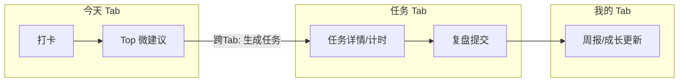
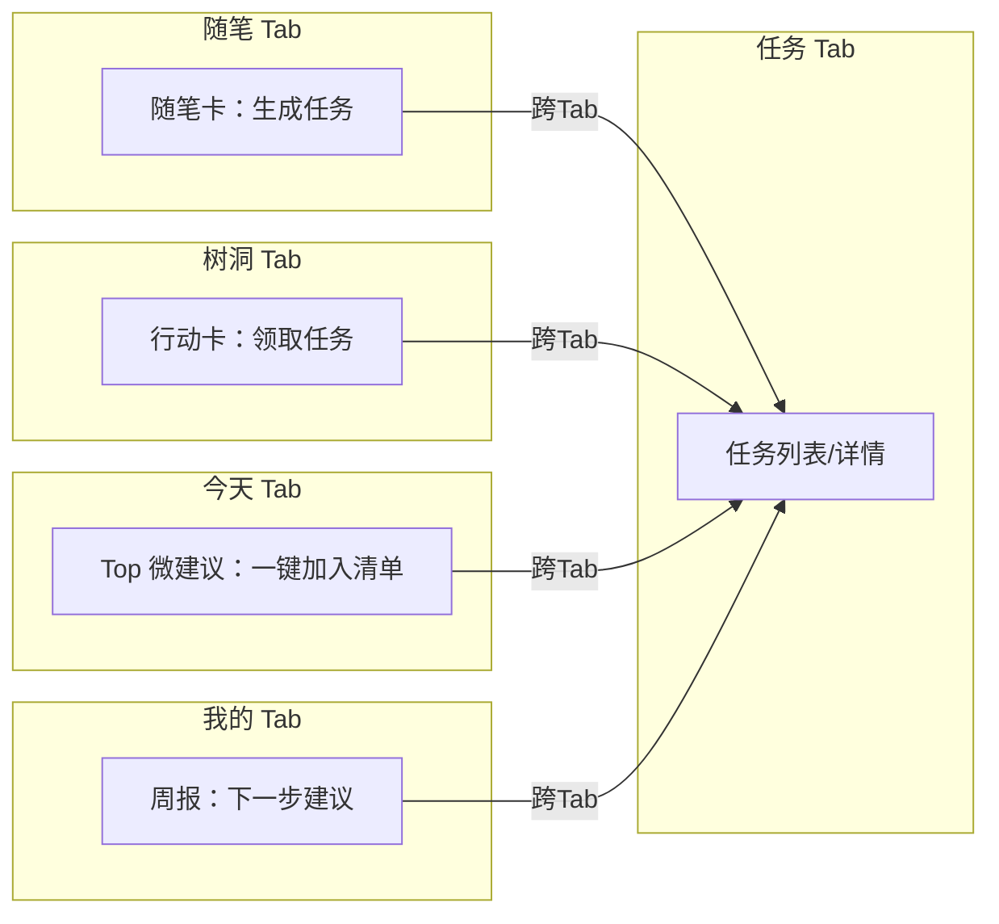

# 用户流程说明

基于功能/页面/接口/分包规划，按 5 个底部 Tab 梳理“点击 → 页面 → 结果”的用户全流程，并补充关键路径流程图与异常/边界处理和任务闭环说明。

— 统一名词：Tab“随笔”（不再使用“心情随笔”作为 Tab 名）。

## 今天 Tab：多次打卡与建议触发
- 点击：启动小程序 → 页面：默认进入“今天” → 结果：展示当日状态卡/最近一次心情与当日曲线（GET `/api/moods/today`）。
- 点击：状态卡/“再次打卡” → 页面：情绪打卡面板 → 结果：写入打卡、刷新曲线、触发情绪判定（POST `/api/checkins`；风险≥L2 自动展开 ASK）。
- 点击：打卡成功页“补充随笔” → 页面：[跨Tab] 随笔·编辑 → 结果：保存随笔并绑定当日情绪，可勾选同步打卡（POST `/api/journals`）。
- 点击：Top 微建议“一键加入清单” → 页面：任务确认弹窗 → 结果：生成任务写入清单并标注来源=AI（POST `/api/tasks`；提示可在任务 Tab 查看）。
- 点击：进行中任务卡“开始” → 页面：[跨Tab] 任务·详情/番茄 → 结果：计时与状态更新，结束后弹出复盘（PATCH `/api/tasks/{id}`、POST `/api/tasks/review`）。
- 点击：社区动态卡 → 页面：[跨Tab] 树洞·帖子详情 → 结果：查看互动与风险提示（GET `/api/treehole/posts/{id}`）。
- 长按：SOS 浮窗 → 页面：SOS 主面板 → 结果：稳定化脚本/紧急联系/资源切换（CALL `sosRelay`）。

异常/边界（今天）：
- 登录失败：阻断写入操作（401），展示登录引导；草稿数据本地暂存（Storage）。
- 重复打卡：返回 409（E_DUP_CHECKIN），提示“已记录，稍后再试”；不重绘曲线。
- 网络/接口失败：Toast+重试，微建议与社区卡回退本地 Mock（`USE_MOCK=true`）。
- 风险≥L3 未授权联系：只展示自助资源与匿名渠道，提示可在“隐私中心”授权。

## 任务 Tab：多来源任务执行面板
- 点击：底部“任务” → 页面：任务列表 → 结果：默认“进行中”分组 + 来源筛选（GET `/api/tasks`）。
- 点击：任务卡“开始/继续” → 页面：番茄计时器/详情 → 结果：进入专注执行，结束弹出复盘（POST `/api/tasks/review`）。
- 点击：批量选择 → 页面：批量操作栏 → 结果：批量延期/提醒设置成功（PATCH `/api/tasks/*`）。
- 上拉：统计抽屉把手 → 页面：数据抽屉 → 结果：查看来源/情绪完成度、延迟 Top5、真人协同列表（GET `/api/tasks/summary`）。
- 点击：真人任务“提交回执” → 页面：回执表单 → 结果：同步给指派人并写入回执（`task_acknowledgements`）。
- 点击：来源链接（随笔/树洞） → 页面：[跨Tab] 随笔·详情/树洞·详情 → 结果：查看任务背景与原帖。

异常/边界（任务）：
- 状态流转失败：乐观更新回滚提示；弱网进入离线队列，恢复后补发。
- 复盘未提交：标记“待复盘”，今日/我的页出现提醒条可一键补交。
- 真人任务逾期：统计抽屉“协同待确认”高亮，允许一键提醒指派人。

## 树洞 Tab：表达、行动卡与风控
- 点击：底部“树洞” → 页面：树洞信息流 → 结果：推荐/话题流，展示情绪标签与风险等级（GET `/api/treehole/posts`）。
- 点击：“发帖” → 页面：发帖编辑器（草稿自检） → 结果：发布后进入风控复检并打标（POST `/api/treehole/posts`；高危走审核流）。
- 点击：行动卡“领取任务” → 页面：确认弹窗 → 结果：写入清单来源=树洞，并提示跳转[跨Tab]任务（POST `/api/tasks`）。
- 点击：高风险帖（L3） → 页面：风险提示条 → 结果：可直达 SOS 或资源地图；后台匿名预警（CALL `treeholeModeration`/`sosRelay`）。
- 点击：抱抱/评论 → 页面：帖子详情 → 结果：互动入库；若命中高危词再弹温和提示与任务建议（POST `/api/treehole/interactions`）。

异常/边界（树洞）：
- 审核拦截：返回 `E_POST_RISK_HIGH`，展示安抚与资源建议，可保存为草稿。
- 匿名模式：禁止外链个人信息；互动与统计均做匿名化处理。

## 随笔 Tab：多模记录与情绪洞察
- 点击：底部“随笔” → 页面：随笔列表（含摘要/趋势入口） → 结果：展示日记与筛选（GET `/api/journals`）。
- 点击：“新增随笔” → 页面：多模录入（文本/语音/图片OCR/REBT） → 结果：保存随笔并可勾选“同步生成打卡”（POST `/api/journals`）。
- 点击：AI 摘要卡时间粒度/关键词 Chip → 页面：趋势过滤 → 结果：列表/词云/折线联动（GET `/api/moods/trend`）。
- 点击：随笔卡“生成任务” → 页面：任务生成弹窗 → 结果：写入清单并提示跳转[跨Tab]任务（POST `/api/tasks`）。
- 连续负向随笔×2 → 页面：ASK 提示 → 结果：可联系真人/继续记录/忽略（记录入 `risk_events`）。

异常/边界（随笔）：
- 语音/相机/相册权限未授予：引导系统授权弹窗，提供“稍后再说”，禁用对应入口。
- OCR/转写失败：保留原始附件与可编辑草稿，允许稍后重试。

## 我的 Tab：成长反馈与隐私控制
- 点击：底部“我的” → 页面：个人中心 → 结果：概览卡、风险提示与角色协作状态。
- 点击：“护心周报” → 页面：周报详情 → 结果：查看趋势/完成率/洞察；可一键生成补救任务[跨Tab]任务（GET `/api/reports/weekly`）。
- 上滑：成长统计面板 → 页面：分析视图 → 结果：按来源/情绪类别进度条；可筛选并跳转[跨Tab]任务。
- 点击：“徽章” → 页面：徽章详情 → 结果：查看解锁条件，提供直达入口（今天/任务/树洞/随笔）。
- 点击：“隐私与授权中心” → 页面：隐私中心 → 结果：调整授权/守护人设置，所有变更写审计日志（GET/PATCH `/api/privacy/consents`）。
- 点击：“资源地图” → 页面：资源导航 → 结果：匿名联系心理中心或拨打热线，记录资源触达日志。

异常/边界（我的）：
- 授权收紧：减少共享后即刻生效；相关页面降级展示（例如周报隐藏细节）。
- 数据导出失败：提示稍后重试并保留导出任务（POST `/api/reports/export`）。

---

## 关键路径流程图（标注跨 Tab）

情绪 → 建议 → 任务 → 执行 → 复盘 → 数据反馈（核心闭环）

```
[今天-打卡]
  → 生成Top微建议
    → 接受建议
      → [跨Tab] 任务-详情/计时
        → 提交复盘
          → 我的-周报/成长更新
```

多入口汇聚任务（跨域整合）

```
[随笔-生成任务] ─────→
                         [跨Tab] 任务-列表/详情 → 执行/复盘 → 我的-周报
[树洞-领取行动卡] ───→

[今天-任务预览“开始”] → [跨Tab] 任务-计时/复盘
```

高风险分支（降噪且可回链）

```
[树洞/随笔/今天 判定L3-L4]
  → ASK/资源提示
    → [可选] [跨域] SOS-主面板
      → 稳定化/联系/转介（sosRelay）
        → 回链“我的”-隐私与审计 & 周报risk_alert
```

说明：跨 Tab 跳转以“[跨Tab]”标注；SOS 为独立分包，任何处置均可直接进入。

---

### Mermaid 版本（可导出图片）

核心闭环（情绪 → 建议 → 任务 → 复盘 → 数据反馈）



多入口汇聚任务（随笔/树洞/今天/我的）



高风险分支（任意域判定 L3-L4 → SOS → 回链“我的”）

```mermaid
flowchart LR
  A[今天/随笔/树洞 判定 L3-L4] --> B[ASK/资源提示]
  B --> C[[SOS 主面板]]
  C --> D[稳定化/联系/转介 (sosRelay)]
  D --> E[我的：隐私/审计 & 周报 risk_alert]
```

---

## 异常与边界情况（统一处理）

- 登录失败（401）
  - 表现：禁止读写 P3 数据（情绪/随笔/任务/树洞发布）。
  - 处理：引导登录；编辑器保存本地草稿；登录后自动恢复提交队列。
- 接口报错/弱网
  - 表现：列表/卡片空态、微建议/资源回退、任务状态回滚。
  - 处理：Toast+重试；关键写操作进入离线队列；可切换 `USE_MOCK=true` 保障可用。
- 隐私权限未授权
  - 语音/相机/相册：引导 `openSetting` 授权；禁用入口不影响其他功能。
  - 位置/电话（资源地图/SOS）：提供匿名替代与文本说明；拒绝时保留“仅记录不分享”。
  - 共享范围收紧：即时生效并降级展示；审计日志记录所有变更。
- 高风险与合规
  - L3-L4：优先保障安全，最小必要信息共享；所有触发含审计与可撤回授权说明。

---

## 用户视角的任务闭环说明（情绪 → 建议 → 任务 → 完成 → 反馈）

1) 触发：
- 今天打卡或随笔保存后，系统基于情绪评分/标签/内容生成 Top 微建议（GET `/api/micro-tips`）。

2) 接受与生成：
- 点击“一键加入清单”或在随笔卡“生成任务”，确认时间/提醒 → 写入统一清单（POST `/api/tasks`，来源=AI/随笔/树洞/真人）。

3) 执行：
- 从今天快捷卡或任务页进入番茄计时/详情，进行开始/暂停/完成/跳过/延期等操作（PATCH `/api/tasks/{id}`）。

4) 复盘：
- 计时结束或完成后弹出复盘，记录情绪前后评分、体会、是否需真人跟进（POST `/api/tasks/review`）。

5) 反馈与成长：
- 任务状态/复盘回写微建议排序与画像；“我的”生成周报/成长统计（GET `/api/reports/weekly`）；未完成/多次跳过触发补救建议或真人协同。

6) 安全兜底：
- 过程中若识别为 L3-L4 风险，随时可直达 SOS；处理结束后回链到“我的”隐私/审计与周报风险摘要。

闭环涉及云函数：`checkinRecorder`（幂等写入）、`suggestionOrchestrator`（建议生成与排序）、`taskWorkflow`（状态/回执联动）、`weeklyReport`（周报生成）、`analyticsIngest`（埋点汇聚）。

— 至此，用户能够从一次情绪触发，自然进入建议与行动，完成后获得可视化的数据反馈与激励，并在需要时得到安全与隐私层面的兜底支持。

---

## 导出图片指引（Mermaid → PNG/SVG）

- 准备：安装 mermaid-cli（任选其一）
  - 全局安装：`npm i -g @mermaid-js/mermaid-cli`
  - 或临时使用：`npx @mermaid-js/mermaid-cli -h`
- 导出步骤：
  1) 将上面的 mermaid 代码块分别保存为 `.mmd` 文件（示例：`docs/flows/core-loop.mmd`、`docs/flows/multi-entry.mmd`、`docs/flows/high-risk.mmd`）。
  2) 执行导出（示例导出 PNG）：
     - `mmdc -i docs/flows/core-loop.mmd -o docs/flows/core-loop.png`
     - `mmdc -i docs/flows/multi-entry.mmd -o docs/flows/multi-entry.png`
     - `mmdc -i docs/flows/high-risk.mmd -o docs/flows/high-risk.png`
  3) 若需 SVG：将输出文件后缀改为 `.svg` 即可。

如需我创建 `.mmd` 源文件与 `docs/flows/` 目录并提交，请告知。
