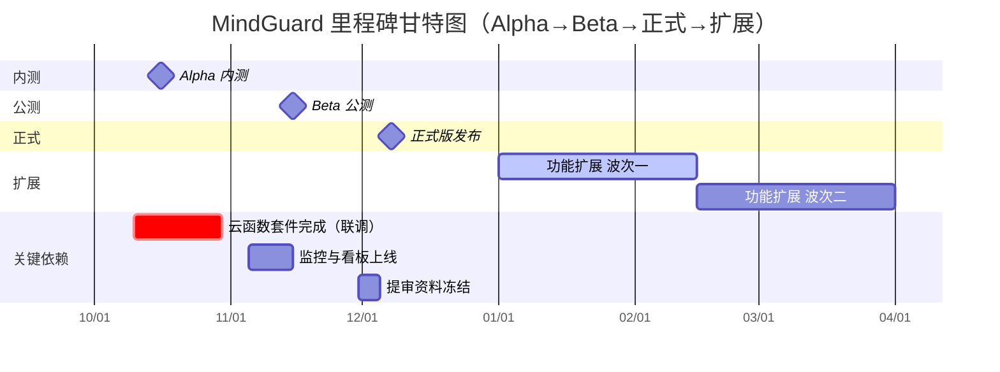

# MindGuard 《总计划-里程碑与时间线》

> 本计划基于以下资料对齐范围与节奏：功能交付范围（docs/功能文档/*.md）、页面上线节奏（docs/页面文档/*.md）、全局索引（docs/功能列表.md）、提审与上线流程（docs/上线说明.md），并以质量门禁（docs/项目计划/质量门禁与验收标准.md）作为验收基线。

## 1. 里程碑矩阵（Alpha/Beta/正式/扩展）

| 里程碑 | 时间范围 | 交付物（功能/页面/接口/数据库） | 验收条件 |
| --- | --- | --- | --- |
| Alpha 内测 | 2025-10-01 ~ 2025-10-31 | 功能：今天页情绪打卡→Top3 微建议→一键生成任务；任务卡最小闭环（开始/完成/复盘）；心情随笔基础版（文本、多标签）；护心周报基础卡片。 页面：`pages/today`、`pages/tasks`、`pages/journal`、`pages/mine` 主流程；组件库基线。 接口：`/api/moods/today`、`/api/checkins`、`/api/micro-tips`、`/api/tasks{GET/POST/PATCH/review}`、`/api/journals{GET/POST}`；云函数 `checkinRecorder`、`suggestionOrchestrator`。 数据库：`users`、`checkins`、`tasks`、`journals`、`suggestions` 基础字段与关键索引（例：`[user_id, checkin_date]`、`[user_id, status, due_at]`）。 | 按《质量门禁与验收标准》M1-M2 DoD：主包可运行；今天页闭环 Demo；集合读写验收（`checkins`/`tasks`/`journals`）；基础埋点通过（`pv_today`/`mood_checkin_submit`/`suggestion_task_create`/`task_status_update`）；体验版提测记录与缺陷关闭率≥95%。 |
| Beta 公测 | 2025-11-01 ~ 2025-11-30 | 功能：树洞发帖/抱抱/风险提示（L1-L2）；行动卡领取→清单同步；晚安模式；独立 SOS 分包；护心周报与导出；隐私与授权中心；徽章与通知；资源地图。 页面：`packages/community/*`（帖子详情/发布/话题/搜索/消息等）最小集；`independent/sos/*`；`packages/profile/*`（隐私中心/周报详情/徽章/资源地图）。 接口：`/api/treehole/*`、`/api/reports/{weekly,export}`、`/api/privacy/consents`、`/api/badges`、`/api/notifications*`；云函数 `treeholeModeration`、`sosRelay`、`weeklyReport`、`analyticsIngest`。 数据库：`posts`、`comments`、`reports`、`notifications`、`sos_events` 完成；索引与权限策略就位。 | 按《质量门禁与验收标准》M3 DoD：风控提示与 SOS 流程测试环境可用；性能与包体预算达标（主包/分包≤2MB、首屏TTI≤1.5s）；埋点漏斗与看板跑通；审核资料初稿归档；风控演练通过。 |
| 正式版发布 | 2025-12-01 ~ 2025-12-15 | 功能：核心流程全量可用（今天/任务/随笔/树洞/SOS/周报/隐私中心）；灰度放量策略与回滚预案；运维值班与监控基线。 页面：全量页面达上线标准；Tab/分包路由与预加载一致性校验通过。 接口：全量接口契约冻结并对齐实现；错误处理与埋点完备。 数据库：索引巡检与迁移脚本归档；审计/告警数据可追溯。 | 按《质量门禁与验收标准》M4 DoD：E2E 主流程用例通过；CI 绿色（lint/单测/E2E）；域名/隐私/截图与提审资料齐全；审核通过并完成发布演练与回滚演练记录。 |
| 功能扩展 | 2026-01-01 ~ 2026-03-31 | 功能：学校协同（绑定/协同工作台/人工转介）；专题工具箱（呼吸/正念/学业/睡眠）；REBT/CBT 在 ASK 中深化；个性化资源推送；社区话题聚合与活动。 页面：`packages/profile/school-cooperation`、工具分包 `packages/breath/*`、`packages/mindfulness/*`、社区扩展页。 接口：`/api/resources`、学校协同相关接口、建议编排增强；数据看板拓展。 数据库：`resources` 等扩展集合；评测与资源关联关系；必要迁移（详见 docs/数据库/*.md）。 | 按《质量门禁与验收标准》M5 DoD（运营与复盘）：上线 48h 值班记录与日报/周报；核心指标达标；复盘完成并沉淀下一阶段 backlog。 |

说明：上述交付物与页面/接口/集合的映射详见 docs/功能列表.md、docs/页面文档/README.md、docs/接口占位文档.md 与 docs/数据库设计.md。

## 2. 责任与 RACI（摘要）

| 里程碑 | R（Responsible） | A（Accountable） | C（Consulted） | I（Informed） |
| --- | --- | --- | --- | --- |
| Alpha 内测 | FE Lead, BE Lead | Tech Lead | PO, QA Lead, Data Lead | PMO, Ops/Risk Lead |
| Beta 公测 | FE Lead, Ops/Risk Lead | Tech Lead | QA Lead, BE Lead, Data Lead | PMO, PO |
| 正式版发布 | QA Lead, Ops/Risk Lead | Tech Lead | FE Lead, BE Lead, PO | Data Lead, PMO |
| 功能扩展 | FE Lead, BE Lead | Tech Lead | PO, QA Lead, Data Lead, Ops/Risk Lead | PMO |

完整责任矩阵参见 docs/项目计划/RACI与沟通节奏.md。

## 3. 时间线与依赖（Mermaid 甘特图）

依赖说明：云函数与集合契约需在 Alpha 中期完成首轮联调；监控与看板在 Beta 期间上线；提审资料在 Beta 末冻结（详见 docs/上线说明.md）。

## 4. 关键风险与缓冲措施（来自《风险清单与应对》）

- 接口延迟（中×高）：核心 API/云函数进度或性能滞后影响闭环联调。
  - 缓冲：Alpha 前置 Mock 与降级策略；冻结 Schema；每日进度巡检；性能 P95>1.5s 触发诊断会（见 docs/项目计划/风险清单与应对.md）。
- 审核被拒（中×高）：资料缺失或功能敏感导致提审驳回。
  - 缓冲：Beta 中期完成资料初稿，Beta 末冻结；被拒 24h 内给出整改与补充材料（见 docs/上线说明.md、docs/项目计划/风险清单与应对.md）。
- 性能与包体（中×高）：主包/分包超 2MB 或首屏 TTI > 1.5s。
  - 缓冲：周度体积/性能巡检；资源拆分与懒加载；预加载命中率≥80%（见 docs/项目计划/质量门禁与验收标准.md）。
- 隐私合规（低×高）：隐私协议、脱敏与授权不达标。
  - 缓冲：M3 前完成合规审阅；敏感集合仅经云函数访问；审计日志≥12 个月留存（见 docs/项目计划/质量门禁与验收标准.md）。
- 数据一致性（中×高）：`tasks/checkins/journals/reports` 链路写入异常导致闭环断裂。
  - 缓冲：重试与告警、对账脚本、T+1 差异补偿；关键漏斗阈值报警（见 docs/项目计划/风险清单与应对.md）。
- 分包路由错配（中×中）：`app.json` 与分包规划不一致导致加载失败。
  - 缓冲：发布前自动路由校验脚本；真机巡检全分包加载（见 docs/分包规划方案.md）。
- 埋点缺失（中×中）：关键事件缺失影响漏斗与风控判断。
  - 缓冲：提测期与 Beta 周报校验；缺失事件热修/补发并标注可信度（见 docs/埋点与数据分析.md）。

## 5. 迭代与里程碑映射（参考）

- Alpha 内测 ≈ 原 M1（骨架与首页）+ 原 M2（核心流程）
- Beta 公测 ≈ 原 M3（扩展与风控）
- 正式版发布 ≈ 原 M4（提审与发布）
- 功能扩展 ≈ 原 M5（运营与复盘）及后续专题功能（见 docs/开发方案/功能扩展.md）

> 更详细的两周节奏、DoR/DoD、关键依赖与产出物，仍保留在下方“附：原 Sprint 计划”一节，便于研发与 QA 具体执行。

---

## 附：原 Sprint 计划（保留）

### M0 准备（Sprint 1，Week 1-2）
- 目标：完成项目启动、需求基线与云开发环境搭建，为后续迭代打下稳定基础。
- 关键范围：确认五个 Tab 的用户旅程与功能优先级；冻结分包规划与数据库命名规范；配置微信云开发环境、代码仓库、集成 CI 基线。
- 重点输出：版本计划、需求澄清记录、`app.json` 主包&分包骨架草案、研发/测试账号、风险清单草稿。

### M1 骨架与首页（Sprint 2，Week 3-4）
- 目标：搭建主包页面骨架，交付可交互的“今天”首页，实现情绪打卡→微建议→任务生成的最小闭环。
- 关键范围：实现 tabBar（今天｜任务｜树洞｜心情随笔｜我的）与主包页面路由；交付今天页核心组件（情绪状态卡、Top3 微建议、一键任务写入任务清单 mock）；对接云函数/集合的读写沙盒；完成首页埋点雏形。
- 重点输出：`pages/today/index` 首屏骨架、公共组件库雏形、情绪打卡与任务生成 API 联调脚手架、体验版基线包。

### M2 核心流程（打卡/心情随笔/任务/树洞）（Sprint 3-4，Week 5-8）
- 目标：完成三个核心闭环：情绪打卡→任务执行、心情随笔记录→复盘→任务同步、树洞互动→行动卡任务同步。
- 关键范围：完善任务卡执行闭环（状态同步 tasks/checkins）；交付心情随笔 Tab 的随笔/清单双视图与多模录入 REBT 模板、情绪趋势；实现树洞发帖、风险提示、行动卡领取并写入清单；完成相关云函数（`taskReceipt`、`syncActionCardTask`）与集合联调；补齐高频埋点。
- 重点输出：核心流程端到端 Demo（含分包调用）、埋点事件验证日志、T+1 复盘提醒策略草案、体验环境全链路自测报告。

### M3 扩展与风控（Sprint 5，Week 9-10）
- 目标：加强社区风控、夜间策略与运营能力，补齐性能与安全保障。
- 关键范围：上线树洞风险提示、资源跳转与温和关怀流程；配置 SOS 独立分包与守护链路；完善晚安模式、护心周报摘要与徽章触达；接入风险监控、慢查询报警、埋点看板；准备审核所需的风控与合规材料。
- 重点输出：`packages/community` 风控能力、`independent/sos` 独立分包、夜间提醒策略、Grafana/看板初版、审核资料包初稿。

### M4 提审与发布（Sprint 6，Week 11-12）
- 目标：完成全面测试、资料准备与微信小程序提审、上线。
- 关键范围：执行端到端测试（功能、性能、风控）；完成埋点验收、数据库索引巡检；准备提审截图、体验版说明、客服资质；走完发布 checklist 与回滚预案演练。
- 重点输出：提审包、体验版测试报告、审核资料归档、回滚脚本与版本快照、上线公告草案。

### M5 运营与复盘（Sprint 7，Week 13-14）
- 目标：支撑上线后的运营推广、监控与项目复盘，闭合数据与体验循环。
- 关键范围：执行上线 48h 值班、监控指标与用户反馈；汇总埋点看板、社区健康、任务完成率；整理复盘文档、运营策略、需求池；规划下一阶段迭代。
- 重点输出：上线日报、指标汇总看板、运营物料包（推送文案、校园渠道计划）、项目复盘报告、后续 backlog 草案。

### 2 周迭代时间线与 DoR/DoD（保留版）
| 里程碑 | 所属 Sprint | 时间范围 | DoR（进入条件） | DoD（退出条件） |
| --- | --- | --- | --- | --- |
| M0 准备 | Sprint 1 | Week 1-2 | 核心成员到位；五个 Tab 用户流程、功能列表评审通过；云开发环境和代码仓库可访问 | 微信云开发环境可编译；分包规划冻结；需求基线文档与风险清单发布；CI 初版跑通 |
| M1 骨架与首页 | Sprint 2 | Week 3-4 | M0 DoD 完成；UI 关键稿件与组件规范确认；接口占位文档对今天页接口达成一致 | 主包四页骨架可运行；今天页情绪打卡→微建议→任务写入完成端到端演示；tabBar 和埋点 `pv_today`、`mood_checkin_submit` 可上报；首版体验包提测 |
| M2 核心流程 | Sprint 3-4 | Week 5-8 | M1 DoD 完成；核心云函数（`taskReceipt`、`syncActionCardTask`）与数据库 Schema 冻结；心情随笔/树洞交互稿确认 | 今天/任务/树洞/心情随笔核心流程真机可用；`tasks`、`checkins`、`journals`、`posts` 集合读写验收；分包 journal/community 可按需加载；埋点核心漏斗跑通；联调缺陷关闭率≥95% |
| M3 扩展与风控 | Sprint 5 | Week 9-10 | M2 DoD 完成；风控策略与 SOS 流程脚本审定；埋点分析环境可追溯 | 风控提示、SOS 独立分包、晚安模式上线测试环境；风险/性能监控指标达标；审核资料（截图、功能介绍、资质）初稿归档；风控演练记录通过 |
| M4 提审与发布 | Sprint 6 | Week 11-12 | M3 DoD 完成；提审 checklist 审阅；测试环境缺陷关闭 | 全量测试通过并归档报告；审核资料提交运营确认；微信提审提交且通过；回滚预案演练记录；正式版发布窗口确定 |
| M5 运营与复盘 | Sprint 7 | Week 13-14 | M4 DoD 完成；运营渠道准备就绪；监控告警阈值配置完成 | 上线 48h 运营值班记录；关键指标日报/周报发布；用户反馈与缺陷跟踪列表；项目复盘与下一阶段 backlog 归档 |

## 6. 可交付物与关键依赖（摘要）
- 代码/文档/数据脚本/验收记录/回滚资产详见原文“可交付物清单”。
- 关键依赖：云函数套件、数据库集合与索引、分包路由与预加载、埋点方案、审核资料（参考 docs/接口占位文档.md、docs/数据库设计.md、docs/分包规划方案.md、docs/上线说明.md）。

## 7. 版本与变更记录
- 2025-09-22 v2.0 重构：新增 Alpha/Beta/正式/扩展 4 类里程碑矩阵；补充交付物清单与 RACI 表；加入 Mermaid 甘特图与关键风险缓冲；保留原 M0-M5 Sprint 计划作为附录；对齐 docs/功能列表.md、docs/页面文档/README.md、docs/接口占位文档.md、docs/数据库设计.md。
- 2025-09-18 v1.0 初稿：按 M0-M5 输出 2 周节奏、DoR/DoD 与关键依赖（内部版）。

更新日期：2025-09-22
