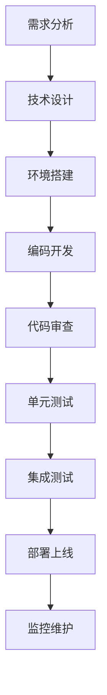

# 💻 开发文档系列

## 📋 文档概述

本系列文档详细描述了微信社区商场小程序的开发规范和质量保证体系，基于**微信小程序原生开发 + 云开发**的技术架构，为开发团队提供统一的开发标准。

### 技术栈
- **前端**: 微信小程序原生开发 (WXML/WXSS/JavaScript)
- **后端**: 微信小程序云函数 (Node.js)
- **数据库**: MongoDB 云数据库
- **工具**: ESLint + Prettier + 微信开发者工具

## 📚 文档列表

### 📝 [编码规范](coding-standards.md) 🔥
**核心内容**: 代码质量标准和开发规范  
**目标受众**: 所有开发者  
**主要章节**:
- JavaScript 编码标准
- WXML 模板规范
- WXSS 样式规范
- 云函数开发规范
- 代码格式化配置
- 命名约定
- 注释规范
- 错误处理标准

**工具配置**:
- ESLint 代码检查
- Prettier 代码格式化
- 微信开发者工具配置
- Git Hooks 配置

**适用场景**: 开发开始前、代码审查时

### 🧪 [测试指南](testing.md) 🔥
**核心内容**: 完整的测试策略和质量保证体系  
**目标受众**: 开发者、测试工程师、质量保证团队  
**主要章节**:
- 测试策略和原则
- 单元测试实施
- 集成测试方案
- 端到端测试
- 性能测试
- 云函数测试
- 小程序测试
- 自动化测试

**测试工具**:
- Jest 单元测试框架
- 微信小程序测试工具
- 云函数本地调试
- 性能监控工具

**适用场景**: 开发过程中、质量保证阶段

## 🎯 开发流程

### 标准开发流程



### 代码质量保证

1. **开发前准备**
   - 阅读编码规范
   - 配置开发工具
   - 了解项目架构

2. **开发过程中**
   - 遵循编码规范
   - 编写单元测试
   - 及时提交代码

3. **开发完成后**
   - 代码自检
   - 同行评审
   - 集成测试

## 🛠️ 开发工具配置

### 微信开发者工具

#### 基础配置
```json
{
  "setting": {
    "urlCheck": false,
    "es6": true,
    "enhance": true,
    "postcss": true,
    "preloadBackgroundData": false,
    "minified": true,
    "newFeature": true,
    "coverView": true,
    "nodeModules": false,
    "autoAudits": false,
    "showShadowRootInWxmlPanel": true,
    "scopeDataCheck": false,
    "uglifyFileName": false,
    "checkInvalidKey": true,
    "checkSiteMap": true,
    "uploadWithSourceMap": true,
    "compileHotReLoad": false,
    "useMultiFrameRuntime": true,
    "useApiHook": true,
    "babelSetting": {
      "ignore": [],
      "disablePlugins": [],
      "outputPath": ""
    }
  }
}
```

### ESLint 配置

#### .eslintrc.js
```javascript
module.exports = {
  env: {
    browser: true,
    es6: true,
    node: true
  },
  extends: [
    'eslint:recommended'
  ],
  globals: {
    wx: 'readonly',
    App: 'readonly',
    Page: 'readonly',
    Component: 'readonly',
    getApp: 'readonly',
    getCurrentPages: 'readonly'
  },
  parserOptions: {
    ecmaVersion: 2020,
    sourceType: 'module'
  },
  rules: {
    'indent': ['error', 2],
    'quotes': ['error', 'single'],
    'semi': ['error', 'never'],
    'no-console': 'warn',
    'no-unused-vars': 'error'
  }
}
```

### Prettier 配置

#### .prettierrc
```json
{
  "semi": false,
  "singleQuote": true,
  "tabWidth": 2,
  "trailingComma": "none",
  "printWidth": 100,
  "bracketSpacing": true,
  "arrowParens": "avoid"
}
```

## 📊 代码质量指标

### 质量标准

| 指标类型 | 目标值 | 检查方式 |
|---------|--------|---------|
| **代码覆盖率** | ≥ 80% | Jest 测试报告 |
| **ESLint 检查** | 0 错误 | 自动化检查 |
| **代码重复率** | ≤ 5% | SonarQube 分析 |
| **圈复杂度** | ≤ 10 | 静态分析工具 |
| **函数长度** | ≤ 50 行 | 代码审查 |
| **文件大小** | ≤ 500 行 | 代码审查 |

### 质量门禁

- **提交前**: ESLint 检查通过
- **合并前**: 代码审查通过 + 测试覆盖率达标
- **发布前**: 集成测试通过 + 性能测试达标

## 🔍 常见问题

**Q: 如何配置开发环境？**  
A: 参考[云开发环境搭建](../deployment/cloud-setup.md)文档进行配置。

**Q: 代码规范检查失败怎么办？**  
A: 运行 `npm run lint:fix` 自动修复，或手动修改不符合规范的代码。

**Q: 如何编写单元测试？**  
A: 参考[测试指南](testing.md)中的单元测试章节，使用 Jest 框架编写测试用例。

**Q: 云函数如何调试？**  
A: 使用微信开发者工具的云函数本地调试功能，或在云端查看日志。

**Q: 如何进行性能优化？**  
A: 关注代码执行效率、减少不必要的API调用、优化图片资源、使用缓存等。

## 📈 最佳实践

### 前端开发最佳实践

1. **组件化开发**
   - 合理拆分组件
   - 组件复用性设计
   - 统一的组件接口

2. **状态管理**
   - 合理使用全局状态
   - 避免状态污染
   - 及时清理无用状态

3. **性能优化**
   - 图片懒加载
   - 分包加载
   - 合理使用缓存

### 后端开发最佳实践

1. **云函数设计**
   - 单一职责原则
   - 合理的函数粒度
   - 统一的错误处理

2. **数据库操作**
   - 合理使用索引
   - 避免N+1查询
   - 控制返回数据量

3. **安全考虑**
   - 输入参数验证
   - 权限检查
   - 敏感信息保护

## 🔗 相关文档

- [API接口文档系列](../api/README.md) - 接口开发规范
- [云数据库结构设计](../database/cloud-schema.md) - 数据库操作规范
- [云开发环境搭建](../deployment/cloud-setup.md) - 开发环境配置
- [部署流程文档](../deployment/deploy.md) - 部署相关规范

## 📝 更新记录

- **2025年5月**: 完成开发规范文档，统一为云开发技术栈
- **编码规范**: JavaScript、WXML、WXSS、云函数开发规范
- **测试指南**: 单元测试、集成测试、E2E测试完整策略
- **工具配置**: ESLint、Prettier、微信开发者工具配置

---

*最后更新时间: 2025年5月*
